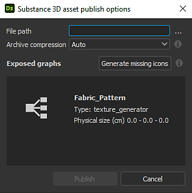

# Publication de fichiers Substance 3D Assets (SBSAR)

Cette page explique comment Substance 3D Designer peut publier des packs en tant que fichiers de <b>ressources Substance 3D</b>, un format de fichier spécial avec l’extension <b>SBSAR</b>, utilisé dans l’écosystème de Substance de données ainsi que dans d’autres applications qui le prennent en charge.

Il est généralement préférable d’utiliser une ressource Substance 3D plutôt que des bitmaps, car elle est beaucoup plus flexible et légère. Si vous les utilisez dans Substance 3D [Painter](https://experienceleague.adobe.com/en/docs/substance-3d-painter/using/home), [Sampler](https://helpx.adobe.com/substance-3d-sampler.html) ou [Player](https://helpx.adobe.com/substance-3d-player/home.html), il est plus rapide d&#39;utiliser la fonctionnalité [&#39;Envoyer à...&#39;](../../interface/the-explorer-window/send-to-interoperability/send-to-interoperability.md).

## Concepts de publication

lors de la publication d’un graphique en Substance, il est important de garder les points suivants à l’esprit :

* Vous<b> publiez un package</b>, avec tout son contenu, et non un [graphique de Substance](../../compositing-graphs/substance-compositing-graphs.md) individuel. Une ressource Substance 3D vous permet ensuite de générer du contenu à partir de tous les graphiques de Substances de ce package.
* Les packages publiés sont <b>entièrement autonomes</b> : toutes les ressources requises sont incorporées dans le fichier. Cela signifie qu’ils sont beaucoup plus faciles à partager que les fichiers SBS.
* La sortie des actifs Substance 3D peut être <b>complètement dynamique</b>. [La résolution n&#39;est pas définie ; les paramètres exposés peuvent être modifiés.](../../compositing-graphs/compositing-graph-key-con/substance-compositing-graph-key-concepts.md) Cependant, il n’est plus possible de modifier le graphique.
* Les actifs Substance 3D peuvent être utilisés en dehors de Designer, dans tous les produits Substance 3D Adobe, Adobe Dimension ainsi que dans toute autre application dotée d&#39;une [intégration de Substance de données](https://experienceleague.adobe.com/en/docs/substance-3d/ecosystem/home).
* La publication est différente de l&#39;[exportation](../../compositing-graphs/exporting-bitmaps/exporting-bitmaps.md). Assurez-vous de bien comprendre la différence.

## Préparation de la publication

La publication nécessite davantage de préparation que l’exportation d’images bitmap. En effet, les actifs Substance 3D publiés sont des outils dynamiques et non pas simplement un instantané statique de l’état actuel de vos textures. Plus précisément, vous devez garder à l’esprit les points suivants :

* Assurez-vous que les résolutions de graphique ([Taille de sortie](../../compositing-graphs/output-size/output-size.md)) sont définies sur la *méthode d&#39;héritage relative à la parente*[5&rbrace;, ce qui signifie qu&#39;elles sont dynamiques et peuvent être modifiées à la volée.](../../compositing-graphs/inheritance-compositing/inheritance-in-substance-compositing-graphs.md)
* Assurez-vous que les [sorties graphiques](../../compositing-graphs/nodes-reference-for-com/atomic-nodes/output/output.md) sont correctement configurées avec les noms, les libellés et les balises d&#39;utilisation.
* Assurez-vous que les [paramètres, si nécessaire, sont organisés et nommés correctement](../../compositing-graphs/manage-parameters/exposing-a-parameter/exposing-a-parameter.md).
* Si un graphique décrit un matériau, définissez son attribut [modèle de matériau](../graph-parameters/graph-parameters.md) sur le modèle de ce matériau.
* Assurez-vous que la propriété [Taille de sortie](../../compositing-graphs/output-size/output-size.md) de tous les nœuds [Bitmap](../../compositing-graphs/nodes-reference-for-com/atomic-nodes/bitmap/bitmap.md) est définie sur la [méthode d&#39;héritage](../../compositing-graphs/inheritance-compositing/inheritance-in-substance-compositing-graphs.md) *absolue*. Si ce n&#39;est pas le cas, leur [ressource Bitmap](../../resources/bitmap-resource/bitmap-resource.md) référencée sera enregistrée à la résolution <b>256\*256</b> par défaut dans le fichier de ressources Substance 3D publié, ce qui* impactera la qualité* d&#39;une ou plusieurs sorties.
* Si le package contient des graphiques qui ne doivent pas être disponibles en dehors de Designer (par exemple, des sous-graphiques d’assistant ou d’« outil » qui ne fonctionnent que dans un contexte spécifique), configurez-les pour qu’ils soient masqués dans leurs propriétés. Voir ci-dessous.

## Méthodes de publication

Une fois que vous êtes prêt à publier, il existe deux façons d&#39;accéder à la boîte de dialogue Publication, toutes deux via l&#39;[Explorateur](../../interface/the-explorer-window/the-explorer-window.md).

<table>
<tr style="border: 0;">
<td style="border: 0;" valign="top">

Dans l’Explorateur, cliquez avec le bouton droit de la souris sur le package et sélectionnez  **Fichier .sbsar Publish...**, autre touche de raccourci Ctrl + P.

Après avoir publié une fois avec la boîte de dialogue, vous pouvez également utiliser le fichier  **Publish .sbsar comme précédent** pour répéter le processus de publication sans voir les boîtes de dialogue, en publiant immédiatement avec les mêmes paramètres.

</td>
<td style="border: 0;" valign="top">

</td>
</tr>
</table>

<table>
<tr style="border: 0;">
<td style="border: 0;" valign="top">

Dans l&#39;Explorateur, en cliquant sur le bouton Publish  dans la barre d&#39;outils supérieure.

Après avoir publié une fois avec la boîte de dialogue, vous pouvez également utiliser le bouton Publish comme précédent  pour répéter le processus de publication sans voir les boîtes de dialogue, en publiant immédiatement avec les mêmes paramètres.

</td>
<td style="border: 0;" valign="top">

</td>
</tr>
</table>

<table>
<tr style="border: 0;">
<td style="border: 0;" valign="top">

## Options de publication de ressources

Avant l’affichage des options de Publish des ressources, vous serez invité à enregistrer le fichier Substance 3D (SBS) si cela n’a pas été fait, et vous serez invité à enregistrer la ressource Substance 3D. Pour éviter de voir les invites et la boîte de dialogue du fichier et de sortir votre fichier plus rapidement, utilisez les méthodes <b>Publish as previous</b> décrites ci-dessus.

</td>
<td style="border: 0;" valign="top">

</td>
</tr>
</table>

Les options suivantes sont disponibles :

<b>Chemin du fichier</b> ouvre une boîte de dialogue permettant de choisir l’emplacement d’enregistrement du fichier de ressources Substance 3D. Le chemin par défaut est celui des documents utilisateur du système. Si le package a été enregistré, le chemin est l’emplacement du package. Si le package a été publié pendant la session, le chemin d’accès est le dernier emplacement de publication.

La <b>compression des archives</b> définit les options de compression de l&#39;archive et affecte la taille des fichiers.

La fonctionnalité <b>Générer les icônes manquantes</b> utilise des techniques intégrées[de Rendu PBR](../../compositing-graphs/nodes-reference-for-com/node-library/material-filters/pbr-utilities/pbr-render/pbr-render.md) pour créer des vignettes pour chaque attribut de graphique.

<b>Graphiques exposés </b>répertorie tous les graphiques qui seront exposés dans ce package. Voir ci-dessous pour les graphiques exclus.

>[!NOTE]
>
> **Exposition aléatoire des graines**
> 
> Les paramètres d’exposition Générateur aléatoire ne sont plus disponibles dans la boîte de dialogue Publish. Définissez plutôt l&#39;attribut de valeur de départ aléatoire de votre graphique [sur Absolu au lieu de relatif pour éviter qu&#39;il ne soit disponible](../../compositing-graphs/graph-parameters/graph-parameters.md).

## Exclusion de graphiques de la ressource publiée

Certains graphiques de votre pack ne sont pas destinés à une utilisation en dehors de celui-ci. Ces sous-graphes sont généralement considérés comme faisant partie d&#39;un ensemble plus vaste, un sous-programme d&#39;un document principal.

<table>
<tr style="border: 0;">
<td style="border: 0;" valign="top">

Pour empêcher un graphe de devenir visible ou utilisable dans un fichier de ressources Substance 3D, accédez aux propriétés de ce graphe (double-cliquez sur la zone vide de la vue du graphe ou cliquez une fois sur le graphe dans l&#39;Explorateur), puis ouvrez le panneau déroulant <b>Attributs</b>. Définissez <b>Exposé dans SBSAR</b> sur <b>Non</b> pour le masquer lors de la publication.

</td>
<td style="border: 0;" valign="top">

</td>
</tr>
</table>

### Avertissements de la boîte de dialogue Publish

La boîte de dialogue Publish affiche parfois des avertissements en jaune. Les plus courants sont énumérés ci-dessous, accompagnés d’une explication et d’une solution.

* Un ou plusieurs graphiques n’ont pas de sortie\
  Cet avertissement signifie que vous essayez de publier un package avec un ou plusieurs graphiques qui n’ont pas de nœuds de sortie. La solution consiste à ajouter des [nœuds de sortie](../../compositing-graphs/nodes-reference-for-com/atomic-nodes/output/output.md) aux graphiques avec un triangle d&#39;avertissement jaune.
* Un ou plusieurs graphes ont un paramètre de taille de sortie non lié au parent\
  Cet avertissement signifie qu’un ou plusieurs graphiques ont été définis sur des tailles de sortie incorrectes. Généralement, il s’agit des propriétés du graphique lui-même. L’avertissement signifie que vous n’aurez pas de contrôle de résolution dynamique sur ce graphique lors de la publication. La solution consiste à accéder aux propriétés du graphique pour ceux qui ont un triangle jaune et à définir la [méthode d&#39;héritage](../../compositing-graphs/inheritance-compositing/inheritance-in-substance-compositing-graphs.md) de la taille de sortie sur *Relative au parent*.

## Limitations des ressources Substance 3D

Bien que la ressource Substance 3D soit le format le plus puissant et le plus dynamique de l’écosystème de Substance, il existe quelques petites limitations techniques à prendre en compte.

* Les packages de ressources Substance 3D publiés sont un format de fichier unidirectionnel. Vous ne pouvez pas « décompiler » une ressource Substance 3D vers un fichier Substance 3D (SBS). La seule façon de « modifier » une ressource Substance 3D consiste à modifier le fichier Substance 3D d’origine. Vous pouvez toujours utiliser le contenu du pack de ressources Substance 3D en tant que nœuds dans les nouveaux graphiques de Substances (ouverture et glisser-déposer). Il ne s’agit donc pas d’une énorme limitation.
* Les fichiers de ressources Substance 3D ont des versions qui infèrent la compatibilité. La Substance Engine de base est mise à jour de temps à autre avec de nouvelles fonctionnalités. les packs qui utilisent ces fonctionnalités doivent être lus par les applications qui prennent en charge ces nouvelles fonctionnalités. Cela ne pose pas de problème pour toutes les applications de Substance de données, car elles sont toutes mises à jour en même temps, mais les plug-ins et les intégrations peuvent avoir des retards de compatibilité plus longs.\
  Utilisez les options d&#39;affichage de la compatibilité des Substances Engine dans les [Préférences du projet](../../interface/preferences-window/project-settings/project-settings.md) pour suivre les problèmes potentiels.
* Certains paramètres exposés, tels que les paramètres *statiques*, sont *masqués* une fois qu’un graphique est publié dans le cadre d’une ressource Substance 3D. Consultez la section [Limitations](../../compositing-graphs/manage-parameters/exposing-a-parameter/exposing-a-parameter.md) de la page [Exposition d&#39;un paramètre](../../compositing-graphs/manage-parameters/exposing-a-parameter/exposing-a-parameter.md) pour obtenir la liste de ces paramètres et en savoir plus sur les paramètres statiques en général.
