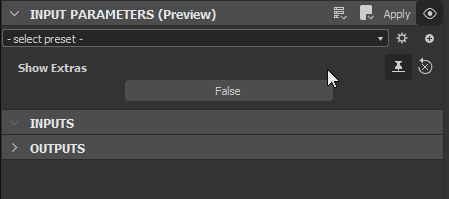

# Visible si les expressions

L&#39;expression « Visible if » vous permet de <b>contrôler la visibilité</b> des entrées, sorties et paramètres dans les graphes.

Lorsque [vous exposez des paramètres](../../compositing-graphs/manage-parameters/exposing-a-parameter/exposing-a-parameter.md), vous pouvez masquer ou afficher des paramètres ou des connecteurs de nœuds en fonction de l&#39;état d&#39;autres paramètres. Par exemple, un curseur s&#39;affichant uniquement lorsqu&#39;un bouton de paramètre booléen est défini sur `true`, car cela n&#39;aurait aucun effet sinon et cela pourrait perturber les utilisateurs.

Pour ce faire, vous pouvez entrer une *expression logique* dans la propriété <b>Visible if</b> de :

* le [paramètre d&#39;entrée](../../compositing-graphs/manage-parameters/exposing-a-parameter/exposing-a-parameter.md) d&#39;un graphe ;
* nœud [d&#39;entrée](../../compositing-graphs/nodes-reference-for-com/atomic-nodes/input/input.md) d&#39;un graphe ;
* nœud [Output](../../compositing-graphs/nodes-reference-for-com/atomic-nodes/output/output.md) d&#39;un graphe.

{width="512px"}

Si l&#39;expression logique est évaluée à `true`, le paramètre, l&#39;entrée ou la sortie s&#39;affiche dans tous les [instanciers](../../compositing-graphs/creating-compositing-gra/graph-instances-sub-gra/graph-instances-sub-graphs.md) représentant le graphe actif. Sinon, il est *masqué*.

Des conditions complexes sont possibles, à condition que l&#39;expression logique énonçant ces conditions soit valide.

>[!NOTE]
>
> Mises en garde
> 
> * Cette fonctionnalité *uniquement* a un impact sur l&#39;affichage d&#39;un paramètre ou d&#39;un connecteur dans l&#39;interface utilisateur et n&#39;a *aucun effet* sur les calculs et le résultat d&#39;un graphe.
> * Lorsque vous exposez ou appliquez une fonction à un paramètre utilisé dans des instructions &#39;Visible if&#39;, ces instructions seront *ignorées* et prendront par défaut la valeur &#39;true&#39;.

>[!IMPORTANT]
>
> Bien que cette fonctionnalité fonctionne au sein de l’écosystème Substance 3D, certaines intégrations peuvent ne pas la prendre en charge. Si elle n&#39;est pas prise en charge, la condition de visibilité est définie par défaut sur `true`.

## Écriture d’expressions « Visible si »

### ACCÈS AUX PARAMÈTRES D&#39;ENTRÉE

Toute expression Visible If devra utiliser au moins une entrée, cela peut être fait à l’aide de la syntaxe suivante :

```
input.identifier 

input["identifier"]
```


>[!WARNING]
>
> Le **identifiant** doit être le nom *exact* de la propriété **Identifiant** d&#39;un paramètre d&#39;entrée existant et il doit être saisi *en respectant la casse*. Vous *ne pouvez pas* faire référence à un paramètre par son libellé.\
>  Si un paramètre référencé n&#39;existe pas ou si l&#39;expression logique n&#39;est pas valide, un *avertissement* s&#39;affiche sur la propriété **Visible if**.

### OPÉRATEURS DISPONIBLES

Les champs « Visible si » acceptent les paramètres suivants :

* Booléen, Flottant et Entier.
* Valeurs `true` et `false` (sensibles à la casse, sans majuscules !)
* `.x` : accéder au sous-paramètre
* `&&`<b> </b> : et
* `||`<b> </b> : ou
* `!`<b> </b> : non
* `<`<b>, </b>`>`<b>, </b>`<=`<b>, </b>`>=`<b>, </b>`==`<b>, </b>`!=` : comparaison
* `()` : crochets

### DOIT TOUJOURS ÊTRE DÉFINI SUR BOOLÉENS

Une expression If Visible est utilisée comme condition pour une instruction « IF », ce qui signifie qu&#39;elle doit toujours produire `true` ou `false`.

* Les valeurs de Booléen peuvent être directement évaluées comme condition. Un simple bouton avec une valeur booléenne ne nécessite pas plus de ceci. Voir les exemples ci-dessous, premier cas ;
* Les paramètres non booléens nécessitent généralement une opération de *comparaison*. Voir ci-dessus pour les opérateurs de comparaison, ci-dessous pour des exemples ;
* Certaines valeurs non booléennes peuvent être *véridiques* ou *fausses*, ce qui signifie qu&#39;elles peuvent être évaluées comme `true` sur `false`, par exemple. une valeur d&#39;entier de `0` est évaluée à false.

## Exemples

| Condition (« If ») | Formule | Note |
| --- | --- | --- |
| True | ` input["my_input"]   input.my_input `  ` input["my_input"] == true   input.my_input == true ` | my\_input est une valeur booléenne |
| False | ` !input["my_input"]   !input.my_input `  ` input["my_input"] == false   input.my_input == false `  ` input["my_input"] != true   input.my_input != true ` | my\_input est une valeur booléenne |
| Inférieur à | ` input["my_input"] < 3   input.my_input < 3 ` | my\_input est une valeur entier |
| Égal à | ` input["param1"] == 2   input.param1 == 2 ` | param1 est une valeur flottante ou entier |
| Inférieur à | ` input["my_input"].y < 3   input.my_input.y < 3 ` | my\_input est une valeur float ou entier avec un ou plusieurs composants - par exemple float2(x, y), entier 3(x, y, z) |
| Ou | ` input["param1"] \|\| input["param2"]   input.param1 \|\| input.param2 ` | param1 et param2 sont des valeurs booléennes |
| Et | ` input["param1"] > 0 && input["param2"] > 1   input.param1 > 0 && input.param2 > 1 ` | param1 et param2 sont des valeurs flottantes ou entiers |
