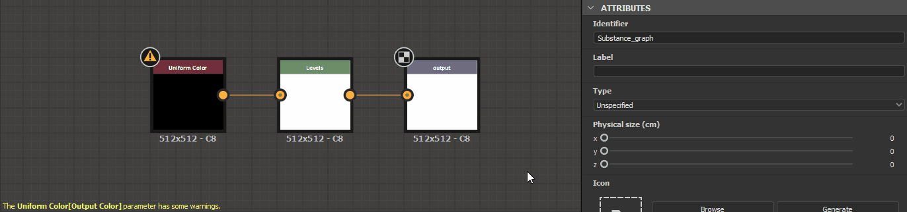

# Avertissements dans les graphes Substance

Cette page répertorie les messages d&#39;avertissement et d&#39;erreur qui peuvent être déclenchés par les [graphiques de Substances](../../compositing-graphs/substance-compositing-graphs.md) dans Substance 3D Designer et propose des étapes de dépannage courantes pour chacun d&#39;eux.

Les avertissements sont affichés dans l&#39;infobulle de l&#39;icône d&#39;avertissement pour la ressource de graphique dans le panneau [Explorateur](../../interface/the-explorer-window/the-explorer-window.md), ainsi que dans le coin inférieur gauche de la [vue graphique](../../interface/the-graph-view/the-graph-view.md) si le graphique est chargé.

##  Aucun nœud de sortie défini

Le graphique n&#39;a pas de nœud [Output](../../compositing-graphs/nodes-reference-for-com/atomic-nodes/output/output.md).

Solution ****

Ajoutez un ou plusieurs nœuds [Sortie](../../compositing-graphs/nodes-reference-for-com/atomic-nodes/output/output.md) au graphique et connectez-y la sortie du dernier nœud d&#39;un flux.

>[!NOTE]
>
> Les modèles de graphiques disponibles via la boîte de dialogue [Nouveau graphique](../creating-compositing-gra/creating-a-substance-compositing-graph.md) disposent de nœuds de sortie prédéfinis prêts à être utilisés.

{width="512px"}

###  La fonction du paramètre *[x]* comporte des avertissements

Le [graphique de fonction](../../function-graphs/function-graphs.md) appliqué au paramètre spécifié du nœud spécifié comporte au moins un avertissement.\
Le paramètre de nœud est spécifié entre crochets après le libellé du nœud, à la suite du modèle Node[Parameter].

E.g. Couleur Uniforme[Couleur De Sortie], Processeur De Pixels[Fonction Par Pixel]

Solution ****

Localisez le nœud qui émet l&#39;avertissement par son étiquette et son badge d&#39;avertissement dans la [vue graphique](../../interface/the-graph-view/the-graph-view.md), puis sélectionnez-le pour afficher ses propriétés dans le panneau [Propriétés](../../interface/properties/properties.md). Recherchez le paramètre émettant l&#39;avertissement et ouvrez sa fonction en cliquant sur le bouton **Modifier la fonction**.

Évaluez ensuite les avertissements répertoriés dans le coin inférieur gauche de la vue Graphique et résolvez les problèmes. Vous pouvez vous référer à la page [Avertissements dans les graphiques de fonctions](../../function-graphs/warnings-function-graphs/warnings-in-function-graphs.md) pour la résolution des avertissements signalés dans les graphiques de fonctions.

###  Les données référencées comportent des avertissements

La ressource référencée par un nœud comporte un ou plusieurs avertissements. Voici quelques nœuds référençant une ressource :

* Un nœud [instance de graphe](../../compositing-graphs/creating-compositing-gra/graph-instances-sub-gra/graph-instances-sub-graphs.md) référence un graphe
* Un nœud [Bitmap](../../compositing-graphs/nodes-reference-for-com/atomic-nodes/bitmap/bitmap.md) référence une [ressource Bitmap](../../resources/bitmap-resource/bitmap-resource.md)
* Un nœud [SVG](../../compositing-graphs/nodes-reference-for-com/atomic-nodes/svg/svg.md) référence une [ressource SVG](../../resources/vector-graphics-svg-res/vector-graphics-svg-resource.md)
* Un nœud [Texte](../../compositing-graphs/nodes-reference-for-com/atomic-nodes/text/text.md) référence une [ressource Police](../../resources/font-resource/font-resource.md)

Solution ****

Dans le panneau [Explorateur](../../interface/the-explorer-window/the-explorer-window.md), recherchez la ressource référencée et résolvez tous les avertissements déclenchés par la ressource :

* Pour les graphiques, reportez-vous aux autres éléments de cette page
* Pour tout autre type de ressource, consultez la page [Avertissements des dépendances](../../resources/warnings-from-dep/warnings-from-dependencies.md)

### Ressource de référence  introuvable

La ressource référencée par un nœud est introuvable au chemin d&#39;accès enregistré dans le fichier [Substance 3D](https://www.adobe.com/products/substance3d/3d-augmented-reality.html) (SBS). Voici quelques nœuds référençant une ressource :

* Un nœud [instance de graphe](../../compositing-graphs/creating-compositing-gra/graph-instances-sub-gra/graph-instances-sub-graphs.md) référence un graphe
* Un nœud [Bitmap](../../compositing-graphs/nodes-reference-for-com/atomic-nodes/bitmap/bitmap.md) référence une [ressource Bitmap](../../resources/bitmap-resource/bitmap-resource.md)
* Un nœud [SVG](../../compositing-graphs/nodes-reference-for-com/atomic-nodes/svg/svg.md) référence une [ressource SVG](../../resources/vector-graphics-svg-res/vector-graphics-svg-resource.md)
* Un nœud [Texte](../../compositing-graphs/nodes-reference-for-com/atomic-nodes/text/text.md) référence une [ressource Police](../../resources/font-resource/font-resource.md)

Solution ****

Pour les nœuds de [l&#39;instance de graphe](../../compositing-graphs/creating-compositing-gra/graph-instances-sub-gra/graph-instances-sub-graphs.md)

Vérifiez que le graphique source existe dans le package situé au chemin enregistré dans leur attribut **Package**.\
Si ce n&#39;est pas le cas, supprimez le nœud d&#39;instance et remplacez-le par un nœud d&#39;instance référençant un package valide. Vous pouvez également recréer le package et le graphique référencés par le nœud d&#39;instance, puis recharger le package hôte en cliquant sur RMB dessus dans le panneau [Explorateur](../../interface/the-explorer-window/the-explorer-window.md) et en sélectionnant l&#39;option **Recharger** dans le menu contextuel.

Pour les nœuds [Bitmap](../../compositing-graphs/nodes-reference-for-com/atomic-nodes/bitmap/bitmap.md), [SVG](../../compositing-graphs/nodes-reference-for-com/atomic-nodes/svg/svg.md) ou [Texte](../../compositing-graphs/nodes-reference-for-com/atomic-nodes/text/text.md)

Recherchez les ressources référencées dans le panneau Explorateur et vérifiez qu&#39;elles existent à l&#39;emplacement enregistré dans leur attribut **Chemin d&#39;accès**.\
Si ce n&#39;est pas le cas, cliquez sur RMB sur l&#39;élément de ressource dans l&#39;Explorateur et sélectionnez l&#39;option **Déplacer...** dans le menu contextuel pour définir un nouveau fichier cible valide pour cette ressource.

###  Le nœud de texte utilise une police non valide

Un nœud [Texte](../../compositing-graphs/nodes-reference-for-com/atomic-nodes/text/text.md) référence une police qui ne peut pas être chargée ou analysée correctement.

<b>  Solution</b>

Sélectionnez le nœud [Texte](../../compositing-graphs/nodes-reference-for-com/atomic-nodes/text/text.md) et notez la valeur de sa propriété <b>Font</b>. Recherchez le fichier source de cette police sur votre système et assurez-vous qu&#39;il est *sain*, par exemple en l&#39;utilisant dans une autre application telle qu&#39;un éditeur de texte. Remplacez la police par un fichier de police saine si nécessaire ou changez le nœud Texte pour une autre police.
