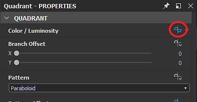
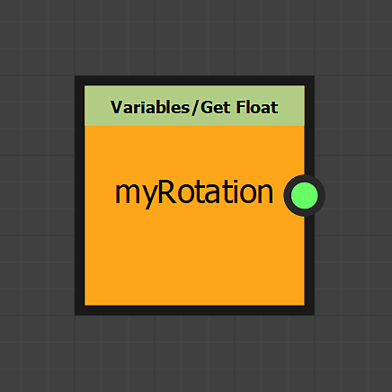

# Utilisation des nœuds Définir/Séquence

Cette page décrit les nœuds **Set** et **Sequence**, et fournit un exemple de cas d&#39;utilisation dans le contexte de **FX-Maps**.

<table>
<tr style="border: 0;">
<td style="border: 0;" valign="top">

## Vue d’ensemble

Lorsque vous travaillez avec des fonctions dans <b>FX-Maps</b>, vous vous retrouvez parfois dans des situations où vous souhaitez sortir une valeur du *[graphique de fonction de Substance](../../../../function-graphs/the-function-graph/the-function-graph.md)* d&#39;un paramètre, afin de pouvoir *l&#39;utiliser dans un autre.* Mais par défaut, un graphique de fonction de Substance ne sort que *une* valeur : celle qui pilote le paramètre associé.

</td>
<td style="border: 0;" valign="top">

</td>
</tr>
</table>

Dans ce cas, vous pouvez utiliser la combinaison des nœuds <b>Set</b> et <b>Sequence</b>, ce qui vous permettra de contrôler des variables sur une ou plusieurs fonctions.

Ce processus comprend deux étapes :

1. Le nœud <b>Set</b> vous permet de créer une nouvelle variable afin de l&#39;appeler ailleurs et de lui attribuer une valeur.
1. Le nœud <b>Séquence</b> est utilisé pour exécuter la logique de l&#39;étape 1 dans son intégralité, *avant d&#39;exécuter une autre branche* du graphique, par exemple la logique réellement impliquée dans la sortie de la valeur attendue pour le graphique actuel

<table>
<tr style="border: 0;">
<td width="100.00%" style="border: 0;" valign="top">

## Nœud Définir

Le nœud <b>Set</b> vous permet de définir une nouvelle variable et de lui attribuer le type et la valeur connectés à l&#39;*entrée* du nœud.

Le *nom* de la variable est saisi par l&#39;utilisateur dans les propriétés du nœud.

Par défaut, la variable définie par ce nœud est *uniquement* accessible dans l&#39;étendue du *parent* de ce graphique de fonction de Substance, par exemple le nœud qui héberge le paramètre défini par la fonction.

</td>
<td width="25.00%" style="border: 0;" valign="top">

</td>
</tr>
</table>

<table>
<tr style="border: 0;">
<td style="border: 0;" valign="top">

Dans cet exemple, le nom de la variable a été défini sur **`myVariable`** et sa valeur est **1**.

</td>
<td style="border: 0;" valign="top">

</td>
</tr>
</table>

<table>
<tr style="border: 0;">
<td width="100.00%" style="border: 0;" valign="top">

## Nœud de séquence

Le nœud <b>Séquence</b> vous donne le contrôle du *flux d&#39;exécution* des graphiques de fonction de Substance, en vous assurant que la *première branche est entièrement exécutée avant la deuxième branche*.

La sortie de la *deuxième branche* est ensuite transmise à la sortie du nœud.

</td>
<td width="25.00%" style="border: 0;" valign="top">

</td>
</tr>
</table>

<table>
<tr style="border: 0;">
<td style="border: 0;" valign="top">

Dans cet exemple, le nœud <b>Séquence</b> est défini comme sortie du graphique. La sortie de la fonction est donc la valeur <b>0.5</b> sortie par le nœud <b>Float</b>.

Toutefois, avant cela, la variable `<b>myVariable</b>` est définie avec une valeur flottante de <b>1.0</b>. Cette variable peut ensuite être utilisée *ailleurs* dans le contexte du nœud.

</td>
<td style="border: 0;" valign="top">

</td>
</tr>
</table>

Les nœuds de **séquence** peuvent être *chaînés* pour contrôler le flux d&#39;exécution du graphique.

Par exemple, vous pouvez *définir* une variable en premier, *mettre à jour* sa valeur à un moment ultérieur, puis *lire* sa valeur finale, tout en vous assurant que ces actions se produisent *dans un ordre spécifique*.

## Visibilité variable

Sachez qu&#39;une variable déclarée n&#39;est *pas* accessible de n&#39;importe où !\
Alors qu&#39;une variable déclarée au niveau parent peut être accessible aux niveaux enfant, le contraire est *faux*.

Ainsi, les variables définies dans le nœud ne sont *pas* accessibles au niveau du graphique, tandis que les variables définies au niveau du graphique *peuvent* être consultées dans les fonctions de paramètres de son nœud.

Par exemple, cette règle est au cœur de l&#39;*exposition d&#39;un paramètre*, car l&#39;exposition implique en fait les étapes suivantes :

1. Création d’un paramètre d’entrée de graphique
1. Accès au graphique de fonction de Substance du paramètre
1. Définition de sa valeur comme sortie de la fonction

Prenons un petit exemple : imaginez que nous voulons que la valeur <b>Rotation</b> d&#39;un <b>quadrant</b> nœud soit influencée par la valeur <b>Couleur/Luminosité</b> : plus la luminosité est vive, plus la rotation est importante.

<table>
<tr style="border: 0;">
<td style="border: 0;" valign="top">

Nous allons effectuer tous les calculs dans la fonction du paramètre <b>Couleur/Luminosité</b>. Ce paramètre sera calculé *en premier*. Ainsi, toute variable définie dans celui-ci sera disponible pour les autres paramètres de nœud.

</td>
<td style="border: 0;" valign="top">

</td>
</tr>
</table>

<table>
<tr style="border: 0;">
<td style="border: 0;" valign="top">

Notre fonction va être simple : la luminosité sera une valeur aléatoire entre **0** et **1**, cette valeur sera stockée dans la variable `myRotation`, puis nous définirons la valeur comme sortie de la fonction.

Cela signifie que la valeur du paramètre **Couleur/Luminosité** sera aléatoire *et* stockée dans la variable `myRotation`.

Notez que la propriété **Position** est déjà définie par une valeur aléatoire et qu&#39;un nœud **Itérer** est utilisé pour obtenir plusieurs motifs placés de manière aléatoire.

</td>
<td style="border: 0;" valign="top">

</td>
</tr>
</table>

<table>
<tr style="border: 0;">
<td style="border: 0;" valign="top">

Maintenant que la variable `myRotation` existe et a une valeur, accédons au graphique de la fonction de Substance de la propriété <b>Rotation du motif</b>.

</td>
<td style="border: 0;" valign="top">

</td>
</tr>
</table>

<table>
<tr style="border: 0;">
<td width="100.00%" style="border: 0;" valign="top">

Dans la fonction, nous lisons la valeur du paramètre `myRotation` à l&#39;aide d&#39;un nœud **Get Float** - nous savons que la variable contient une valeur float - et la définissons comme sortie de la fonction.

</td>
<td width="25.00%" style="border: 0;" valign="top">

</td>
</tr>
</table>

La luminosité contrôle désormais également la rotation.

