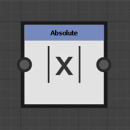
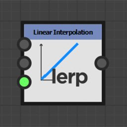

# Nœuds de fonction

Les noeuds de fonction transforment la valeur d’entrée en fonction de la fonction mathématique qu’ils représentent.

Bien que leurs connecteurs d’entrée ne soient généralement pas typés, ils ne prennent pas en charge tous les types valeur.

## Liste des nœuds

+++Pow

Retourne la première entrée élevée à la puissance de la deuxième entrée : <b>X^Y</b>.

+++

+++2Pow

Renvoie 2 à la puissance de sa valeur d&#39;entrée : <b>2^X</b>.

+++

+++Racine carrée

Renvoie la racine carrée de sa valeur d&#39;entrée : <b>√X</b>.

+++

+++Exponentiel

Renvoie la valeur exponentielle de sa valeur d&#39;entrée : <b>e^X</b>

<b>e</b> est approximativement égal à 2,7182818.

+++

+++Logarithme

Renvoie le logarithme naturel de sa valeur d&#39;entrée : <b>ln(X)</b>.

+++

+++Logarithme base 2
Icône 

Renvoie le logarithme de base 2 de sa valeur d&#39;entrée : <b>log2(X)</b>.

+++

+++Absolu

Retourne la valeur absolue de son entrée : <b>abs(X)</b>.

+++

+++Ceil

Arrondit sa valeur d’entrée à une valeur supérieure. Elle renvoie la plus petite valeur d&#39;entier non inférieure à X : <b>ceil(X)</b>.

+++

+++Arrondi à l’inférieur

Arrondit sa valeur d’entrée vers le bas. Elle renvoie la plus grande valeur d&#39;entier ne dépassant pas X : <b>floor(X)</b>.

+++

+++Interpolation linéaire

Renvoie l&#39;interpolation linéaire entre deux valeurs en fonction d&#39;une valeur flottante : <b>(1 - X)\*A + X\*B</b>.

+++

+++Minimum

Renvoie la plus faible des deux valeurs d&#39;entrée : <b>min(A, B)</b>.

+++

+++Maximum

Renvoie la plus élevée des deux valeurs d&#39;entrée : <b>max(A, B)</b>.

+++

+++Cosinus

Renvoie le cosinus de sa valeur d&#39;entrée en radians : <b>cos(X)</b>.

+++

+++Sinus

Renvoie le sinus de sa valeur d&#39;entrée en radians : <b>sin(X)</b>.

+++

+++Tangente

Renvoie la tangente de sa valeur d&#39;entrée en radians : <b>tan(X)</b>.

+++

+++Arc tangente 2
Icône de nœud 

Renvoie l’angle entre le vecteur 2D d’entrée et l’horizontale.

C&#39;est l&#39;inverse de la fonction <b>Cartésien</b>.

Il n&#39;est pas nécessaire de permuter les composantes X et Y du vecteur d&#39;entrée comme dans la fonction <b>atan2</b> habituelle.

+++

+++Cartésien

Convertit les coordonnées polaires en coordonnées cartésiennes.

Il s&#39;agit de l&#39;inverse de la fonction <b>tangente d&#39;arc 2 </b> : <b>Longueur \* Flottant 2(cos(Angle), sin(Angle).</b>

Les coordonnées polaires sont une distance depuis l’origine et un angle en radians depuis l’horizontale.

+++

+++Aléatoire

Renvoie une valeur aléatoire comprise entre 0 et la valeur d&#39;entrée <b>X</b>.

+++
