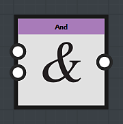

# Nœuds logiques

Les nœuds logiques sont utilisés pour ajouter plusieurs conditions à votre graphe :

## Nœud *And*

Le nœud Et prend deux nœuds de Booléen comme entrée :

* Si les deux entrées sont True, la sortie du nœud *And* sera *True*
* Dans tous les autres cas, le nœud *And* retournera *False*

## Le nœud *Or*

Le nœud Or prend deux nœuds de Booléen comme entrée :

* Si au moins une des entrées est True (1), la sortie du nœud *Or* sera *True*
* Si les deux entrées sont False, le nœud *Or* renvoie *False*

## Nœud *Not*

Le nœud Not prend un Booléen comme entrée : il va regarder la valeur d&#39;entrée et retourner son contraire :

* L&#39;entrée *Vrai* donne une sortie *Faux*
* L&#39;entrée *False* donne une sortie *True*
