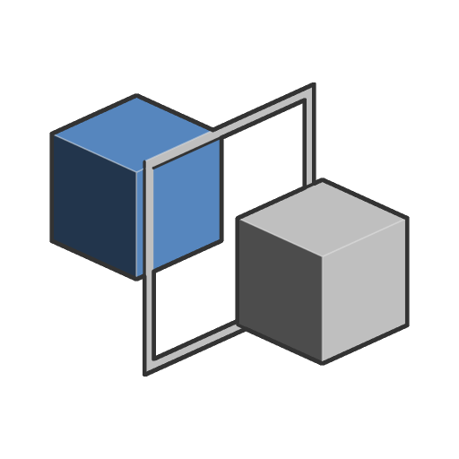

# Symétrie

<table>
<tr style="border: 0;">
<td width="33.33%" style="border: 0;" valign="top">

Icône 

<b>Entrée :</b> Fonction SDF > Opérateur

</td>
<td width="100.00%" style="border: 0;" valign="top">

## Description

Retourne et duplique une forme SDF sur un plan miroir, puis renvoie l&#39;union de la forme SDF de base et de son ou ses doublons. La symétrie peut être appliquée simultanément sur n&#39;importe quel axe.

</td>
</tr>
</table>

>[!INFO]
> 
> Pour en savoir plus sur les concepts et les workflows impliquant des Fonctions SDF, consultez la page dédiée : [Utilisation des Fonctions SDF](../../working-with-sdf-functions.md)

## Entrées

|  |  |
| :--- | :--- |
| <b>SDF</b> *Flotter* | Forme SDF d’entrée. |
| <b>Position du plan de symétrie</b> *Float3* | Position dans l&#39;espace univers du centre du plan du miroir. Cette position est partagée par tous les plans miroir si la symétrie est appliquée sur plusieurs axes.  <i>Par défaut : (0, 0, 0)</i> |
| <b>Axe de miroir</b> *Entier3* | Définit les axes de miroir souhaités.  Par exemple, (1, 0, 0) appliquera la symétrie sur l&#39;axe X.  <i>Par défaut : (1, 0, 0)</i> |
| <b>Symétrie de l&#39;axe</b> *Entier3* | Définit les axes à inverser.  Par exemple, (1, 0, 0) inversera la direction de la symétrie sur l&#39;axe X.  <i>Par défaut : (0, 0, 0)</i> |
| <b>Prédécalage</b> *Float3* | Décalage sur les axes X, Y et Z appliqué à la forme avant l&#39;application de l&#39;opérateur de symétrie. |
