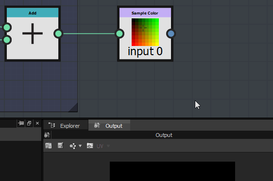

# Similitudes avec un graphique en Substance

À première vue, le graphique de fonction de Substance est très similaire à un graphique de Substance et le workflow est presque identique.

## La navigation est similaire

Dans le graphique de fonction de Substance, vous pouvez créer et organiser vos nœuds de la même manière que dans un graphique de Substance.

vous pouvez accéder aux nœuds de la même manière :

* À partir de la bibliothèque
* en appuyant sur la barre d’espace ou la touche de tabulation
* en cliquant avec le bouton droit et en utilisant le menu Ajouter un nœud

### Le workflow est similaire

Comme dans le graphique de Substance, vous construirez votre fonction en enchaînant des séries de nœuds, chacun d&#39;eux utilisant le résultat généré par le ou les précédents.

La sortie définira soit la valeur d&#39;un paramètre, soit la sortie du nœud de processeur de pixels.

## Différences avec un graphique en Substance

<table>
<tr style="border: 0;">
<td width="100.00%" style="border: 0;" valign="top">

### Nœuds

Les nœuds disponibles dans le graphique de fonction de Substance sont complètement différents de ceux que vous rencontreriez dans un graphique de Substance.

</td>
<td width="25.00%" style="border: 0;" valign="top">

</td>
</tr>
</table>

<table>
<tr style="border: 0;">
<td style="border: 0;" valign="top">

### La sortie

Contrairement aux graphiques de Substance, une fonction ne peut avoir qu’une seule sortie.

Autre point à noter : il n’y a pas de nœud de sortie spécifique où vous branchez votre résultat final. Au lieu de cela, vous pouvez marquer directement comme sortie le nœud qui génère le résultat attendu :

</td>
<td style="border: 0;" valign="top">

</td>
</tr>
</table>

#### Comment définir le nœud de sortie ?

Pour définir la sortie, cliquez avec le bouton droit de la souris sur le nœud qui génère la sortie attendue, puis cliquez sur *Définir comme nœud de sortie :*

>[!WARNING]
>
> <b>Vérifiez deux fois le type de résultat généré</b>
> 
> Si vous remarquez que l&#39;option *Définir comme nœud de sortie* est grisée, cela signifie que la valeur générée par le nœud est différente de la valeur attendue par le paramètre ou le processeur de pixels.

<table>
<tr style="border: 0;">
<td style="border: 0;" valign="top">

En ce qui concerne les graphiques de Substance, vous pouvez importer des fonctions créées dans un autre graphique. Vous pouvez ouvrir le graphique de référence en cliquant dessus avec le bouton droit de la souris, puis en choisissant « Ouvrir la référence » :

</td>
<td style="border: 0;" valign="top">

</td>
</tr>
</table>

Si vous avez un sbs contenant plusieurs fonctions, vous pouvez le glisser-déposer directement dans un graphique de fonction de Substance et choisir la fonction que vous voulez importer dans la liste qui apparaît :

