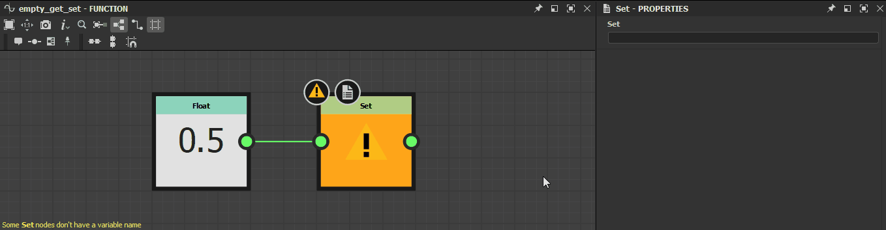

# Avertissements dans les graphiques de fonctions

Cette page répertorie les messages d&#39;avertissement et d&#39;erreur qui peuvent être déclenchés par les [graphiques fonctionnels](../../function-graphs/function-graphs.md) dans Substance 3D Designer et propose des étapes de dépannage courantes pour chacun d&#39;eux.

Les avertissements sont affichés dans l&#39;infobulle de l&#39;icône d&#39;avertissement pour la ressource de graphique dans le panneau [Explorateur](https://helpx.adobe.com/fr/substance-3d/unlisted/documentation/sddoc/the-explorer-129368147.html), ainsi que dans le coin inférieur gauche de la [vue graphique](../../interface/the-graph-view/the-graph-view.md) si le graphique est chargé.\
Si la fonction est *appliquée à un paramètre* dans un [graphe de Substances](../../compositing-graphs/substance-compositing-graphs.md), tout avertissement entraîne l&#39;avertissement « *La fonction du paramètre [x] comporte des erreurs* » pour ce paramètre.

##  Aucun nœud de sortie défini

La fonction n&#39;a pas de nœud de sortie défini.

<table>
<tr style="border: 0;">
<td width="58.30%" style="border: 0;" valign="top">

Solution ****

Sélectionnez un nœud dans le graphique qui génère une valeur dont le type correspond au type attendu pour cette fonction, le cas échéant, puis cliquez sur RMB et sélectionnez l&#39;option **Définir comme nœud de sortie** dans le menu contextuel.\
Le nœud de sortie d&#39;un graphique de fonction est coloré en *orange*.

>[!NOTE]
>
> Si une fonction a un type de valeur de sortie attendu, une note dans le coin inférieur gauche de la [vue Graphique](../../interface/the-graph-view/the-graph-view.md) vous permet de connaître ce type.

</td>
<td width="41.60%" style="border: 0;" valign="top">

</td>
</tr>
</table>

###  Le nœud de sortie actuel renvoie une valeur de type *x*

Le nœud de sortie de la fonction renvoie une valeur dont le type ne correspond pas au type de valeur de sortie attendu pour cette fonction.

<table>
<tr style="border: 0;">
<td width="58.30%" style="border: 0;" valign="top">

Solution ****

Sélectionnez n&#39;importe quel nœud dans le graphique qui génère une valeur dont le type correspond au type attendu pour cette fonction, puis cliquez sur RMB et sélectionnez l&#39;option **Définir comme nœud de sortie** dans le menu contextuel.\
Le nœud de sortie d&#39;un graphique de fonction est coloré en *orange*.

>[!NOTE]
>
> Si une fonction a un type de valeur de sortie attendu, une note dans le coin inférieur gauche de la [vue Graphique](../../interface/the-graph-view/the-graph-view.md) vous permet de connaître ce type.

</td>
<td width="41.60%" style="border: 0;" valign="top">

</td>
</tr>
</table>

###  Certains nœuds Get n&#39;ont pas de nom de variable

La propriété <b>Get...</b> d&#39;un ou plusieurs nœuds [Get](../../function-graphs/nodes-reference-for-fun/atomic-function-nodes/get-nodes/get-nodes.md) reste vide. Aucune variable ne doit donc être utilisée.

<table>
<tr style="border: 0;">
<td width="58.30%" style="border: 0;" valign="top">

Solution ****

Entrez une chaîne correspondant au nom d&#39;une variable *disponible dans la portée de la fonction* dans la propriété **Get...** des nœuds Get qui déclenchent cet avertissement.

>[!NOTE]
>
> La chaîne d&#39;entrée *s&#39;affiche dans le nœud*, ce qui facilite la recherche des nœuds avec des valeurs vides.

</td>
<td width="41.60%" style="border: 0;" valign="top">

</td>
</tr>
</table>

###  Certains nœuds Set n&#39;ont pas de nom de variable

La propriété **Set** d&#39;un ou de plusieurs nœuds [Set](../../function-graphs/fxmaps/using-functions-in-fxmaps/using-the-set-sequence/using-the-set-sequence-nodes.md) reste vide. Aucune variable ne doit donc être utilisée.

<table>
<tr style="border: 0;">
<td width="58.30%" style="border: 0;" valign="top">

Solution ****

Saisissez une chaîne dans la propriété **Set** des nœuds Set qui déclenchent cet avertissement.

>[!NOTE]
>
> La chaîne d&#39;entrée *s&#39;affiche dans le nœud*, ce qui facilite la recherche des nœuds avec des valeurs vides.

>[!NOTE]
>
> Si la chaîne *ne correspond* à aucune variable disponible dans la portée de la fonction, une *nouvelle variable* est créée dans cette portée et nommée d&#39;après la chaîne.

</td>
<td width="41.60%" style="border: 0;" valign="top">

</td>
</tr>
</table>
