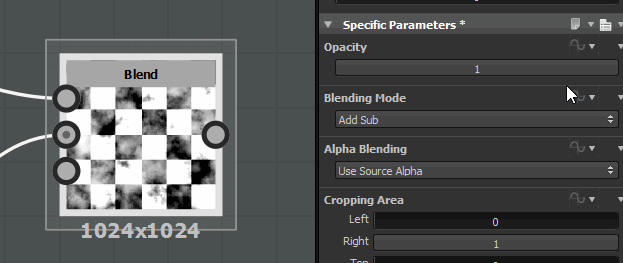

# Qu’est-ce qu’une fonction ?

Les fonctions de Substance 3D Designer permettent à l’utilisateur de générer des résultats en utilisant la logique que vous retrouverez dans un langage de programmation.

Mais plutôt que d’utiliser des lignes de codes, les fonctions de Designer conservent la même approche nodale. À première vue, un graphe de fonction ressemble beaucoup à un graphe normal.

Vous pouvez rencontrer des fonctions dans 2 cas principaux :

* pour contrôler le résultat d&#39;un paramètre
* si vous modifiez un processeur de pixels

## Contrôle du résultat d’un paramètre

Dans Substance 3D Designer, n’importe quel paramètre peut être contrôlé par une fonction.

Par conséquent, vous pouvez imaginer des règles et des dépendances entre les parties de votre graphe, pour obtenir des résultats uniques.

Par exemple, vous pouvez décider que l’opacité d’un nœud de fusion correspondra à la moitié de l’intensité d’un nœud de déformation :

En fait, vous avez peut-être déjà créé des fonctions sans en être conscient :

si vous avez exposé un paramètre, vous avez automatiquement créé une fonction et une variable : la fonction contient un nœud get float qui capture la valeur de la nouvelle variable créée :

