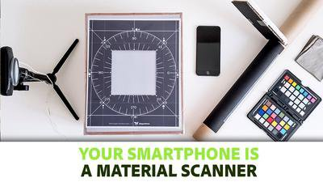

# apprentissage du Tutorials

La documentation se veut principalement une référence technique approfondie. Si vous préférez plonger avec des vidéos et d’autres matériaux d’apprentissage plus ciblés, ces tutoriels sont parfaits pour commencer.

<table>
<tr style="border: 0;">
<td style="border: 0;" valign="top">

[Illustration du tutoriel ](https://creativecloud.adobe.com/cc/learn/substance-3d-designer/web/first-steps-with-substance-3d-designer?locale=en)

</td>
<td style="border: 0;" valign="top">

## Premières étapes

Série destinée aux débutants qui met l’accent sur les premiers pas avec Designer. Présente l’interface utilisateur, les concepts de base, puis passe aux techniques de base et explique enfin comment exposer des paramètres et créer un matériau complet. Il est court et concentré, mais garde les choses légères, ce qui en fait le meilleur départ pour les débutants absolus.

</td>
</tr>
</table>

<table>
<tr style="border: 0;">
<td style="border: 0;" valign="top">

[Illustration du tutoriel ](https://creativecloud.adobe.com/cc/learn/substance-3d-designer/web/getting-started-with-substance-3d-designer?locale=en)

</td>
<td style="border: 0;" valign="top">

### Création de votre premier Matériau

Grande série de vidéos de démarrage qui vous guide tout au long du processus de création d’un matériau étendu et entièrement procédural. Chaque étape du processus est couverte et expliquée, donc vous apprendrez beaucoup à la fin, mais peut être intensive pour les débutants absolus.

</td>
</tr>
</table>

<table>
<tr style="border: 0;">
<td style="border: 0;" valign="top">

[Illustration du tutoriel ](https://www.youtube.com/playlist?list=PLB0wXHrWAmCy457vxKM4rQuJ-nvYm9j4M)

</td>
<td style="border: 0;" valign="top">

### Conseils rapides

Chaque vidéo quicktip se concentre sur un ensemble de nœuds et de techniques de taille de morsure. Nous expliquons le résultat, les nœuds ainsi que les paramètres les plus importants et vous montrons ensuite quelques façons de développer l&#39;idée.

</td>
</tr>
</table>

<table>
<tr style="border: 0;">
<td style="border: 0;" valign="top">

</td>
<td style="border: 0;" valign="top">

### Votre smartphone est un scanner de Matériau

Article intégré à la profondeur qui illustre l’intégralité du processus de prise de photos et de traitement à l’aide de Designer. Il s’agit d’un bon exemple d’utilisation de Substance 3D Designer pour automatiser certaines tâches.

</td>
</tr>
</table>
