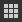
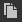
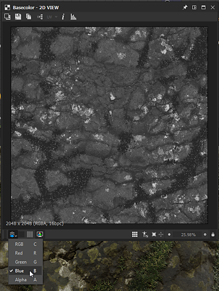

# Vue 2D

Cette page décrit l&#39;interface utilisateur et les fonctionnalités du panneau **Vue 2D** dans Substance 3D Designer.

## Vue d’ensemble

La [Vue 2D](https://substance3d.adobe.com/) est l’un des panneaux principaux de l’interface utilisateur de Designer. Ses principaux objectifs sont les suivants :

* affichage de la sortie *valeur* ou *image* par un *nœud* spécifié ou via un *connecteur de nœud* spécifié
* affichage de [bitmaps](../../resources/bitmap-resource/bitmap-resource.md) et de [graphiques vectoriels](../../resources/vector-graphics-svg-res/vector-graphics-svg-resource.md) [ressources](../../resources/resources.md)
* affichage de *informations supplémentaires* sur le contenu qu&#39;il contient actuellement, telles que les couches de couleur ou les valeurs de couleur exactes
* contrôle des paramètres *gizmos*

Lorsqu&#39;une image ou une valeur affichée est modifiée, la vue 2D *se met à jour automatiquement* pour rester synchronisée avec l&#39;état actuel des données.\
Les panneaux d&#39;affichage 2D *multiples* peuvent être actifs à tout moment et chacun peut afficher différentes images ou valeurs. Vous pouvez contrôler quand un nouveau panneau doit être utilisé à l&#39;aide de la fonctionnalité  <b>Coin</b> du panneau de l&#39;interface utilisateur.

### Affichage du contenu dans la vue 2D

>[!WARNING]
>
> Toutes les mentions d&#39;actions effectuées sur *nœuds* dans cette section ne s&#39;appliquent qu&#39;aux [graphes de Substance](../../compositing-graphs/substance-compositing-graphs.md).

Le moyen le plus simple d&#39;afficher une image dans la vue 2D consiste à double-cliquer sur *LMB*...

* ...sur une ressource [Bitmap](../../resources/bitmap-resource/bitmap-resource.md) ou [graphiques vectoriels](../../resources/vector-graphics-svg-res/vector-graphics-svg-resource.md) dans l&#39;[Explorateur](../../interface/the-explorer-window/the-explorer-window.md)
* ...sur un nœud ou un connecteur de nœud dans la [Vue graphique](../../interface/the-graph-view/the-graph-view.md)

Vous pouvez également *faire glisser et déposer* des images directement dans la fenêtre d&#39;affichage en maintenant *LMB* sur une [ressource](../../resources/resources.md) dans le panneau [Explorateur](../../interface/the-explorer-window/the-explorer-window.md) ou *RMB* sur un nœud dans la vue Graphique.

Dans la vue Graphique, vous pouvez envoyer une image à la vue 2D à l&#39;aide de l&#39;option de menu contextuel <b>Afficher la sortie en vue 2D</b>, accessible en cliquant sur *RMB*...

* ...sur un *nœud* pour afficher *la sortie de ce nœud*. Si le nœud a plusieurs sorties, sélectionnez la sortie souhaitée dans le sous-menu
* ...sur *espace vide* dans la vue Graphique pour afficher *la sortie de ce graphique*. Si le graphique comporte plusieurs sorties, sélectionnez la sortie souhaitée dans le sous-menu

Lors du chargement d&#39;un graphique, sa *première sortie* s&#39;affiche automatiquement dans la vue 2D par défaut. Vous pouvez désactiver ce comportement dans les [Préférences](../../interface/preferences-window/preferences-window.md). Accédez à <b>Modifier > Préférences > Graphe > graphe de composition de Substance</b> et *décochez* l&#39;<b>Afficher la sortie dans Vue 2D lors de l&#39;ouverture d&#39;un graphe</b>.

## Viewport

La fenêtre d&#39;affichage est la *zone d&#39;affichage* de la <b>Vue 2D</b> et vous permet de *parcourir* l&#39;image affichée à l&#39;aide des raccourcis clavier et de la souris suivants :

<table>
<tr style="border: 0;">
<td style="border: 0;" valign="top">

* <b>Panoramique :</b> Ctrl+RMB/MMB
* <b>Zoom :</b> Alt + RMB / MouseWheel / Outil « Afficher l’échelle » :\
  
* <b>Ajuster au viewport :</b> F / bouton « Ajuster à l&#39;affichage » 
* <b>Ajuster à l&#39;échelle 1:1 :</b> bouton Z / Adapter à l&#39;échelle 

</td>
<td style="border: 0;" valign="top">

</td>
</tr>
</table>

Utilisation d’un pavé tactile (macOS uniquement)

* <b>Panoramique :</b>Balayage à deux doigts
* <b>Zoom :</b> pincement à deux doigts / balayage à deux doigts tout en maintenant la touche Cmd enfoncée

>[!IMPORTANT]
>
> Actions non disponibles
> 
> Il n&#39;est *pas* possible de panoramiser l&#39;image si la taille d&#39;affichage actuelle de l&#39;image est *inférieure à la taille du viewport*.
> 
> Il n&#39;est *pas* possible d&#39;effectuer un zoom avant/arrière sur l&#39;image si le contenu affiché *n&#39;existe plus* - par exemple, le nœud ou la ressource de référence d&#39;une image a été supprimé.

>[!NOTE]
>
> Sens du zoom
> 
> Chacune des méthodes de zoom est inversée par rapport à l’autre :
> 
> * La molette de la souris vers le haut *rapproche* l&#39;image
> * Alt+RMB et faites glisser l&#39;image *en poussant* vers le haut
> 
> Le sens du zoom peut être inversé dans les [Préférences](../../interface/preferences-window/preferences-window.md).

La *résolution*, le *format de couleur* et le *nombre de bits par pixel* natifs de l&#39;image apparaissent dans la zone inférieure gauche de la fenêtre d&#39;affichage.

En plus de la navigation, la clôture offre les fonctionnalités suivantes :

* Affichage en mosaïque : *répète l&#39;image* dans la fenêtre d&#39;affichage avec un motif en mosaïque. Ceci est utile pour vérifier la manière dont un motif ou une texture se répétera. Elle est activée à l&#39;aide du bouton **Barre d&#39;espace** ou  **Affichage en mosaïque**
* Affichage de la taille physique : affiche l&#39;image avec un *rapport* correspondant à la propriété [Taille physique](../../compositing-graphs/graph-parameters/graph-parameters.md) du graphique. Elle est activée à l&#39;aide du bouton  **Rapport de Taille physique**
* Conserver la taille de l&#39;affichage : cette option *verrouille l&#39;échelle d&#39;affichage* afin qu&#39;elle reste cohérente sur les différentes images. Elle est *activée par défaut* et peut être désactivée à l&#39;aide du bouton  **Conserver la taille de l&#39;affichage**

## Barre d&#39;outils principale

La barre d&#39;outils principale du panneau <b>Vue 2D</b> vous permet d&#39;en faire plus avec vos images affichées et offre les fonctionnalités suivantes :

+++Image d’arrière-plan
{width="360px"}

Vous pouvez *superposer une autre image* sur celle actuellement affichée. Appuyez sur le bouton  <b>Image d&#39;arrière-plan</b> et vous serez invité à sélectionner un fichier image à utiliser comme incrustation.

Une fois le fichier sélectionné, une nouvelle barre d’outils apparaît avec les commandes suivantes pour l’incrustation d’image :

Fermeture de <b> :</b> *fermez* la barre d&#39;outils contrôles d&#39;incrustation et *désactivez* l&#39;incrustation de l&#39;image d&#39;arrière-plan.

<b> Charger l&#39;image :</b> sélectionnez *un autre fichier image* à utiliser comme superposition.

<b> Image source :</b> définit l&#39;image d&#39;incrustation sur une opacité de *0 %*.

Image d&#39;arrière-plan <b> :</b> définit l&#39;image d&#39;incrustation sur l&#39;opacité *100 %*.

<b> Réinitialiser :</b> définit l&#39;image d&#39;incrustation sur une opacité de *50 %*.

Un curseur vous permet de *contrôler manuellement* l&#39;opacité de l&#39;image d&#39;incrustation.

+++

+++Exporter l’image
{width="360px"}

L&#39;image actuellement affichée peut être *exportée vers un fichier image*. Appuyez sur le bouton  <b>Enregistrer l&#39;image...</b> et vous serez invité à sélectionner un *emplacement*, un *nom* et un *format de fichier* pour le fichier exporté.

Bien que l&#39;image soit exportée en tant que *résolution native* (affichée dans la zone inférieure gauche de la fenêtre d&#39;affichage), le *format de nombre de bits par pixel* et le *format de couleur* *dépendent du format d&#39;image* sélectionné. Par exemple, les images 32 bits en virgule flottante ne peuvent être exportées à leur plage de données complète qu’avec des formats d’image qui prennent en charge cette précision, tels que TIFF, EXR et HDR. Si le format de l’image ne prend pas en charge les données, un verrouillage et/ou un effet de bande chromatique risquent de se produire dans l’image exportée.\
En général, n’oubliez pas quelles sont la précision et les fonctionnalités offertes par les formats d’image que vous avez l’intention d’utiliser (prise en charge de la virgule flottante, profils ICC, etc.).

Si <b>OCIO</b> ou <b>ACE Adobe</b> Le [mode de gestion des couleurs](../../color-management/color-management.md) est actuellement utilisé et une option supplémentaire est disponible pour sélectionner l&#39;*espace colorimétrique* de l&#39;image exportée.

+++

+++Copier dans le presse-papiers
{width="360px"}

L&#39;image actuellement affichée peut être *copiée dans le Presse-papiers*. Appuyez sur le bouton  <b>Copier l&#39;image dans le Presse-papiers</b> pour coller l&#39;image dans n&#39;importe quel logiciel tiers, tel qu&#39;Adobe Photoshop.

L&#39;image sera copiée en tant qu&#39;image de précision *8 bits* à sa *résolution native*, qui s&#39;affiche dans la zone inférieure gauche du viewport.

+++

+++Permuter les sorties du graphe
{width="360px"}

Si l&#39;image actuellement affichée est une *sortie du graphe*, vous pouvez *rapidement passer à n&#39;importe quelle* autre sortie du graphe à l&#39;aide du bouton <b>Sélectionner la sortie</b>.

Cette fonctionnalité n&#39;est *pas* disponible pour les autres nœuds, y compris les nœuds qui ont plusieurs sorties.

+++

+++incrustation UV
{width="357px"}

Si l&#39;option <b>Afficher les UV dans vue 2D</b> est activée dans le menu <b>Scène</b> du dock [vue 3D](../../interface/3d-view/3d-view.md), la fonction d&#39;incrustation d&#39;UV est disponible dans la vue 2D.

Vous pouvez l&#39;activer à l&#39;aide du bouton <b>UV</b>. 

Cela affiche les UV du maillage [actuellement sélectionné dans la vue 3D](../../interface/3d-view/3d-view.md) sous la forme d&#39;une structure filaire colorée.

Si les informations de couleur du matériau sont disponibles dans le fichier de maillage, la couleur du matériau est utilisée comme couleur de l’incrustation de l’UV.

Si le maillage a <b>plusieurs Ensembles d&#39;UV</b>, les UV souhaités peuvent être sélectionnés dans la liste déroulante qui peut être ouverte en cliquant sur la flèche à côté de l&#39;étiquette « UV » dans le bouton.

+++

+++Informations sur l’image
{width="360px"}

Vous pouvez afficher les *valeurs de pixel exactes* *et les* dans une image à l&#39;aide du panneau <b>Informations</b>, qui est activé à l&#39;aide du bouton  <b>Informations sur l&#39;image</b>. Cette fonction est très utile lors de l’inspection d’images HDR, par exemple, ou pour s’assurer que le passage d’un pixel à l’autre suit la progression prévue.

Les couleurs sont représentées par des valeurs <b>RVBA</b> et <b>HSV</b>, et affichées en fonction de la *précision* de l&#39;image, comme suit :

* <b>8 bits</b> : entier 0-255 / virgule flottante 0,0-1,0

* <b>16 bits</b> : entier 0-65532 / virgule flottante 0,0-1,0

* <b>16F</b> (virgule flottante 16 bits) : valeur de virgule flottante brute

* <b>32F</b> (virgule flottante 32 bits) : valeur de virgule flottante brute

Les coordonnées des pixels sont représentées par les valeurs <b>X</b> et <b>Y</b>.

+++

+++Histogramme
{width="360px"}

Vous pouvez afficher l&#39;*histogramme* de l&#39;image avec le panneau <b>Histogramme</b>, qui est activé à l&#39;aide du bouton  <b>Afficher l&#39;histogramme</b>.

Les *modes d&#39;histogramme* suivants sont disponibles :

* <b>Luminance</b>

* <b>Rouge</b>

* <b>Vert</b>

* <b>Bleu</b>

* <b>RGB</b>

* <b>Alpha</b>

Les informations suivantes sont répertoriées sous les modes :

* <b>Pixels</b> : nombre de pixels dans l’image

* <b>Plage</b> : plage de valeurs entière disponible

* <b>Plage utilisée</b> : plage de valeurs allant du pixel de la valeur la plus basse au pixel de la valeur la plus élevée

En outre, vous pouvez cliquer sur **LMB** sur l&#39;histogramme ou *maintenir* **LMB** et *faire glisser* sur l&#39;histogramme pour *sélectionner une partie spécifique* des données. Les informations suivantes s’affichent alors pour cette sélection :

* **Pixels sélectionnés** : nombre de pixels ayant les valeurs sélectionnées

* **Plage sélectionnée** : plage de valeurs de la partie sélectionnée

* **Maximum sélectionné** : nombre maximal de pixels dont une valeur est incluse dans la partie sélectionnée

La sélection peut être *effacée* en cliquant sur **RMB** dans l&#39;histogramme.

La représentation de certaines des valeurs ci-dessus dépend de la précision sélectionnée dans la section inférieure du panneau, comme suit :

* **8 bits** : 0-255 entier

* **16 bits** : entier de 0 à 65532

* **32 bits** : valeur brute en virgule flottante

Certaines parties de l’histogramme peuvent inclure des valeurs de nombre de pixels très faibles, ce qui rend leur lecture difficile. Dans ce cas, vous pouvez activer le mode **racine carrée**, à l&#39;aide du bouton **Sqrt**, qui utilise la *racine carrée des valeurs réelles* pour tracer l&#39;histogramme.

+++

## Afficher la barre d’outils

La barre d&#39;outils **Affichage**, qui se trouve par défaut au *bas* du panneau **Vue 2D**, vous permet de contrôler l&#39;affichage de l&#39;image dans la clôture.

La section *la plus à gauche* inclut des contrôles pour la *couleur* et la *transparence*, tandis que la section *la plus à droite* inclut les contrôles *viewport* détaillés dans la section Viewport de cette page.

>[!NOTE]
>
> La barre d&#39;outils peut être *repositionnée* autour du panneau **vue 2D** à l&#39;aide de la *poignée* la plus à gauche représentée par trois lignes parallèles.

{width="360px"}

### Canaux de couleur

Vous pouvez afficher un canal unique de l&#39;image en utilisant le bouton  <b>Couches de couleur</b>. Une zone de liste déroulante s&#39;ouvre, vous permettant de sélectionner les canaux <b>rouge</b>, <b>vert</b>, <b>bleu</b> et <b>Alpha</b> qui doivent être affichés. L&#39;aspect normal de l&#39;image avec tous les canaux est restauré en sélectionnant l&#39;option <b>RGB</b>.

Les *raccourcis clavier* suivants peuvent être utilisés pour basculer rapidement vers différentes couches de couleur :

* RGB : <b>C</b>
* Rouge : <b>R</b>
* Vert : <b>G</b>
* Bleu : <b>B</b>
* Alpha : <b>A</b>

L&#39;*icône* du bouton <b>Couches de couleur</b> *change* en fonction des couches actuellement affichées.

>[!NOTE]
>
> Les raccourcis clavier ne peuvent être utilisés que si le panneau vue 2D est activé. Vous pouvez cliquer sur ce panneau au moins une fois pour vous assurer que c&#39;est le cas.
> 
> Comme le panneau doit être mis au point, ces raccourcis *n&#39;interfèrent* avec aucun des *raccourcis personnalisés* que vous avez définis pour la création de nœuds dans le graphe. Pour en savoir plus sur cette fonctionnalité, cliquez [ici](../../interface/preferences-window/preferences-window.md).

{width="360px"}

### Bouton Transparence

L&#39;affichage de la transparence peut être activé et désactivé à l&#39;aide du bouton / <b>Afficher le damier</b>. Lorsque cette option est activée, la transparence s’affiche avec un motif à damier.

Il existe deux façons principales d&#39;interpréter la transparence, qui peuvent être sélectionnées à l&#39;aide du bouton / <b>Mode de transparence</b> :

<b> Direct :</b> les informations de transparence sont uniquement stockées dans le canal Alpha et n&#39;ont aucune incidence sur les autres aspects de l&#39;image

<b> prémultiplié :</b> les informations de transparence sont stockées dans le canal Alpha et ont également un impact sur les canaux du RGB, car elles sont effectivement multipliées par rapport au canal Alpha

Pour afficher *les bonnes couleurs*, le mode de transparence approprié doit être sélectionné dans le panneau <b>vue 2D</b> pour correspondre à la méthode de transparence qui a été appliquée lorsque l&#39;image a été *créée*.

{width="360px"}

### Espace colorimétrique

Pour une représentation plus précise des couleurs, les images sont affichées par défaut dans un *espace colorimétrique* qui correspond à celui utilisé par le *moniteur*.

Les commandes disponibles et l&#39;effet du bouton / <b>Espace colorimétrique</b> dépendront du [mode de gestion des couleurs](../../color-management/color-management.md) défini dans les [paramètres du projet](../../interface/preferences-window/project-settings/project-settings.md). Pour en savoir plus sur ces commandes, consultez la section Gestion des couleurs de cette page.

<table>
<tr style="border: 0;">
<td style="border: 0;" valign="top">

## Outils de peinture bitmap

Les <b>outils de peinture bitmap</b> sont disponibles pour les [ressources bitmap](../../resources/bitmap-resource/bitmap-resource.md) répondant aux critères suivants :

* Le bitmap utilise la précision *8 bits*
* La ressource bitmap est *importée* dans le package, les images liées ne sont *pas* prises en charge

>[!NOTE]
>
> Les *nouvelles* ressources bitmap créées dans Substance 3D Designer *correspondront automatiquement* à ces critères.

</td>
<td style="border: 0;" valign="top">

</td>
</tr>
</table>

>[!TIP]
>
> Pour en savoir plus, consultez la page [Outils de peinture bitmap](../../resources/bitmap-resource/bitmap-painting-tools/bitmap-painting-tools.md) de la documentation.

<table>
<tr style="border: 0;">
<td style="border: 0;" valign="top">

## Éditeur d’images vectorielles

L&#39;<b>éditeur d&#39;images vectorielles</b> est disponible pour les *ressources de SVG* [importées](../../resources/vector-graphics-svg-res/vector-graphics-svg-resource.md). Les ressources liées ne sont *pas* prises en charge.

>[!NOTE]
>
> Les *nouvelles* ressources de SVG créées dans Substance 3D Designer *correspondront automatiquement* à ce critère.

</td>
<td style="border: 0;" valign="top">

</td>
</tr>
</table>

>[!TIP]
>
> Pour en savoir plus, consultez la page [Outils de modification vectorielle](../../resources/vector-graphics-svg-res/vector-editing-tools/vector-editing-tools.md) (obsolète) de la documentation.

{width="360px"}

## Gestion des couleurs

La <b>Vue 2D</b> offre des commandes simples de *gestion des couleurs* pour vous permettre de choisir l&#39;*espace colorimétrique d&#39;affichage* à utiliser lors de l&#39;affichage de l&#39;image.

Ces commandes s&#39;adapteront au [mode de gestion des couleurs](../../color-management/color-management.md) actuel défini dans les [paramètres du projet](../../interface/preferences-window/project-settings/project-settings.md), comme suit :

* <b>Hérité :</b> vous pouvez afficher l&#39;image dans les espaces colorimétriques sRVB  ou sRVB  linéaires ;
* <b>ACE d&#39;Adobe :</b> vous pouvez  *activer* la gestion des couleurs et définir l&#39;espace colorimétrique le plus approprié pour le *moniteur actif* tel que détecté par le Adobe ACE, ou  *désactiver* la gestion des couleurs et afficher l&#39;image à l&#39;aide des valeurs de couleur brute ;
* <b>OCIO :</b> vous pouvez  *activer* la gestion des couleurs et définir le moniteur le plus approprié pour le *moniteur actuel* tel que détecté par le moteur OCIO, utiliser la zone de liste déroulante et sélectionner l&#39;un des *espaces colorimétriques d&#39;affichage* disponibles dans le [fichier de configuration OCIO](../../color-management/color-management.md) actuellement utilisé, ou  *désactiver* la gestion des couleurs et afficher l&#39;image à l&#39;aide des valeurs de couleur brute.

>[!WARNING]
>
> Gardez à l&#39;esprit que ces commandes *n&#39;affectent* que l&#39;*espace colorimétrique d&#39;affichage*. L&#39;*espace colorimétrique d&#39;origine* des images et l&#39;*espace colorimétrique de travail* doivent également être pris en compte pour s&#39;assurer que les couleurs s&#39;affichent correctement dans la **Vue 2D**.

>[!TIP]
>
> Accédez à la section [Gestion des couleurs](../../color-management/color-management.md) de cette documentation pour en savoir plus sur cette fonctionnalité et son implémentation plus large dans Designer.
