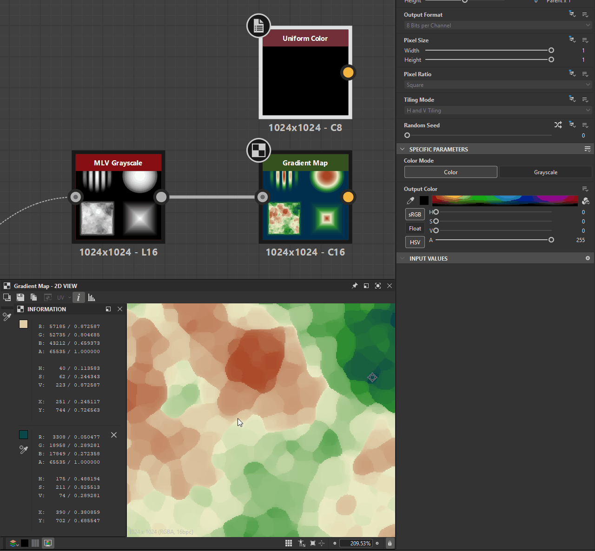
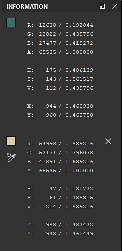

# Outil Échantillonnage de couleur

{zoomable="yes"}

L&#39;outil Sampler des couleurs vous permet de <b>suivre la valeur d&#39;un pixel spécifique</b> dans la [vue 2D](../../../interface/2d-view/2d-view.md) lorsque vous ajustez les paramètres ou changez de nœud.

Il place un coin dans la clôture et échantillonne la couleur et la position du pixel à cet emplacement.

## Utilisation de l’outil

Procédez comme suit pour accéder à l’outil et l’utiliser :

1. Cliquez sur le bouton  <b>Informations</b> dans la barre d&#39;outils de la vue 2D pour ouvrir le dock d&#39;informations et la barre d&#39;outils
1. Cliquez sur le bouton  <b>Outil Sampler couleur</b> dans la barre d&#39;outils Informations
1. Dans la fenêtre d&#39;affichage, cliquez sur le pixel à échantillonner pour placer une  <b>épingle</b>
1. Examinez les valeurs échantillonnées dans la section dédiée du dock d’informations
1. Lorsque vous avez terminé avec l&#39;outil, cliquez sur le bouton  <b>Supprimer</b> pour supprimer l&#39;épingle de la fenêtre d&#39;affichage.\
   Vous pouvez également supprimer l’épingle en cliquant sur le RMB et en sélectionnant l’action « Supprimer » dans le menu contextuel.

Voici une démonstration de l&#39;outil en action :

{zoomable="yes"}

*Cliquer pour agrandir*

+++Copie des valeurs RVBA échantillonnées
Vous pouvez copier les valeurs échantillonnées en cliquant sur le RMB de l’épingle et en sélectionnant l’action « Copier les valeurs RVB » dans le menu contextuel.

Les valeurs copiées peuvent être <b>collées dans les paramètres à l&#39;aide d&#39;une vignette de couleur</b>.

Il est également possible de faire glisser les vignettes de couleur du panneau Informations directement sur les vignettes de couleur de ces paramètres.

{zoomable="yes"}

*Cliquer pour agrandir*

+++

## Informations échantillonnées

<table>
<tr style="border: 0;">
<td width="100.00%" style="border: 0;" valign="top">

Les informations sont regroupées en trois types et deux formats.

* <b>Valeurs échantillonnées</b> stockées dans chacun des canaux RVBA de l&#39;image :\
  Variation\* / Virgule flottante
* <b>Échantillonnage de couleur</b> dans la représentation HSV :\
  Entier 8 bits/virgule flottante
* <b>Position</b> du pixel en nombre de pixels et espace d&#39;image normalisé :\
  Nombre entier/Point flottant

</td>
<td width="33.33%" style="border: 0;" valign="top">

{zoomable="yes"}

</td>
</tr>
</table>

La valeur dépend de la résolution utilisée par l’image. Dans un graphique en Substance, la profondeur de bits est contrôlée par le <b>format de sortie</b> [paramètre de base](../../../compositing-graphs/graph-parameters/graph-parameters.md).

Les débits disponibles sont les suivants :

* <b>Entier 8 bits :</b> 256 valeurs entières comprises entre 0 et 255.
* <b>Nombre entier 16 bits :</b> 65 536 valeurs entières comprises entre 0 et 65 535.
* <b>Faible précision HDR (16 bits)</b> : valeur en virgule flottante codée à l’aide de la version 16 bits.
* <b>Haute précision HDR (32 bits)</b> : valeur en virgule flottante codée à l’aide de la technologie 32 bits. Il s’agit de la plus haute précision disponible dans Designer.
