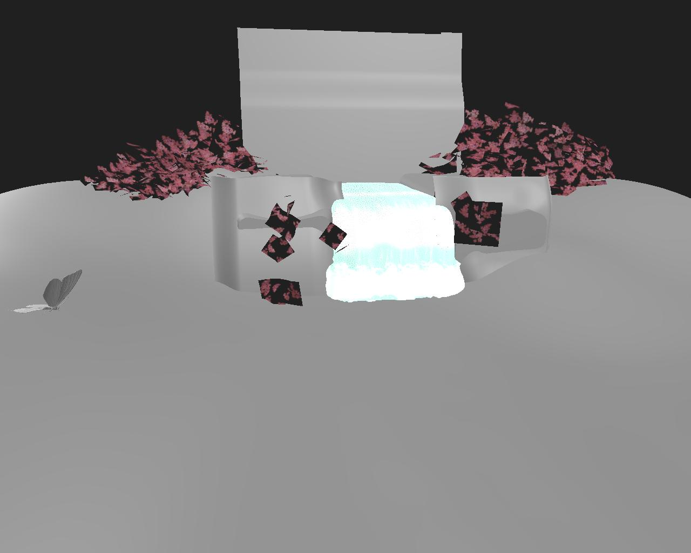

# Moteurs de rendu 3D

La vue 3D propose quatre systèmes de rendu :

* Deux versions du rendu 3D interne d’Adobe : Pixelliseur pour la visualisation en temps réel avec prise en charge des ombres et Pathtracer GPU pour un rendu précis des ombres, des reflets, des propriétés de matériau complexes et plus encore.
* Deux systèmes de rendu tiers obsolètes : OpenGL et Iray de NVIDIA.

>[!NOTE]
>
> Gardez les pilotes graphiques à jour !
> 
> Les nouveaux rendus 3D sont régulièrement mis à niveau et certaines de ces mises à niveau nécessitent des pilotes GPU récents. Veuillez mettre à jour les pilotes GPU de votre système vers la dernière version pour une fiabilité et une prise en charge optimales des fonctionnalités de rendu.
> 
> Vous trouverez peut-être des pilotes ici : [NVIDIA](https://www.nvidia.com/Download/index.aspx?lang=en-us) [AMD](https://www.amd.com/en/support) [Intel](https://downloadcenter.intel.com/product/80939/Graphics-Drivers)

+++ Comparaison de la pixellisation/du traceur de tracé GPU

<table>
  <tr>
    <td>
      
       <i>Pixellisation</i>
    </td>
    <td>
      
       <i>Pathtracer GPU</i>
    </td>
  </tr>
</table>

+++

Le moteur de rendu 3D d&#39;Adobe est conçu en sol pour prendre en charge les technologies modernes telles que le langage d&#39;ombrage [MaterialX](https://materialx.org/) et la description de scène [USD](https://openusd.org/release/index.html), et est prêt à offrir une cohérence visuelle complète dans l&#39;ensemble de l&#39;écosystème Substance 3D.

Grâce à sa dépendance à USD, il peut exploiter le [plug-in USDFileFormat](https://github.com/adobe/USD-Fileformat-plugins) d&#39;Adobe pour importer de nombreux formats Scène 3D, tels que FBX et GLTF, et restituer ces scènes intégralement, y compris les matériaux, les textures, les caméras et les éclairages.

+++ Importation de scènes : Pixellisation et OpenGL

<table>
  <tr>
    <td>
      
       <i>Pixellisation</i>
    </td>
    <td>
      
       <i>OpenGL</i>
    </td>
  </tr>
</table>

+++

>[!TIP]
>
> Vous pouvez sélectionner le moteur de rendu utilisé par défaut lors du démarrage d&#39;une nouvelle vue 3D dans la section [« Vue 3D » des paramètres du projet](../../../interface/preferences-window/project-settings/project-settings.md).

## Rastériseur

+++ Paramètres

|                                                                 |                                                                                                                                                                                                                                                                             |
|-----------------------------------------------------------------|-----------------------------------------------------------------------------------------------------------------------------------------------------------------------------------------------------------------------------------------------------------------------------|
| **Échantillons** flottants | Indique le nombre d’échantillons de pixels à calculer pour que l’image soit considérée comme convergente. |
| flottant d&#39;**opacité de l&#39;Ambient occlusion** | Spécifie la valeur de l’opacité de l’occlusion ambiante. |
| **Activer le displacement** booléen | Indique si le displacement doit être activé. |
| **Seuil de Displacement** Flottant | Définit un seuil pour activer ou désactiver la tessellation par le GPU. |
| **Activer l&#39;abattage de la face arrière** booléen | Une valeur true permet d’éliminer les filets triangulaires dont les normales sont orientées vers l’extérieur de la caméra. Une valeur fausse désactivera l’abattage de la face arrière. |
| Entier **mode diagnostic** | Indique le mode de diagnostic pour le rendu. |
| entier du **mode Ombre de la pixellisation** | Spécifie la technique à utiliser pour le rendu des ombres :<ul data-preserve-html="true"> <li data-preserve-html="true"><i>Aucune ombre :</i> aucune ombre ne sera rendue.</li> <li data-preserve-html="true"><i>Voxel a marché :</i> mars les rayons de l&#39;ombre dans une scène voxélisée.</li> </ul> |
| **Nombre d&#39;échantillons d&#39;ombre de la pixellisation** Entier | Spécifie le nombre de rayons d’ombre vectorisés par pixel. |
| flottant d&#39;**opacité de l&#39;ombre de la pixellisation** | Indique l’opacité des tons foncés, de 0,0 (aucune ombre) à 1,0 (tons foncés complets). |
| **La transparence indépendante de l&#39;ordre de pixellisation est activée** Booléen | Ne tient pas compte de l&#39;ordre des surfaces transparentes lors de leur rendu. Cela sacrifie une certaine précision pour un rendu plus rapide des surfaces transparentes. |
| **Activer le Booléen de pixellisation SSS** | Active/désactive l&#39;effet de diffusion de la sous-surface. |
| **Nombre d’échantillons SSS pixellisés** Entier | Spécifie le nombre d’échantillons prélevés par pixel pour le rendu de la diffusion de la sous-surface. |
| **Activer l&#39;anticrénelage de l&#39;accumulation de pixellisation** Booléen | Active/désactive l’anticrénelage par accumulation, ce qui améliore le ou les smoothness de l’image rendue en effectuant des rendus avec variation et en calculant la couleur moyenne locale de chaque pixel, de manière cumulative. C’est-à-dire qu’il accumule des valeurs pour calculer une moyenne à partir de. |
| **Résolution de grille voxel de la pixellisation** Entier | Détermine la résolution de la grille de voxel utilisée dans le voxel de la pixellisation.   Des valeurs élevées produisent des ombres plus précises au détriment des performances. |
| **Nombre d’échantillons IBL pixellisés à l’exécution** Entier | Spécifie le nombre d&#39;échantillons utilisés pour calculer les réflexions de specular de l&#39;IBL lorsque la technique est définie sur `runtimeSampled`. |

+++

+++ Plan de sol

|                               |                                                                                                                                                              |
|-------------------------------|--------------------------------------------------------------------------------------------------------------------------------------------------------------|
| **Booléen activé** | Active/désactive le plan au sol dans la scène rendue. |
| Flottement **Height** | Définit le décalage d’height du plan au sol.   S’il est créé, la valeur doit avoir le biais approprié intégré, en fonction de l’échelle de la scène. |
| **Intensité de l&#39;ombre** flottante | Lorsque l’option Ombres est activée, elle contrôle l’opacité des ombres projetées sur le plan au sol, de 0,0 (aucune ombre) à 1,0 (ombres totales). |

+++

{zoomable="yes"}

## Pathtracer GPU

+++ Paramètres

|                                                     |                                                                                                                                                                                                                                                                                                                                                                                                                                                                                                                                                                                                                                                                                                                               |
|-----------------------------------------------------|-------------------------------------------------------------------------------------------------------------------------------------------------------------------------------------------------------------------------------------------------------------------------------------------------------------------------------------------------------------------------------------------------------------------------------------------------------------------------------------------------------------------------------------------------------------------------------------------------------------------------------------------------------------------------------------------------------------------------------|
| **Échantillons** flottants | Indique le nombre d’échantillons de pixels à calculer pour que l’image soit considérée comme convergente. |
| **Activer le displacement** booléen | Indique si le displacement doit être activé. |
| **Seuil de Displacement** Flottant | Définit un seuil pour activer ou désactiver la tessellation par le GPU. |
| **Activer l&#39;abattage de la face arrière** booléen | Une valeur true permet d’éliminer les filets triangulaires dont les normales sont orientées vers l’extérieur de la caméra. Une valeur fausse désactivera l’abattage de la face arrière. |
| Entier de **type de cyclage de pixels** | Spécifie la technique à utiliser pour réduire la résolution de calcul pour le rendu interactif :<ul data-preserve-html="true"> <li data-preserve-html="true"><i>Aucun cycle :</i> désactive le cycle de pixels et calcule chaque échantillon de pixels complet.</li> <li data-preserve-html="true"><i>Optimale pour l’appareil :</i> sélectionne la résolution de cycle de pixels idéale en fonction de l’appareil utilisé pour le rendu.</li> <li data-preserve-html="true"><i>4x4:</i> Échantillonne 1/16e des pixels par passe de cycle.</li> <li data-preserve-html="true"><i>8x8:</i> Échantillonne 1/64e des pixels par passe de cycle.</li><li data-preserve-html="true"><i>Bruit bleu :</i> échantillonne de manière adaptative un certain nombre de pixels et les étalent pour cibler une cadence d&#39;images objective.</li> </ul> |
| Entier **mode diagnostic** | Indique le mode de diagnostic pour le rendu. |
| **Afficher l&#39;arrière-plan par transmission** booléenne | Une valeur vraie permet de voir l&#39;image d&#39;arrière-plan à travers des objets transmissifs ou réfractifs.   Lorsque ce n’est pas le cas, les objets transmissifs montrent l’image réfractée de l’environnement de la scène. |

+++

+++ Plan de sol

|                                    |                                                                                                                                                                  |
|------------------------------------|------------------------------------------------------------------------------------------------------------------------------------------------------------------|
| **Booléen activé** | Active/désactive le plan au sol dans la scène rendue. |
| Flottement **Height** | Définit le décalage d’height du plan au sol.   S’il est créé, la valeur doit avoir le biais approprié intégré, en fonction de l’échelle de la scène. |
| **Intensité de l&#39;ombre** flottante | Lorsque l’option Ombres est activée, elle contrôle l’opacité des ombres projetées sur le plan au sol, de 0,0 (aucune ombre) à 1,0 (ombres totales). |
| **Activer les lumières locales** booléennes | Contrôle si la lumière directe des éclairages locaux contribue aux captages d’ombres. |
| **Activer les réflexions** booléennes | Contrôle la visibilité de toutes les réflexions sur le plan au sol. |
| **Opacité des reflets** flottant | Lorsque les reflets sont activés, cette option contrôle l’opacité des reflets, entre 0,0 (aucun reflet) et 1,0 (reflets complets). |
| **Rugosité des reflets** Flottant | Lorsque les réflexions sont activées, cette option contrôle la rugosité du matériau du plan au sol contribuant aux réflexions, de 0,0 (brillant) à 1,0 (rugueux). |

+++

{zoomable="yes"}

## OpenGL

Le moteur de rendu OpenGL offre un rendu rapide en temps réel, avec quelques nuanciers disponibles par défaut en fonction de votre cas d’utilisation : voir la liste ci-dessous.

+++ OpenPBR

Un modèle de matériau avec un soutien croissant soutenu par les principaux acteurs du secteur, y compris l&#39;Adobe, et avec le plus large ensemble de fonctionnalités.

Deux techniques sont disponibles pour visualiser les heights :

<b>Occlusion parallèle</b> : fausse displacement d&#39;height sans modifier la géométrie par déformation et occlusion UV localisées.

<b>Tessation + Displacement</b> : subdivise la géométrie et déplace les sommets le long de leurs normales.

En savoir plus sur OpenPBR dans Designer [ici](../material-properties/material-properties.md#openpbr).

+++

+++ Adobe Standard Material

shader standardisé de l&#39;Adobe. Assure un aspect correct entre toutes les applications Substance 3D Adobe et prend en charge un large éventail de fonctionnalités.

Deux techniques sont disponibles pour visualiser les heights :

<b>Occlusion parallèle</b> : fausse displacement d&#39;height sans modifier la géométrie par déformation et occlusion UV localisées.

<b>Tessation + Displacement</b> : subdivise la géométrie et déplace les sommets le long de leurs normales.

L&#39;Adobe Standard Material est documenté en détail dans [cette section](https://experienceleague.adobe.com/en/docs/substance-3d/general-knowledge/asm/adobe-standard-material) de notre documentation.

+++

+++ AxF SVBRDF

Un shader dédié à la visualisation des matériaux extraits des [Fichiers AxF](../../../resources/axf-appearance-exchange/axf-appearance-exchange-format.md) et à l&#39;utilisation de la représentation <b>SVBRDF</b>.

Deux techniques sont disponibles pour visualiser les heights :

<b>Occlusion parallèle</b> : fausse displacement d&#39;height sans modifier la géométrie par déformation et occlusion UV localisées.

<b>Tessation + Displacement</b> : subdivise la géométrie et déplace les sommets le long de leurs normales.

Ce shader est actuellement un *travail en cours* et fournit un aperçu des caractéristiques des matériaux, mais il ne doit pas être utilisé pour des ajustements fins et certaines fonctionnalités ne sont toujours pas prises en charge.

+++

+++ Blinn

« Ancienne génération », shader correct non PBR. Utilise les couches de Diffuse, de Specular et de Brillance en regard des couches standard telles que l’opacité, l’Height et la normale.

Deux techniques sont disponibles pour visualiser les heights :

<b>Occlusion parallèle</b> : fausse displacement d&#39;height sans modifier la géométrie par déformation et occlusion UV localisées.

<b>Tessation + Displacement</b> : subdivise la géométrie et déplace les sommets le long de leurs normales.

+++

+++ Lambert

Shader d&#39;éclairage lambert très simple, ne prend en charge que le canal Diffuse. Utilise l’ancien système d’éclairage des points et ne prend pas en charge l’éclairage d’image HDR.

+++

+++ Informations sur le maillage

Déboguez le shader non éclairé pour visualiser les données de géométrie suivantes :

* Normale

* Tangente

* Binormal

* UV

* Tuile UV

* Couleur de vertex

* Position (espace monde)

La visualisation est définie sur [0, 1]. Il n&#39;est donc pas possible d&#39;acquérir une lecture directe de valeurs en dehors de cette plage sur l&#39;écran.

+++

+++ Métallique rugosité

Matériau PBR standard pour le modèle de Métallique rugosité. Utilise les couches Base color, Métallique et Rugosité.

Deux techniques sont disponibles pour visualiser les heights :

<b>Occlusion parallèle</b> : fausse displacement d&#39;height sans modifier la géométrie par déformation et occlusion UV localisées.

<b>Tessation + Displacement</b> : subdivise la géométrie et déplace les sommets le long de leurs normales.

+++

+++ Métallique rugosité - Enduite

Matériau PBR revêtu pour le modèle de Métallique rugosité. Utilise des canaux de Base color, Métallique et de Rugosité, ainsi que des canaux supplémentaires de type « couche ».

Deux techniques sont disponibles pour visualiser les heights :

<b>Occlusion parallèle</b> : fausse displacement d&#39;height sans modifier la géométrie par déformation et occlusion UV localisées.

<b>Tessation + Displacement</b> : subdivise la géométrie et déplace les sommets le long de leurs normales.

+++

+++ MÉTALLIQUE RUGOSITÉ - SSS

Matériau PBR de diffusion sous la surface pour le modèle de Métallique rugosité. Utilise des couches de Base color, Métallique et de Rugosité, ainsi qu’une couche de diffusion supplémentaire.

Deux techniques sont disponibles pour visualiser les heights :

<b>Occlusion parallèle</b> : fausse displacement d&#39;height sans modifier la géométrie par déformation et occlusion UV localisées.

<b>Tessation + Displacement</b> : subdivise la géométrie et déplace les sommets le long de leurs normales.

+++

+++ Spéculaire Brillance

Matériau PBR standard pour la Brillance Specular. Utilise les canaux Diffus, Specular et Brillance.

Deux techniques sont disponibles pour visualiser les heights :

<b>Occlusion parallèle</b> : fausse displacement d&#39;height sans modifier la géométrie par déformation et occlusion UV localisées.

<b>Tessation + Displacement</b> : subdivise la géométrie et déplace les sommets le long de leurs normales.

+++

+++ Non éclairé

Ombrage de débogage non éclairé pour visualiser les textures sans éclairage. Utilise uniquement une couche de « couleur ».

+++

Designer offre également la possibilité de configurer vos propres shaders pour le rendu OpenGL [à l&#39;aide de fichiers GLSLFX](../../../interface/3d-view/glslfx-shaders/glslfx-shaders.md).

>[!IMPORTANT]
> 
> Ce moteur de rendu est **obsolète** : il ne recevra pas de nouvelles fonctionnalités et sera mis hors service dans une future version de Designer.

{zoomable="yes"}
