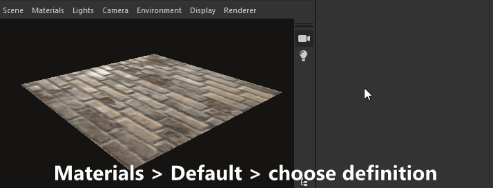

# Vue 3D

La vue 3D vous permet d’afficher et de comprendre vos matériaux avec des maillages personnalisés et des matériaux PBR rendus. Comme toutes les fenêtres Substance 3D Designer, il fonctionne avec les autres fenêtres via les options du menu contextuel et les opérations de glisser-déposer.

La vue 3D propose également deux méthodes principales de rendu des matériaux dans les scènes 3D :
* Visualisation rapide et en temps réel avec les rendus **Pixelliseur** et **OpenGL**
* Rendu par lancer de rayons de haute qualité avec moteur de rendu **Pathtracer GPU**

En savoir plus ici : [Moteurs de rendu 3D](3d-renderers/3d-renderers.md)

+++ Le dock de vue 3D

+++

## Interactions de la fenêtre d’affichage

La section ci-dessous explique comment effectuer des actions courantes, ainsi qu’un gif animé pour illustrer le processus.

### Navigation

La caméra Vue 3D et l’environnement peuvent être manipulés de trois manières :

* <b>Orbite :</b> LMB+faire glisser
* <b>Panoramique</b> : MMB+faire glisser / Ctrl+RMB+faire glisser
* <b>Zoom</b> : défilement à l’aide de MouseWheel / RMB+Drag
* <b>Faire pivoter l&#39;environnement :</b> ⇧+RMB+faire glisser
* <b>Se concentrer sur un filet sélectionné :</b> F (se concentre sur l’ensemble de la scène s’il n’y a pas de sélection)
* <b>Lumière du point d&#39;orbite 1:</b> Ctrl+⇧+LMB+Glisser
* <b>Rapprocher/éloigner l’éclairage du point 1 de l’origine :</b> Ctrl+⇧+RMB+Faire glisser
* <b>Réinitialiser la position de l&#39;orbite de la caméra :</b> R
* <b>Réinitialiser la position et les propriétés de l&#39;orbite de la caméra :</b> ⇧+R

Utilisation d’un pavé tactile (macOS uniquement)

* <b>Orbite :</b> balayage à deux doigts
* <b>Panoramique :</b> ⇧ + Balayage à deux doigts
* <b>Zoom :</b>Pincement à deux doigts / ⌘+Balayage à deux doigts
* <b>Faire pivoter l&#39;environnement :</b> balayage à deux doigts ⇧+

>[!NOTE]
>
> Sens du zoom
> 
> Chacune des méthodes de zoom est inversée par rapport à l’autre :
> 
> * La molette de la souris *tire* vers le haut la scène
> * RMB et faites glisser *push* vers le haut pour éloigner la scène
> 
> Le sens du zoom peut être inversé dans les [Préférences](../../interface/preferences-window/preferences-window.md).

### Sélection et mise au point

Vous pouvez interagir avec les maillages directement dans le viewport :

<b>Maintenez la touche ⇧ enfoncée et cliquez sur LMB sur un maillage pour sélectionner un maillage.</b> Les maillages sélectionnés ont un contour bleu.

<b>Appuyez sur F pour vous concentrer sur un maillage sélectionné</b>. La mise au point d’un maillage déplace la caméra pour la cadre et la faire tourner en orbite.

<b>Cliquez sur RMB alors qu&#39;un maillage est sélectionné</b> pour accéder à ses [actions de matériau](#material-actions) dans un menu contextuel.

<b>Appuyez sur Échap pour désélectionner.</b> Il n’est pas nécessaire que le curseur se trouve sur le maillage.

{zoomable="yes"}

*Sélectionner, mettre au point, désélectionner*

{zoomable="yes"}

*Sélectionner, menu contextuel*

>[!NOTE]
>
> Ces actions ne sont pas disponibles pour le moteur de rendu [OpenGL](../../interface/3d-view/3d-renderers/3d-renderers.md) obsolète.

### Modification de l’éclairage de l’environnement (IBL)

Designer fonctionne par défaut avec l’éclairage basé sur l’image (IBL). Une image bitmap HDR est utilisée pour le rendu de l’éclairage ambiant.

Vous pouvez faire pivoter cet environnement autour de votre objet 3D ou charger des environnements de lumière HDR prédéfinis ou personnalisés. Veuillez noter que vos images HDR doivent utiliser une projection équirectangulaire et avoir une précision de 32 bits en virgule flottante.

⇧+RMB+Faire glisser <b>fait pivoter l&#39;environnement</b> dans la vue 3D.

Pour définir une rotation précise, utilisez <b>Environnement > Modifier</b> dans la barre d&#39;outils supérieure de la vue 3D et modifiez le curseur <b>Angle de rotation</b> dans la fenêtre des propriétés.

Pour utiliser un environnement de lumière HDR prédéfini, cliquez sur la section <b> Environnements HDRI</b> de la catégorie <b>Vue 3D </b> dans la [Bibliothèque](../../interface/the-library/the-library.md), puis faites glisser l’une des icônes vers la vue 3D.

Pour utiliser votre propre environnement d&#39;éclairage HDR personnalisé, importez une image HDR en faisant glisser le fichier dans un package dans la fenêtre de l&#39;Explorateur (<b>Lier</b> le fichier lorsque vous y êtes invité). Ensuite, faites glisser et déposez la ressource, choisissez <b>Panorama Latitude/Longtitude</b> comme cible.

### Lumières ponctuelles

Accédez à <b>Éclairages > Modifier les propriétés</b> pour activer/désactiver les éclairages ponctuels dans votre scène.

La lumière ponctuelle 1 peut être déplacée autour de l&#39;origine de la scène en maintenant la touche LMB ou RMB enfoncée et en la faisant glisser dans la clôture en mode Éclairage. 

En mode Caméra  , vous pouvez également passer temporairement en mode Éclairage en maintenant les touches Ctrl+⇧ enfoncées en combinaison avec les boutons de la souris.

## Afficher les données dans la vue 3D

### Graphes Substance

Vous pouvez afficher des matériaux entiers en tant que matériau complet dans la vue 3D. Il s&#39;agit de la méthode de travail la plus courante. Elle fera correspondre les [attributs d&#39;utilisation sur les nœuds de sortie](../../compositing-graphs/nodes-reference-for-com/atomic-nodes/output/output.md) aux emplacements de texture pertinents de la matière de vue 3D. Cela signifie que vos sorties doivent être définies correctement (l&#39;utilisation de Templates garantit que c&#39;est le cas), et que vous avez sélectionné matériau/shader prend en charge

Pour afficher toutes les sorties d&#39;un graphique, cliquez sur *RMB* dans une zone vide de la [vue Graphique](../../interface/the-graph-view/the-graph-view.md), puis sélectionnez l&#39;option **Afficher les sorties en vue 3D** dans le menu contextuel.

Vous pouvez également afficher les sorties d&#39;un graphique sans avoir à l&#39;ouvrir, en cliquant sur le RMB d&#39;une ressource de graphique dans le dock [Explorateur](../the-explorer-window/the-explorer-window.md) et en choisissant l&#39;option **Afficher les sorties en vue 3D** dans le menu contextuel.

Au lieu du menu contextuel du graphe, vous pouvez obtenir le même résultat en faisant glisser le graphe du dock [Explorateur](../the-explorer-window/the-explorer-window.md) vers la vue 3D.

Lors du *chargement d&#39;un graphique*, ses sorties sont automatiquement appliquées dans la vue 3D par défaut. Vous pouvez désactiver ce comportement dans les [Préférences](../../interface/preferences-window/preferences-window.md). Accédez à **Édition > Préférences > Graphique > Commun** et décochez l&#39;option **Afficher les sorties en vue 3D lors de l&#39;ouverture d&#39;un graphique**.

>[!NOTE]
>
> **Emplacements Matériaux Multiples**
> 
> Si vous utilisez des maillages personnalisés avec plusieurs matières, vous serez invité à choisir l&#39;emplacement de matière auquel assigner la matière. Avec l&#39;une des méthodes ci-dessus, cliquez sur un emplacement pour confirmer votre choix. Pour plus d’informations sur les matières et leur affectation, lisez la section détaillée ci-dessous.

### Sortie de nœud/graphique individuel

Vous pouvez afficher une seule sortie dans n&#39;importe quel canal de matériau disponible dans la [Vue 3D](https://substance3d.adobe.com/). Cette option est moins fréquemment utilisée, mais elle est idéale pour prévisualiser des tests rapides ou des nœuds individuels sans sortie.

Vous pouvez afficher n&#39;importe quel nœud, pas seulement les nœuds de sortie, en cliquant dessus avec le bouton droit dans la [vue Graphique](../../interface/the-graph-view/the-graph-view.md) et en choisissant <b>Vue 3D</b>. Une liste des canaux disponibles auxquels attribuer le nœud s’affiche. Cliquez sur n’importe lequel pour confirmer.

Vous pouvez également utiliser *RMB* pour faire glisser et déposer n&#39;importe quel nœud de la vue Graphique vers la vue 3D. Une liste des canaux disponibles auxquels attribuer le nœud s’affiche. Cliquez sur n’importe lequel pour confirmer.

Vous pouvez afficher une sortie graphique individuelle en développant la ressource graphique dans le dock [Explorer](../the-explorer-window/the-explorer-window.md) et en utilisant *LMB* pour faire glisser cette sortie vers la vue 3D. Une liste des canaux disponibles auxquels assigner le nœud s&#39;affiche. Cliquez sur n’importe lequel pour confirmer.

## Affichage (personnalisé) de scènes 3D

Designer propose une douzaine de maillages prédéfinis. Ces maillages ont des coordonnées d&#39;UV uniformes et utilisables et servent à la plupart des scénarios pour les textures de répétition. Il est également possible d’importer et d’afficher vos propres maillages 3D.\
Sélectionnez l&#39;un des maillages par défaut dans le menu déroulant <b>Scène</b> de la barre supérieure.

Pour des scènes 3D personnalisées, consultez la section [Utilisation des scènes 3D](../../working-with-3d-scenes/working-with-3d-scenes.md).

## Modification des propriétés du shader

Il existe quelques [shaders](../../glossary/glossary.md) différents disponibles par défaut dans Designer, et chaque shader a des options au-delà des canaux de texture. Ils peuvent être configurés individuellement.

Gardez à l’esprit que les nuanciers sont différents entre les [systèmes de rendu 3D](../../interface/3d-view/3d-renderers/3d-renderers.md) de Designer et que seuls les paramètres marqués avec un libellé « Commun » sont conservés lors du changement de système de rendu.

Pour modifier le shader actuel, accédez à <b> Dans le menu « </b>Matériaux », ouvrez le sous-menu correspondant au matériau que vous souhaitez modifier.

Par exemple, pour ajuster la propriété « Échelle d’Height » pour le matériau « Par défaut » dans la scène « Plan (haute résolution) », accédez à « Matériaux > Par défaut > Modifier les propriétés ». Recherchez ensuite la propriété « Échelle d’Height » dans le dock Propriétés.

Les shaders peuvent être réinitialisés à l’aide des actions « Réinitialiser le matériau » ou « Réinitialiser l’état de la scène » dans le sous-menu. Si vous visualisiez des sorties du graphe de Substance dans la vue 3D, vous devrez les réappliquer.

>[!NOTE]
>
> À propos de la tessellation
> 
> La propriété « Facteur de Tessellation » varie en fonction du moteur de rendu 3D sélectionné :
> 
> * <b>Pixellisation/Pathtracer GPU :</b> situé dans les paramètres de rendu (Moteur de rendu > Modifier les paramètres), a un impact sur *la scène entière*.
> * <b>OpenGL :</b> situé dans les propriétés du matériau, affecte le matériau.

## Exporter la scène

Découvrez comment exporter des scènes 3D dans [cette page](../../working-with-3d-scenes/exporting-scenes/exporting-scenes.md).

### Exportation d’un maillage tesellé (moteur de rendu OpenGL uniquement)

Vous pouvez exporter le maillage de la <b>vue 3D</b> vers un fichier aux formats <b>OBJ</b>, <b>FBX</b> ou <b>PLY</b>. Si le displacement de *tessellation* est activé, la subdivision de la géométrie est bakée dans le maillage exporté.

Cependant, les normales de vertex du maillage d&#39;origine peuvent ne pas correspondre à sa nouvelle forme déplacée, ce qui signifie que le maillage déplacé peut ne pas s&#39;afficher correctement. Vous pouvez gérer cela de deux manières :

* Utilisez le maillage *carte des normales* qui fournira les normales correctes
* *Recalculez les normales de maillage* lors de l&#39;exportation à l&#39;aide de la carte des normales de maillage, ce qui signifie que ces normales sont ancrées dans le maillage exporté et que la carte des normales n&#39;est plus nécessaire

Pour exporter le maillage Vue 3D, accédez à <b>Scène > Exporter le maillage tesselé...</b>, définissez votre choix concernant le recalcul des normales, puis sélectionnez un emplacement, un nom et un format de fichier pour le maillage exporté.

>[!NOTE]
>
> Cette fonctionnalité n&#39;est *pas disponible* sur **macOS**.

>[!IMPORTANT]
>
> Quelques réserves
> 
> Si le maillage d&#39;origine comporte plusieurs matières et/ou ensembles UV, ceux-ci seront *fusionnés en un*.
> 
> La durée du processus d&#39;exportation et la taille du fichier obtenu dépendent du nombre de triangles de maillage et du *facteur de facettisation*. Des valeurs élevées de facteur de pavage peuvent entraîner une instabilité en fonction du pool de mémoire intégré du GPU.
> 
> Cela dit, le nombre de sommets du maillage tesselé doit être dans la *même plage* que le nombre de pixels de la carte *height*.
> 
> Le fait d&#39;avoir un filet plus dense que la carte d&#39;height peut rendre le filet légèrement plus lisse lors de l&#39;utilisation de la facettisation <b>Phong</b>. Toutefois, vous devez viser à exporter de manière fiable le filet avec les détails de carte d&#39;height requis en premier, puis à affiner le filet exporté dans d&#39;autres logiciels si nécessaire.

>[!WARNING]
>
> **TDR (Windows uniquement)**
> 
> Cette fonctionnalité nécessite que la <b>détection et récupération du délai d&#39;attente (TDR)</b> corresponde aux valeurs recommandées dans [cette page](https://experienceleague.adobe.com/fr/docs/substance-3d-painter/using/technical-support/technical-issues/gpu-issues/gpu-drivers-crash-with-long-computations-tdr-crash) de notre documentation, comme indiqué dans Designer [Configuration technique](../../getting-started/system-requirements/system-requirements.md).

## Barre de menus

La barre de menus propose 7 menus avec des options liées à la vue 3D. vous trouverez ci-dessous un aperçu de toutes les options disponibles.

+++Scène
Le menu <b>Scène</b> traite de la géométrie (ressource 3D) affichée et des états de vue 3D. Les ressources 3D partagent uniquement le maillage, les états de la scène sont les lumières, la caméra et les paramètres associés. Ils peuvent également contenir le maillage à côté.

<b>Modifier :</b>charge les options de scène dans le panneau [Propriétés](../../interface/properties/properties.md). Permet d’activer/désactiver la visibilité du filet 3D.

<b>Primitives standard :</b> affiche l’un des maillages 3D simples ci-dessous dans la vue 3D.

* Cube

* Cylindre

* Boîte Creuse

* Boîte intérieure

* Plan

* Plan (haute résolution)

* Sphère

<b>Primitives étendues :</b> affiche l’un des maillages 3D ci-dessous dans la vue 3D.

* Tissu

* Balle mate

* Cube arrondi

* Cylindre arrondi

* Sphère à 2 tuiles

* Tore

<b>Afficher les UV dans la vue 2D :</b> active l&#39;affichage des UV pour le maillage actuellement sélectionné en tant qu&#39;incrustation dans la [vue 2D](../2d-view/2d-view.md).

<b>Créer une ressource 3D à partir de la scène actuelle...:</b> Crée une nouvelle [ressource de scène 3D](../../resources/3d-scene-resource/3d-scene-resource.md) dans un package à partir de la scène actuelle.

<b>Charger le fichier d&#39;état... :</b>Charge un fichier d&#39;état de scène [enregistré en externe](../../working-with-3d-scenes/working-with-3d-scenes.md) (\*.sbsscn). Ne remplace pas le filet 3D, charge uniquement les paramètres du rendu 3D, de la caméra et des éclairages.

<b>Charger le fichier d&#39;état avec le maillage...:</b> Charge un [fichier d&#39;état de scène](../../working-with-3d-scenes/working-with-3d-scenes.md) enregistré en externe (\*.sbsscn). Charge les paramètres du rendu 3D, de la caméra, des éclairages, ainsi que ses références à la scène 3D. .

<b>Enregistrer le fichier d&#39;état... :</b>Enregistrez l&#39;état actuel de la vue 3D dans un [fichier d&#39;état de scène](../../working-with-3d-scenes/working-with-3d-scenes.md) (\*.sbsscn).

<b>Enregistrer l&#39;état actuel comme état par défaut :</b>Définissez l&#39;état actuel de la vue 3D en tant que [fichier d&#39;état de scène](../../working-with-3d-scenes/working-with-3d-scenes.md) à utiliser par défaut lors de la création de nouvelles vues 3D. Ce fichier est chargé chaque fois que la vue 3D est réinitialisée ou initialisée. Il peut être défini dans les [paramètres du projet](../../interface/preferences-window/project-settings/project-settings.md).

<b>Exporter la scène :</b> *(Pixellisation/Rendu Pathtracer GPU uniquement)* exporte la scène active en tant que [scène aplatie](../../working-with-3d-scenes/exporting-scenes/exporting-scenes.md), où seule la scène finale est écrite et toutes les références à la scène d’origine sont perdues. Le contenu de la scène exportée dépend des fonctions prises en charge par le format d’exportation sélectionné.\
Formats disponibles : STL, FBX, GLB, GLTF, PLY, USDC, USD, USDA, USDZ, OBJ.

<b>Exporter la scène avec les calques :</b> *(Rendu pixellisé/Pathtracer GPU uniquement)*Exporte la scène active en tant que [scène multicalque](../../working-with-3d-scenes/exporting-scenes/exporting-scenes.md), où toutes les modifications apportées à la scène d’origine sont enregistrées dans des fichiers distincts dans un workflow non destructif. Cette option est uniquement disponible pour les formats de fichier USD.\
Les formats disponibles sont : USDC, USD, USDA.

<b>Exporter la géométrie répartie :</b> *(moteur de rendu OpenGL uniquement)* exporte la scène actuelle avec la facettisation en tant que géométrie brute, voir la section Exporter la scène.

<b>Réinitialiser la scène :</b>réinitialise la vue 3D par défaut.

Certaines mises à jour logicielles peuvent modifier la façon dont les fichiers d’état de scène sont enregistrés/chargés.

Si la scène n&#39;est *pas correctement restaurée* à partir du fichier, il est recommandé de définir manuellement l&#39;état souhaité de la scène et de *réexporter* le fichier d&#39;état de la scène.

+++

+++Matériaux
Le menu <b>Matières</b> change en fonction du maillage 3D chargé et du moteur de rendu utilisé.

Le menu « Matières » contient une liste de toutes les matières attribuées à un filet dans la scène. Chaque matériau répertorié dans le menu « Matériaux » possède un sous-menu d’actions de matériau :

<b>Modifier</b> : modifiez les paramètres de la matière actuelle dans la fenêtre Propriétés.

<b>Liste des nuanciers</b> : tous les [nuanciers](../../glossary/glossary.md) sont disponibles pour le [moteur de rendu 3D](../../interface/3d-view/3d-renderers/3d-renderers.md) actuel.

<b>Charger la définition... :</b>(moteur de rendu OpenGL uniquement) vous permet de charger votre propre [shader GLSLFX personnalisé.](../../interface/3d-view/glslfx-shaders/glslfx-shaders.md) L’ombrage est ajouté à la liste ci-dessus.

<b>Réinitialiser les paramètres communs :</b> réinitialise tous les paramètres communs aux nuanceurs. Par exemple, lors du basculement entre les rendus Pixellisation/Pathtracer GPU et OpenGL, plusieurs valeurs de paramètre dans la [matière Adobe Standard](https://experienceleague.adobe.com/fr/docs/substance-3d/general-knowledge/asm/adobe-standard-material) sont reportées.

<b>Renommer :</b> modifiez l&#39;étiquette de ce matériau.

<b>Réinitialiser la matière :</b> réinitialise tous les paramètres d&#39;ombrage à leurs valeurs par défaut. Si des textures sont connectées à l’un des échantillonnages de l’ombrage, elles sont déconnectées.

<b>Réinitialiser la matière à l&#39;état de la scène :</b>*(Rendu pixellisé/Pathtracer GPU uniquement)* réinitialise toutes les propriétés des [matières remplacées](../../working-with-3d-scenes/overriding-scene-mat/overriding-scene-materials.md) à leurs valeurs d&#39;origine de la scène, y compris les textures d&#39;origine, le cas échéant.

<b>Ajouter :</b>ajoute un nouveau matériau à la liste. Il n&#39;est pas utilisé par défaut et peut être [connecté à un matériau de scène](../../working-with-3d-scenes/overriding-scene-mat/overriding-scene-materials.md) à l&#39;aide de [l&#39;explorateur de scènes](../../interface/3d-view/scene-browser/scene-browser.md).

+++

+++Lumières
Le menu <b>Éclairages</b> ne traite que des éclairages ambiants et ponctuels plus anciens. Ces éclairages ne sont pas conformes au PBR et ne donnent pas les mêmes résultats de haute qualité que le rendu basé sur des images HDR.

<b>Modifier :</b> modifiez des paramètres individuels pour la lumière ambiante et les deux lumières ponctuelles.

<b>Réinitialiser les éclairages :</b> réinitialise les propriétés d&#39;éclairage à l&#39;état par défaut.

+++

+++Caméra
Le menu <b>Caméra</b> vous permet de modifier les paramètres de la caméra, d&#39;accéder à des angles prédéfinis et de charger des angles de caméra stockés dans un fichier de maillage 3D personnalisé.

<b>Modifier les propriétés :</b> ouvre les paramètres de l&#39;appareil photo par défaut dans le dock Propriétés.

<b>Mise au point :</b>(F) met au point la caméra par défaut sur le filet actuellement sélectionné. Par exemple, encadre le filet et aligne le pivot de la caméra sur celui-ci. S’il n’y a pas de sélection active, le cadre de sélection global de la scène est utilisé.

<b>Caméras de scène :</b> si les scènes incluent une ou plusieurs caméras, elles sont répertoriées ici et leurs paramètres sont utilisés comme paramètres prédéfinis à appliquer à la caméra par défaut de la scène.

<b>Points de vue :</b> points de vue préconfigurés pour la caméra par défaut. Ils ont uniquement un impact sur la transformation de la caméra (position et rotation).

* Valeur par défaut : prise de vue en contre-plongée depuis l’avant gauche des objets.

* Arrière

* Bas

* Avant

* Gauche

* Droite

* Haut

<b>Enregistrer le rendu...:</b> (Alt+S) Enregistre l&#39;image actuellement rendue sur le disque, à la résolution spécifiée dans les propriétés de rendu ou dans les propriétés de la caméra par défaut si une résolution de remplacement a été configurée.

<b>Copier le rendu dans le Presse-papiers :</b> (Alt+C) Copie l&#39;image actuellement rendue dans le Presse-papiers, pour la coller dans un éditeur d&#39;image externe.

<b>Réinitialiser la position :</b> (R) Réinitialise la position de la caméra.

<b>Réinitialiser la sélection :</b> (Maj+R) réinitialise la position et les propriétés de la caméra.

+++

+++Environnement
Le menu <b>Environnement</b> vous permet de modifier les paramètres liés à l&#39;environnement HDRI utilisé pour éclairer les matériaux corrects PBR.

<b>Modifier les propriétés :</b> donne accès aux paramètres de l&#39;environnement HDR, utilisés pour l&#39;éclairage dans PBR. Plus précisément, vous pouvez basculer la visibilité, modifier l’exposition avec un aperçu et définir la rotation à l’aide d’un curseur précis.

<b>Réinitialiser l&#39;environnement :</b> réinitialise toutes les propriétés de l&#39;environnement par défaut.

+++

+++Affichage
Le menu d’affichage vous permet de basculer entre les modes d’affichage, les assistants et les informations de la scène rendue :

<b>Axe :</b> Active/désactive l&#39;affichage de l&#39;axe 3D dans le viewport.

<b>Grille :</b> active/désactive l&#39;affichage de la frid mondiale.

<b>Résolution :</b> active/désactive l&#39;affichage d&#39;un petit compteur de résolution.

<b>Statistiques de Scène :</b> active l&#39;affichage des statistiques de scène, telles que polycount, nombre de matériaux, nombre de maillages statiques, etc.

<b>Temps de rendu :</b> temps nécessaire pour calculer un échantillon pour l&#39;image complète.

<b>Échantillons :</b> la quantité d’échantillons de pixels calculée pour l’antialiasing d’accumulation (pixellisation) ou le tracé (tracé GPU).

<b>Backface culling :</b> la désactivation de cette option vous permet de voir une face de maillage de *chaque côté*. Cette option fonctionne en combinaison avec Structure filaire

<b>Cadre de sélection :</b> active/désactive l&#39;affichage du cadre de sélection du maillage.

<b>Structure filaire :</b> active/désactive l&#39;affichage de la structure filaire du maillage.

<b>Lumière :</b> active/désactive l&#39;affichage des lignes d&#39;assistant pour les lumières ponctuelles.

<b>Espace de tangente du Vertex :</b> affiche la tangente, le binormal et les vecteurs normaux de tous les vertex sous forme de gadgets colorés

Certaines de ces options sont disponibles sous forme de boutons bascule dans la barre d’outils Scène.

+++

+++Système de rendu
Le menu <b>Moteur de rendu</b> vous permet de changer de moteur de rendu 3D et d’accéder aux propriétés du moteur de rendu 3D actuel via l’action <b>Modifier les propriétés</b>.

Les moteurs de rendu disponibles et leurs paramètres sont documentés dans [cette page dédiée](../../interface/3d-view/3d-renderers/3d-renderers.md).

+++

## Barre d’outils scène

La barre d&#39;outils de la **Scène**, située par défaut sur le bord gauche de la vue 3D, offre des commandes permettant de visualiser la scène et d&#39;interagir avec elle.

Il vous permet également d&#39;accéder à la fenêtre contextuelle [Displacement](displacement/displacement.md) et au dock [Explorateur de Scènes](scene-browser/scene-browser.md).

>[!NOTE]
>
> La barre d&#39;outils peut être *repositionnée* autour du dock **vue 3D** à l&#39;aide de la *poignée* la plus à gauche représentée par trois lignes parallèles.

### Options d’affichage

#### Haut

 

 <b>Explorateur de Scènes</b>

Affiche la hiérarchie de tous les éléments d’une Scène 3D.

>[!INFO]
>
>L&#39;explorateur de Scènes et ses fonctionnalités sont largement traités dans [la page dédiée](../../interface/3d-view/scene-browser/scene-browser.md).

 <b>Sélectionner</b>

Active la sélection directe des maillages dans la scène.

<code> LMB</code> Sélectionnez un maillage dans la scène.

Sélectionne des maillages individuels dans la scène. Les maillages sélectionnés ont un contour bleu dans le viewport et sont mis en surbrillance dans l&#39;[explorateur de Scènes](../../interface/3d-view/scene-browser/scene-browser.md).

Un menu contextuel est disponible pour les maillages sélectionnés et peut être affiché en cliquant sur <code>RMB</code>.

Les maillages peuvent également être sélectionnés en mode Caméra ou Lumière, en appuyant sur <code>Maj+LMB</code>.

 

 <b>Caméra</b>

Permet de contrôler directement la Caméra dans la scène.

<code> LMB</code> Orbite autour de la caméra. <code>RMB</code> Rapprochez ou éloignez la caméra de sa cible.

 

 <b>Afficher l&#39;environnement</b>

Ce bouton active/désactive l’affichage de l’environnement de la scène. Le même paramètre se trouve dans le dock Propriétés après avoir accédé à <b>Environnement > Modifier</b> dans la barre de menus de vue 3D.

 

 <b>Clair</b>

Active le contrôle direct de la lumière ponctuelle 1 dans la scène.

<code> LMB</code> Faites pivoter la caméra autour de l&#39;origine de la scène. <code>RMB</code> Rapprochez ou éloignez la lumière de l’origine de la scène.

 

 <b>Paramètres de rendu</b>

Affiche les paramètres du moteur de rendu actuel dans le dock [Propriétés](../properties/properties.md).

 

 <b>Activer le traceur</b>

Active/désactive la sélection du moteur de rendu [Pathtracer GPU](3d-renderers/3d-renderers.md#gpu-pathtracer).

 

 <b>Activer les ombres</b>

Active/désactive le rendu des ombres en temps réel dans le rendu [Pixelliseur](3d-renderers/3d-renderers.md#rasterizer).

 

 <b>Activer le plan de sol</b>

Active/désactive le rendu du plan de sol dans les rendus [Pixellisé](3d-renderers/3d-renderers.md#rasterizer) et [Pathtracer GPU](3d-renderers/3d-renderers.md#gpu-pathtracer).

 

 <b>Displacement</b>

Affiche la fenêtre [Displacement](displacement/displacement.md).

 

#### Bas

 

 <b>Grille</b>

Active/désactive l’affichage de la grille du monde.

 

 <b>Statistiques de Scène</b>

Active/désactive l’affichage des statistiques de scène, telles que le polycount, le nombre de matériaux, le nombre de maillages statiques, etc.

 

 <b>Axe</b>

Active/désactive l’affichage de l’axe 3D dans le viewport.

 

#### Rendu OpenGL uniquement

 

 <b>Backface culling</b>

La désactivation de cette option vous permet de voir une face de maillage de *chaque côté*. Cette option fonctionne en association avec Structure filaire.

 

 <b>Cadre de sélection</b>

Active/désactive l’affichage du cadre de sélection du maillage.

 

 <b>Espace de tangente de Vertex</b>

Affiche la tangente, le binormal et les vecteurs normaux de tous les vertex sous forme de gadgets colorés.

 

 <b>Structure filaire</b>

Active/désactive l&#39;affichage du filet sous forme de structure filaire.

## Afficher la barre d’outils

La barre d&#39;outils <b>Affichage</b>, qui se trouve par défaut au *bas* du panneau <b>Vue 3D</b>, vous permet de contrôler l&#39;affichage de l&#39;image rendue dans la clôture.

>[!NOTE]
>
> La barre d&#39;outils peut être *repositionnée* autour du dock **Vue 3D** à l&#39;aide de la *poignée* la plus à gauche représentée par trois lignes parallèles.

### AOV de rendu 3D

<table style="margin-top: 32px; margin-bottom: 32px">
    <tr style="border: 0; vertical-align: top">
        <td style="border: 0">
            
Vous pouvez afficher différents <a href="../../glossary/glossary.md#aov">AOV</a> à l’aide du bouton  <b>AOV de rendu 3D</b>.

            
Les AOV vous permettent d'inspecter les informations de maillage et de matériau séparément pour un travail ciblé et le débogage.

            
Certains AOV incluent des <i>Valeurs HDR</i> qui sont fixées à 1 (blanc pur) ou à 0 (noir pur) dans le viewport. Pour inspecter la plage complète de valeurs, vous pouvez exporter un rendu 3D de l'AOV vers un format de fichier image qui prend en charge les Valeurs HDR, comme <code>.exr</code>. Utilisez l'option de menu <code>Camera > Save render...</code> pour exporter l'AOV actif.

            
<i>Remarque :</i> les AOV sont uniquement disponibles lors de l'utilisation du pixelliseur et des <a href="./3d-renderers/3d-renderers.md">rendus 3D Pathtracer GPU</a>.

        </td>
        <td style="width: 33%; border: 0">
            
        </td>
    </tr>
</table>

### Canaux de couleur

Vous pouvez afficher une seule couche de l&#39;image à l&#39;aide du bouton  <b>Couches de couleur</b>. Une zone de liste déroulante s&#39;ouvre, vous permettant de sélectionner les canaux <b>rouge</b>, <b>vert</b> et <b>bleu</b> qui doivent être affichés. L&#39;aspect normal de l&#39;image avec tous les canaux est restauré en sélectionnant l&#39;option <b>RGB</b>.

L&#39;*icône* du bouton <b>Couches de couleur</b> *change* en fonction des couches actuellement affichées.

### Espace colorimétrique

Pour une représentation plus précise des couleurs, les images sont affichées par défaut dans un *espace colorimétrique* qui correspond à celui utilisé par le *moniteur*.

Les commandes disponibles dépendent du mode de gestion des couleurs défini dans les [paramètres du projet](../../interface/preferences-window/project-settings/project-settings.md). En savoir plus sur ces commandes dans la section [Gestion des couleurs](../../color-management/color-management.md) de cette page.
