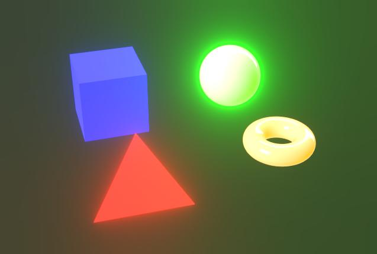

# Effets de post-traitement

{zoomable="yes"}

Dans les propriétés de caméra, vous pouvez activer les effets de post-traitement pour améliorer les rendus ou vérifier des propriétés de matériau spécifiques.

Ces effets sont développés en interne et ne sont disponibles que pour le pixelliseur et les [rendus](../../../../interface/3d-view/3d-renderers/3d-renderers.md) Pathtracer GPU.

Tout effet de post-publication activé au moment de l&#39;enregistrement des [ressources de scène 3D](../../../../resources/3d-scene-resource/3d-scene-resource.md) ou des [fichiers d&#39;état de scène](../../../../working-with-3d-scenes/working-with-3d-scenes.md) sera enregistré dans le cadre de l&#39;état de la scène.

<table>
<tr style="border: 0;">
<td style="border: 0;" valign="top">

## Mappage de tons

</td>
<td style="border: 0;" valign="top">

### Flou lumineux

</td>
<td style="border: 0;" valign="top">

### Profondeur de champ

</td>
<td style="border: 0;" valign="top">

</td>
</tr>
</table>

## Mappage de tons

Remappe les couleurs du rendu en fonction d’algorithmes et/ou de tables de correspondance (LUT) spécifiques.

Cela vous permet d’améliorer la cohérence des couleurs entre les applications. Par exemple, le mappeur de tonalité AgX est également disponible dans Blender.

+++Reinhard

<table>
  <tr>
    <td>
      
       <i>Avant</i>
    </td>
    <td>
      
       <i>Après</i>
    </td>
  </tr>
</table>

+++

+++Atan

<table>
  <tr>
    <td>
      
       <i>Avant</i>
    </td>
    <td>
      
       <i>Après</i>
    </td>
  </tr>
</table>

+++

+++Exp

<table>
  <tr>
    <td>
      
       <i>Avant</i>
    </td>
    <td>
      
       <i>Après</i>
    </td>
  </tr>
</table>

+++

+++Journal

<table>
  <tr>
    <td>
      
       <i>Avant</i>
    </td>
    <td>
      
       <i>Après</i>
    </td>
  </tr>
</table>

+++

+++Aces

<table>
  <tr>
    <td>
      
       <i>Avant</i>
    </td>
    <td>
      
       <i>Après</i>
    </td>
  </tr>
</table>

+++

+++Hejl

<table>
  <tr>
    <td>
      
       <i>Avant</i>
    </td>
    <td>
      
       <i>Après</i>
    </td>
  </tr>
</table>

+++

+++Neutre

<table>
  <tr>
    <td>
      
       <i>Avant</i>
    </td>
    <td>
      
       <i>Après</i>
    </td>
  </tr>
</table>

+++

+++Agx

<table>
  <tr>
    <td>
      
       <i>Avant</i>
    </td>
    <td>
      
       <i>Après</i>
    </td>
  </tr>
</table>

+++

+++Pbr neutre

<table>
  <tr>
    <td>
      
       <i>Avant</i>
    </td>
    <td>
      
       <i>Après</i>
    </td>
  </tr>
</table>

+++

## Flou lumineux

Simule l’effet produit par l’appareil photo de franges de lumières se vidant des zones très lumineuses vers l’extérieur sur les zones recevant moins de lumière.

L’effet est influencé par l’éclairage de la scène, l’exposition de l’appareil photo et les matériaux émissifs.

+++Seuil
Valeur de luminance au-dessus de laquelle la floraison doit être visible.

*Gauche : 1,0 / Droite : 4,0*

<table>
  <tr>
    <td>
      
       <i>Avant</i>
    </td>
    <td>
      
       <i>Après</i>
    </td>
  </tr>
</table>

+++

+++Atténuation
Dégradé d&#39;atténuation de la floraison, où une valeur plus faible réduit le rayon de la floraison.

*Gauche : 1,0 / Droite : 0,6*

<table>
  <tr>
    <td>
      
       <i>Avant</i>
    </td>
    <td>
      
       <i>Après</i>
    </td>
  </tr>
</table>

+++

+++Niveau
L&#39;intensité de la floraison. Plus la valeur est élevée, plus les franges de lumière sont claires et marquées.

*Gauche : 8.0 / Droite : 2.0*

<table>
  <tr>
    <td>
      
       <i>Avant</i>
    </td>
    <td>
      
       <i>Après</i>
    </td>
  </tr>
</table>

+++

+++Changement de couleur
Décale la teinte des zones affectées par la floraison vers des couleurs plus chaudes.

*Gauche : 0,0 / Droite : 0,8*

<table>
  <tr>
    <td>
      
       <i>Avant</i>
    </td>
    <td>
      
       <i>Après</i>
    </td>
  </tr>
</table>

+++

## Profondeur de champ

Simule le phénomène optique provoqué par les objectifs de l’appareil photo lorsque des objets plus proches et plus éloignés que la distance focale sont flous.

L’effet est affecté par les paramètres « F-Stop » et « Distance de mise au point » de l’appareil photo.

>[!TIP]
>
> Pour régler rapidement la mise au point de l’appareil photo, placez le curseur sur l’emplacement d’une scène que vous souhaitez mettre au point et appuyez sur les touches Ctrl + LMB (Windows) ou Cmd + LMB (macOS) pour définir automatiquement la distance de mise au point sur cet emplacement.

+++Rayon max.
Rayon maximal de l’effet de flou.

*Gauche : 32,0 / Droite : 4,0*

<table>
  <tr>
    <td>
      
       <i>Avant</i>
    </td>
    <td>
      
       <i>Après</i>
    </td>
  </tr>
</table>

+++

+++Force composite
Ampleur de l’effet de flou à partir de la distance focale vers l’extérieur.

*Gauche : 0,2 / Droite : 0,05*

<table>
  <tr>
    <td>
      
       <i>Avant</i>
    </td>
    <td>
      
       <i>Après</i>
    </td>
  </tr>
</table>

+++

+++Aberration longitudinale
Intensité de l&#39;aberration se produisant à distance de la distance focale.

L’aberration simule comment différentes longueurs d’onde de la lumière ont des distances focales légèrement différentes, ce qui donne l’impression que les couleurs sont décalées et présentent des différences subtiles de mise au point.

*Gauche : 0,0 / Droite : 1,0*

<table>
  <tr>
    <td>
      
       <i>Avant</i>
    </td>
    <td>
      
       <i>Après</i>
    </td>
  </tr>
</table>

+++

+++Aberration achromatique
Indique si l’aberration doit être achromatique, ce qui signifie que certaines couleurs ou toutes ont la même distance focale.

Ainsi, l’effet de flou semble être réparti de manière plus égale.

*À Gauche : Vrai/À Droite : Faux*

<table>
  <tr>
    <td>
      
       <i>Avant</i>
    </td>
    <td>
      
       <i>Après</i>
    </td>
  </tr>
</table>

+++

+++Œil de chat
Active l’effet d’œil de chat dans la scène. Ce dernier simule comment la lumière pénétrant à un angle oblique ne pénètre pas dans un disque, mais dans un ovale irrégulier, ce qui provoque une distorsion.

Cet effet est plus prononcé aux ouvertures supérieures, c&#39;est-à-dire aux valeurs F-Stop plus faibles.

*À Gauche : Vrai/À Droite : Faux*

<table>
  <tr>
    <td>
      
       <i>Avant</i>
    </td>
    <td>
      
       <i>Après</i>
    </td>
  </tr>
</table>

+++
