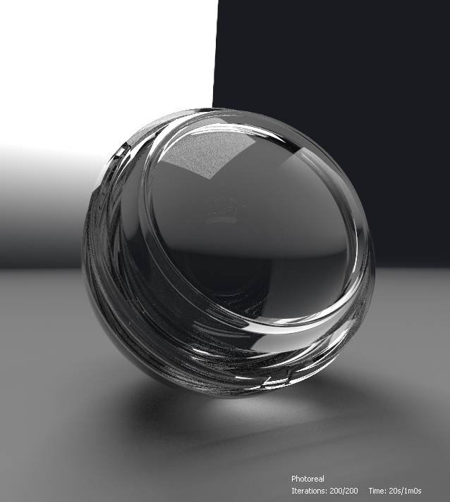

# Iray

Cette page présente le rendu Iray disponible dans le panneau de vue 3D de [Substance 3D Designer](https://www.adobe.com/fr/products/substance3d-designer.html), qui offre un traçage de chemin interactif pour un rendu photoréaliste avec accélération CPU et/ou GPU (GPU Nvidia uniquement).

>[!WARNING]
> 
> Le rendu Iray et toutes les fonctionnalités associées ont été supprimés de Designer dans la version 16.0.0.
> 
> En savoir plus ici : [Fin de vie du graphique MDL et de l&#39;iray](../../../technical-issues/mdl-graph-iray-eol/mdl-graph-iray-eol.md)

<table>
<tr style="border: 0;">
<td style="border: 0;" valign="top">

## Vue d’ensemble

<b>Iray</b> est une technologie de rendu physique hautement *interactive* et intuitive qui génère des *images photoréalistes* en simulant le comportement physique de la lumière et des matériaux. En savoir plus sur la page Web [Nvidia Iray](https://www.nvidia.com/en-us/design-visualization/iray/).

</td>
<td style="border: 0;" valign="top">

</td>
</tr>

<tr style="border: 0;">
<td style="border: 0;" valign="top">

Comme la vue 3D utilise le *moteur de rendu progressif* d&#39;Iray, une image est produite dès qu&#39;au moins un échantillon a été effectué sur chaque pixel. L&#39;image est *automatiquement mise à jour* lors des itérations d&#39;échantillonnage, ce qui permet d&#39;obtenir une image brute initiale *plus nette à chaque itération*.

Le rendu est disponible dans le panneau [Vue 3D](../../../interface/3d-view/3d-view.md) : ouvrez le menu <b>Rendu</b> et sélectionnez l’option <b>Iray</b> pour basculer le rendu utilisé dans ce panneau de vue 3D sur Iray.\
Le passage au rendu Iray *modifie les options disponibles* dans certains menus de vue 3D. Ces modifications sont expliquées dans la section <b>Vue 3D</b> ci-dessous.

Par défaut, le rendu progressif démarre dès que le rendu Iray est sélectionné. Le processus de rendu s&#39;exécutera jusqu&#39;à ce que *une* de ces conditions soit remplie :

* *Le nombre maximum d&#39;échantillons* est atteint
* Le *délai de rendu* est respecté

Consultez la section <b>Moteur de rendu</b> de cette page pour en savoir plus sur l’ajustement de ces conditions.

</td>
<td style="border: 0;" valign="top">

*Matériau :[mur du château médiéval](https://oggyart.artstation.com/projects/Xnzx0a)* *par [Mark Foreman](https://www.artstation.com/oggyart)* *disponible dans notre [bibliothèque Substance 3D](https://substance3d.adobe.com/assets)* *bibliothèque*

</td>
</tr>
</table>

>[!WARNING]
>
> Seule *une* instance de rendu Iray peut être exécutée à tout moment.\
> Cela signifie que lorsqu&#39;un panneau de vue 3D utilise ce moteur de rendu, le menu **Moteur de rendu** est *désactivé* dans les autres panneaux de vue 3D et ceux-ci sont définis par défaut sur le moteur de rendu **OpenGL**.

## Options de vue 3D

### Scène

Sélectionnez l&#39;option <b>Modifier</b> dans le menu <b>Scène</b> pour trouver les propriétés de scène spécifiques à Iray dans le panneau <b>Propriétés</b>.

* <b>Est activé :</b> lorsqu&#39;il est défini sur *Faux*, l&#39;objet est masqué et *ne contribue plus* à la scène

Afficher le composant

* <b>Est visible</b> : lorsqu&#39;il est défini sur *Faux*, l&#39;objet est masqué, mais *contribue* à la scène, c&#39;est-à-dire réfléchit la lumière, absorbe la lumière et projette des ombres

Composant d’affichage du maillage

* Sous-division
  * <b>Méthode</b> : méthode utilisée pour subdiviser procéduralement le filet en une géométrie plus fine
    * *Aucun* : aucune subdivision n&#39;est appliquée
    * *Paramétrique* : divise le filet en `4^x` triangles où `x` est la valeur spécifiée par ce paramètre
    * *Longueur* : divise le maillage jusqu&#39;à ce que tous les bords aient une longueur (en espace objet) inférieure à la valeur spécifiée par le paramètre Longueur minimale
  * <b>Longueur minimale</b> : divise le maillage jusqu&#39;à ce que tous les bords aient une longueur inférieure à cette valeur spécifiée dans l&#39;espace objet (s&#39;applique uniquement à la méthode *Length*)
  * <b>Nombre</b> : nombre d&#39;itérations de subdivision à appliquer au maillage (s&#39;applique uniquement à la méthode *paramétrique*)

>[!WARNING]
>
> La subdivision du maillage *augmente son temps de traitement de manière exponentielle* avant et pendant le rendu. Nous vous suggérons d&#39;être *conservateur* avec les valeurs saisies.\
> Faites attention lorsque vous utilisez des valeurs *haute* **nombre** pour la méthode Parametric et des valeurs *basse* **longueur minimale** pour la méthode Length.

### Matériaux

Comme Iray s&#39;appuie sur le [modèle d&#39;ombrage MDL](https://www.nvidia.com/en-us/design-visualization/technologies/material-definition-language/) développé par NVIDIA, les matériaux disponibles pour les matériaux de scène sont remplacés par la bibliothèque MDL chargée par Designer. Cette bibliothèque est créée à partir des sources suivantes :

* Fichiers MDL inclus dans l’installation de Designer
* Les fichiers MDL trouvés dans les [répertoires répertoriés par l&#39;utilisateur](../../../interface/preferences-window/project-settings/project-settings.md) dans les [fichiers de projet](../../../pipeline-and-project-con/project-configuration-fil/project-configuration-files-sbsprj.md) chargés
* La bibliothèque [NVIDIA vMaterials](https://developer.nvidia.com/vmaterials) si elle est installée

>[!NOTE]
>
> Pour un examen plus approfondi du modèle d&#39;ombrage MDL, consultez le [Manuel MDL](http://mdlhandbook.com/), écrit et géré par NVIDIA.

<table>
<tr style="border: 0;">
<td style="border: 0;" valign="top">

La liste cumulée des matériaux MDL chargés est disponible dans le menu <b>Matériaux</b>, sous l’un des sous-menus des matériaux répertoriés, comme indiqué dans l’image de droite.

En outre, si un graphique [MDL](../../../mdl-graphs/creating-an-mdl-graph/creating-an-mdl-graph.md) est chargé dans Designer, il peut être appliqué à n&#39;importe quelle matière de la scène. À ce stade, il est ajouté à la liste des matières MDL disponibles.

Les autres options notables de ce menu sont les suivantes :

* Sélectionnez l&#39;option <b>Modifier</b> pour accéder aux *entrées exposées* du MDL dans le panneau <b>Propriétés</b> et ajustez la matière selon vos besoins
* L&#39;option <b>Charger...</b> vous permet de *charger manuellement n&#39;importe quel fichier MDL* à ajouter à la liste cumulative et à appliquer à la scène
* L&#39;option <b>Exporter le paramètre prédéfini...</b> ouvre la boîte de dialogue <b>Exporter le paramètre prédéfini de matière MDL</b>, qui vous permet d&#39;exporter un fichier MDL de paramètre prédéfini à l&#39;aide des paramètres actuels appliqués dans la vue 3D

</td>
<td style="border: 0;" valign="top">

</td>
</tr>
</table>

>[!NOTE]
>
> Lors du chargement d&#39;un graphique **MDL**, le moteur de rendu de vue 3D est *automatiquement basculé sur **Iray*** pour le charger et l&#39;appliquer.

### Caméra

La principale différence entre OpenGL et Iray en ce qui concerne les paramètres de l&#39;appareil photo est la façon dont la *profondeur de champ* est gérée. En effet, Iray étant un moteur de rendu physiquement précis, la profondeur de champ se produit « naturellement » en fonction de l&#39;*ouverture* de l&#39;appareil photo.

Les paramètres suivants sont disponibles dans les propriétés de la caméra lorsque le rendu Iray est sélectionné :

* <b>Distance de mise au point</b> : distance par rapport à la caméra du point focal, c’est-à-dire là où l’image est la plus nette
* <b>Diamètre de l&#39;ouverture</b> : valeur déterminant l&#39;ouverture de l&#39;appareil photo. Plus la valeur est faible, plus les éléments de l’image sont nets avant et après le point focal. Plus simplement, cette valeur contrôle l’intensité de la profondeur de l’effet de champ

### Environnement

Ouvrez le menu <b>Environnement</b> et sélectionnez l&#39;option <b>Modifier</b> pour afficher les propriétés de l&#39;environnement dans le panneau <b>Propriétés</b>.

Les propriétés suivantes sont disponibles :

Dôme

* <b>Type de dôme</b> : définit les objets entourant la scène, sur lesquels la texture de l&#39;environnement est projetée
  * *Sphère infinie* : environnement sphérique infini
  * *Sol* : environnement sphérique infini, mais avec un plan au sol texturé
  * *Sphère* : dôme en forme de sphère de taille finie de rayon personnalisé
  * *Sphère avec sol* : dôme en forme de sphère de taille finie avec un rayon personnalisé où la partie inférieure de l&#39;environnement est projetée sur le plan divisant les parties supérieure et inférieure de la sphère
  * *Boîte avec sol* : dôme en forme de boîte de taille finie de largeur, d&#39;height et de longueur personnalisées où la partie inférieure de l&#39;environnement est projetée sur le plan divisant les parties supérieure et inférieure de la boîte
* <b>Angle de rotation</b> : contrôle l&#39;angle de rotation du dôme autour de l&#39;*axe Y*
* <b>Rayon</b> : le rayon de la sphère (s&#39;applique uniquement aux types de dôme *Sphère* et *Sphère avec sol*)
* <b>Largeur</b> : la largeur de la boîte (s&#39;applique uniquement au type de dôme *Boîte avec sol*)
* <b>Height</b> : l&#39;height de la boîte (s&#39;applique uniquement au type de dôme *Box avec sol*)
* <b>Longueur</b> : longueur de la boîte (s&#39;applique uniquement au type de dôme *Box avec sol*)
* <b>Visualiser</b> : active une incrustation de fausse couleur de la géométrie de l&#39;environnement de taille finie. Cela peut être utilisé pour aligner la géométrie avec la projection de la carte d&#39;environnement capturée (s&#39;applique uniquement aux types de dômes *Sphère*, *Sphère avec sol* et *Boîte avec sol*)

>[!NOTE]
>
> Pour les dômes de taille finie, toute la géométrie de la scène doit être *entourée* du dôme.

Sol en dôme\
Les paramètres suivants s&#39;appliquent aux types de dômes *Sol*, *Sphère avec sol* et *Boîte avec sol* :

* **Sol** : active le plan au sol
* **Position** : position de l&#39;origine du dôme fini (s&#39;applique également au type de dôme *Sphère*)
* **Réflectivité** : opacité et teinte du reflet du sol, où le noir signifie que le reflet n&#39;est pas visible
* **Brillance** : brillance du reflet du sol
* **Intensité de l&#39;ombre** : opacité de l&#39;ombre projetée sur le sol
* **Échelle de texture** : contrôle la taille de la projection de la texture de l&#39;environnement sur le sol (s&#39;applique également au type de dôme *Sphère*)

L’impact de certains de ces paramètres est démontré ci-dessous :

+++Environnement d’affichage

<table>
  <tr>
    <td>
      
       <i>Avant</i>
    </td>
    <td>
      
       <i>Après</i>
    </td>
  </tr>
</table>

+++

+++Activer le plan de sol

<table>
  <tr>
    <td>
      
       <i>Avant</i>
    </td>
    <td>
      
       <i>Après</i>
    </td>
  </tr>
</table>

+++

+++Faire une Rotation de l&#39;environnement

+++

+++Ajuster le plan au sol

+++

+++Ajuster la sphère infinie
")

+++

+++Ajuster le cadre de sélection
")

+++

### Affichage

Ces options affichent une *incrustation de texte* au-dessus de l&#39;image rendue avec des informations utiles concernant le rendu.

* <b>Temps écoulé</b> : durée du rendu en secondes. Ce minuteur et le processus de rendu s’arrêtent lorsque l’une des conditions de fin est remplie
* <b>Itérations</b> : nombre d&#39;itérations d&#39;échantillonnage effectuées. Ce compteur et le processus de rendu s’arrêteront lorsque l’une des conditions de fin sera remplie
* <b>Méthode de rendu</b> : chemin de rendu utilisé. Photoreal est utilisé sur la plupart des ordinateurs locaux
* <b>Résolution</b> : résolution de rendu effective. Si l’option Utiliser la résolution de la fenêtre dans les propriétés de la caméra est définie sur Faux, le rapport de l’image est automatiquement ajusté pour correspondre au rapport de résolution
* <b>Statistiques de scène</b> : liste de statistiques liées à la scène rendue, qui inclut le nombre de triangles et le nombre de matières, entre autres données

{width="512px"}

### Système de rendu

Ouvrez le menu <b>Moteur de rendu</b> et sélectionnez l&#39;option <b>Modifier</b> pour afficher les propriétés du moteur de rendu dans le panneau <b>Propriétés</b>.

Rendu progressif

* <b>Échantillons min.</b> : nombre minimum d’échantillons par pixel à calculer avant de prendre en compte les critères d’arrêt du rendu progressif
* <b>Nombre maximum d&#39;échantillons</b> : si ce nombre d&#39;échantillons par pixel a été rendu, arrêtez automatiquement le rendu progressif
* <b>Durée max. (secondes)</b> : durée en secondes après laquelle le rendu progressif doit se terminer automatiquement
* <b>Échantillonneur caustique activé</b> : augmentez l’échantillonneur par défaut avec un échantillonneur caustique dédié. Les caustiques résultent du passage de la lumière à travers un objet non opaque. Ils ne sont donc nécessaires que si un matériau [MDL](../../../mdl-graphs/creating-an-mdl-graph/creating-an-mdl-graph.md) prenant en charge la translucidité est appliqué sur un objet de la scène
* <b>Filtre Firefly activé</b> : activez le filtre luciole, qui utilise un algorithme prédéfini pour supprimer les lucioles de l’image calculée au fur et à mesure de la progression du rendu. Les Firefly sont des artefacts visuels où les *pixels isolés* d&#39;une image sont *sensiblement plus lumineux* que leurs voisins et résultent d&#39;échantillons de rayons insuffisants pour déterminer avec précision la répartition de la lumière
* Post denoiser\
  Le rendu Iray utilise l&#39;algorithme [dénoiseur accéléré par IA NVIDIA Optix](https://developer.nvidia.com/optix-denoiser) pour un rendu itératif de haute qualité de l&#39;image telle qu&#39;elle est rendue.

  * <b>Activé</b> : permet de déclencher un *algorithme de débruitage* prédéfini à une itération de rendu définie et d&#39;être actif jusqu&#39;à la *fin* du rendu
  * <b>Démarrer l&#39;itération</b> : si le dénoiseur est activé, cette option définit l&#39;itération à laquelle le processus de dénoisage commence. Cela peut empêcher les frais généraux de performance du dénoiseur d&#39;affecter l&#39;interactivité, par exemple, lors du déplacement de la caméra. En outre, les premières itérations ne conviennent souvent pas comme entrée pour le dénoiseur en raison d&#39;une convergence insuffisante, ce qui conduit à des résultats insatisfaisants.

L’impact de certains de ces paramètres est démontré dans les comparaisons d’images ci-dessous :

+++Échantillonneur caustique

<table>
  <tr>
    <td>
      
       <i>Avant</i>
    </td>
    <td>
      
       <i>Après</i>
    </td>
  </tr>
</table>

+++

+++filtre Firefly

<table>
  <tr>
    <td>
      
       <i>Avant</i>
    </td>
    <td>
      
       <i>Après</i>
    </td>
  </tr>
</table>

+++

+++Post-dénoiseur

<table>
  <tr>
    <td>
      
       <i>Avant</i>
    </td>
    <td>
      
       <i>Après</i>
    </td>
  </tr>
</table>

+++

*Matériau : MDL en verre épais* *disponible dans les définitions de base MDL* *par NVIDIA*

## Accélération matérielle

Le moteur de rendu Iray offre une accélération matérielle sur les GPU NVIDIA exclusivement, ce qui offre les avantages suivants :

* Augmentation significative de la vitesse de rendu
* [Suppression de bruit accélérée par l&#39;IA Optix](https://developer.nvidia.com/optix-denoiser) (voir « Post-dénoiseur » dans la section <b>Moteur de rendu</b> de cette page)

Vous pouvez sélectionner le matériel qui doit être utilisé par Iray pour le rendu dans la section <b>Vue 3D</b> de la fenêtre [Préférences](../../../interface/preferences-window/preferences-window.md), comme indiqué sur l’image de droite.

Lorsqu&#39;un GPU pris en charge est détecté, il est répertorié dans cette section, est *sélectionné automatiquement* par défaut et le processeur est désélectionné. Toute modification manuelle remplace ce comportement automatique, de sorte que vos modifications personnalisées sont enregistrées pour les sessions ultérieures.

>[!NOTE]
>
> Si un GPU pris en charge est détecté et répertorié, nous vous recommandons vivement de *laisser le processeur désélectionné*, car l’utilisation du processeur pour le rendu Iray a un *impact significatif* sur les performances globales et la réactivité de l’application.

>[!WARNING]
>
> L&#39;accélération matérielle du GPU utilise la technologie [NVIDIA CUDA](https://developer.nvidia.com/cuda-zone). Assurez-vous que votre pilote graphique *est à jour* pour une compatibilité et une fiabilité optimales. Cliquez [ici](https://www.nvidia.com/Download/index.aspx?lang=en-us) pour trouver le pilote le plus récent pour votre GPU NVIDIA.\
> Pour les configurations à plusieurs GPU, il est recommandé de *désactiver SLI* et de sélectionner un seul GPU pour une fiabilité optimale.

