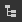

# Navigateur de scènes

L’explorateur de scènes de la vue 3D répertorie tous les éléments de la scène et leur hiérarchie.

Elle offre des commandes pour sélectionner des objets, activer/désactiver leur visibilité ainsi que sélectionner quel matériau doit [remplacer un matériau de scène](../../../working-with-3d-scenes/overriding-scene-mat/overriding-scene-materials.md).

Comme Designer utilise [USD](https://openusd.org/release/index.html) pour décrire et gérer ses scènes, sa terminologie et ses concepts se trouvent dans cet arbre de scène.

Il s&#39;affiche en cliquant sur son bouton bascule dédié  dans la [barre d&#39;outils de la scène de vue 3D](../../../interface/3d-view/3d-view.md).

{zoomable="yes"}

<table>
<tr style="border: 0;">
<td style="border: 0;" valign="top">

## Arborescence de scène

</td>
<td style="border: 0;" valign="top">

### Activation/désactivation d’objets dans la scène

</td>
<td style="border: 0;" valign="top">

### Matériaux connectés

</td>
</tr>
</table>

## Arborescence de scène

<table>
<tr style="border: 0;">
<td width="100.00%" style="border: 0;" valign="top">

L’explorateur de scènes affiche une liste d’objets organisés en arborescence hiérarchique.

Les objets sont associés à d’autres objets, jusqu’à la racine de la scène. Un objet parent possède un bouton fléché qui permet de développer ou de réduire la liste de ses enfants.

</td>
<td width="33.33%" style="border: 0;" valign="top">

{zoomable="yes"}

</td>
</tr>
</table>

Laissez le curseur sur n’importe quel élément de l’arborescence pendant quelques secondes pour afficher une info-bulle avec les informations suivantes :

* <b>Chemin :</b> chemin complet de l&#39;objet dans la scène.
* <b>TypeName:</b> type USD de l&#39;objet.
* <b>Documentation :</b> informations détaillées sur l&#39;objet en tant qu&#39;élément de scène USD.

Les filets contiennent des informations supplémentaires : Nombre de sommets, Nombre de faces et Nombre d’UV.

### Objets ajoutés par Designer

<table>
<tr style="border: 0;">
<td width="100.00%" style="border: 0;" valign="top">

Designer ajoute des objets à n’importe quelle scène chargée. Les objets ajoutés par Designer sont étiquetés en <b>gras</b>.

Lorsque vous utilisez l’action « Modifier... » dans les menus Lumière, Caméra et Environnement, il s’agit des objets en cours de modification, qu’il y ait d’autres lumières, caméras ou environnements dans la scène.

Ces objets sont inclus dans la scène lorsque [exporté](../../../working-with-3d-scenes/exporting-scenes/exporting-scenes.md).

</td>
<td width="33.33%" style="border: 0;" valign="top">

{zoomable="yes"}

</td>
</tr>
</table>

* <b>Caméra :</b> caméra par défaut de la scène. C’est la seule caméra avec laquelle vous pouvez interagir dans Designer. Toutes les caméras incluses dans une scène chargée sont ajoutées en tant que paramètres prédéfinis pour la caméra par défaut.
* <b>Environnement :</b> environnement par défaut de la scène. Toute texture appliquée à l’environnement de la scène s’appliquera uniquement à cet environnement. De même, la rotation de l’environnement n’a d’incidence que sur ce dernier.\
  Lorsqu&#39;une scène chargée comprend un ou plusieurs éclairages d&#39;environnement ([DomeLight](https://openusd.org/release/user_guides/schemas/usdLux/DomeLight.html) dans USD), l&#39;environnement par défaut est automatiquement désactivé afin de ne pas interférer avec l&#39;éclairage de l&#39;environnement de la scène.
* <b>Point lumineux # :</b> si l&#39;un des points lumineux de Designer est activé dans Lumières > Modifier les propriétés, chaque point lumineux est ajouté à la scène.

## Basculement d’objets dans la scène

### Tous types

Tout objet peut être activé et désactivé dans la scène. Lorsqu’il est désactivé, un objet ne contribue plus à la scène : il ne convertit pas d’ombres, n’émet pas et ne réfléchit pas la lumière.

L’état d’un objet parent étant transféré à ses enfants, la désactivation d’un objet parent désactive également ses enfants.

La visibilité d&#39;un objet peut être basculée en cliquant sur son bouton d&#39;œil  ou à partir de son menu contextuel. Le menu propose quelques actions supplémentaires pour gérer la visibilité des objets des scènes :

* <b>Masquer :</b> désactivez l&#39;objet sélectionné.
* <b>Afficher :</b> activez l&#39;objet sélectionné.

Certaines actions ont une incidence sur la visibilité des maillages en particulier :

* <b>Afficher uniquement :</b> désactivez tous les maillages sauf celui sélectionné et ses enfants.
* <b>Tout afficher :</b> activez tous les maillages.

Les objets parents ont ces actions supplémentaires :

* <b>Masquer les enfants :</b> désactivez tous les enfants de l&#39;objet sélectionné, de manière récursive.
* <b>Afficher les enfants :</b> activez tous les enfants de l&#39;objet sélectionné, de manière récursive.
* <b>Développer tous les enfants :</b> développez toutes les listes d&#39;enfants sous l&#39;objet sélectionné, de manière récursive.
* <b>Réduire tous les enfants :</b> Réduire toutes les listes d&#39;enfants sous l&#39;objet sélectionné, de manière récursive.

{zoomable="yes"}

### Environnements

La visibilité d’un éclairage d’environnement (DomeLight) peut être activée et désactivée de la même manière que pour les autres objets.

Lorsqu’un éclairage d’environnement est désactivé, sa contribution à l’éclairage de la scène est également désactivée.

Si plusieurs éclairages de l&#39;environnement sont activés, leurs contributions en éclairage sont *cumulées*.

{zoomable="yes"}

### Lumières

Il en va de même pour tous les éclairages de la scène : vous pouvez basculer individuellement.

{zoomable="yes"}

## Matériaux connectés

L&#39;explorateur de scènes vous permet également de connecter toute matière remplacée à une autre matière répertoriée par Designer dans le menu [Matières](../../../interface/3d-view/3d-view.md) de la vue 3D.

<table>
<tr style="border: 0;">
<td style="border: 0;" valign="top">

Les matériaux répertoriés par Designer sont les objets Matériau de l’arborescence de la scène utilisés sur au moins un filet.

Lorsque [vous remplacez](../../../working-with-3d-scenes/overriding-scene-mat/overriding-scene-materials.md) l&#39;une de ces matières, Designer crée une copie avec un suffixe numérique.

Un matériau remplacé offre un élément supplémentaire dans son menu contextuel : le sous-menu « [Matériau connecté](../../../working-with-3d-scenes/overriding-scene-mat/overriding-scene-materials.md) » répertorie tous les autres matériaux disponibles pouvant être utilisés pour remplacer ce matériau.

</td>
<td style="border: 0;" valign="top">

{zoomable="yes"}

</td>
</tr>
</table>
