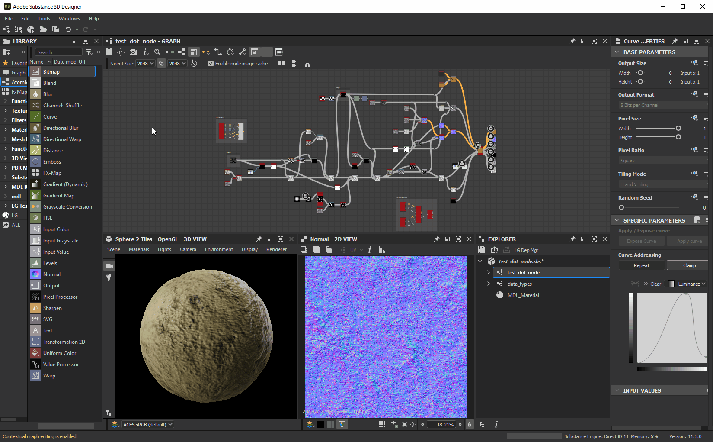

# Personnalisation de votre espace de travail

Cette page présente la façon d&#39;organiser les panneaux dans l&#39;interface utilisateur de [Adobe Substance 3D Designer](https://www.adobe.com/fr/products/substance3d-designer.html) et d&#39;utiliser leurs fonctionnalités pour améliorer vos workflows.

<table>
<tr style="border: 0;">
<td width="100.00%" style="border: 0;" valign="top">

## menu Windows

Ce menu vous permet de gérer les principaux éléments de l’interface utilisateur de Designer. Chaque option est décrite dans la section <b>Windows</b> de [cette page](../the-main-toolbar/the-main-toolbar.md) à propos de la barre d&#39;outils principale. Ici, nous allons fournir des concepts supplémentaires liés à ce menu.

### Afficher/Masquer une vue

Pour afficher ou masquer un élément d&#39;interface spécifique, cliquez sur son nom dans le menu *Windows*. Les éléments affichés sont marqués d&#39;une coche .

### Remplir un dock avec une vue

Dans Designer, un dock est un *conteneur distinct de son contenu*. Cela signifie qu&#39;un dock <b>Bibliothèque</b> peut exister et être vide, car il ne contient aucune *vue* de bibliothèque.

Les options <b>Nouvel Explorateur</b>, <b>Nouvelle vue 3D</b> et <b>Nouvelle vue de bibliothèque</b> créent des vues, qui seront placées en fonction de l&#39;état actuel de l&#39;interface utilisateur :

* Si un dock vide est disponible, la nouvelle vue est créée *en son sein*
* Si des docks vides ne sont *pas* disponibles, un *nouveau dock* est créé pour contenir la nouvelle vue

</td>
<td width="33.33%" style="border: 0;" valign="top">

</td>
</tr>
</table>

## Redimensionnement des docks

Les docks peuvent être redimensionnés en déplaçant l’un de leurs bords. Les autres quais seront redimensionnés dynamiquement pour s’adapter.

## Déplacement des docks

Tout dock peut être déplacé autour de la fenêtre principale à l&#39;aide de sa *barre de titre*. Selon l’emplacement vers lequel le dock est déplacé, les docks seront redimensionnés pour s’adapter.

## Tabulation des docks

Les docks peuvent être empilés dans des onglets. Cela est utile pour enregistrer des vues d’écran ou des vues agrégées qui sont liées les unes aux autres d’une manière ou d’une autre.

Vous pouvez activer la tabulation des docks en déplaçant un dock à l&#39;aide de sa barre de titre *sur un dock existant*. Les docks ne sont ni redimensionnés ni déplacés, mais un *cadre* apparaît autour du dock cible.

## Désancrage

Un dock peut être désancré dans une *fenêtre flottante* qui peut être redimensionnée et déplacée hors de la fenêtre principale, y compris vers un autre écran.

Cela peut se faire de deux manières :

* Déplacer le dock à l&#39;aide de sa *barre de titre* et le placer *hors de la fenêtre principale* ou sur une zone de la fenêtre principale qui n&#39;est *pas un dock*. Vous pouvez réancrer ce dock en le déplaçant sur un autre dock *dans la fenêtre principale* ou en cliquant sur le bouton <b> Réancrer</b> ;
* Cliquez sur le bouton <b> Annuler l&#39;ancrage</b>. Un dock non ancré avec cette méthode peut *être réancré* uniquement en cliquant sur le bouton <b> Réancrer</b>.

## Agrandissement des quais

Tout dock peut être agrandi pour s&#39;adapter à la zone ou à sa *fenêtre parent* :

* Les docks ancrés s&#39;étendront sur toute la zone de la *fenêtre principale*, à l&#39;exclusion de la barre de titre, de la barre d&#39;outils principale et de la barre d&#39;état
* Les docks non ancrés s&#39;étendront sur l&#39;*ensemble de l&#39;affichage*

Les docks peuvent être agrandis de deux manières :

* Placement du curseur *sur le dock* et appui sur la touche <b>Maj+Espace</b>
* Cliquer sur leur bouton <b> Agrandir</b>

Les docks agrandis peuvent être réduits à la taille et à l&#39;emplacement qu&#39;ils occupaient *avant d&#39;être agrandis*. Cela peut se faire de trois manières :

* Placement du curseur *sur le dock* et appui sur la touche <b>Maj+Espace</b>
* Cliquer sur leur bouton <b> Réduire</b>
* Ouverture du menu <b>Windows</b> et sélection de l&#39;option <b>Annuler l&#39;agrandissement de la fenêtre</b>

>[!NOTE]
>
> Seul *un* dock peut être agrandi à la fois.

>[!IMPORTANT]
>
> Lorsqu’un dock est agrandi, certains comportements d’interface peuvent différer :
> 
> * Les docks qui s’affichent/se mettent à jour automatiquement le font en arrière-plan (par exemple, Properties, Vue 2D)
> * Les éléments de menu sont *désactivés* dans le menu **Windows**
> * Les boutons sont *désactivés* dans la barre de titre du dock
> * Un dock agrandi dans la fenêtre principale *ne peut pas être déplacé* à l&#39;aide de sa barre de titre

## Épingler les docks

L&#39;épinglage d&#39;un dock *empêche son remplissage* avec un autre contenu ou une vue différente.

Lorsqu&#39;un dock est épinglé, tout contenu futur qui doit être affiché dans son sera *créé un nouveau dock* pour l&#39;héberger. Ce nouveau dock ne sera pas épinglé et pourra donc mettre à jour et héberger de nouveaux contenus.

Pour épingle un dock, cliquez sur son bouton  <b>Épingle</b>. Vous pouvez ensuite *retirer* l&#39;épingle à l&#39;aide du bouton  <b>Retirer</b> pour qu&#39;il soit à nouveau *disponible* pour héberger tout nouveau contenu.

*Plusieurs docks* peuvent être épinglés à la fois, y compris plusieurs docks du *même type*.

L’épinglage des docks vous permet d’effectuer les opérations suivantes :

* Affichage et modification des propriétés de plusieurs nœuds en même temps
* Affichage simultané de deux bitmaps ou plus
* Utilisation simultanée de plusieurs graphes

## Fermeture des docks

Tout dock peut être fermé en cliquant sur son bouton  <b>Fermer</b>.

## Réinitialisation de la disposition de l’interface

L&#39;interface utilisateur entière peut être réinitialisée dans sa mise en page par défaut en ouvrant le menu <b>Windows</b> et en sélectionnant l&#39;option <b>Réinitialiser la mise en page</b>.

Leur état d&#39;affichage sera également réinitialisé, ce qui signifie que les docks fermés peuvent être *rouverts* (par exemple, vue 3D) et que les docks affichés peuvent être *fermés* (par exemple, Console, Gestionnaire de dépendances, docks créés par des plug-ins).

