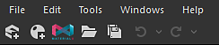

# Espace de travail

L&#39;espace de travail est divisé en zones distinctes appelées <b>docks</b>, qui peuvent être [redimensionnées, déplacées et non ancrées](../interface/customizing-your-wor/customizing-your-workspace.md) de la fenêtre principale de Designer dans un dock flottant.

Voici la disposition de dock par défaut de Designer :

<table>
<tr style="border: 0;">
<td style="border: 0;" valign="top">

Menu principal et barre d&#39;outils <b>1</b>

explorateur <b>2</b>

vue du graphe <b>3</b>

</td>
<td style="border: 0;" valign="top">

Propriétés <b>4</b>

vue 2D <b>5</b>

</td>
<td style="border: 0;" valign="top">

vue 3D <b>6</b>

Bibliothèque <b>7</b>

</td>
</tr>
</table>

>[!NOTE]
>
> Mise à l’échelle de l’interface
> 
> Designer acquiert l&#39;échelle spécifique des éléments d&#39;interface utilisateur *à partir du système d&#39;exploitation*. Par conséquent, tout réglage de la mise à l’échelle de l’interface utilisateur doit être effectué dans les paramètres d’affichage du système d’exploitation.
> 
> Pour vous assurer que les paramètres d&#39;affichage sont appliqués correctement dans Designer, *déconnectez-vous* de votre session utilisateur du système d&#39;exploitation et reconnectez-vous après avoir modifié ces paramètres.

<table>
<tr style="border: 0;">
<td style="border: 0;" valign="top">

## Menu principal et barre d’outils

La barre d&#39;outils principale vous permet d&#39;accéder à des menus supplémentaires, comme la [fenêtre Préférences](../interface/preferences-window/preferences-window.md), et comporte quelques boutons pour créer rapidement un nouveau graphe et pack de Substances.

</td>
<td style="border: 0;" valign="top">

</td>
</tr>
</table>

* <b>Fichier :</b>Vous permet de créer de nouveaux packs et de nouvelles ressources, ainsi que d&#39;enregistrer et de fermer les packs sur lesquels vous travaillez actuellement. Les fonctions de ce menu sont également disponibles sous forme de boutons rapides dans cette barre d’outils.
* <b>Modification :</b>Fournit des fonctions Annuler et Rétablir (disponibles sous forme de boutons rapides ci-dessous), ainsi qu&#39;un accès à [Préférences](../interface/preferences-window/preferences-window.md), pour une personnalisation dans la profondeur.
* <b>Outils :</b> contrôle la Substance Engine et vous permet d&#39;accéder au gestionnaire de plug-ins.
* <b>Windows :</b> vous permet de masquer ou d&#39;afficher n&#39;importe quelle fenêtre (certaines sont masquées par défaut) et de rétablir la disposition par défaut de la fenêtre.
* <b>Aide :</b>permet d&#39;accéder à des informations supplémentaires et à des ressources en ligne, telles que Substance Academy ou ce site Web de documentation.

## Explorateur

[La fenêtre de l&#39;Explorateur](the-explorer-window/the-explorer-window.md) est le principal moyen d&#39;interagir avec tout type de fichier et de ressource. Il offre plus d’options que le menu Fichier de la barre d’outils principale. C’est ici que commencent et terminent chaque session de travail.

## Vue Graphique

[Le dock Vue graphique](../interface/the-graph-view/the-graph-view.md) est la fenêtre la plus importante de Substance 3D Designer. Il affiche les réseaux nodaux de tout type de graphique disponible dans Designer ([graphiques de Substance](../compositing-graphs/substance-compositing-graphs.md), [graphiques de fonction de Substance](../function-graphs/function-graphs.md), [graphiques FX-Map](../function-graphs/fxmaps/fxmaps.md)) et vous permet de les créer et de les modifier.

## Propriétés

Le [dock des propriétés](properties/properties.md) est la fenêtre la plus technique. Il est toujours contextuel et présente des curseurs, des listes déroulantes et d’autres éléments qui modifient le comportement d’une ressource ou d’un nœud sélectionné.

## Vue 2D

[La vue 2D](../interface/2d-view/2d-view.md) est l&#39;outil de prévisualisation le plus simple. Cela fonctionne étroitement avec le graphique : un double-clic sur n’importe quel nœud dans la vue Graphique affichera le résultat visuel dans la vue 2D.

## Vue 3D

[La vue 3D](../interface/3d-view/3d-view.md) est la fenêtre d&#39;aperçu la plus interactive et la plus avancée. Contrairement à la vue 2D, elle utilise un certain nombre de cartes de sortie différentes pour effectuer le rendu d’un matériau complet. Cela signifie que toutes les couches sont représentées, comme Couleur de base, Normal et Rugosité.

## Bibliothèque

[Le dock de bibliothèque](../interface/the-library/the-library.md) donne accès par défaut à tout le contenu inclus dans la bibliothèque Designer, ainsi qu&#39;à votre [contenu personnalisé](../interface/the-library/managing-custom-content/managing-custom-content-and-filters.md).

