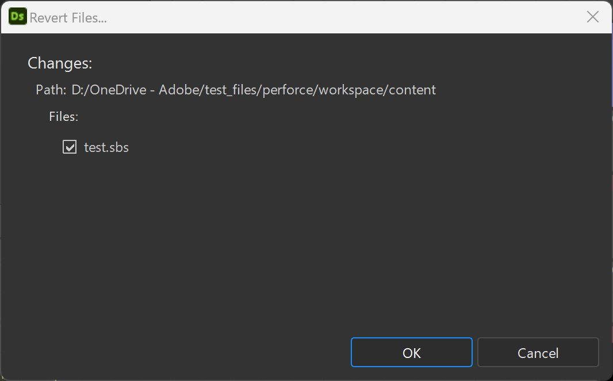

# Contrôle de version

>[!IMPORTANT]
>
> La version <b>14.0.0</b> de Substance 3D Designer met à niveau la prise en charge de Perforce vers <b>Python 3</b>.
> 
> Assurez-vous que vos autres scripts et votre environnement de contrôle de version sont ajustés en conséquence.

Designer offre une intégration Python du système de contrôle de version [Perforce](https://www.perforce.com/) (P4).

L&#39;intégration ajoute un sous-menu personnalisé « Contrôle de version » au menu contextuel des packs dans l&#39;[Explorateur](../../../interface/the-explorer-window/the-explorer-window.md), ainsi que des icônes personnalisées pour correspondre à l&#39;état d&#39;un pack dans P4.

## Préparation de P4

Dans [P4V](https://www.perforce.com/products/helix-core-apps/helix-visual-client-p4v), notez le nom et le chemin de l&#39;espace de travail, comme indiqué ci-dessous :

{zoomable="yes"}

Dans n&#39;importe quel éditeur de texte ou IDE, ouvrez ce script situé dans l&#39;installation de Designer : &#39;*tools/version\_control/perforce.py*&#39;.

À la ligne 19, modifiez le chemin d&#39;accès à l&#39;emplacement de l&#39;exécutable <b>&#39;p4&#39;</b> sur votre système.\
Dans l&#39;exemple ci-dessous, ce chemin est &#39;*c :/Program Files/Perforce/p4.exe*&#39;.

```
## Editable variables

cPerforceP4AbsPath = os.path.abspath("c:/Program Files/Perforce/p4.exe")

cVerbose = False
```


## Configuration dans Designer

Le contrôle de version est configuré dans les [paramètres du projet](../../../interface/preferences-window/project-settings/project-settings.md), qui sont disponibles dans les [préférences](../../../interface/preferences-window/preferences-window.md) de Designer.

Onglet {zoomable="yes"}

1. Accédez à Modifier > Préférences.
1. Accédez à « Projets », sélectionnez le [fichier de projet](../../../pipeline-and-project-con/project-configuration-fil/project-configuration-files-sbsprj.md) cible et accédez à l&#39;onglet « Contrôle de version »
1. Cochez « Contrôle de version activé ».
1. Renseignez ces informations dans la section « Espace de travail » :

   * <b>Nom :</b> entrez le « Nom de l&#39;espace de travail » précédemment récupéré dans P4V
   * <b>Chemin :</b> entrez le « Chemin d&#39;accès de l&#39;espace de travail » que vous avez précédemment récupéré à partir de P4V

{zoomable="yes"}

### Configuration des actions

Les actions seront disponibles dans le menu contextuel d’un pack dans l’Explorateur. Il existe des actions prédéfinies qui correspondent à la plupart des concepts de l’outil de contrôle de version :

* Tous les libellés d’action peuvent être modifiés selon les besoins.
* Toutes les actions nécessitent un script pour être valides.

Vous pouvez utiliser :

* un script *par* action
* un script pour les actions *toutes*

Un script de démarrage pour toutes les actions est disponible dans l&#39;installation de Designer : &#39;*tools/version\_control/perforce.py*&#39;.

>[!IMPORTANT]
>
> Pour être disponible, le package doit être enregistré sous « Chemin d&#39;accès de l&#39;espace de travail » (par exemple, sous « *f :/Dev/perforce* »)

1. Dans le groupe <b>Actions</b>, cliquez sur le bouton &#39;...&#39; de l&#39;action <b>Ajouter</b>
1. Sélectionnez le script suivant dans l&#39;installation de Designer : &#39;*tools/version\_control/perforce.py*&#39;
1. Le script doit être automatiquement configuré pour toutes les autres actions.

{zoomable="yes"}

### Configuration d’actions personnalisées

Comme tous les outils de contrôle de version sont différents et incluent de nombreuses fonctionnalités, nous permettons à l’utilisateur d’ajouter des actions personnalisées.

1. Cliquez sur Ajouter un élément.
1. Renseignez le libellé de la nouvelle action et définissez son chemin de script

### Configuration de l’interpréteur de scripts

1. Dans la section « Interprètes », cliquez sur « Ajouter un élément »
1. Définissez une extension ou un suffixe de fichier de script et le chemin d’accès à l’exécutable de l’interpréteur
1. Modifiez le script perforce.py pour mettre à jour l&#39;emplacement du binaire « p4 »

{zoomable="yes"}

## Comment utiliser le contrôle de version

1. Création d’un pack
1. Enregistrez le package sous le répertoire « Chemin d’accès de l’espace de travail »
1. Cliquez sur RMB sur le pack : vous avez maintenant accès au sous-menu « Contrôle de version »
1. Plusieurs actions sont disponibles, en fonction de l’état du fichier du package dans l’espace de travail :

   * <b>Ajouter :</b> marquez les fichiers comme « ToAdd »
   * <b>Envoyer :</b> envoyez les packages sélectionnés. Cette action affiche une boîte de dialogue permettant de spécifier un message de modification (voir ci-dessous)
   * <b>Rétablir :</b> rétablissez les modifications. Cette action affiche une boîte de dialogue pour sélectionner les fichiers à rétablir (voir ci-dessous)
   * <b>Extraire :</b> Extraire le fichier du dépôt
   * <b>Obtenir la dernière version :</b> récupérer la dernière version du dépôt
   * <b>État d&#39;actualisation :</b> actualisez l&#39;état du fichier du package

   <table>
   <tr style="border: 0;">
   <td style="border: 0;" valign="top">

   Boîte de dialogue {zoomable="yes"}

   </td>
   <td style="border: 0;" valign="top">

   Boîte de dialogue {zoomable="yes"}

   </td>
   </tr>
   </table>

>[!NOTE]
>
> Toutes les actions prennent en charge la sélection multiple
> 
> Pour les outils de contrôle de version P4 et autres qui utilisent une autorisation de fichier en lecture seule pour restreindre les modifications, l’utilisateur devra d’abord extraire le package avant de le modifier.
> 
> Les fichiers du package en lecture seule ne peuvent pas être modifiés dans SD.

Le pack contient les icônes suivantes, en fonction de son statut :

<table>
<tr style="border: 0;">
<td style="border: 0;" valign="top">


À jour

</td>
<td style="border: 0;" valign="top">


Extrait

</td>
<td style="border: 0;" valign="top">


Marqué pour ajout

</td>
<td style="border: 0;" valign="top">


Pas en dépôt

</td>
</tr>
</table>

Notez qu&#39;un package qui n&#39;est pas à jour est marqué d&#39;un signe d&#39;avertissement.

## Scripts d’action

La commande exécutée par chaque action est ainsi construite:

my\_script <b>*WorkspaceName WorkspacePath ActionName[ActionArgs]*</b>

<b>WorkspaceName:</b> le nom de l&#39;espace de travail

<b>WorkspacePath :</b> le chemin du répertoire racine de l&#39;espace de travail

<b>ActionName:</b> le nom de l&#39;action :

* *ajouter:* pour l&#39;action « Ajouter »
* *passage en caisse :* pour l&#39;action « Passer en caisse »
* *envoyer :* pour l&#39;action « Envoyer »
* *rétablir :* pour l&#39;action « Rétablir »
* *get\_last\_version:* pour l&#39;action « Obtenir la dernière version »
* *get\_status:* pour l&#39;action « Obtenir le statut »

Le libellé est configuré dans les paramètres du projet, avec le caractère &#39; &#39; remplacé par &#39;\_&#39; — Par exemple : « Mon action » => « Mon\_action ».

<b>ActionArgs:</b> arguments de l&#39;action :

* *-desc* : chaîne de description utilisée par l&#39;action « Envoyer »
* *-files:* Une liste de fichiers
* *-files\_list:* Fichier texte contenant une liste de fichiers par ligne

<b>get\_status</b> : renvoie une valeur en fonction de l&#39;état du fichier spécifié :

* 0 : Statut non défini
* 1 : pas dans le dépôt
* 2 : version précédente (non à jour)
* 3 : dernière version (à jour)
* 4 : extrait
* 5 : marqué pour ajout
* autres actions :
  * 0 : succès
  * autre : error
