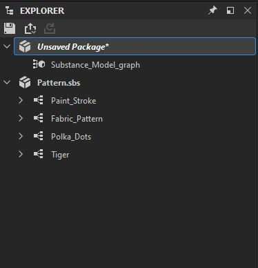
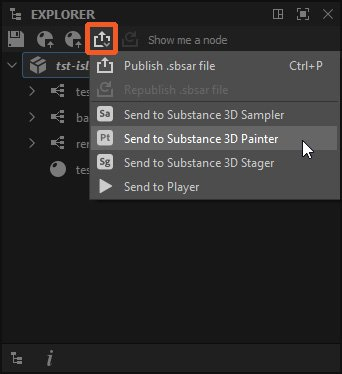

# Explorateur

Cette page décrit le dock Explorateur dans [Substance 3D Designer](https://www.adobe.com/fr/products/substance3d-designer.html). Ce dock vous permet de gérer les packages et leurs ressources.

<table>
<tr style="border: 0;">
<td style="border: 0;" valign="top">

## Vue d’ensemble

Le dock Explorateur est l’endroit où vous gérez vos fichiers et ressources actuellement ouverts dans Substance 3D Designer. La liste de tous les packages actuellement ouverts s&#39;affiche. Chaque package est développé sous forme de hiérarchie pour afficher [ressources](../../resources/resources.md)à l&#39;intérieur.

L’Explorateur est l’endroit où vous commencez et terminez vos projets, car il vous permet de créer, d’enregistrer et d’exporter tout type de ressource.

</td>
<td style="border: 0;" valign="top">

</td>
</tr>
</table>

Vous pouvez effectuer quelques actions importantes via le dock Explorateur :

* Création de packs et de graphes
* Charger les packs existants
* Enregistrement et fermeture de packs chargés
* [Importation et liaison de ressources](../../resources/importing-linking-and-new/importing-linking-and-new-resources.md)
* [Exporter les résultats du graphe vers les textures](../../compositing-graphs/exporting-bitmaps/exporting-bitmaps.md)
* [Publish d’un pack vers une ressource Substance 3D (SBSAR)](../../compositing-graphs/publishing-asset-files/publishing-substance-3d-asset-files-sbsar.md)
* [Envoi de packs à d’autres applications Substance 3D](send-to-interoperability/send-to-interoperability.md)
* [Mappages Baker à partir d’un maillage](../../bakers/bakers.md)

## Barre d’outils supérieure

Cette barre d’outils vous permet d’exécuter rapidement des fonctions liées à votre workflow global. Tous les boutons sont *sensibles au contexte*, ce qui signifie qu&#39;ils activent et modifient leur comportement en fonction de votre sélection actuelle dans l&#39;Explorateur.

 <b>Enregistrer</b> le package sélectionné.

 <b>élément(s) sélectionné(s) dans Publish ou [send](../../interface/the-explorer-window/send-to-interoperability/send-to-interoperability.md)</b> :

* [Publish tout pack sélectionné vers une ressource Substance 3D (SBSAR)](../../compositing-graphs/publishing-asset-files/publishing-substance-3d-asset-files-sbsar.md) ;
* Envoyez le package sélectionné à [Substance 3D Sampler](https://www.adobe.com/fr/products/substance3d-sampler.html), [Substance 3D Painter](https://www.adobe.com/fr/products/substance3d-painter.html) ou [Substance 3D Stager](https://www.adobe.com/fr/products/substance3d-stager.html).

 <b>Publish ou envoi comme précédent :</b> Publish ou envoi des éléments sélectionnés avec les mêmes paramètres qu&#39;auparavant. Cette option est uniquement disponible sur un pack qui a déjà été publié *au moins une fois* dans la session *actuelle*.

 <b>Supprimer les nœuds inutilisés</b> dans le ou les graphes sélectionnés. L’outil suit les règles suivantes :

* L&#39;outil n&#39;est disponible que si les éléments sélectionnés sont du *même type* : uniquement des graphes, des dossiers ou des packages ;
* Lorsque la sélection comprend des dossiers ou des packages, l&#39;outil nettoie tous les graphes qu&#39;ils contiennent *de manière récursive* ;
* Si l&#39;un des graphes ciblés est un [graphe de Substance de données](../../compositing-graphs/substance-compositing-graphs.md), une deuxième option est disponible pour vous permettre de nettoyer toutes les fonctions de paramètre sur les nœuds de ce graphe.

Pour en savoir plus sur l&#39;outil, consultez la section « Supprimer les nœuds inutilisés » de la page [Vue du graphe](../../interface/the-graph-view/the-graph-view.md).

<table>
<tr style="border: 0;">
<td style="border: 0;" valign="top">

*Publish/Send*

</td>
<td style="border: 0;" valign="top">

*Supprimer les nœuds inutilisés*

</td>
</tr>
</table>

## Menu contextuel

La plupart de vos interactions avec l&#39;Explorateur se font par le biais de menus contextuels, qui s&#39;affichent en cliquant sur le RMB d&#39;un élément dans la vue de l&#39;arborescence de l&#39;Explorateur.

Les options disponibles varient en fonction des éléments sélectionnés et sélectionnés :

+++Espace vide

Un espace vide est uniquement disponible sous les packs actuellement ouverts. Cliquer en regard des éléments existants n’est pas considéré comme un espace vide.

<b>Nouveau package</b> : crée un nouveau package vide ;

<b>Ouvrir le package</b> : ouvre une boîte de dialogue de fichier pour ouvrir un fichier SBS.

+++

+++Package

<b>Le </b>nouveauvous permet de créer de nouveaux graphes ([graphe de Substances](../../compositing-graphs/substance-compositing-graphs.md), [bitmap](../../resources/bitmap-resource/bitmap-resource.md) et [images vectorielles](../../resources/vector-graphics-svg-res/vector-graphics-svg-resource.md), ainsi que des *dossiers* pour le tri du contenu

<b>L&#39;importation</b> et le <b>lien </b>vous permettent d&#39;importer [des ressources](../../resources/importing-linking-and-new/importing-linking-and-new-resources.md)

<b>Recharger</b>, <b>Enregistrer, Enregistrer sous</b> et<b> Enregistrer une copie sous</b> vous permettent d&#39;enregistrer sur le disque ou de rappeler à partir du disque une version précédemment enregistrée du package.

<b>Publish .fichier sbsar</b> et<b> Republiez .fichier sbsar</b> vous permettent de [publier](../../compositing-graphs/publishing-asset-files/publishing-substance-3d-asset-files-sbsar.md) votre graphe de Substance non compilé et non optimisé, dans un Fichier sbsar efficace et portable pour nous dans d&#39;autres applications et intégrations de Substance. Publish as Previous répète l’action Publish précédente avec les mêmes options, en ignorant la boîte de dialogue options pour une itération plus rapide. La barre d’outils contient des boutons dotés de la même fonctionnalité.

<b>L&#39;exportation avec dépendances</b> est différente de l&#39;enregistrement et de la publication. Il prend vos fichiers SBS, collecte toutes les ressources et dépendances référencées et crée un package autonome. La boîte de dialogue vous permet de choisir les bibliothèques à collecter et de préciser si le fichier doit être une archive compressée (7-zip). C’est un bon choix pour partager un fichier SBS avec quelqu’un d’autre, sans se soucier des dépendances manquantes.

<b>Envoyer à...</b> ouvre un sous-menu vous permettant d&#39;[envoyer](send-to-interoperability/send-to-interoperability.md) directement votre pack à [Substance 3D Sampler](https://www.adobe.com/fr/products/substance3d-sampler.html), [Substance 3D Painter](https://www.adobe.com/fr/products/substance3d-painter.html), [Substance 3D Stager](https://www.adobe.com/fr/products/substance3d-stager.html) ou [Substance Player](https://helpx.adobe.com/substance-3d-player/home.html).

<b>Copier</b> copie le package sélectionné.

<b>Coller</b> colle les graphes et/ou les ressources copiés *dans* le package sélectionné.

<b>Fermer le(s) pack(s)</b> ferme tous les packs sélectionnés

<b>Calculer les sorties</b> force Designer à calculer toutes les sorties de tous les graphes du package.

<b>Afficher dans l&#39;Explorateur...</b> ouvre l&#39;emplacement du package dans la fenêtre de l&#39;explorateur de fichiers de votre système d&#39;exploitation

Le <b>Gestionnaire de dépendances</b> ouvre la fenêtre Gestionnaire de dépendances pour le package sélectionné.

<b>Ouvrir les dépendances</b> ouvre toutes les dépendances dans l&#39;Explorateur (*[graphes de Substance](../../compositing-graphs/substance-compositing-graphs.md) uniquement*).

+++

+++Graphe Substance

<b>Ouvrir :</b> (retour) ouvre ce graphe dans [la vue du graphe](../../interface/the-graph-view/the-graph-view.md).

<b>Copier :</b> *(Ctrl-C)* Copie le graphe actif dans le Presse-papiers.

<b>Supprimer :</b> (Supprimer) supprime le graphe de ce package.

<b>Renommer :</b> (F2) Renommez ce graphe.

<b>Afficher les sorties en vue 3D :</b> envoie les sorties de ce graphe à [la vue 3D](../../interface/3d-view/3d-view.md), pour qu&#39;elles s&#39;affichent en tant que matériau.

<b>Calculer les sorties :</b> calcule les sorties de ce graphe et les garde en mémoire.

<b>Exporter les sorties...:</b> Ouvre la boîte de dialogue pour [exporter vers des bitmaps.](../../compositing-graphs/exporting-bitmaps/exporting-bitmaps.md)

+++

+++Ressource de scène 3D

<b>Ouvrir :</b> (Retour) utilise ce maillage 3D dans[la vue 3D](../../interface/3d-view/3d-view.md), en remplaçant le cube ou le plan standard.

<b>Copier :</b> (Ctrl-C) copie cette ressource dans le presse-papiers.

<b>Coller :</b> (Ctrl-V) colle la ressource à partir du Presse-papiers.

<b>Supprimer :</b> (Suppr) Supprime la ressource de ce package.

<b>Renommer :</b> (F2) Renommez cette ressource.

<b>Recharger :</b> forcez le rechargement de ce maillage à partir du disque.

<b>Afficher dans l&#39;Explorateur :</b> ouvrez une fenêtre de l&#39;explorateur de fichiers système à l&#39;emplacement de la ressource sur le disque.

<b>Redéfinir l&#39;emplacement :</b> modifiez cette ressource pour la lier à un autre fichier.

<b>Informations sur le modèle Baker...:</b> Ouvre la boîte de dialogue [Baking](../../bakers/bakers.md).

+++

+++Dossier

<b>Nouveau :</b> vous permet de créer dans le dossier de nouveaux graphes ([graphe de Substance](../../compositing-graphs/substance-compositing-graphs.md), [graphe de fonction de Substance](../../function-graphs/function-graphs.md), [bitmap](../../resources/bitmap-resource/bitmap-resource.md) et [images vectorielles](../../resources/vector-graphics-svg-res/vector-graphics-svg-resource.md), ainsi que des *dossiers* pour le tri du contenu.

<b>Importer</b> et <b>Lier :</b>vous permettent d&#39;importer [des ressources](../../resources/importing-linking-and-new/importing-linking-and-new-resources.md) et de les placer dans le dossier.

<b>Copier :</b> (Ctrl-C) Copie le dossier et tout son contenu dans le Presse-papiers.

<b>Coller :</b> (Ctrl-V) colle le dossier et tout son contenu à partir du Presse-papiers.

<b>Renommer :</b> (F2) Renommez ce dossier.

<b>Supprimer :</b> *(Del)* Supprime le dossier et tout son contenu de son package.

<b>Calculer les sorties :</b> calcule les sorties de tous les graphes inclus dans le dossier et les garde en mémoire.

+++

## Barre d’outils inférieure

La barre d’outils située au bas du dock Explorateur fournit des informations sur un pack ou une ressource de pack :

<b> Dépendances :</b> Lorsqu&#39;un package est sélectionné, ses dépendances de package sont répertoriées dans un panneau dédié.

Informations <b> :</b> fournit des métadonnées liées au package ou à la ressource actuellement sélectionné(e) :

* Package : chemin d’accès complet au fichier du package
* [Ressource bitmap](../../resources/bitmap-resource/bitmap-resource.md) : le chemin d&#39;accès complet au fichier de la ressource, son [profil ICC](../../color-management/color-management.md), la taille de l&#39;image et la [méthode d&#39;importation](../../resources/importing-linking-and-new/importing-linking-and-new-resources.md) (c&#39;est-à-dire *lié* ou *importé*)

<table>
<tr style="border: 0;">
<td style="border: 0;" valign="top">

*Dépendances*

</td>
<td style="border: 0;" valign="top">

*Informations*

</td>
</tr>
</table>
