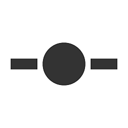

# Nœud Point (également Portal)

<table>
<tr style="border: 0;">
<td width="25.00%" style="border: 0;" valign="top">

</td>
<td width="100.00%" style="border: 0;" valign="top">

Le nœud <b>Point</b> est un assistant qui vous permet de simplifier et de nettoyer les graphiques en redirigeant et en regroupant les connexions. Elle est particulièrement utile pour les graphiques comportant de nombreuses connexions longues s&#39;exécutant sur d&#39;autres connexions ou nœuds.

Une paire de nœuds Dot peut être utilisée comme <b>portails</b> pour masquer une connexion sur une longue distance ou dans des endroits où le routage de la connexion serait difficile.

</td>
</tr>
</table>

## Création de nœuds Point

Les nœuds de point peuvent être ajoutés dans n’importe quel type de graphique, de l’une des manières suivantes :

+++Insérer sur le lien
Maintenez la touche <b>Alt</b> enfoncée tout en survolant une connexion pour afficher l&#39;aperçu du nœud Point, puis cliquez sur LMB pour ajouter un nœud Point sur la connexion à cet emplacement.

{width="512px"}

+++

+++Connecteur de nœud
Appuyez sur la touche <b>Alt</b> tout en faisant glisser une nouvelle connexion à partir d&#39;un connecteur de nœud pour insérer un nœud Dot à cet emplacement.

Vous pouvez continuer à faire glisser la nouvelle connexion et répéter l&#39;opération pour router cette connexion comme vous le souhaitez.

+++

+++Menu Nœud
Appuyez sur la <b>barre d&#39;espace</b> pour afficher le <b>menu Nœud</b>, puis sélectionnez l&#39;élément Point ou tapez Point dans le champ de recherche pour faire apparaître l&#39;élément et le trouver plus rapidement.

+++

>[!TIP]
>
> Lorsqu&#39;un nœud Point est créé, sa propriété « Name » est automatiquement mise en avant afin que vous puissiez immédiatement modifier le nom du nœud.

<table>
<tr style="border: 0;">
<td style="border: 0;" valign="top">

## Fusion des liens

Appuyez sur ALT et déplacez un nœud Point sur les liens pour fusionner plusieurs connexions de nœuds.

</td>
<td style="border: 0;" valign="top">

{width="512px"}

</td>
</tr>
</table>

## Portails

<table>
<tr style="border: 0;">
<td width="16.67%" style="border: 0;" valign="top">

</td>
<td width="100.00%" style="border: 0;" valign="top">

Les nœuds point peuvent être utilisés comme <b>portails</b> pour envoyer des données sur une longue distance dans le graphique sans avoir un lien long encombrant qui nuit à la lisibilité. Cela masque efficacement le lien entre les nœuds Point.

</td>
</tr>
</table>

### Création de portails

Un portail est automatiquement créé entre deux nœuds Dot - un émetteur et un récepteur - lorsque le nœud Dot de l&#39;émetteur est nommé. Pour nommer un nœud Point, définissez un identificateur unique dans sa propriété <b>Name</b>.

Lorsqu’un ou plusieurs nœuds Dot nommés existent dans un graphe, n’importe quel nœud Dot peut y être connecté en tant que récepteur :

* la création d&#39;une liaison entre l&#39;entrée du récepteur et la sortie d&#39;un émetteur;
* Sélection du nom de l&#39;émetteur dans la propriété <b>Portail d&#39;entrée</b> du récepteur.

La duplication ou la copie de récepteurs préserve leur connexion à l&#39;émetteur en tant que portail.

### Identification des portails

Les nœuds de point utilisés comme portails ont une icône de signal sans fil placée à côté du connecteur utilisé comme portail.

La sélection d&#39;un nœud Point utilisé comme portail affiche ses connexions masquées à d&#39;autres portails sous la forme d&#39;une ligne en pointillés.

### Suppression de portails

Un portail est supprimé lorsque le <b>nom</b> de l&#39;émetteur est effacé ou lorsque la connexion masquée est supprimée par :

* Sélectionner un portail, puis sélectionner la connexion masquée et la supprimer ;
* Sélectionnez le récepteur et appuyez sur le bouton <b>X</b> en regard du menu déroulant <b>Portail d&#39;entrée</b> dans Propriétés.

>[!IMPORTANT]
>
> L&#39;utilisation de nœuds Point comme portails n&#39;est pas prise en charge dans les [graphiques FX-Map](../../../../function-graphs/fxmaps/fxmaps.md).

Consultez ce tutoriel sur les nœuds Point en tant que portails :
