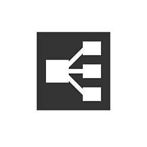
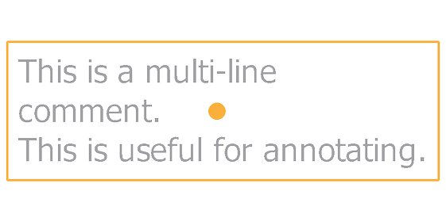

# Cadre

<table>
<tr style="border: 0;">
<td width="25.00%" style="border: 0;" valign="top">



</td>
<td width="100.00%" style="border: 0;" valign="top">

Un cadre facilite la lisibilité et la mise en page des graphes en regroupant visuellement les objets dans ce graphe et en vous permettant de déplacer facilement tous ces objets ensemble.

Par exemple, les cadres peuvent être nommés et colorés de sorte que la structure du graphe ressorte clairement lors d&#39;une présentation, ce qui est très utile à mesure que la complexité du graphe augmente.

Ils peuvent également être annotés et fonctionnent ainsi comme un outil de documentation pour expliquer pourquoi certains nœuds ont été configurés d&#39;une manière spécifique.

</td>
</tr>
</table>

## Apparence

Selon la position du curseur de la souris ou s’il fait partie d’une sélection, un cadre se présente dans différents styles visuels pour vous indiquer si vous pouvez interagir avec lui et comment.

+++Par défaut
Par défaut, le cadre est un rectangle dont les coins arrondis sont remplis de la couleur sélectionnée dans sa propriété <b>Couleur Cadre</b>. Une teinte plus foncée de cette couleur est appliquée sur le contour du cadre.

Le titre défini dans la propriété <b>Titre</b> est gris dans le coin supérieur gauche du cadre.

")


+++

+++Survol de l’en-tête
Lorsque vous survolez le haut du cadre, une barre d’en-tête s’affiche.

Le cadre peut être déplacé en faisant glisser cette barre d’en-tête ou son titre.

")


+++

+++Sélection
Lorsque cette option est sélectionnée, le titre et le contour du cadre sont mis en évidence en blanc. Le contour s’épaissit.

")


+++

## Création de cadres

Les mots de cadre peuvent être ajoutés dans n’importe quel type de graphe, de l’une des manières suivantes :

+++Menu Nœud
Appuyez sur la <b>barre d&#39;espace</b> dans la Vue du graphe pour ouvrir le <b>menu Nœud</b>, puis sélectionnez l&#39;élément « Cadre » dans la liste.

Tapez « cadre » dans le champ de recherche pour faire apparaître l’élément et le retrouver plus rapidement.

+++

+++Raccourci
Si un raccourci de clavier est associé à l&#39;élément « Cadre » dans les [Préférences](../../../../interface/preferences-window/preferences-window.md), appuyez sur ce raccourci lorsque la Vue du graphe est active.

+++

+++Menu contextuel
En Vue du graphe de compte, appuyez sur <b>RMB</b> sur n&#39;importe quel objet ou dans un espace vide et sélectionnez l&#39;option <b>Ajouter un Cadre</b>.

+++

+++Barre d’outils Graphique
Dans la barre d&#39;outils Vue du graphe, cliquez sur le bouton Cadre dans la <b>Palette de noeuds</b>.

+++

+++Bibliothèque
Dans la bibliothèque, sélectionnez la catégorie <b>Éléments de Graphe</b>, puis faites glisser l&#39;élément « Cadre » dans la Vue du graphe de données.

+++

### Sélections de cadrage

Si une sélection est active dans un graphe lors de la création d’un cadre, ce cadre est automatiquement ajusté pour inclure entièrement les objets sélectionnés.

En gardant cela à l’esprit, la création de cadres à l’aide d’un raccourci de clavier rend encore plus rapide la cadre du contenu dans un graphe.

{width="480px"}

>[!TIP]
>
> Lors de la création d’un cadre, sa propriété Titre devient automatiquement active pour vous permettre de modifier immédiatement le titre du cadre.

## Manipulation des cadres

<table>
<tr style="border: 0;">
<td style="border: 0;" valign="top">

Les cadres peuvent être <b>panoramiques</b> en faisant glisser leur barre de titre ou d&#39;en-tête et <b>redimensionnés</b> en faisant glisser l&#39;une de leurs bordures ou de leurs angles.

L’illustration met en évidence les zones d’interaction pour le panoramique (bleu) et le redimensionnement (jaune).

</td>
<td style="border: 0;" valign="top">


</td>
</tr>
</table>

<table>
<tr style="border: 0;">
<td style="border: 0;" valign="top">

### Magnétisme de la grille

Par défaut, un cadre contraint à la grille moyenne lorsqu’il est déplacé ou redimensionné.

Maintenez la touche <b>Ctrl</b> (Windows) / <b>Cmd</b> (macOS) enfoncée pour déplacer ce contraint vers la petite grille pour des réglages plus fins.

</td>
<td style="border: 0;" valign="top">


</td>
</tr>
</table>

## Propriétés

Lorsqu&#39;un cadre est sélectionné, les propriétés suivantes sont disponibles dans le dock [Propriétés](../../../../interface/properties/properties.md) :

+++Titre
Le <b>Titre</b> se trouve en haut à gauche du cadre. Sa visibilité du titre peut être activée ou désactivée à l&#39;aide de la propriété <b>Titre visible</b>.

La taille du titre peut être verrouillée à une taille d’écran minimale afin qu’il reste lisible lors d’un zoom arrière sur le graphe. Pour ce faire, cochez l&#39;option Titres du Cadre dans la liste déroulante <b>Informations</b> de la barre d&#39;outils [Vue du graphe](../../../../interface/the-graph-view/the-graph-view.md).

{width="640px"}


+++

+++Description
La <b>Description</b> est une partie de texte supplémentaire facultative qui peut être utilisée pour annoter le contenu du cadre.

Le texte peut être mis en forme à l’aide d’étiquettes de HTML. Cette mise en forme est basculée en cliquant sur le bouton  <b>Annotation de HTML</b>.

Pour en savoir plus, consultez la section Description ci-dessous.

{width="640px"}


+++

+++Couleur
La <b>couleur du Cadre</b> est utilisée pour remplir le cadre dans la Vue du graphe. Utilisez le sélecteur de couleurs pour sélectionner une couleur.

Le canal Alpha de la couleur contrôle l&#39;*opacité* du cadre, où une valeur de 0 signifie que le cadre est entièrement transparent.

{width="640px"}


+++

## Description

Un cadre peut être annoté avec un texte qui sera placé dans le cadre. Le texte est aligné à gauche et commence dans le coin supérieur gauche du cadre. Utilisez la propriété [Description](#properties) du cadre pour modifier ce texte.

<table>
<tr style="border: 0;">
<td style="border: 0;" valign="top">

### Standard

Le <b>Titre</b> s&#39;affiche dans une police en gras située en haut à gauche du cadre. La visibilité du titre peut être activée ou désactivée.

Sa taille peut être verrouillée à une taille d’écran minimale afin qu’il reste lisible lors d’un zoom arrière sur le graphe. Pour ce faire, cochez l&#39;option Titres du Cadre dans la liste déroulante <b>Informations</b> de la barre d&#39;outils [Vue du graphe](../../../../interface/the-graph-view/the-graph-view.md).

</td>
<td style="border: 0;" valign="top">

"){zoomable="yes"}

</td>
</tr>
</table>

<table>
<tr style="border: 0;">
<td style="border: 0;" valign="top">

### formatage de HTML

Le texte peut être mis en forme à l&#39;aide de balises de HTML dans la propriété <b>Description</b> du cadre. La mise en forme doit être activée à l&#39;aide du bouton  <b>Annotation de HTML</b> dans cette même propriété.

</td>
<td style="border: 0;" valign="top">

"){zoomable="yes"}

</td>
</tr>
</table>

Vous pouvez copier et coller cet exemple dans la propriété Description du cadre pour tester cette fonctionnalité par vous-même :

```
<h2>HTML formatting</h2>

<p>This is a description formatted using <b>HTML markup</b>.</p>

<p>Formattig text makes it more <i>pleasant</i>, <font color="#CC8822">impactful</font> and <code>clearly structured</code> for users.</p>

<p>  Images are also supported! <sup>How nice!</sup></p>
```


Voici une liste de balises utiles pour la mise en forme du texte :

+++balises de formatage de HTML

|  |  |
| --- | --- |
| Gras | &lt;b>...&lt;/b> |
| Italique | &lt;i>...&lt;/i> |
| Couleur | &lt;font color=« #4A567C« >...&lt;/font> |
| Paragraphe | &lt;p>...&lt;/p> |
| Saut de ligne | &lt;br> |
| Intitulés | &lt;h1>...&lt;/h1>, &lt;h2>...&lt;/h2>, etc. |
| Image | &lt;img src=« {path\_to\_image}« > |
| Exposant | &lt;sub>...&lt;/sub> |
| Liste non triée (puces) | &lt;ul> &lt;li>...&lt;/li> &lt;li>...&lt;/li> &lt;/ul> |
| Liste triée (numéros) | &lt;ol> &lt;li>...&lt;/li> &lt;li>...&lt;/li> &lt;/ol> |
| Code | &lt;code>...&lt;/code> |


+++

## Règles d’inclusion

Un objet est considéré comme inclus dans une image s’il répond à sa règle d’inclusion. Ces règles varient en fonction de l’objet et du cas particulier. Ils sont répertoriés ci-dessous.

Le symbole jaune de chaque illustration représente le point ou la zone qui doit se trouver entièrement à l’intérieur des limites d’un cadre pour qu’un objet soit inclus dans ce cadre.

+++Nœuds
Le <b>point central</b> est utilisé.

Les badges, les connecteurs et les informations affichés sous le nœud sont tous ignorés.

Les nœuds peuvent être d&#39;heights différents, selon leur nombre de connecteurs d&#39;entrée ou de sortie.

Lorsque des connecteurs sont affichés ou masqués, ajoutés ou supprimés, l&#39;height du nœud s&#39;ajuste à partir de son *centre*.

Par conséquent, l&#39;emplacement du point central d&#39;un nœud ne doit pas être modifié tant qu&#39;il n&#39;a pas *été délibérément déplacé*.


Le <b>point d&#39;entrée</b><b></b> du nœud *hôte* est utilisé.

Le nœud hôte est le nœud auquel un nœud est ancré.

Si plusieurs nœuds sont ancrés dans une chaîne, le nœud hôte du dernier nœud ancré est utilisé pour toute la chaîne.

Les badges, les connecteurs et les informations affichés sous le nœud sont tous ignorés.


+++

+++Nœuds point
Le <b>point central</b> du point est utilisé.

Les connecteurs, les icônes de portail et les noms sont tous ignorés.


+++

+++Commentaires
Le <b>point central</b> du *cadre de sélection* du commentaire (contour jaune) est utilisé.

Les commentaires parents ne suivent pas les règles d’inclusion des commentaires.

À la place, le <b>point central</b> du nœud *parent* est utilisé.

Les badges, les connecteurs et les informations affichés sous le nœud sont tous ignorés.





+++

+++Épingles
Le <b>conseil</b> de l&#39;icône d&#39;épingle est utilisé.


+++

+++Images
Le <b>cadre de sélection</b> du cadre imbriqué est utilisé.

Cela signifie qu’un cadre imbriqué doit se trouver entièrement dans les limites d’un autre cadre pour être inclus dans ce dernier.

Le titre est ignoré.


+++

## Ajuster la taille au contenu


Lorsque vous effectuez des réglages dans votre graphe, il se peut qu’un cadre ne soit plus correctement ajusté à son contenu. Dans ce cas, il est possible d’ajuster automatiquement la position et la taille de l’image afin qu’elle s’adapte à l’étendue de son contenu, avec un remplissage d’une cellule de grille moyenne.

Pour ce faire, cliquez sur <b>RMB</b> sur la barre de titre ou d&#39;en-tête du cadre (voir [Apparence](#appearance)) et sélectionnez l&#39;option <b>Adapter à la taille du contenu</b> dans le menu contextuel.

>[!NOTE]
>
> L&#39;option est disponible si au moins *un* objet graphique respecte les [règles d&#39;inclusion](../../../../interface/the-graph-view/graph-items/frame/frame.md) du cadre.

<table>
<tr style="border: 0;">
<td style="border: 0;" valign="top">

### Ajustement du texte de description

Si le cadre comporte une description, sa valeur est ajustée pour utiliser tout espace vide en regard de la description, si possible.

Si aucun objet inclus ne peut être placé dans cet espace, l’height du cadre est ajusté pour tenir compte de la description.

</td>
<td style="border: 0;" valign="top">

")

</td>
</tr>
</table>

+++Exemple
"){width="640px"}


+++

## Développement automatique


Au fur et à mesure que le graphique se développe, le contenu des blocs peut devoir être réorganisé. Les nœuds peuvent se déplacer pour faire de la place pour les ajouts ou le contenu peut devoir être plus espacé pour promouvoir la lisibilité.

Pour faciliter ces réglages, il est possible de développer automatiquement un cadre lors du déplacement de [objets inclus](#inclusion-rules) : maintenez la touche <b>Maj</b> enfoncée tout en déplaçant un objet pour que les bordures du cadre s&#39;ajustent automatiquement afin de maintenir cet objet dans leurs limites.

Cela s’applique également aux sélections qui peuvent inclure plusieurs objets. Dans ce cas, l’image hôte de chaque objet sera ajustée simultanément.

Si un objet n&#39;est pas entièrement entouré par les limites du cadre, mais qu&#39;il respecte toujours sa [règle d&#39;inclusion](#inclusion-rules), le cadre est ajusté pour l&#39;entourer entièrement avec un remplissage supplémentaire d&#39;une cellule de grille moyenne dès que la touche <b>Maj</b> est enfoncée.

>[!NOTE]
>
> Bien que la touche <b>Maj</b> puisse être enfoncée ou relâchée à tout moment pendant le déplacement pour déclencher ou annuler le réglage automatique de l&#39;image, elle *doit* être maintenue pendant la réalisation du déplacement pour appliquer efficacement le réglage.

+++Exemple
"){width="640px"}


+++
