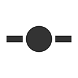

# Éléments du graphe

Les éléments de graphe sont des objets spéciaux qui vous aident à organiser vos graphes, à améliorer leur lisibilité et à accélérer leur navigation.

<table>
<tr style="border: 0;">
<td style="border: 0;" valign="top">

[{width="128px"}](../../../interface/the-graph-view/graph-items/dot-node/dot-node.md)

## Nœud Point (également Portal)

</td>
<td style="border: 0;" valign="top">

[Icône {width="128px"}](../../../interface/the-graph-view/graph-items/frame/frame.md)

## Cadre

</td>
</tr>
</table>

<table>
<tr style="border: 0;">
<td style="border: 0;" valign="top">

Réacheminez et fusionnez des connexions, ou transmettez-les à un autre nœud Dot de réception.

</td>
<td style="border: 0;" valign="top">

Regroupez les nœuds avec libellé et code couleur, puis déplacez-les facilement.

</td>
</tr>
</table>

<table>
<tr style="border: 0;">
<td style="border: 0;" valign="top">

[{width="128px"}](../../../interface/the-graph-view/graph-items/comment/comment.md)

## Commentaire

</td>
<td style="border: 0;" valign="top">

[{width="128px"}](../../../interface/the-graph-view/graph-items/navigation-pin/navigation-pin.md)

## Épingle

</td>
</tr>
</table>

<table>
<tr style="border: 0;">
<td style="border: 0;" valign="top">

Annotez votre graphe.

</td>
<td style="border: 0;" valign="top">

Marquez les points d’intérêt dans votre graphe, puis accédez-y rapidement.

</td>
</tr>
</table>
