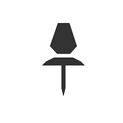

# Épingle

<table>
<tr style="border: 0;">
<td width="25.00%" style="border: 0;" valign="top">

</td>
<td width="100.00%" style="border: 0;" valign="top">

Un coin est un assistant qui vous permet de passer rapidement d’un emplacement spécifique à un autre dans les graphiques.

Vous pouvez définir un libellé personnalisé à l&#39;aide de leur propriété <b>Description</b>.

</td>
</tr>
</table>

## Création de coins

Les épingles peuvent être créées de l’une des manières suivantes :

+++Menu Nœud
Appuyez sur la <b>barre d&#39;espace</b> dans la vue Graphique pour ouvrir le <b>menu Nœud</b>, puis sélectionnez l&#39;élément Épingler dans la liste.

Tapez « épingle » dans le champ de recherche pour faire apparaître l’élément et le trouver plus rapidement.

+++

+++Raccourci
Si un raccourci clavier est mappé à l&#39;élément Épingle dans les [Préférences](../../../../interface/preferences-window/preferences-window.md), appuyez sur ce raccourci lorsque la vue Graphique est active.

+++

+++Menu contextuel
Dans la vue Graphique, appuyez sur <b>RMB</b> dans un espace vide et sélectionnez l&#39;option <b>Ajouter un coin</b>.

+++

+++Barre d’outils Graphique
Dans la barre d&#39;outils du mode Graphique, cliquez sur le bouton Épingler dans la <b>Palette de noeuds</b>.

+++

+++Bibliothèque
Dans la bibliothèque, sélectionnez la catégorie <b>Éléments de graphique</b>, puis faites glisser l&#39;élément Épingler dans la vue Graphique.

+++

>[!TIP]
>
> Lorsqu&#39;un coin est créé, sa propriété « Description » est automatiquement mise en avant afin que vous puissiez immédiatement modifier le texte du coin.

## Passage aux coins

Quel que soit le type de graphique, appuyer sur <b>F2</b> permet de parcourir toutes les épingles de ce graphique dans l&#39;ordre de création.

Les épingles seront encadrées dans la clôture au niveau de zoom actuel.

