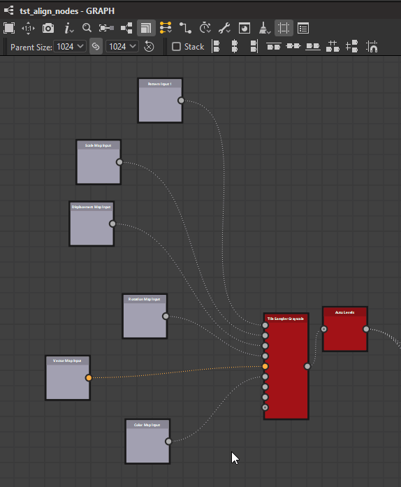
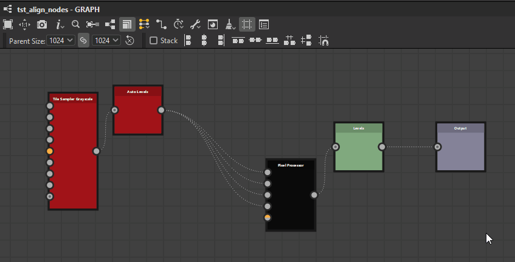

# Outils d’alignement des nœuds

{zoomable="yes"}

Les outils d&#39;alignement des nœuds vous permettent d&#39;organiser les nœuds dans des graphiques pour améliorer leur lisibilité et leur expérience de création. Ils proposent des actions permettant d’aligner les nœuds, de les répartir uniformément et de les aligner sur la grille.

Ils agissent sur les <b>nœuds actuellement sélectionnés uniquement</b>.

>[!NOTE]
>
> Raccourcis clavier
> 
> Certaines actions disposent de raccourcis clavier pour un accès rapide : H, V et S. Ils s’affichent entre parenthèses dans la liste des actions ci-dessous.
> 
> Notez que ces raccourcis remplaceront tout [raccourci clavier attribué aux nœuds](../../../interface/preferences-window/preferences-window.md).

## Alignements

Les nœuds peuvent être alignés horizontalement et verticalement, avec trois modes pour chaque axe :

### Alignements horizontaux

<b> Gauche :</b> alignez le côté gauche des nœuds sélectionnés sur le côté gauche du nœud le plus à gauche.

<b> Centre (H) :</b> Alignez le centre horizontal des nœuds sélectionnés sur le centre horizontal du cadre de sélection qui les entoure.

<b> Droite :</b> alignez le côté droit des nœuds sélectionnés sur le côté droit du nœud le plus à droite.

<table>
<tr style="border: 0;">
<td style="border: 0;" valign="top">

{zoomable="yes"}

*À Gauche*

</td>
<td style="border: 0;" valign="top">

{zoomable="yes"}

*Centrer*

</td>
<td style="border: 0;" valign="top">

{zoomable="yes"}

*Droite*

</td>
</tr>
</table>

### Alignements verticaux

<b> Haut :</b> Alignez le bord supérieur des nœuds sélectionnés sur le bord supérieur du nœud le plus haut.

<b> Milieu (V) :</b> Alignez le centre vertical des nœuds sélectionnés sur le centre vertical du cadre de sélection qui les entoure.

<b> Bas :</b> Alignez le bas des nœuds sélectionnés sur le bas du nœud le plus bas.

<table>
<tr style="border: 0;">
<td style="border: 0;" valign="top">

{zoomable="yes"}

*Haut*

</td>
<td style="border: 0;" valign="top">

{zoomable="yes"}

*Milieu*

</td>
<td style="border: 0;" valign="top">

{zoomable="yes"}

*Bas*

</td>
</tr>
</table>

### Empilement

L&#39;option  <b>Empiler</b> vous permet d&#39;<b>éviter tout chevauchement</b> lors de l&#39;utilisation des alignements. Elle est activée par défaut.

Lorsque cette option est activée, les nœuds sont déplacés le plus loin possible vers la position de référence jusqu&#39;à ce qu&#39;ils entrent en collision avec un autre nœud dans la sélection. Cela permet de les empiler dans l’axe sélectionné avec une marge d’une cellule de grille moyenne entre chaque nœud.

{zoomable="yes"}

## Distributions

Les nœuds peuvent être répartis uniformément entre les nœuds à chaque extrémité de la sélection actuelle sur l&#39;axe souhaité.

<b> horizontalement :</b> nœuds sont répartis uniformément entre les nœuds les plus à gauche et à droite de la sélection.

<b> Verticalement :</b> nœuds sont répartis uniformément entre les nœuds les plus élevés et les plus bas de la sélection.

Les distributions visent un <b>espacement régulier</b> entre les nœuds, quelle que soit leur taille.

Lorsque plusieurs nœuds ont leurs centres parfaitement alignés sur l&#39;axe sélectionné, ils restent et sont <b>traités comme un</b> dans la distribution. Le *plus grand* des nœuds alignés est utilisé pour calculer l&#39;espacement pair.

Notez que lorsque la taille totale des nœuds sélectionnés est supérieure à l&#39;espace disponible sur l&#39;axe sélectionné, des chevauchements peuvent se produire.

<table>
<tr style="border: 0;">
<td width="58.33%" style="border: 0;" valign="top">

{zoomable="yes"}

*Horizontalement*

</td>
<td width="100.00%" style="border: 0;" valign="top">

{zoomable="yes"}

*Verticalement*

</td>
</tr>
</table>

<table>
<tr style="border: 0;">
<td width="58.33%" style="border: 0;" valign="top">

## Magnétisme de la grille

L&#39;action <b>Accrocher (S) </b> déplace chaque nœud sélectionné de sorte que son coin supérieur gauche repose sur le point le plus proche sur la grille moyenne.

</td>
<td width="100.00%" style="border: 0;" valign="top">

{zoomable="yes"}

</td>
</tr>
</table>
