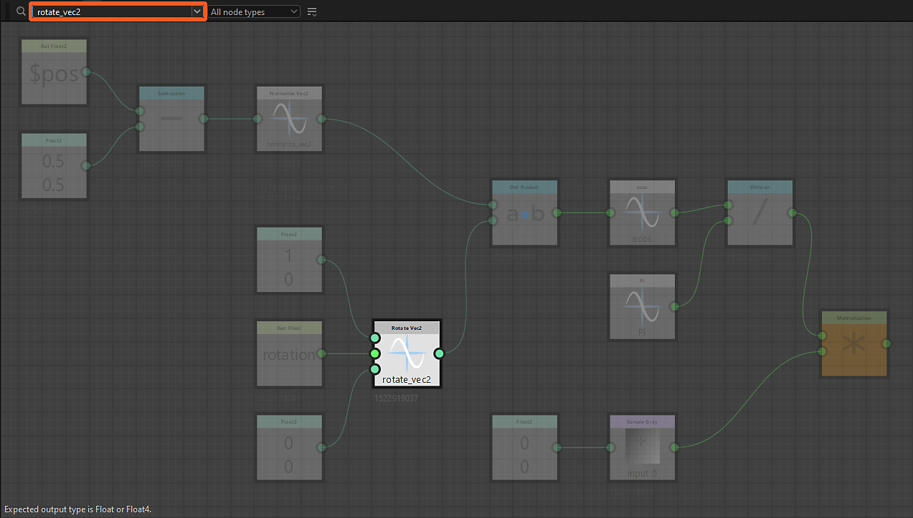
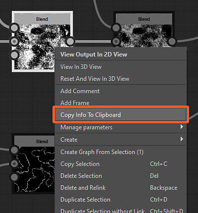
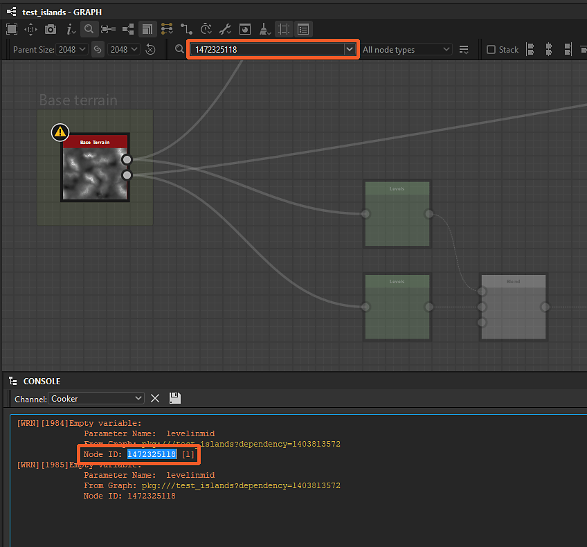
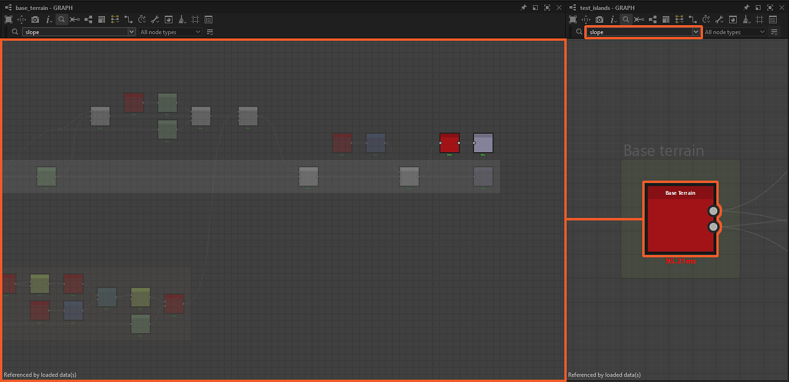

# Node Finder

{zoomable="yes"}

L&#39;outil Node Finder vous permet d&#39;effectuer une <b>recherche de nœuds et de variables</b> à l&#39;aide d&#39;une requête texte. Tous les nœuds qui ne correspondent pas à la requête sont grisés pour que les résultats ressortent.

La requête peut correspondre à n&#39;importe lequel de ces critères :

* <b>Identificateur d&#39;un graphique</b> référencé par un nœud d&#39;instance
* <b>Identificateur d&#39;un paramètre ou variable exposé</b> utilisé dans une fonction de paramètre de nœud
* <b>UID</b> d&#39;un nœud (identifiant unique)
* Étiquette <b>d&#39;un nœud</b>

La recherche peut parcourir de manière récursive [les instances de graphique](../../../compositing-graphs/creating-compositing-gra/graph-instances-sub-gra/graph-instances-sub-graphs.md) afin que les nœuds et les variables soient disponibles sur [sous-graphes](../../../compositing-graphs/creating-compositing-gra/graph-instances-sub-gra/graph-instances-sub-graphs.md). Si vous n&#39;êtes pas sûr du terme exact que vous devez rechercher, une option de recherche floue est disponible pour appliquer une tolérance à la requête.

## Interface

Le Node Finder est accessible de deux façons :

Dans la vue Graphique, appuyez sur <b>Ctrl+F</b> (Windows) / <b>Cmd+F</b> (macOS) pour afficher la barre d&#39;outils du Finder de nœuds et définir automatiquement le focus sur le champ de requête. Cela vous permet d’effectuer une recherche rapidement.

Dans la barre d&#39;outils Vue graphique, cliquez sur le bouton <b>Node Finder </b> pour afficher la barre d&#39;outils Node Finder. Une fois affichée, la barre d’outils se ferme uniquement en cliquant sur ce bouton.

<b>Effectue des recherches dans les graphiques</b>. En d’autres termes, une recherche reste active lors de l’ouverture de graphiques à l’aide des actions suivantes :

* Nœud d&#39;instance : ouvrir la référence en contexte (Ctrl+E / Cmd+E) (*Remarque :* l&#39;édition de graphique en contexte doit être activée dans Modifier > Préférences > Graphique)
* Processeur de pixels : fonction Modifier (Ctrl+E / Cmd+E)
* Processeur de valeurs : fonction Modifier (Ctrl+E / Cmd+E)
* FX-Map : Modifier le graphique FX-Map (Ctrl+E / Cmd+E)
* Paramètres de nœud : fonction Modifier

{zoomable="yes"}

### Requête de recherche

{zoomable="yes"}

Les termes de recherche peuvent être saisis dans ce champ et le bouton fléché ouvre une liste de suggestions de requête qui inclut certaines des variables disponibles dans le contexte actuel.

Pour en savoir plus sur les requêtes que vous pouvez effectuer, consultez la section [Requête de recherche](#search-query) ci-dessous.

### Type de nœud

{zoomable="yes"}

Cette zone de liste déroulante vous permet de filtrer les résultats de la recherche pour ne conserver qu&#39;un type spécifique de nœuds.

Notez que tous les nœuds d&#39;instance sont du *même type* de nœud (en fait, le type « instance »), tandis que les nœuds atomiques sont chacun leur propre type.

+++Listes de types de nœuds
La liste est contextuelle par rapport au type de graphique actuel.

"){zoomable="yes"}

*Types de nœuds pour la composition de graphiques*

"){zoomable="yes"}

*Types de nœuds pour les graphiques de fonctions*

+++

+++Recherche de nœuds atomiques
"){zoomable="yes"}

*Recherche du type de nœud « Levels » dans un graphique de Substances*

+++

+++Recherche de nœuds d&#39;instance
"){zoomable="yes"}

*Recherche du type de nœud « Instance » dans un graphique de Substance*

"){zoomable="yes"}

*Recherche du type de nœud « Instance » dans un graphique de fonction de Substance*

+++

### Options de recherche

<table>
<tr style="border: 0;">
<td width="100.00%" style="border: 0;" valign="top">

Le bouton <b>Options de recherche </b> ouvre une liste des paramètres utilisés pour la recherche qui peuvent être activés et désactivés.

Pour en savoir plus sur ces options, consultez la section Options de recherche ci-dessous.

</td>
<td width="33.33%" style="border: 0;" valign="top">

{zoomable="yes"}

</td>
</tr>
</table>

## Requête de recherche

Pour rechercher des nœuds, une requête de texte est mise en correspondance avec les propriétés de nœud répertoriées ci-dessous.

>[!NOTE]
>
> Votre requête doit être saisie en tenant compte des avertissements suivants :
> 
> * La recherche ne respecte pas la casse. Par exemple, « Mon libellé de nœud » et « Mon libellé de nœud » renvoient les mêmes résultats.
> * Les espaces avant et après la requête sont ignorés.
> * Plusieurs requêtes ne peuvent pas être effectuées en même temps dans le même graphique. Par exemple, « levels blur » ne correspondra pas aux nœuds « Levels » et « Blur ». De même, les opérateurs logiques ne sont pas pris en charge.

<table>
<tr style="border: 0;">
<td width="100.00%" style="border: 0;" valign="top">

### Identificateurs de graphiques d’instance

[Des nœuds d&#39;instance](../../../compositing-graphs/creating-compositing-gra/graph-instances-sub-gra/graph-instances-sub-graphs.md) sont disponibles à l&#39;aide de l&#39;<b>identificateur</b> des graphiques auxquels ils font référence.

</td>
<td width="33.33%" style="border: 0;" valign="top">

{zoomable="yes"}

*Cliquer sur l&#39;image pour l&#39;agrandir*

</td>
</tr>
</table>

+++Identificateur dans l’Explorateur
Les graphiques sont répertoriés en fonction de leurs identifiants dans l’Explorateur.

{zoomable="yes"}

+++

+++Identificateur dans l&#39;info-bulle du nœud d&#39;instance
L&#39;info-bulle des nœuds d&#39;instance inclut l&#39;identifiant de leur graphique référencé.

{zoomable="yes"}

+++

<table>
<tr style="border: 0;">
<td width="100.00%" style="border: 0;" valign="top">

### Paramètres et variables exposés

L&#39;identificateur des [paramètres exposés](../../../compositing-graphs/manage-parameters/exposing-a-parameter/exposing-a-parameter.md) ou de toute autre variable peut être recherché directement.

</td>
<td width="33.33%" style="border: 0;" valign="top">

{zoomable="yes"}

*Cliquer sur l&#39;image pour l&#39;agrandir*

</td>
</tr>
</table>

+++Suggestions de requête
Le champ de requête peut être développé pour afficher une liste de suggestions.

Il s&#39;agit notamment des [variables intégrées](../../../function-graphs/variables/system-variables/system-variables.md) disponibles pour le type de graphique actuel, ainsi que des identificateurs des paramètres exposés du graphique.

{zoomable="yes"}

L&#39;identificateur des paramètres exposés peut également être copié ou modifié directement dans les [propriétés du graphique de Substance](../../../compositing-graphs/graph-parameters/graph-parameters.md).

{zoomable="yes"}

*Cliquer sur l&#39;image pour l&#39;agrandir*

+++

+++Recherche d’une variable à partir d’un avertissement/d’une erreur de console
Lorsqu&#39;un graphique comporte des erreurs ou des avertissements déclenchés par une <b>variable</b> utilisée par un nœud, accédez à <b>Windows > Console</b> pour afficher l&#39;intégralité du message d&#39;erreur/avertissement qui inclura la variable. Vous pouvez ensuite copier et coller cette variable dans le champ de requête Node Finder pour localiser rapidement le nœud à l’origine du problème.

Les variables peuvent également être copiées directement à partir des données XML dans le fichier SBS à l’aide de n’importe quel éditeur de texte.

{zoomable="yes"}

+++

+++Obtenir/définir des nœuds
Lors de la recherche d&#39;une variable dans un graphique, y compris les paramètres exposés, la recherche met en surbrillance tous les nœuds où un nœud [Get](../../../function-graphs/nodes-reference-for-fun/atomic-function-nodes/get-nodes/get-nodes.md) ou [Set](../../../function-graphs/fxmaps/using-functions-in-fxmaps/using-the-set-sequence/using-the-set-sequence-nodes.md) utilise cette variable dans l&#39;une des fonctions de paramètre du nœud.

{zoomable="yes"}

+++

<table>
<tr style="border: 0;">
<td width="100.00%" style="border: 0;" valign="top">

### UID de nœud

Chaque nœud d’un graphique possède un numéro d’identifiant unique (UID) qui peut être utilisé pour rechercher ce nœud.

</td>
<td width="33.33%" style="border: 0;" valign="top">

{zoomable="yes"}

*Cliquer sur l&#39;image pour l&#39;agrandir*

</td>
</tr>
</table>

+++Copie de l&#39;UID d&#39;un nœud
L&#39;UID d&#39;un nœud peut être copié dans le Presse-papiers à partir de son menu contextuel.

L’action copie l’UID au format suivant :

uid=1234567890

{zoomable="yes"}

+++

+++Recherche d’un UID de nœud à partir d’un avertissement/erreur de console
Lorsqu&#39;un graphique comporte des erreurs ou des avertissements déclenchés par un nœud, accédez à Windows > Console pour afficher le message d&#39;erreur/d&#39;avertissement complet qui inclut l&#39;<b>UID</b> du nœud. Vous pouvez ensuite copier et coller cet UID dans le champ de requête Node Finder pour localiser rapidement le nœud à l&#39;origine du problème.

Les UID de nœud peuvent également être copiés directement à partir des données XML dans le fichier SBS à l’aide de n’importe quel éditeur de texte.

{zoomable="yes"}

+++

### Libellé du nœud

Les nœuds peuvent également être trouvés en utilisant leurs libellés.

La recherche de nœuds spécifiques est particulièrement efficace lorsque l’utilisation de leur libellé exact est désactivée.

## Options de recherche

<table>
<tr style="border: 0;">
<td width="100.00%" style="border: 0;" valign="top">

Le bouton <b>Options de recherche </b> vous permet de basculer entre les modes <b>récursif</b> et <b>flou</b> pour la recherche de nœuds.

Les deux peuvent être activés en même temps.

</td>
<td width="33.33%" style="border: 0;" valign="top">

{zoomable="yes"}

</td>
</tr>
</table>

### Mode récursif

Activez cette option pour que les recherches traversent [les instances de graphique](../../../compositing-graphs/creating-compositing-gra/graph-instances-sub-gra/graph-instances-sub-graphs.md) afin d&#39;inclure les résultats de [sous-graphes](../../../compositing-graphs/creating-compositing-gra/graph-instances-sub-gra/graph-instances-sub-graphs.md).

Cette option peut être essentielle lors du dépannage des graphiques, si vous devez rechercher un nœud par son UID acquis à partir d&#39;un message d&#39;avertissement ou d&#39;erreur dans la console.

{zoomable="yes"}

*La requête à droite met en surbrillance le nœud d&#39;instance ci-dessous, car son graphique référencé à gauche contient des correspondances pour cette requête*

+++Exemple 1
{zoomable="yes"}

Un nœud d&#39;instance référence un graphique où plusieurs nœuds correspondent à la requête.

+++

+++Exemple 2
{zoomable="yes"}

L’activation de l’option « Recherche récursive » met en surbrillance le nœud d’instance référençant un graphique où un nœud de processeur de pixels utilise une variable correspondant à la requête.

+++

### Mode flou

Si vous n&#39;êtes pas sûr de l&#39;orthographe exacte d&#39;une requête, cette option active une <b>tolérance</b> dans les résultats.

Notez que l’utilisation de cette option entraînera probablement des correspondances non souhaitées.

{zoomable="yes"}
