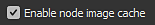

# Vue du graphe

Cette page présente le dock de Vue du graphe de Substance 3D Designer.

La vue du graphe est la fenêtre principale de [Substance 3D Designer](https://www.adobe.com/fr/products/substance3d-designer.html), dans laquelle vous pouvez créer et modifier vos graphes. La vue du graphe de données comporte deux zones principales : une barre d’outils en haut, offrant un accès rapide à certaines fonctions, et la zone de graphe réelle où les nœuds sont placés.

La vue du graphe est utilisée pour tous les types de graphes, mais diffère légèrement entre [graphes de Substance](../../compositing-graphs/substance-compositing-graphs.md), [graphes de fonction](../../function-graphs/function-graphs.md) et [graphes FX-Map](../../function-graphs/fxmaps/fxmaps.md), principalement dans la zone de la barre d&#39;outils.

## navigation par viewport

Le graphe peut être parcouru à l’aide des actions suivantes :

* <b>Panoramique :</b> Mo / Ctrl + RMB
* <b>Zoom :</b> MouseWheel / Alt + RMB

Utilisation d’un pavé tactile (macOS uniquement)

* <b>Panoramique :</b>Balayage à deux doigts
* <b>Zoom :</b> pincement à deux doigts / balayage à deux doigts tout en maintenant la touche Cmd enfoncée

>[!NOTE]
>
> Sens du zoom
> 
> Chacune des méthodes de zoom est inversée par rapport à l’autre :
> 
> * La molette de la souris *tire* vers le haut la vue du graphe
> * Alt + RMB et faites glisser *poussez* la vue du graphe vers le haut
> 
> Le sens du zoom peut être inversé dans les [Préférences](../../interface/preferences-window/preferences-window.md).

Vous <b>vous concentrez</b> sur le ou les nœuds sélectionnés, ou sur l&#39;ensemble du graphe si aucun nœud n&#39;est sélectionné, à l&#39;aide de la touche F.

La navigation peut également se faire à l&#39;aide des <b>épingles de navigation </b> et de la touche F2, voir [Éléments de graphe](#graph-items) ci-dessous[.](../../interface/the-graph-view/graph-items/graph-items.md)

## Déplacement d’objets

Cliquez sur LMB sur un objet (c&#39;est-à-dire un nœud ou un élément de graphe), puis maintenez et faites glisser le curseur pour <b>déplacer un nœud</b> sur le graphe. Si plusieurs objets sont sélectionnés, tous les objets sélectionnés sont déplacés en même temps que celui sous le curseur.

Si le curseur <b>atteint une bordure</b> de la Vue du graphe lors du déplacement d&#39;objets, la vue est balayée dans la direction du curseur. Notez que le panoramique est plus rapide lorsque le curseur s’éloigne de la bordure.\
Cela s’applique également au dessin de zones de sélection au-delà des bordures de Vue du graphe.

Par défaut, les objets sont <b>contraints sur la grille</b> lors de leur déplacement. Pour désactiver ce contraint, maintenez la touche Ctrl (Windows) / ⌘ (macOS) enfoncée pendant le déplacement des objets.

## Éléments du graphe

Plusieurs objets d’assistant sont disponibles pour vous aider à organiser et à naviguer dans le graphe, en particulier lorsqu’il se développe dans un réseau complexe de nœuds qui peuvent être difficiles à lire :

Les <b>nœuds point</b> vous permettent de réacheminer et de fusionner des connexions et peuvent être utilisés comme <b>portails</b> pour masquer les connexions longues ou complexes ;

<b>Cadre</b> vous aide à regrouper les nœuds avec un titre et un code couleur visibles ;

<b>Les commentaires</b> vous permettent de suivre l&#39;objectif d&#39;un nœud ou d&#39;un groupe de nœuds et de faire toute autre annotation utile ;

Les <b>épingles de navigation</b> permettent de passer rapidement aux points d&#39;intérêt du graphe.

>[!NOTE]
>
> En savoir plus dans la section [Éléments de Graphe](../../interface/the-graph-view/graph-items/graph-items.md) de cette documentation.

## menu contextuel du graphe

Lorsque vous cliquez sur RMB dans un espace vide du graphe, un menu contextuel s’affiche et peut inclure les options suivantes :

<b>Ajouter un nœud :</b> ouvrez le menu Nœud pour ajouter un nœud dans le graphe ;

<b>Ajouter un commentaire :</b> ajoutez un objet de graphe [Commentaire](../../interface/the-graph-view/graph-items/graph-items.md) sans lien de parenté ;

<b>Ajouter un cadre :</b> ajoutez un objet de graphe [Cadre](../../interface/the-graph-view/graph-items/graph-items.md) ;

<b>Ajouter une épingle :</b> ajoutez un objet de graphe [Épingle](../../interface/the-graph-view/graph-items/graph-items.md) ;

<b>Ajouter un nœud point :</b> Ajouter un nœud [point](../../interface/the-graph-view/graph-items/graph-items.md);

<b>Afficher les sorties en vue 3D :</b> attribuez toutes les sorties du graphe à un matériau dans la [vue 3D](../../interface/3d-view/3d-view.md) en faisant correspondre les utilisations, voir [Interaction avec la vue 3D](#interacting-with-the-3d-view) ci-dessous ;

<b>Réinitialiser et afficher les sorties en vue 3D :</b> réinitialisez un matériau dans la [vue 3D](../../interface/3d-view/3d-view.md) et affectez toutes les sorties du graphe à ce matériau en fonction des utilisations, voir [Interaction avec la vue 3D](#interacting-with-the-3d-view) ci-dessous ;

<b>Afficher la sortie dans Vue 2D :</b> affichez l&#39;une des sorties du graphe dans [Vue 2D](../../interface/2d-view/2d-view.md), voir [Interaction avec la Vue 2D](#interacting-with-the-2d-view) ci-dessous ;

<b>Calculer les miniatures des nœuds :</b> déclenchez le calcul de tous les nœuds du graphe, qui seront stockés dans le [cache d&#39;images](../../interface/preferences-window/preferences-window.md), et utilisez leur première sortie comme miniature ;

<b>Effacer les vignettes des nœuds :</b> effacez le [cache d&#39;image](../../interface/preferences-window/preferences-window.md) contenant le résultat de tous les nœuds du graphe, qui efface à son tour les vignettes du nœud ;

<b>Enregistrer le pack :</b> Enregistrez le pack contenant ce graphe ;

<b>Coller :</b> collez les nœuds actuellement copiés dans le Presse-papiers, y compris leurs connexions en amont, à l&#39;emplacement du curseur. Si le curseur ne se trouve pas dans le viewport de Vue du graphe, les nœuds sont placés au centre du viewport.

<b>Coller sans lien :</b> collez les nœuds actuellement copiés dans le Presse-papiers, à l&#39;exclusion de leurs connexions en amont, à l&#39;emplacement du curseur. Si le curseur ne se trouve pas dans le viewport de Vue du graphe, les nœuds sont placés au centre du viewport.

<b>Tout sélectionner :</b> sélectionnez tous les nœuds du graphe ;

<b>épingle précédente :</b> accédez à l&#39;objet [Épingle](../../interface/the-graph-view/graph-items/graph-items.md) précédent dans le graphe ;

<b>épingle suivante :</b> accédez à l&#39;objet [Épingle](../../interface/the-graph-view/graph-items/graph-items.md) suivant dans le graphe ;

<b>Copier la sélection :</b> copiez les nœuds, connexions et valeurs de paramètre sélectionnés dans le Presse-papiers ;

<b>Supprimer la sélection :</b> supprimez le ou les nœuds sélectionnés ;

<b>Supprimer et relier :</b> supprimez le ou les nœuds sélectionnés et remplacez-les par des connexions directes de leurs nœuds en amont à leurs nœuds en aval, si possible ;

<b>Dupliquer la sélection :</b> dupliquez le ou les nœuds sélectionnés dans le même graphe, y compris leurs connexions en amont, à l&#39;emplacement du curseur. Si le curseur ne se trouve pas dans le viewport de Vue du graphe, les nœuds sont placés au centre du viewport.

<b>Dupliquer la sélection sans lien :</b> dupliquez le(s) nœud(s) sélectionné(s) dans le même graphe, à l&#39;exclusion de leurs connexions en amont, à l&#39;emplacement du curseur. Si le curseur ne se trouve pas dans le viewport de Vue du graphe, les nœuds sont placés au centre du viewport.

<b>Sélectionner les nœuds en amont :</b> sélectionner tous les nœuds en amont du ou des nœuds sélectionnés ;

<b>Sélectionner les nœuds en aval :</b> sélectionner tous les nœuds en aval du ou des nœuds sélectionnés ;

<b>Permuter les liens\*:</b> permutez les connexions entre la paire de connecteurs d&#39;entrée et de sortie sélectionnée ;

<b>Désactiver le nœud/la sélection :</b> désactivez le ou les nœuds sélectionnés afin qu&#39;ils n&#39;aient aucun impact sur le résultat du flux, voir <b>Désactivation des nœuds</b> ci-dessous.

<b>\* :</b> disponible uniquement lorsque la sélection comprend deux liens ou trois nœuds dont deux sont connectés à des entrées du même troisième nœud.

## Utilisation des nœuds

Les graphes sont principalement des vaisseaux pour les nœuds qui peuvent assimiler, générer et modifier les données, puis les sortir comme résultat du graphe. L&#39;utilisation des nœuds implique les concepts et actions suivants.

### Création ET GESTION DES NOEUDS

Les nœuds peuvent être placés dans des graphes de 5 façons, quel que soit le type de graphe :

* Cliquer ou faire glisser depuis une icône de la barre d’outils des nœuds (voir ci-dessous). Seuls [Noeuds atomiques](../../compositing-graphs/nodes-reference-for-com/atomic-nodes/atomic-nodes.md) peuvent être placés de cette façon.
* Cliquez avec le bouton droit de la souris sur une zone vide du graphe, puis sélectionnez <b>Ajouter un nœud</b>. Seuls [Noeuds atomiques](../../compositing-graphs/nodes-reference-for-com/atomic-nodes/atomic-nodes.md) peuvent être placés de cette façon.
* Glissement d’une vignette de la vue Bibliothèque vers la vue du graphe. Cette méthode fonctionne pour[tous les types de nœuds, y compris les instances de nœuds](../../compositing-graphs/nodes-reference-for-com/node-library/node-library.md).
* Appuyez sur la <b>barre d&#39;espace</b> pour accéder au <b>menu Nœud</b>. Voir ci-dessous.
* Utilisation du raccourci clavier mappé à un nœud. Le mappage est effectué dans la [fenêtre Préférences](../../interface/preferences-window/preferences-window.md).

Si un nœud est placé alors qu’un autre nœud est sélectionné, Designer tente de connecter automatiquement le nouveau nœud à l’ancien.\
Cette connexion automatique place toujours le nouveau nœud *après* l&#39;ancien dans le flux.

La suppression des nœuds peut être effectuée de deux façons, selon la façon dont vous souhaitez qu’un lien perdu soit traité :

* Sélectionnez un nœud et appuyez sur Supprimer, ou cliquez avec le bouton droit et choisissez <b>Supprimer la sélection</b>. Toutes les connexions existantes sont rompues, ce qui risque d’entraîner des dysfonctionnements.
* Sélectionnez un nœud et appuyez sur Retour arrière, ou cliquez avec le bouton droit et choisissez <b>Supprimer et relier</b>. Cette opération tente de conserver les liens lorsque cela est possible, afin d’éviter toute fonctionnalité rompue.

<table>
<tr style="border: 0;">
<td width="100.00%" style="border: 0;" valign="top">

### Menu Nœud

Appuyez sur <b>Barre d&#39;espace</b> dans la Vue du graphe pour afficher le menu Nœud.

Ce menu permet d&#39;accéder à tous les nœuds de la [bibliothèque](../../interface/the-library/the-library.md) par le biais d&#39;une interface de recherche et permet à vos nœuds préférés de s&#39;afficher en haut de la liste.

Vous pouvez utiliser les touches fléchées pour parcourir les résultats de la recherche. Le répertorie les *boucles*, de sorte que l&#39;utilisation de la flèche Haut sur le premier élément passe au dernier élément.

La recherche est *floue*, ce qui signifie qu&#39;elle pardonne les petites différences dans le terme de recherche. Par exemple, « Couleur » ou « Couleur », « Normaliser » ou « Normaliser », etc.

Si un nœud *unique* est sélectionné dans le graphe ou si le menu Nœud est généré en faisant glisser un connecteur de nœud, les résultats de la recherche sont automatiquement *filtrés* en fonction du type de sortie.\
Par exemple, seuls les nœuds avec une [Entrée principale](../../compositing-graphs/inheritance-compositing/inheritance-in-substance-compositing-graphs.md) de type Niveaux de gris sont répertoriés pour une sortie de type Niveaux de gris.

</td>
<td width="33.33%" style="border: 0;" valign="top">

</td>
</tr>
</table>

### SÉLECTION DE NOEUDS

Vous pouvez sélectionner un ou plusieurs nœuds pour les copier, les supprimer, les déplacer sur le graphe, etc.

Pour sélectionner un nœud *unique*, placez le curseur sur le nœud et cliquez sur LMB.

Pour sélectionner *plusieurs* nœuds, les différentes méthodes sont disponibles :

* <b>Un par un :</b> maintenez la touche Ctrl enfoncée, puis cliquez sur LMB sur les nœuds. Les nœuds non sélectionnés sont *ajoutés* à la sélection, tandis que les nœuds sélectionnés sont *supprimés* de la sélection ;
* <b>Zone de sélection :</b> cliquez sur LMB sur un espace vide en graphe, *maintenez enfoncé, puis faites glisser* le curseur pour dessiner une zone de sélection. Les nœuds *au moins partiellement inclus* dans la zone sont sélectionnés lors de la libération de LMB ;
* <b>En amont :</b> cliquez sur RMB sur un nœud et sélectionnez l&#39;option <b>Sélectionner les nœuds en amont</b> : le nœud et tous les nœuds qui font partie de flux connectés aux *entrées* du nœud sont sélectionnés ;
* <b>En aval :</b> cliquez sur RMB sur un nœud et sélectionnez l&#39;option <b>Sélectionner des nœuds en aval</b> : le nœud et tous les nœuds qui font partie de flux connectés aux *sorties* du nœud sont sélectionnés.

### Menu contextuel du nœud

Lorsque vous cliquez sur RMB sur un nœud, un menu contextuel apparaît et peut inclure les options suivantes :

<b>Afficher la sortie dans Vue 2D :</b> affichez l&#39;une des sorties du nœud dans [Vue 2D](../../interface/2d-view/2d-view.md), voir [Interaction avec la Vue 2D](#interacting-with-the-2d-view) ci-dessous ;

<b>Afficher en vue 3D</b> : attribuez toutes les sorties du nœud à un matériau dans la [vue 3D](../../interface/3d-view/3d-view.md) en faisant correspondre les utilisations, voir [Interaction avec la vue 3D](#interacting-with-the-3d-view) ci-dessous ;

<b>Réinitialiser et afficher en vue 3D :</b> réinitialisez un matériau dans la [vue 3D](../../interface/3d-view/3d-view.md) et affectez toutes les sorties du nœud à ce matériau en faisant correspondre les utilisations, voir [Interaction avec la vue 3D](#interacting-with-the-3d-view) ci-dessous ;

<b>Afficher la sortie en vue 3D\* :</b> attribuez une sortie de nœud spécifique à un matériau dans la [vue 3D](../../interface/3d-view/3d-view.md) en faisant correspondre les utilisations ;

<b>Ajouter un commentaire :</b> créez un objet de graphe [Commentaire](../../interface/the-graph-view/graph-items/graph-items.md) et associez-le à ce nœud ;

<b>Ajouter un cadre :</b> créez un objet de graphe [Cadre](../../interface/the-graph-view/graph-items/graph-items.md) et ajustez-le au(x) nœud(s) sélectionné(s) ;

<b>Copier les informations dans le Presse-papiers :</b> copier l&#39;identifiant unique (UID) du nœud dans le Presse-papiers ;

<b>Paramètres d&#39;Expose :</b> affichez la boîte de dialogue [Exposer les paramètres de nœud](../../compositing-graphs/manage-parameters/exposing-a-parameter/exposing-a-parameter.md) pour ce nœud ;

<b>Créer\*:</b> créez des nœuds d&#39;entrée et/ou de sortie pour chacune des entrées et/ou sorties de ce nœud ;

<b>Ouvrir la référence\*:</b> Chargez le graphe [référencé par ce nœud](../../compositing-graphs/creating-compositing-gra/graph-instances-sub-gra/graph-instances-sub-graphs.md) en tant qu&#39;onglet de Vue du graphe séparé ;

<b>Ouvrir la référence dans le contexte\*\*:</b> Chargez le graphe [référencé par ce nœud](../../compositing-graphs/creating-compositing-gra/graph-instances-sub-gra/graph-instances-sub-graphs.md) dans le contexte du graphe actif, sous la forme d&#39;un chemin de navigation dans l&#39;onglet Vue du graphe de données existant ;

<b>Créer un graphe à partir de la sélection :</b> copiez le ou les nœuds sélectionnés dans un nouveau graphe ;

<b>Copier la sélection :</b> copiez les nœuds, connexions et valeurs de paramètre sélectionnés dans le Presse-papiers ;

<b>Supprimer la sélection :</b> supprimez le ou les nœuds sélectionnés ;

<b>Supprimer et relier :</b> supprimez le ou les nœuds sélectionnés et remplacez-les par des connexions directes de leurs nœuds en amont à leurs nœuds en aval, si possible ;

<b>Dupliquer la sélection :</b> dupliquez le ou les nœuds sélectionnés dans le même graphe, y compris leurs connexions en amont ;

<b>Dupliquer la sélection sans lien :</b> dupliquer le(s) nœud(s) sélectionné(s) dans le même graphe, à l&#39;exclusion de leurs connexions en amont ;

<b>Sélectionner les nœuds en amont :</b> sélectionner tous les nœuds en amont du ou des nœuds sélectionnés ;

<b>Sélectionner les nœuds en aval :</b> sélectionner tous les nœuds en aval du ou des nœuds sélectionnés ;

<b>Permuter les liens\*\*\* :</b> permutez les connexions entre la paire de connecteurs d’entrée et de sortie sélectionnée ;

<b>Désactiver le nœud/la sélection :</b> Désactivez le ou les nœuds sélectionnés afin qu&#39;ils n&#39;aient aucun impact sur le résultat du flux. Reportez-vous à la section <b>Désactivation des nœuds</b> ci-dessous.

<b>\*</b> : disponible uniquement pour les nœuds [instance de graphe](../../compositing-graphs/creating-compositing-gra/graph-instances-sub-gra/graph-instances-sub-graphs.md).\
<b>\*\* :</b> disponible uniquement pour les nœuds [instance de graphe](../../compositing-graphs/creating-compositing-gra/graph-instances-sub-gra/graph-instances-sub-graphs.md) et si l&#39;option <b>Activer l&#39;édition contextuelle</b> est cochée dans les [Préférences](../../interface/preferences-window/preferences-window.md).\
<b>\*\*\*:</b> disponible uniquement lorsque la sélection comprend deux liens ou trois nœuds dont deux sont connectés aux entrées du même troisième nœud.

>[!IMPORTANT]
>
> Si vous avez cliqué sur *RMB* lorsque le curseur est placé *sur un nœud*, plusieurs de ces options de menu contextuel cibleront *ce* nœud, que d&#39;autres nœuds soient actuellement *sélectionnés* dans le graphe ou non.
> 
> Par conséquent, pour un résultat prévisible de manière cohérente, il est recommandé de toujours placer le curseur sur le nœud qui fait partie de la sélection que vous souhaitez réellement cibler avec une action de menu contextuel.

### Nœuds de connexion

Le *connecteur de sortie* d&#39;un nœud A peut être connecté au *connecteur d&#39;entrée* d&#39;un autre nœud B. Le nœud B utilisera alors les données de sortie de A pour effectuer ses calculs.

>[!NOTE]
>
> Tous les connecteurs d&#39;un nœud ne doivent *pas* nécessairement être connectés. Le fait de laisser les connecteurs vides entraîne les conséquences suivantes :
> 
> * pour un connecteur *d&#39;entrée* : le nœud revient à une valeur par défaut définie pour cette entrée ;
> * pour un connecteur *de sortie* : les données sont ignorées et supprimées lors du calcul du graphe.

Vous pouvez <b>créer</b> un nouveau lien en cliquant sur LMB sur chacun de ces connecteurs, dans *n&#39;importe quel ordre*.\
En outre, si un nœud B est créé alors qu&#39;un nœud A est sélectionné, alors la *première sortie* du nœud A sera automatiquement connectée à l&#39;*entrée principale* du nœud B.

Les opérations suivantes peuvent être effectuées sur des liens *existants* :

<b>Supprimer :</b> supprimez les liens en cliquant sur le LMB du lien et en appuyant sur *Supprimer*<b>, </b> ou en maintenant la touche Alt enfoncée et en cliquant sur toute connexion comportant des liens. Alt-clic supprime tous les liens sur cette connexion ;

<b>Dupliquer :</b> dupliquez les liens en maintenant la touche Ctrl enfoncée, en cliquant sur le LMB d&#39;un connecteur et en faisant glisser le curseur. Cliquez sur LMB sur un autre connecteur pour connecter le lien ;

<b>Déplacer :</b> les liens peuvent être récupérés et déplacés d&#39;un connecteur à un autre en maintenant la touche Maj enfoncée, en cliquant sur le bouton gauche de la souris sur un connecteur et en faisant glisser le curseur. Cliquez sur LMB sur un autre connecteur pour connecter le lien.

### Désactivation des nœuds

>[!NOTE]
>
> Cela s&#39;applique uniquement aux [graphes de Substance](../../compositing-graphs/substance-compositing-graphs.md).

Les nœuds peuvent être désactivés pour qu&#39;ils n&#39;aient *aucun effet* dans le graphe, mais ils n&#39;ont pas besoin d&#39;être déconnectés ou supprimés.

Les nœuds désactivés ont le comportement suivant :

* Ils sont affichés avec le badge  <b>Désactivé</b>*,* a *contour en pointillés* et un lien interne *redirection* au lieu d’une vignette ;
* Les nœuds produiront les données reçues dans leur *entrée principale* ;
* Les nœuds désactivés peuvent être *enchaînés* ensemble ;
* Leurs propriétés et connexions ne sont *pas modifiées* ;
* Leur état désactivé est *enregistré* et persiste d&#39;une session à l&#39;autre ;
* Lors de la publication sur SBSAR, le fichier résultant *prend en compte* l&#39;état désactivé des nœuds, c&#39;est-à-dire que ce que vous voyez est ce que vous obtenez.

Vous pouvez désactiver un nœud ou un groupe de nœuds sélectionnés en utilisant la touche <b>Maj+D</b> ou en cliquant avec le bouton droit de la souris dans le graphe et en sélectionnant l&#39;élément <b>Désactiver le nœud/Désactiver la sélection</b> dans le menu contextuel.

>[!IMPORTANT]
>
> Seuls les nœuds qui répondent aux critères suivants peuvent être désactivés :
> 
> * Le nœud a au moins *une entrée*
> * Le nœud n&#39;a que *une sortie*
> * Les *types* de l&#39;entrée principale et de la sortie doivent *correspondre*, c&#39;est-à-dire niveaux de gris à niveaux de gris, couleur à couleur
> * Tous les nœuds sélectionnés doivent avoir le *même état*, c&#39;est-à-dire que tous doivent être activés, la même règle s&#39;applique pour leur activation

{width="512px"}

## Interaction avec la Vue 2D

>[!NOTE]
>
> Cela s&#39;applique uniquement aux [graphes de Substance](../../compositing-graphs/substance-compositing-graphs.md).

Pour afficher une sortie de nœud dans la [Vue 2D](../../interface/2d-view/2d-view.md), double-cliquez sur LMB sur un nœud ou cliquez sur RMB sur le nœud et sélectionnez l&#39;option [Afficher la sortie dans Vue 2D](#interacting-with-the-2d-view) dans le menu contextuel. Si le nœud a plusieurs sorties, sélectionnez la sortie souhaitée dans le sous-menu.

Vous pouvez afficher l&#39;une des sorties du graphe de la Vue 2D en cliquant sur le RMB dans une zone vide de la [Vue du graphe](https://substance3d.adobe.com/) et en sélectionnant l&#39;option [Afficher la sortie dans Vue 2D](#interacting-with-the-2d-view) dans le menu contextuel. Si le graphe comporte plusieurs sorties, sélectionnez la sortie souhaitée dans le sous-menu.

## Interaction avec la vue 3D

>[!NOTE]
>
> Cela s&#39;applique uniquement aux [graphes de Substance](../../compositing-graphs/substance-compositing-graphs.md).

Pour appliquer une sortie de nœud dans la [vue 3D](../../interface/3d-view/3d-view.md), cliquez sur RMB sur un nœud et sélectionnez l&#39;option <b>Afficher en vue 3D</b> dans le menu contextuel. Si le nœud a plusieurs sorties, sélectionnez la sortie souhaitée dans le sous-menu. Choisissez ensuite une couche cible du shader actuellement utilisé dans la vue 3D.

(*[graphe de Substance](../../compositing-graphs/substance-compositing-graphs.md) uniquement*) Vous pouvez appliquer toutes les sorties du graphe de la vue 3D en cliquant sur le RMB dans une zone vide de la Vue du graphe et en sélectionnant l&#39;option <b>Afficher les sorties en vue 3D</b> dans le menu contextuel. Assurez-vous qu&#39;un ou plusieurs nœuds de [sortie](../../compositing-graphs/nodes-reference-for-com/atomic-nodes/output/output.md) sont présents dans le graphe et qu&#39;il est [configuré correctement](../../compositing-graphs/nodes-reference-for-com/atomic-nodes/output/output.md).

## Barres d&#39;outils

>[!NOTE]
>
> La liste complète s&#39;applique uniquement aux [graphes de Substance](../../compositing-graphs/substance-compositing-graphs.md). D&#39;autres types de graphes disposent d&#39;un *ensemble restreint* de ces options.

### outils Graphe

La barre d’outils principale se trouve dans tous les types de graphe. Elle fournit des fonctions générales, ainsi que des options de visibilité des autres barres d’outils. Les fonctions suivantes sont disponibles :

 <b>Sélection du focus</b> (F)\
Focus sur la sélection ou sur la scène entière si la sélection est vide.

 <b>Réinitialiser le zoom</b> (Z)\
Ramenez le niveau de zoom actuel à son état par défaut et centrez la vue au milieu du graphe. Cela peut signifier effectuer un zoom avant ou arrière.

 <b>Vue du graphe d&#39;exportation\
</b>Exporte le graphe complet à une résolution 1:1 sous forme d’image. Utile pour partager une capture d’écran de l’ensemble de votre graphe.

 <b>Informations sur le nœud\
</b>*- Nom du connecteur d&#39;affichage :* Active/désactive l&#39;affichage du nom de chaque connecteur individuel sur un nœud.\
*- Afficher les badges de nœud :* bascule les badges de nœud sur tous les nœuds.\
*- Taille de nœud d&#39;affichage :* Active/désactive l&#39;affichage de la résolution de nœud ([graphe de Substance](../../compositing-graphs/substance-compositing-graphs.md) uniquement).\
*- Horaires d&#39;affichage :* Active/désactive l&#39;affichage des horaires en millisecondes pour chaque nœud ([graphe de Substance](../../compositing-graphs/substance-compositing-graphs.md) uniquement).\
*- Limiter la mise à l&#39;échelle du texte lors du zoom arrière :* conserve le texte de [éléments de graphe](../../interface/the-graph-view/graph-items/graph-items.md) à une taille d&#39;écran constante au-delà d&#39;un seuil de zoom, ce qui garde le texte clairement visible lors du zoom arrière.

Finder de nœuds <b></b> (Ctrl+F)\
Permet à un outil de rechercher des nœuds, des paramètres exposés et d’autres variables dans le graphe. En savoir plus sur la [page dédiée](../../interface/the-graph-view/node-finder/node-finder.md).

 <b>Flux de mise en surbrillance\
</b>Mettez en surbrillance tous les nœuds connectés avant ou après le nœud actuellement sélectionné. Cette option est idéale pour tracer un chemin complexe de nœuds.

 <b>Palette de noeuds\
</b>Affiche ou masque la barre d&#39;outils de nœud, voir ci-dessous.

 <b>Liens de rectangle\
</b>Basculer entre des liens de forme arrondie ou rectangulaire entre des nœuds. Non disponible pour [FX-Maps.](../../compositing-graphs/nodes-reference-for-com/atomic-nodes/fx-map/fx-map.md)

 <b>Outils d&#39;alignement des nœuds\
</b>Permet aux outils d&#39;organiser les nœuds sélectionnés dans le graphe. En savoir plus sur la [page dédiée](../../interface/the-graph-view/node-alignment-tools/node-alignment-tools.md).

Uniquement sur [graphes de Substance](../../compositing-graphs/substance-compositing-graphs.md) :

 <b>Taille parent\
</b>Active/désactive l’affichage des paramètres de contrôle de résolution du gabarit, voir ci-dessous.

 <b>Modes De Création De Lien</b> (1, 2, 3)\
Choisissez entre les modes de création de liens Standard (1), Matériau (2) et Matériau compact (3) pour lier les connecteurs de nœuds individuellement ou par lots. En savoir plus sur la [page dédiée](../../interface/the-graph-view/link-creation-modes/link-creation-modes.md).

 <b>Contrôle des durées\
</b>Vous permet de réinitialiser tous les nœuds et de réinitialiser tous les minutages.

 <b>Outils\
</b>*- Nettoyer :* supprime tous les nœuds qui font partie d&#39;un flux non connecté à un nœud [Sortie](../../compositing-graphs/nodes-reference-for-com/atomic-nodes/output/output.md).\
*- Sorties d&#39;exportation :* ouvre l&#39;[interface d&#39;exportation bitmap](../../compositing-graphs/exporting-bitmaps/exporting-bitmaps.md).\
*- Sorties de réexportation :* effectue à nouveau l&#39;opération d&#39;exportation précédente.\
*- Exporteur PSD :* ouvre l&#39;interface [Exporteur PSD](../../compositing-graphs/exporting-psd-files/exporting-psd-files.md).

 <b>Cache d&#39;image de nœud\
</b>Active/désactive l&#39;affichage du cache d&#39;image de nœud, voir ci-dessous.

 Supprimer les nœuds inutilisés\
</b>Affiche les options de suppression des nœuds inutilisés dans les graphes, voir ci-dessous.

### Palette de noeuds

La barre d’outils du nœud diffère selon le type de graphe :

 
<b>[graphes de Substance](../../compositing-graphs/substance-compositing-graphs.md):</b> voir [noeuds atomiques](../../compositing-graphs/nodes-reference-for-com/atomic-nodes/atomic-nodes.md) et [éléments de graphe](../../interface/the-graph-view/graph-items/graph-items.md).

 
<b>[graphes de fonction de Substance](../../function-graphs/function-graphs.md):</b> voir [éléments de graphe](../../interface/the-graph-view/graph-items/graph-items.md).

 
<b>[graphes FX-Map](../../compositing-graphs/nodes-reference-for-com/atomic-nodes/fx-map/fx-map.md):</b> voir [éléments de graphe](../../interface/the-graph-view/graph-items/graph-items.md).

### Taille du gabarit

Cette barre d&#39;outils n&#39;est disponible que dans les [graphes de Substance](../../compositing-graphs/substance-compositing-graphs.md) et définit la [taille de sortie](../../compositing-graphs/output-size/output-size.md) du *parent* du graphe, ce qui a un impact sur la taille de sortie du graphe s&#39;il utilise la *méthode d&#39;héritage Relatif au parent*[&#128279;](../../compositing-graphs/inheritance-compositing/inheritance-in-substance-compositing-graphs.md).

Les dimensions horizontale et verticale sont liées par défaut, mais peuvent être *dissociées* pour les textures non carrées. Les valeurs peuvent également être réinitialisées sur la valeur par défaut de 256 x 256.

### Cache d&#39;image de nœud

Cela permet d&#39;activer l&#39;utilisation du cache lors du calcul des nœuds dans les [graphes de Substance](../../compositing-graphs/substance-compositing-graphs.md).

Lorsqu&#39;un nœud est calculé, ses images de sortie sont stockées en mémoire, c&#39;est-à-dire en cache, de sorte qu&#39;elles peuvent être *réutilisées* lors du recalcul du graphe si ce nœud n&#39;est pas affecté par une modification. Cela signifie que seule la partie du graphe qui a été modifiée est recalculée.

La limite de stockage de mémoire de ce cache peut être modifiée dans la section <b>Général</b> des [Préférences](../../interface/preferences-window/preferences-window.md), sous la section <b>Mémoire</b>.

L’activation de cette option accroît considérablement la réactivité globale des calculs de graphe, au détriment d’une augmentation significative de l’utilisation de la mémoire de Designer.

### Supprimer les nœuds inutilisés

Lorsque vous effectuez une itération dans des graphes et que vous essayez des choses, certains nœuds qui n’ont aucun effet sur le résultat final peuvent être laissés de côté. Cela ajoute de l’encombrement et du gaspillage de calcul, car tous les nœuds sont évalués lors des premières étapes du rendu du graphe.

L&#39;outil  Supprimer les nœuds inutilisés</b> supprime tous les nœuds qui ne font *pas* partie d&#39;un flux qui *se termine par un nœud de sortie*. La seule exception concerne les nœuds *d&#39;entrée*, car leur suppression modifierait l&#39;interface de [instanciers](../../compositing-graphs/creating-compositing-gra/graph-instances-sub-gra/graph-instances-sub-graphs.md) référençant ce graphe.

La première option applique le nettoyage exclusivement au graphe *actuel*.

Si le graphe actif est un [graphe de Substance de données](../../compositing-graphs/substance-compositing-graphs.md), une deuxième option est activée, qui vous permet d&#39;*inclure toutes les fonctions de paramètre de nœud* dans le processus de nettoyage. Cela signifie que si un [graphe de fonction](../../function-graphs/function-graphs.md) contrôlant une valeur de paramètre de nœud comporte des nœuds inutilisés, ce graphe sera également nettoyé selon les mêmes règles.

Une fois le nettoyage terminé, une boîte de dialogue de rapport s’affiche. Vous trouverez plus de détails dans la <b>Console</b>, sous la forme de journaux balisés `GraphCleaner`. Ces journaux incluent le nombre de nœuds supprimés par fonction de graphe et de paramètre.

Le nettoyage peut être annulé sur tous les graphes affectés en tant qu&#39;action *unique*.
