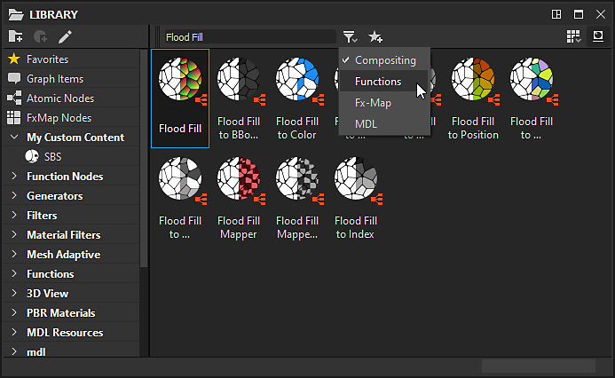

# La bibliothèque

Cette page présente le panneau **Bibliothèque** de Substance 3D Designer, sa mise en page ainsi que les outils qu&#39;il propose pour la recherche et le filtrage de contenu.

## Vue d’ensemble

Le panneau <b>Bibliothèque</b> est un *gestionnaire de ressources* à double affichage, où vous pouvez trouver et rassembler tous vos *actifs* avec lesquels vous devez travailler dans votre graphique.

Il surveille *les dossiers* sur votre disque dur ou sur un réseau qui sont ajoutés à la liste des [chemins de contrôle de bibliothèque](https://docs.substance3d.com/display/SDDOC/Project+Settings#ProjectSettings-proj-libraryLibrary) dans les [paramètres du projet](../../interface/preferences-window/project-settings/project-settings.md). Toute modification apportée à ces dossiers (ajout, suppression et mise à jour du contenu) est *reportée* sur la <b>bibliothèque</b>.

>[!WARNING]
>
> **À propos du contenu personnalisé**
> 
> Vos ressources personnalisées seront ajoutées à la **bibliothèque**, mais elles risquent de ne pas être visibles en raison des règles de filtrage définies pour les catégories existantes. Nous vous recommandons de créer vos propres filtres organisés en dossiers, pour vous assurer que votre contenu peut être trouvé de manière fiable lorsque vous travaillez sur vos projets.\
> Voir la section [Gestion du contenu et des filtres personnalisés](./managing-custom-content/managing-custom-content-and-filters.md) de la documentation pour plus d&#39;informations.

La **bibliothèque** peut surveiller toutes les ressources prises en charge par [Ressources](../../resources/resources.md) :

* Graphiques provenant de [packs de Substances](../../getting-started/overview/overview.md) (SBS) et de [archives de Substances](../../getting-started/overview/overview.md) (SBSAR)
* [Images bitmap](../../resources/bitmap-resource/bitmap-resource.md)
* [Images vectorielles](../../resources/vector-graphics-svg-res/vector-graphics-svg-resource.md)
* [Graphes fonctionnels](../../function-graphs/function-graphs.md)
* [Fichiers AxF](../../resources/axf-appearance-exchange/axf-appearance-exchange-format.md)
* [Polices](../../resources/font-resource/font-resource.md)
* [Scènes 3D](../../resources/3d-scene-resource/3d-scene-resource.md)

Le panneau est divisé en 2 parties principales :

* Section **Catégories** sur la gauche
* Section **Contenu** sur la droite

## Catégories

Située à gauche du panneau <b>Bibliothèque </b>, la section <b>Catégorie</b> contient toutes les ressources *catégories* (c’est-à-dire les dossiers) et *filtres*, sous forme d’arborescence.\
Vous pouvez cliquer sur n&#39;importe quel élément de cette arborescence pour afficher son contenu, ainsi que le contenu de *tous ses éléments enfants*.

### Les catégories

Les catégories et les filtres par défaut contiennent tous les fichiers livrés avec Designer. Ils ne peuvent pas être modifiés ou supprimés.\
Les catégories par défaut sont les suivantes :

* Favoris : rassemble tous les actifs que vous avez marqués comme « Favoris »
* [Éléments de graphique](../../interface/the-graph-view/graph-items/graph-items.md) : répertorie les objets spéciaux pour organiser les graphiques
* [Nœuds atomiques](../../compositing-graphs/nodes-reference-for-com/atomic-nodes/atomic-nodes.md) : répertorie les nœuds atomiques pour [graphiques de Substance](../../compositing-graphs/substance-compositing-graphs.md)
* [Nœuds FX-Map](../../function-graphs/fxmaps/fxmaps.md) : inclut les nœuds spécifiques aux graphiques calculés par les nœuds [FX-Map](../../compositing-graphs/nodes-reference-for-com/atomic-nodes/fx-map/fx-map.md)
* [Nœuds de fonction](../../function-graphs/nodes-reference-for-fun/atomic-function-nodes/atomic-function-nodes.md) : répertorie les nœuds atomiques pour [graphiques de fonction](../../function-graphs/function-graphs.md)
* [Générateurs de textures](../../compositing-graphs/nodes-reference-for-com/node-library/texture-generators/texture-generators.md) : contient des nœuds représentant [des graphiques de Substance](../../compositing-graphs/substance-compositing-graphs.md) qui génèrent du contenu de manière autonome
* [Filtres](../../compositing-graphs/nodes-reference-for-com/node-library/filters/filters.md) : contient des nœuds représentant [graphiques de Substance](../../compositing-graphs/substance-compositing-graphs.md) qui modifient une entrée
* [Outils Spline et tracés](../../compositing-graphs/nodes-reference-for-com/node-library/spline-paths-tools/spline-paths-tools.md) : catalogue des nœuds [Spline](../../compositing-graphs/nodes-reference-for-com/node-library/spline-paths-tools/spline-tools/spline-tools.md) et [Tracés](../../compositing-graphs/nodes-reference-for-com/node-library/spline-paths-tools/path-tools/path-tools.md)
* [Fonctions SDF](../../function-graphs/nodes-reference-for-fun/function-node-library/function-node-library.md#sdf-functions) : inclut des nœuds pour la création de Fonctions SDF 3D, à utiliser avec les nœuds [Shape splatter v2](../../compositing-graphs/nodes-reference-for-com/node-library/texture-generators/patterns/shape-splatter-v2/shape-splatter-v2.md) et [Visualiseur 3D](../../compositing-graphs/nodes-reference-for-com/node-library/filters/effects/3d-viewer/3d-viewer.md)
* [Fonctions](../../function-graphs/nodes-reference-for-fun/function-node-library/function-node-library.md) : inclut les nœuds représentant [graphiques de fonction](../../function-graphs/the-function-graph/the-function-graph.md)
* [Vue 3D](../3d-view/3d-view.md) : offre du contenu lié aux cartes utilisées pour l’éclairage basé sur l’image dans une scène 3D, comme dans la [Vue 3D](../../interface/3d-view/3d-view.md), telles que les cartes d’environnement et les nœuds pour la création de cartes d’environnement
* Matériaux PBR : matériaux prédéfinis qui peuvent être utilisés comme balises d’emplacement pour tester d’autres nœuds, des « recettes » ou une configuration d’espace de travail personnalisée. Pour en savoir plus sur la création de matériaux, nous vous recommandons de consulter nos [échantillons de matériaux](../../compositing-graphs/creating-compositing-gra/material-samples/material-samples.md) dédiés.
* [Valeurs](../../compositing-graphs/nodes-reference-for-com/node-library/values/constant.md) : nœuds pour la génération de valeurs simples dans les graphiques de Substance.

## Contenu

Le contenu de la <b>bibliothèque</b> s&#39;affiche sous la forme de *vignettes étiquetées*. Ces vignettes auront un aspect différent en fonction des facteurs suivants :

* Les [graphiques de Substance](../../compositing-graphs/substance-compositing-graphs.md) dans les fichiers [SBS](../../getting-started/overview/overview.md) et [SBSAR](../../getting-started/overview/overview.md) sont représentés par leur *première sortie* ou par leur *icône personnalisée* si celle-ci a été définie par l&#39;auteur du graphique
* Les [bitmaps](../../resources/bitmap-resource/bitmap-resource.md) et les [images vectorielles (SVG)](../../resources/vector-graphics-svg-res/vector-graphics-svg-resource.md) sont représentées par un *rendu miniature* du bitmap lui-même
* Les [scènes 3D](../../resources/3d-scene-resource/3d-scene-resource.md), les [graphiques de fonction](../../function-graphs/the-function-graph/the-function-graph.md), les [polices](../../resources/font-resource/font-resource.md) et les fichiers [AxF](../../resources/axf-appearance-exchange/axf-appearance-exchange-format.md) sont représentés par des *icônes génériques* pour chaque type

>[!WARNING]
>
> **En cas de problèmes de vignettes**
> 
> Notre étape de dépannage recommandée pour tout problème lié aux vignettes de la bibliothèque (image incorrecte, rendu bloqué sur l’icône d’actualisation, etc.) doit déclencher manuellement une *actualisation des vignettes*.\
> Pour ce faire, utilisez le bouton **Reconstruire les vignettes** dans la section [Bibliothèque](../../interface/preferences-window/preferences-window.md) de la [fenêtre Préférences](../../interface/preferences-window/preferences-window.md).

<table>
<tr style="border: 0;">
<td width="100.00%" style="border: 0;" valign="top">

### Utilisation d’une ressource de la bibliothèque

Pour utiliser une ressource de la bibliothèque, *faites-la glisser* vers l&#39;emplacement souhaité.\
Vous pouvez sélectionner *plusieurs* éléments dans la section <b>Contenu</b> en maintenant la touche <b>Ctrl</b> enfoncée tout en cliquant sur les éléments. Dans ce cas, l&#39;opération de glisser-déposer placera des nœuds dans le graphique pour l&#39;*ensemble de la sélection*.

</td>
<td width="41.67%" style="border: 0;" valign="top">

</td>
</tr>
</table>

### Recherche d’une ressource par nom

La barre de <b>recherche</b>, située en haut à gauche de la section <b>Contenu</b>, vous permet de rechercher *n’importe quelle ressource par nom*. Lors de la recherche de contenu de cette manière, la sélection actuelle dans la section <b>Catégories</b> est ignorée et la *totalité du contenu* dans la <b>bibliothèque</b> est recherchée.\
Vous pouvez filtrer les résultats de la recherche par *type de graphique*, à l&#39;aide de l&#39;icône  <b>Filtrer par...</b> située en regard de la barre <b>Rechercher</b>.

>[!NOTE]
>
> La barre de recherche tient compte du nom de l&#39;actif que vous recherchez, mais également des *balises* que l&#39;actif peut contenir ou de la *catégorie* à laquelle il appartient.\
> Par exemple, la saisie de « *Normal* » répertorie tous les actifs qui peuvent être utilisés pour générer ou modifier un mappage normal. C&#39;est un bon moyen de découvrir de nouveaux nœuds, et donc de nouvelles possibilités !

<table>
<tr style="border: 0;">
<td width="100.00%" style="border: 0;" valign="top">

### Visualisation des ressources de la bibliothèque

En utilisant le bouton déroulant  <b>Mode d&#39;affichage</b>, vous pouvez sélectionner la taille d&#39;affichage des éléments de contenu.

</td>
<td width="25.00%" style="border: 0;" valign="top">

</td>
</tr>
</table>

<table>
<tr style="border: 0;">
<td style="border: 0;" valign="top">

Le bouton  **Activer/Désactiver les étiquettes** vous permet d&#39;afficher ou de masquer les étiquettes des nœuds.

</td>
<td style="border: 0;" valign="top">

</td>
</tr>
</table>

<table>
<tr style="border: 0;">
<td style="border: 0;" valign="top">

Lorsque vous placez le curseur sur un élément de contenu, une info-bulle s&#39;affiche après un court instant pour afficher une *description* de l&#39;élément si son auteur en a fourni une.\
*Cliquez avec le bouton droit* sur l&#39;élément pour afficher des informations supplémentaires, notamment le chemin d&#39;accès au fichier source de cet élément.

</td>
<td style="border: 0;" valign="top">

</td>
</tr>
</table>

>[!NOTE]
>
> Pour les [nœuds d&#39;instance](../../compositing-graphs/creating-compositing-gra/graph-instances-sub-gra/graph-instances-sub-graphs.md), c&#39;est-à-dire les nœuds non atomiques, ce chemin est un *hyperlien* qui affichera le fichier dans l&#39;explorateur de fichiers du système.\
> Les nœuds atomiques utilisent un chemin alias spécial (par exemple, `graphatomic://`, `structure://`, ...) sur lequel vous ne pouvez pas cliquer, car il pointe vers une bibliothèque interne.

<table>
<tr style="border: 0;">
<td style="border: 0;" valign="top">

### Favoris

Vous pouvez ajouter n&#39;importe quel élément de la section <b>Contenu</b> à votre liste <b>Favoris</b> à l&#39;aide du bouton  <b>Ajouter aux favoris</b>. Le bouton vous permet également de *supprimer* du contenu de cette liste s&#39;il a déjà été ajouté.\
Lorsque du contenu est ajouté à cette liste, il est disponible dans la catégorie <b>Favoris</b> de la <b>Bibliothèque</b> et s&#39;affiche dans le *haut* de la liste de menus <b>Nœud</b> lors de la recherche d&#39;un nœud dans le graphique, à condition que les termes de recherche y correspondent.

</td>
<td style="border: 0;" valign="top">

</td>
</tr>
</table>
