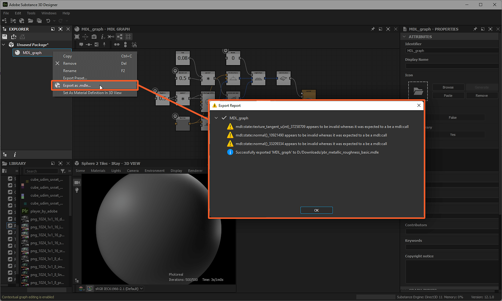

# Exportation de contenu MDL

Cette page décrit les processus d&#39;exportation liés aux [graphiques MDL](../../mdl-graphs/mdl-graphs.md) et aux matières dans Substance 3D Designer.

## Vue d’ensemble

Une fois qu&#39;un matériau MDL est créé dans Designer, il doit être exporté dans un format qui peut *porter la définition du matériau* et être lu par les moteurs de rendu qui prennent en charge MDL. MDL utilise des formats propriétaires pour transporter les définitions de matériau, appelées modules MDL, écrites et conditionnées dans différents formats qui peuvent tous être exportés depuis Designer.

>[!NOTE]
>
> Tous ces formats peuvent être ouverts directement avec un *éditeur de texte*, parfois après avoir été déballés avec un gestionnaire d&#39;archives, pour inspecter la définition de matériau qu&#39;ils contiennent.

## Module MDL (\*.mdl)

Il s&#39;agit du format de fichier d&#39;exchange fondamental pour les définitions de matériaux. Un module MDL définit les éléments suivants :

* caractéristiques et comportement du matériau
* ses paramètres exposés et ses valeurs par défaut
* ses annotations (c’est-à-dire les métadonnées) : auteur, balises, catégories, ...

L&#39;exportation d&#39;un module MDL s&#39;effectue au niveau du *pack*. Pour exporter un module MDL pour un package donné, cliquez sur le bouton  <b>Exporter le module MDL</b> dans l&#39;[Explorateur](https://helpx.adobe.com/substance-3d/unlisted/documentation/sddoc/the-explorer-129368147.html) ou sélectionnez la même option dans le menu contextuel *du* package. Sélectionnez un emplacement et un nom cible pour le module MDL exporté, et la boîte de dialogue <b>Rapport d&#39;exportation</b> s&#39;affiche avec la liste des messages consignés pendant le processus d&#39;exportation.

Le module exporté contiendra les définitions de *tous* les matériaux MDL définis par un [graphique MDL](../../mdl-graphs/mdl-graphs.md) dans le package.

>[!NOTE]
>
> En savoir plus sur les modules MDL dans les sections 4 et 15 de la [spécification MDL](https://developer.download.nvidia.com/designworks/mdl-sdk/secure/MDL_spec_1.6.1_16Dec2019.pdf?__token__=exp=1776166178~hmac=38656bc9d8199764568d1fa0d4d945b90c57638ebd37b100a402bdc983e518ee&t=eyJscyI6ImdzZW8iLCJsc2QiOiJodHRwczovL3d3dy5nb29nbGUuY29tLyJ9) de NVIDIA.

>[!NOTE]
>
> Avertissements suivant ce modèle : `x appears to be invalid whereas it was expected to be an mdl::call` sont provoqués par la façon dont les matériaux MDL sont traités dans les graphiques MDL et peuvent *être ignorés* en toute sécurité.

*Les chemins d&#39;accès « Exporter le module MDL » dans l&#39;Explorateur et la boîte de dialogue Rapport d&#39;exportation qui en résulte*

### Paramètre prédéfini MDL (\*.mdl)

Un paramètre prédéfini de module MDL est en grande partie identique au module sur lequel il est basé, la seule différence étant qu&#39;il porte un ensemble différent de valeurs par défaut. Pour en savoir plus, [cliquez ici](https://www.migenius.com/doc/realityserver/latest/resources/general/iray/api_reference/iray/html/classmi_1_1neuraylib_1_1IMdl__factory.html#details).

Un paramètre prédéfini pour un matériau MDL attribué à un matériau de scène `my_material` peut être exporté à partir des emplacements suivants :

* Le panneau [Explorateur](https://helpx.adobe.com/substance-3d/unlisted/documentation/sddoc/the-explorer-129368147.html), en cliquant sur <b>RMB</b> sur la ressource graphique MDL et en sélectionnant l&#39;option <b>Exporter le paramètre prédéfini...</b> dans le menu contextuel
* Le panneau [Vue 3D](../../interface/3d-view/3d-view.md), à l’aide de l’option de menu <b>Matières > mon\_matériau > Préréglage d’exportation...</b>

L&#39;option de menu ouvre la boîte de dialogue <b>Exporter le paramètre prédéfini de matière MDL</b>, qui propose les options suivantes :

* <b>Répertoire</b> : emplacement cible vers lequel le module MDL est exporté
* <b>Nom du fichier MDL</b> : nom du module MDL
* <b>Incorporer les modules MDL importés</b> : si le module MDL repose sur des modules importés, c&#39;est-à-dire qu&#39;il comporte des dépendances de module, la sélection de cette option entraîne l&#39;intégration *des dépendances de module* dans le module MDL exporté, ce qui le rend effectivement *autonome* au détriment de la taille du fichier et de l&#39;héritage dynamique

Le préréglage exporté utilisera les *valeurs actuelles* des paramètres du matériau dans la vue 3D en tant que *nouvelles valeurs par défaut*. Ces valeurs peuvent être modifiées à l&#39;aide de l&#39;option <b>Matières > mon\_matériau > Modifier</b>, qui affichera les paramètres exposés du matériau dans le panneau [Propriétés](https://helpx.adobe.com/substance-3d/unlisted/documentation/sddoc/parameters-ui-129368153.html).

>[!WARNING]
>
> Lors de l&#39;exportation d&#39;un module MDL à partir du panneau [Explorateur](https://helpx.adobe.com/substance-3d/unlisted/documentation/sddoc/the-explorer-129368147.html), un module MDL contient *tous* les matériaux MDL définis par un graphique MDL dans le package. L&#39;exportation d&#39;un paramètre prédéfini MDL à partir de la [vue 3D](../../interface/3d-view/3d-view.md) entraîne un module MDL contenant *uniquement* la définition des matériaux MDL appliqués au *matériau sélectionné* dans le menu - `my_material` dans cet exemple.

*Chemin du paramètre prédéfini « Exporter » dans la vue 3D et boîte de dialogue du paramètre prédéfini Exporter la matière MDL qui en résulte*

## Archive du module MDL (\*.mdr)

Une archive de module MDL combine des modules MDL (voir ci-dessus) avec des ressources telles que des *textures* et des fichiers Lisez-moi dans un *fichier transportable unique*.

L&#39;exportation d&#39;une archive de module MDL s&#39;effectue au niveau du *package*. Pour exporter une archive de module MDL pour un package donné, cliquez sur le bouton  <b>Exporter l&#39;archive de module MDL</b> dans l&#39;[Explorateur](https://helpx.adobe.com/substance-3d/unlisted/documentation/sddoc/the-explorer-129368147.html) ou sélectionnez la même option dans le menu contextuel du *package*. Sélectionnez un emplacement cible et un nom pour l&#39;archive du module MDL exportée, et la boîte de dialogue <b>Rapport d&#39;exportation</b> s&#39;affiche avec la liste des messages consignés pendant le processus d&#39;exportation.

L&#39;archive de module exportée contient le module MDL contenant les définitions de *tous* les matériaux MDL définis par un [graphique MDL](../../mdl-graphs/mdl-graphs.md) dans le package. Si un graphique [de Substance](../../compositing-graphs/substance-compositing-graphs.md) est [instancié dans un graphique MDL](../../mdl-graphs/compositing-graphs-and/substance-compositing-graphs-and-mdl-materials.md) et connecté à un flux allant au nœud [racine](../../mdl-graphs/main-mdl-graph-concepts/main-mdl-graph-concepts.md), les textures qu&#39;il génère sont *enregistrées dans l&#39;archive*.

Outre ces éléments, l&#39;archive comprend un fichier <b>MANIFEST</b> qui décrit les métadonnées suivantes pour l&#39;archive du module MDL :

* `mdl` : version de MDL utilisée pour exporter l&#39;archive de module, par exemple, « 1.5 »
* `version` : la version de l&#39;archive de module, par exemple, « 1.0.0 »
* `module` : nom de l&#39;archive de module, par exemple,  »::pbr\_metallic\_roughness\_basic »
* `exports.material` : nom des matériaux définis dans l&#39;archive de module, par exemple,  »::pbr\_metallic\_roughness\_basic::MDL\_graph »

>[!NOTE]
>
> En savoir plus sur le format de fichier d&#39;archive MDL dans l&#39;annexe C de la [spécification MDL](https://developer.download.nvidia.com/designworks/mdl-sdk/secure/MDL_spec_1.6.1_16Dec2019.pdf?__token__=exp=1776166178~hmac=38656bc9d8199764568d1fa0d4d945b90c57638ebd37b100a402bdc983e518ee&t=eyJscyI6ImdzZW8iLCJsc2QiOiJodHRwczovL3d3dy5nb29nbGUuY29tLyJ9) de NVIDIA.

*Les chemins d&#39;accès « Exporter l&#39;archive du module MDL » dans l&#39;Explorateur et la boîte de dialogue Rapport d&#39;exportation qui en résulte*

## Module encapsulé MDL (\*.mdle)

Les graphiques MDL avec des paramètres exposés peuvent être exportés sous forme de matériaux MDL encapsulés. L&#39;encapsulation *enveloppe les données* dans une classe dédiée de sorte que les données *ne soient pas accessibles directement*.

Par exemple, alors que vous pouvez toujours modifier les valeurs des paramètres exposés pour contrôler le comportement d&#39;un matériau, la *définition* de ces paramètres n&#39;est *pas disponible* dans un module MDL encapsulé.

L&#39;exportation d&#39;un module MDL encapsulé s&#39;effectue dans l&#39;[Explorateur](https://helpx.adobe.com/substance-3d/unlisted/documentation/sddoc/the-explorer-129368147.html) au niveau du graphique MDL, en sélectionnant l&#39;option <b>Exporter en tant que .mdle</b> dans le menu contextuel d&#39;un graphique MDL. Sélectionnez un emplacement cible et un nom pour le module encapsulé MDL exporté, et la boîte de dialogue <b>Rapport d&#39;exportation</b> s&#39;affiche avec la liste des messages consignés pendant le processus d&#39;exportation.

*Seule* la définition de matériau pour le *graphique MDL sélectionné* sera incluse dans le module MDL encapsulé exporté.

>[!NOTE]
>
> En savoir plus sur les définitions de matériaux encapsulés dans la section 13.5 de la [spécification MDL](https://developer.download.nvidia.com/designworks/mdl-sdk/secure/MDL_spec_1.6.1_16Dec2019.pdf?__token__=exp=1776166178~hmac=38656bc9d8199764568d1fa0d4d945b90c57638ebd37b100a402bdc983e518ee&t=eyJscyI6ImdzZW8iLCJsc2QiOiJodHRwczovL3d3dy5nb29nbGUuY29tLyJ9) de NVIDIA et de l&#39;[API SDK MDL](https://raytracing-docs.nvidia.com/mdl/api/mi_neuray_example_mdle.html).

*Chemin d&#39;accès « Exporter en tant que milieu » dans l&#39;Explorateur et boîte de dialogue Rapport d&#39;exportation obtenue*
