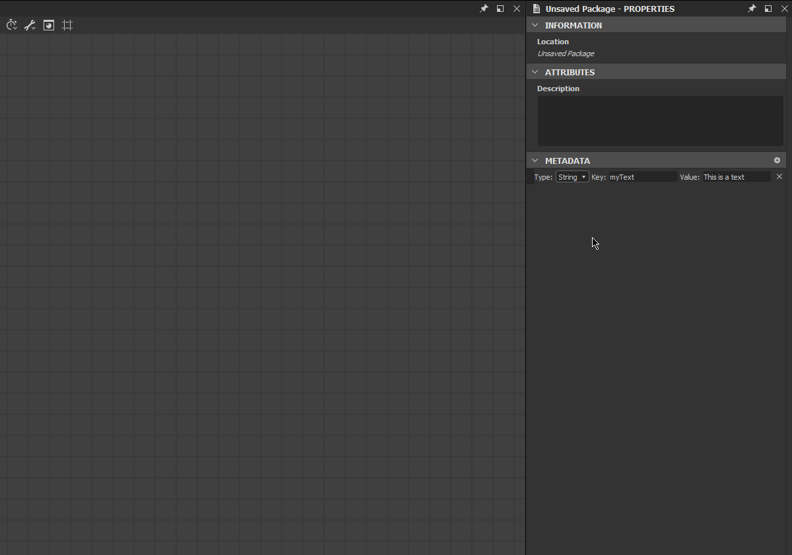

# Métadonnées du package

Les métadonnées de package sont un dictionnaire de valeurs de texte (chaînes) définies au niveau du package. Il est inclus dans le SBSAR lors de la publication, et il s&#39;agit d&#39;un stockage à usage général destiné à être utilisé par le script python.

## Affichage et modification des métadonnées via l’interface Designer

Si vous développez un plug-in Python, vous pouvez modifier les métadonnées manuellement à des fins de test et de débogage. Voici comment procéder :

1. Si vous double-cliquez sur un pack dans l’explorateur, le panneau Propriétés s’ouvre sur ce pack.

   
1. Ici, vous avez une section dédiée « Métadonnées ». Il est probablement vide dans votre cas, comme dans la capture ci-dessus.

   Vous pouvez ajouter de nouvelles métadonnées en utilisant le bouton « plus ».

   
1. Un nouvel élément apparaît dans la section :

   
1. Il existe un champ « Clé » et un champ « Valeur ». Les deux peuvent être réglés sur tout ce qui convient à vos besoins. Le champ « Clé » doit avoir une valeur unique dans la liste.

   
1. Vous pouvez également choisir le « Type » de l’élément. Pour le moment, il peut s’agir de « String » ou « URL » :

   
1. Ici, le terme « URL » désigne une référence à une ressource incluse dans le package. Pour ce faire, sélectionnez un fichier sur votre disque dur, puis faites-le glisser sur le pack dans l’Explorateur. Il peut s’agir d’une ressource ordinaire, comme une image, ou de tout autre fichier, comme un fichier texte.

   
1. Le fichier apparaît comme une nouvelle ressource dans le package.

   Revenez maintenant au panneau Propriétés du package, créez une nouvelle métadonnée, attribuez-lui une clé appropriée et choisissez « URL » comme type. Sélectionnez ensuite le symbole « ... ». dans le champ « Valeur », et choisissez « De la ressource ». Enfin, choisissez le fichier que vous avez inclus juste avant et validez :

   
1. Vous pouvez maintenant voir que l&#39;URL de la ressource est stockée dans le champ Valeur.

   Vous pouvez également supprimer les métadonnées à l’aide du bouton « X » situé à droite de l’élément :

   

>[!NOTE]
>
> Le déplacement ou la réorganisation des entrées de métadonnées est désactivé : l’ordre n’est pas significatif et ne sera pas conservé lors de la publication du package.

## Métadonnées dans les fichiers SBSAR publiés

Dans certains cas, vous pouvez récupérer les métadonnées que vous avez définies sur un package dans le SBSAR publié correspondant. Vous trouverez ci-dessous la manière dont les métadonnées sont transformées et stockées dans l&#39;archive, ainsi que la manière appropriée de les exploiter.

Les métadonnées sont stockées au format JSON dans un fichier nommé /assemblies/content/0000/metadata.json (le chemin est relatif à la racine de l’archive .sbsar).

Les métadonnées normales (chaîne) sont stockées telles quelles, par exemple « key » : « stringValue », une par ligne. Là encore, l&#39;ordre d&#39;origine des différentes clés n&#39;est pas conservé et sa mise en œuvre est définie. Ne vous fiez jamais à l&#39;ordre dans votre processus, comme avec les dicts Python réguliers !

Comme le but des métadonnées d&#39;URL est de permettre aux utilisateurs et aux plug-ins d&#39;inclure des fichiers étrangers dans l&#39;archive .sbsar, ils sont soumis à une transformation spécifique : Tout d&#39;abord, le fichier de la ressource correspondant à l&#39;URL stockée est copié dans l&#39;archive dans un emplacement défini par l&#39;implémentation (généralement dans un sous-dossier numéroté, qui contiendra uniquement ce fichier. Il s’agit d’éviter tout conflit de nom.) Le fichier conserve son nom d’origine (le nom de la ressource est ignoré à ce stade). Ainsi, au lieu de l’URL d’origine dans metadata.json, le chemin d’accès au fichier copié dans l’archive relatif à metadata.json est écrit.

Si nous exportons l’exemple de pack créé dans la section précédente (après avoir créé au moins un graphique avec certaines sorties), nous obtenons ce contenu d’archive :

```
myPackage.sbsar

|-- assemblies

        |-- content

            |-- 0000

                |-- New_Graph.sbsasm

                |-- New_Graph.xml

                |-- metadata.json

                |-- resources

                    |-- 0

                        |-- TEXT.txt
```


Et le contenu metadata.json est :

```
{

    "myResource": "resources/0/TEXT.txt",

    "myText": "This is a text"

}
```


À l&#39;heure actuelle, aucun outil spécifique n&#39;est fourni pour accéder aux métadonnées et aux ressources stockées dans l&#39;archive. La méthode recommandée est d’ouvrir l’archive avec le décodeur LZMA de votre choix et d’analyser le fichier metadata.json avec un analyseur JSON standard (si les clés ou les chaînes de valeurs contiennent des caractères fantaisie, ils seront échappés de la manière JSON).

>[!NOTE]
>
> Il ne reste aucune information sur le fait que chaque métadonnée soit une simple chaîne ou une URL, donc vous devez savoir ce que chaque clé que vous voulez lire est censée signifier.
