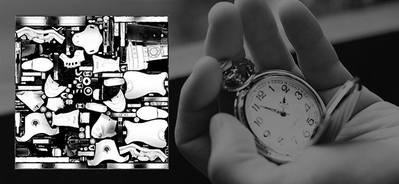

# Version 2019.1 (9.1)

**Substance Designer 2019.1** apporte une nouvelle mise à jour à la Substance Engine pour étendre davantage ses capacités, ainsi que de nouveaux filtres supplémentaires.

## Principales fonctionnalités

### Nouveau nœud de Processeur de valeurs

La Substance Engine est maintenant à la version 7 et apporte le nouveau concept de « valeurs » dans le graphe de la composition. Les valeurs sont des nombres et non des textures. Elles peuvent donc être utilisées pour effectuer divers calculs qui peuvent être partagés entre les nœuds via les graphes de fonction et les graphes de composition. Le nœud de Processeur de valeurs peut lire une image d&#39;entrée et calculer une valeur de sortie unique.

Le nœud de Processeur de valeurs n&#39;est pas le seul à pouvoir transmettre des informations à travers le graphe. Quelques modifications et ajouts ont été effectués :

* Les nœuds de sortie peuvent être directement alimentés avec une valeur et non plus nécessairement une image.

  
* Un nouveau **Noeud d&#39;entrée** nommé « Valeur d&#39;entrée » a été ajouté afin que le graphe puisse interroger les valeurs.

  
* Les nœuds disposent désormais d&#39;une nouvelle catégorie sous leurs paramètres nommée « Valeurs d&#39;entrée » qui peut être utilisée pour créer des valeurs d&#39;entrée pour le nœud lui-même.\
  Les valeurs d&#39;entrée peuvent alors être référencées à l&#39;intérieur du graphe de fonction via les nœuds « Get ».

  

>[!NOTE]
>
> Comme pour toute modification majeure de la Substance Engine, le mode de compatibilité est défini sur la version précédente (nouvelle version 6 par défaut). Cela signifie que les nœuds incompatibles auront une bordure jaune dans le graphe. Pour désactiver/masquer la bordure jaune, il suffit de modifier la version du moteur dans les paramètres principaux vers la dernière version (via les paramètres du projet) :
> 
> 

### Prise en charge d’Optix dans les Bakers

La dernière mise à jour de Substance Designer a introduit DXR qui permet d&#39;effectuer des GPU raytracings sur du matériel compatible RTX. Nous avons ajouté la prise en charge de [Optix](https://developer.nvidia.com/optix), qui permet de lancer de rayon sur d&#39;autres GPU Nvidia même sous Linux. Vous pouvez espérer baker au moins **5 fois plus vite** lorsque vous utilisez Optix qu’avec un raytracing CPU normal.

Voici la liste des Bakers concernés par cette modification :

* Ambient occlusion du Maillage
* Bents normals du Maillage
* Thickness du Maillage

Si vous souhaitez désactiver l&#39;un des deux backends, accédez aux préférences principales (**Modifier > Préférences**) et aux paramètres de Bakers :

>[!NOTE]
>
> Pour accéder à la fonctionnalité, assurez-vous de **mettre à jour vers les pilotes suivants** :
> 
> * GPU Nvidia 10XX et 20XX : **pilotes 430.39** (compatibles à la fois avec DXR et Optix)
> * Nvidia 9XX et versions antérieures : **d** **drivers 419.67 or 430.39** (les pilotes 425.31 ont un problème avec Optix)
> 
> Notez que DXR est également disponible sur les [GPU GeForce GTX 10xx](https://www.nvidia.com/en-us/geforce/news/geforce-gtx-dxr-ray-tracing-available-now/) (avec pilotes à jour). DXR exige également que Windows soit à jour pour fonctionner. Pour plus d&#39;informations, consultez [cette page](../../../best-practices/performance-optimization/performance-optimization-guidelines.md).

### Amélioration des temps de chargement des Maillages OBJ

Dans cette version, nous avons amélioré notre lecteur de fichiers **obj** afin de réduire le temps de chargement des Maillages 3D. Les temps de chargement ont été jusqu’à 3 fois plus rapides, en particulier pour les maillages qui n’ont pas de valeurs UV et de valeurs normales définies.

Cette amélioration des performances affectera à la fois les Bakers et la vue 3D.

### Système De Plug-In Python Amélioré

Avec cette mise à jour, nous avons ajouté de nombreuses nouvelles fonctionnalités au système de script :

* **Prise en charge de Qt** : permet de créer une interface utilisateur personnalisée qui suit le même style que le reste de l&#39;application. L’interface utilisateur personnalisée peut également être intégrée beaucoup plus facilement à ce nouveau système. (Le minuteur est désormais obsolète.)
* **Fonctions de rappel** : il est désormais possible d&#39;enregistrer des fonctions de rappel. Pour le moment, cela inclut seulement l&#39;ouverture et l&#39;enregistrement de fichiers ainsi que la création d&#39;éléments d&#39;interface utilisateur. D’autres rappels seront ajoutés ultérieurement.
* **Threading** : les plug-ins peuvent désormais créer des threads pour effectuer un traitement en arrière-plan ou attendre des événements du système d&#39;exploitation (tels que des connexions réseau).

Pour plus de détails, consultez le journal des modifications de l&#39;API accessible via l&#39;entrée de menu **Aide > Documentation de l&#39;API Python** dans la Substance Designer.

### Nouveau contenu

Nous avons également quelques nouveaux nœuds disponibles dans la bibliothèque par défaut, dont certains sont désormais alimentés par le nouveau nœud de Processeur de valeurs :

* **Flood Fill À L&#39;Index**\
  Attribue un index unique aux formes à partir d’un nœud de Flood Fill.\
  Dans l’exemple ci-dessous, le nœud Processeur de pixels fait correspondre l’entrée de valeur à la forme et crée un masque.

  
* **Non Uniform Directional Warp**\
  Applique une Déformation directionnelle où l’intensité et l’angle sont échantillonnés à partir des entrées d’image.

  
* **Déformation directionnelle multiple**\
  Déforme l’image d&#39;entrée plusieurs fois dans différentes directions.

  
* **Height Extrude**\
  Génère un rendu 3D orthographique de l’Height donné. La vue caméra peut être contrôlée à l’aide de l’objet Position.

  
* **Valeur Min/Max**\
  Renvoie la valeur de pixel minimale et maximale de l’image d&#39;entrée.

  

>[!WARNING]
>
> Cette version ne prend plus en charge CentOS 6.x. Pour utiliser la dernière version de Substance Designer, effectuez une mise à niveau vers CentOS 7.x.

## Notes de mise à jour

### 2019.1.3

*(Publié Le 19 Août 2019)*

**Fixe :**

* [Bakers] Crash dans DXR lorsque les rapports L/H de la sortie baker et de la carte d’inclinaison ne correspondent pas
* [Bakers] L’Ambient occlusion du baker du Maillage génère des résultats incorrects avec Optix ou DXR lors de l’utilisation d’une Map normal
* [Bakers] Le baker « Courbure » génère des résultats incorrects lors de l’utilisation du paramètre « Par Vertex »
* [Bakers] Les messages d’erreur indiquent le back-end qui a échoué au lieu de la cause de l’erreur
* [Bakers] Crash lors du traitement d’un baker de mappage de détail sans maillage high poly
* [Bakers] Le mappage d’inclinaison ne semble pas affecter toutes les sorties lorsque DXR est activé
* [Content] mg\_leaks : faute de frappe dans le nom des paramètres
* [Contenu] « Forme » renvoie un avertissement de cuisson
* [Contenu] Les polygones 1 et 2 ne prennent pas en charge les fonctions aléatoires
* [Contenu] Les polygones 1 et 2 peuvent avoir moins de 3 côtés
* [Contenu] Normal à l’Height HQ ne fonctionne pas correctement dans un format non carré
* [Paramètres] paramètres d&#39;entrée d&#39;Entier : la liste déroulante n&#39;affiche pas les valeurs

### 2019.1.2

*(Publié Le 2 Juillet 2019)*

**Fixe :**

* [vue 3D] L’exportation vue 3D avec la profondeur de champ activée semble incorrecte
* [vue 3D] Le Canal Alpha des images de PSD est incorrect lors de l’utilisation du rendu d’enregistrement
* [vue 3D] Le PNG et le PSD sont rompus lors de l’utilisation de l’option Enregistrer le rendu avec Iray
* [Vue 3D] Le format dds ne fonctionne pas lors de l’enregistrement du rendu
* [Graphe] Les nœuds sont décalés lors de la combinaison des clics droit et gauche de manière spécifique
* [Graphe] La modification d&#39;instances de fonction ne met plus à jour le résultat du nœud
* [Graphe] Crash lors de l’affichage du menu de la barre d’espace
* [Contenu] Extrusion de forme : problème de qualité lorsque la forme n’a pas de rotation.
* [Contenu] L’ombre portée de forme (et les niveaux de gris) ne produit pas d’ombre sans répétition H et V
* [Contenu] Problème de recadrage Matériau normal
* [Bakers] Les paramètres prédéfinis de bakers JSON ne sont pas chargés correctement
* [Bakers] Crash lors du baking de maillages lourds à l’aide d’Optix ou de DXR (il peut désormais échouer en raison d’une Vram insuffisante, mais il ne crash pas)
* [Éditeur de bitmap] Les outils de peinture bitmap décalent les contours et les redessinent dans le cadre de sélection des contours
* [Éditeur de bitmap] Outils de peinture bitmap rompus dans OSX
* [UI] Le menu de certains boutons est à peine accessible
* [UI] Crash lors du glisser-déposer d&#39;une instance de baker
* [SVG] Les outils de modification de SVG intégrés ne sont pas fiables
* [Paramètres] Crash lors de l&#39;application d&#39;un paramètre prédéfini avec des paramètres booléens dans une instance SBSAR
* crash [Réseau] parfois lorsqu&#39;une erreur se produisait dans une connexion chiffrée SSL

### 2019.1.1

*(Publié Le 28 Mai 2019)*

**Ajouté :**

* [Intégration Python] Enregistrement et restauration de l’état du gestionnaire de plug-ins
* [Préférences]&#x200B;[Dépendances] Ajoutez une option pour déterminer comment le chemin du fichier de dépendances est stocké
* Mappeur de Flood Fill [Content] : ajout d’une option « Adapter la forme BBox »

**Fixe :**

* [Contenu] Mappeur de Flood Fill : « Rotation Auto Scale » a l’effet inverse
* [Contenu] L’entrée « luminance\_offset\_map » n’est pas utilisée par « Couleur du mappeur de Flood Fill »
* [Contenu] Le nœud « Niveaux de gris du mappeur de Flood Fill » génère des artefacts d’étape
* [Content] Impossible de publier l&#39;Height Extrude
* [Paramètres] Les paramètres prédéfinis incorporés dans sbsar ne sont pas chargés dans Designer
* Le nom du Baker [Baker] ne s&#39;affiche pas correctement dans la liste des bakers
* [vue 3D] « Afficher les sorties en vue 3D » ne fonctionne pas pour les valeurs
* [Cooker] Crash lors de la correction d’un type de paramètre incorrect
* [API] La fonction SDResource.setInputPropertyFromId ne fonctionne pas sur les paramètres d&#39;entrée SDSBSCompGraph
* [Updater] certains sbs ne peuvent pas être mis à jour en 2019
* [Explorateur] Crash lors de l’importation d’un fichier .obj spécifique
* [Intégration Python] Les barres obliques inverses ne s&#39;affichaient pas correctement sous Windows lors de l&#39;initialisation de PYTHONPATH
* Problème de valeur [UI] avec certains curseurs dans les bakers
* [Linux] Designer ne peut pas être exécuté sous CentOS &lt; 7.6

### 2019.1

*(Publié Le 9 Mai 2019)*

**Ajouté :**

* [API] Ajoutez le paramètre « updatePackages » à la méthode SDPackageMGR.loadUserPackage() pour contrôler si les programmes de mise à jour doivent être appliqués ou non lors du chargement
* [API] Ajout de la possibilité de déconnecter une connexion SDConnection
* [API] Ajout de la classe SDSBSARExporter pour publier un package SDP
* [API] Ajoutez la classe SDHistoryUtils pour gérer les commandes annulables.
* [API] Ajout d’une définition de noeud d&#39;entrée en niveaux de gris dans le Graphe de composition de Substances (sbs::compositing::input\_grayscale)
* [API] Ajout d’une définition de noeud d&#39;entrée de valeur dans le Graphe de composition de Substances (sbs::compositing::input\_value)
* [API] Méthode Add SDProperty.isFunctionOnly()
* [API] Ajout de la prise en charge du paramètre d&#39;entrée personnalisé sur SDSBSCompNode
* [API] Ajoutez le paramètre reloadIfModified à la méthode SDPackageMGR.loadUserPackage() pour contrôler si un package doit être rechargé en cas de modification
* [API] Méthode Add SDPackageMgr.getPackages()
* [API] Ajout de la possibilité d’obtenir/d’ajouter/de supprimer des chemins racines de SDModuleMgr
* [API] Permet d’obtenir le pointeur du buffer des pixels et la hauteur de ton d’une texture SDT
* [API] Autoriser à récupérer le pointeur de la fenêtre principale
* [API] Permet de créer des menus personnalisés dans le menu principal
* [API] Autoriser à créer des DockWidgets personnalisés dans la fenêtre principale
* [API] Utilisation des noms d’objet pour rechercher des menus dans les barres d’outils
* [API] Fournir un système permettant de gérer les notifications d’application à l’API
* [Intégration Python] Ajout d’une variable d’environnement par défaut pour rechercher les plug-ins Python
* [Intégration Python] Ajout de la recherche de texte et remplacement dans l’éditeur Python
* [Intégration Python] Instanciation des plug-ins Python au démarrage
* [Intégration Python] Prise en compte de la variable d’environnement PYTHONPATH
* [PythonIntegration] Autoriser la création de barres d’outils dans les widgets de graphe
* [Intégration Python] Prise en charge des threads Python
* [Intégration Python] Ajout d’un gestionnaire de plug-ins (dans le menu Outils )
* [Contenu] Rotation vectorielle normale : ajoutez une entrée d’image facultative pour déterminer l’angle
* [Contenu] Nouveau filtre Min/Max
* [Contenu] Nouveau filtre « Flood Fill vers index »
* [Contenu] Nouveau filtre « Mappeur de Flood Fill »
* Filtre Nouvel Atlas splitter [Contenu]
* [Contenu] Amélioration du filtre Tri Planaire
* [Contenu] Nouveau filtre de Non Uniform Directional Warp
* [Contenu] Nouvelle Déformation directionnelle multiple
* [Contenu] Nouveau filtre d’Height Extrude
* [Moteur] Fxmap : nouveau modèle « Graduation avec décalage »
* [Moteur] Prise en charge du traitement uniforme des valeurs (nouveau nœud de Processeur de valeurs)
* [vue 3D]&#x200B;[Bakers] Améliorer les performances du chargeur OBJ
* [vue 3D] Augmentez les distances des plans du clip de caméra
* [Préférences] Ajout de paramètres pour les Bakers
* [Graphe] Accélérez l&#39;invalidation en évitant les comparaisons de chaînes
* [MDL] Prise en charge des baies MDL
* [UI] Améliorations de l&#39;interface utilisateur de sélection de Moteur
* [Iray] Mise à niveau vers Iray SDK 2018.1.4
* [Gestionnaire de dépendances] Utilisez le « dernier chemin » pour redéfinir l&#39;emplacement une ressource.
* [Cuisine] Ajouter la prise en charge des étiquettes de Booléen dans le sbsar
* Intégration de Qt 5.12.2

**Fixe :**

* [Graphe] Les connexions sont rompues lors de la modification du nom de l’entrée
* [Graphe] Trop d’invalidations sont déclenchées lors de l’ajustement des paramètres.
* [Graphe] L’action « Copier dans le Presse-papiers » ne fonctionne pas si nous faisons un clic droit sur un badge
* [Graphe] Le déplacement d’un cadre à l’aide d’Alt n’est pas stocké dans le fichier .sbs
* [MDL] Le Profil colorimétrique n’est pas automatiquement mis à jour dans l’éditeur MDL
* [MDL] crash lors de l&#39;exportation d&#39;un module contenant une configuration spécifique
* [MDL] Échec de l’exportation d’un Graphe MDL contenant un LightProfile ou une ressource MBSDF
* [UI] Les raccourcis ne s’affichent plus dans les menus contextuels
* [UI] La fenêtre flottante devient ancrable après le redémarrage
* [Scripting] L’option Annuler ne fonctionne pas dans l’éditeur Python
* [Scripting] L’option « oui à tout » dans le menu Enregistrer ne fonctionne pas
* La liste déroulante [Paramètres] ne s’affiche pas correctement après la copie
* [Explorateur] Les ressources de Redéfini l&#39;emplacement doivent ouvrir le dernier chemin redéfini l&#39;emplacement par défaut
* [Bibliothèque] Le contenu de la bibliothèque est toujours reconstruit lors du passage d’une version à une autre
* [Bibliothèque] Les bitmaps importés sont invalidés lors de l’enregistrement
* [Iray] L&#39;espace de Tangente n&#39;est pas calculé correctement / mappage normal incorrect
* [Fonction] Crash ou échec lors de la création d&#39;un nouveau graphe à partir de la sélection
* [API] la valeur par défaut des propriétés n’est pas définie
