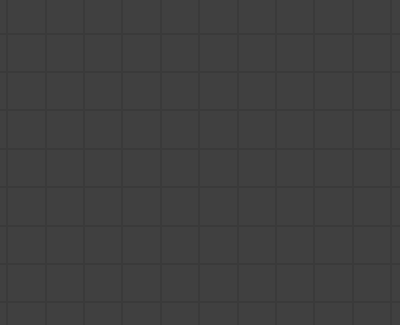

# Version 2019.2 (9.2)

**Substance Designer 2019.2** offre le nouveau nœud Dot, des filtres HDR et de fortes optimisations.

## Principales fonctionnalités

### Nouveau nœud point

Le nœud Point est une requête attendue depuis longtemps. Il a pour but de rediriger les connexions entre les nœuds pour réorganiser votre graphique. Contrairement à notre point de redirection précédent, celui-ci peut accumuler des liens et ne disparaît pas lorsque ses connexions sont rompues.

Pour en savoir plus sur le nœud de point, consultez la page [Éléments de graphique](../../../interface/the-graph-view/graph-items/graph-items.md).

### Amélioration du menu de création de nœud

Le menu Création de nœud qui apparaît en appuyant sur « barre d&#39;espace » peut désormais définir et répertorier en priorité vos favoris. De nouveaux comportements ont également été ajoutés autour du menu pour le rendre plus facile à utiliser.

* **Afficher les favoris en premier**\
  Lorsque vous cliquez sur l’icône en regard du champ de texte, vous pouvez d’abord activer ou désactiver la liste des favoris.

  
* **Ajouter ou supprimer des favoris**\
  Lorsque les favoris sont affichés, vous pouvez ajouter ou supprimer des nœuds de la liste en cliquant sur l&#39;icône en regard du nom du nœud.\
  (Les favoris peuvent également être gérés directement dans la fenêtre Bibliothèque.)

  
* **Ouvrez le menu lorsque vous cliquez et faites glisser un lien à partir d&#39;un nœud**\
  Lorsque vous cliquez et faites glisser la connexion d&#39;un nœud et que vous relâchez la souris, le menu Création de nœud s&#39;ouvre. Le nœud créé sera alors connecté à la liaison. Les nœuds disponibles dans la liste dépendront de la connexion entrante. 

### Nouvelles techniques de rendu en temps réel

L&#39;aire d&#39;affichage en temps réel de la Substance Designer a été améliorée pour prendre en charge de nouvelles fonctions de rendu : **Anisotropie**, **Revêtement** et **Dispersion de sous-surface**. Tous les nouveaux canaux et usages introduits par ces fonctionnalités sont également compatibles avec l&#39;Irlande.

* **Anisotropie**\
  L’Anisotropie est une propriété qui définit le comportement d’un reflet dans une direction donnée. Il est souvent utilisé pour des types de matériaux spécifiques tels que les cheveux et les métaux brossés.\
  Pour créer un matériau anisotrope, vous devez disposer de deux sorties dans votre graphique avec les utilisations suivantes :

  * **AnisotropyAngle** : définit la direction de l&#39;anisotropie. Passe du noir au blanc en boucle.
  * **Niveau d&#39;anisotropie** : définit l&#39;intensité anisotropie. Les valeurs recommandées sont comprises entre 0,9 et 0,98 (niveaux de gris).

  Remarque : l’Anisotropie est prise en charge par tous nos shaders PBR par défaut.

  {width="400px"}
* **Revêtement**\
  Le revêtement permet de définir une deuxième couche de matériau au-dessus du matériau de base. Il peut être utilisé pour simuler de la peinture ou des films automobiles sur des surfaces métalliques.\
  Pour créer un matériau revêtu, vous pouvez utiliser le nouveau modèle de Substance « Revêtu PBR (Métallique/Rugosité) » ou ajouter les sorties suivantes dans votre graphique :

  * **coatWeight** : opacité de la couche de revêtement.
  * **coatSpecularLevel** : Specular level pour la couche de revêtement.
  * **coatColor** : couleur de la couche de revêtement.
  * **coatNormal** : normal pour la couche de revêtement.
  * **coatRoughness** : rugosité de la couche de revêtement.

  Remarque : le revêtement nécessite le nouveau shader « physically\_metallic\_roughness\_coated ».

  {width="400px"}
* **Diffusion Souterraine**\
  La diffusion souterraine simule l&#39;absorption et la diffusion de la lumière à l&#39;intérieur d&#39;un matériau. Il est très utile pour simuler la peau et d&#39;autres surfaces organiques.\
  Pour créer un matériau Subsurface, vous pouvez utiliser le nouveau gabarit de Substance « Diffusion sous la surface PBR (Métallique/Rugosité) » ou ajouter la sortie suivante à votre graphique :

  * **diffusion** : contrôle l&#39;intensité de la diffusion de la lumière à l&#39;intérieur du matériau.

  Remarque : Subsurface nécessite le nouvel ombrage « physically\_metallic\_roughness\_sss » . La couleur de diffusion peut être contrôlée dans les paramètres du nuanceur.

  {width="400px"}

>[!NOTE]
>
> Toutes ces nouvelles fonctionnalités de rendu sont possibles grâce à une refonte du système de Substance Designer du shader. Notre format **GLSLFX** prend désormais en charge la définition de « **Techniques** », qui permet plusieurs passes de rendu. Pour quelques exemples, jetez un œil à nos shaders par défaut disponibles dans : **Substance Designer/resources/view3d/shaders**

### Performances améliorées

Plusieurs améliorations ont été apportées au moteur de Substance de données (qui passe à la version 7.2.0) et sont bénéfiques dans plusieurs situations :

* **Mise en cache des calculs graphiques pour un ajustement plus rapide**\
  Le rendu graphique a été amélioré avec l’ajout d’un nouveau système de mise en cache. Ainsi, l’ajustement d’un graphique est beaucoup plus rapide qu’auparavant, car nous ignorons désormais les nœuds non modifiés.
* **Amélioration du temps de chargement de la bibliothèque**\
  Le chargement de la bibliothèque a été grandement amélioré grâce aux nouvelles optimisations de cuisson et aux améliorations de la vitesse de décodage. La génération de la bibliothèque est désormais 2 à 8 fois plus rapide.

### Nouveau contenu avec filtres HDR

Avec cette nouvelle version, nous introduisons de nombreux nouveaux filtres dédiés à la manipulation des cartes d’environnement HDR.

* **Fusion HDR**:Bring en combinant plusieurs photos LDR (plage dynamique basse) pour créer une image HDR.
* Le nœud **Nadir patch**:This vous permet de cloner/corriger la partie au sol d&#39;un HDRI tout en tenant compte de la déformation sphérique.
* **Nadir extract** : ce nœud peut extraire une texture d&#39;une image HDRI. Il peut être utilisé pour plaquer une texture de sol dans une scène 3D.
* **Color temperature adjustment** : ajustez la température des couleurs d&#39;une image d&#39;entrée, y compris la prise en charge des valeurs HDR.
* **Redresser l&#39;horizon** : faites pivoter la latitude/longitude d&#39;une carte d&#39;environnement. En fonction des conditions de prise de vue, le panorama à 360° obtenu peut ne pas être droit.
* **Ciel&amp;soleil physique** : ce nœud est une implémentation du modèle Hosek-Wilkie Skylight. Spécifiez la position du soleil pour générer un panorama du ciel physiquement précis.
* **Lumière plane** : générez une lumière rectangulaire comme s’il s’agissait d’une forme 3D. Vous pouvez modifier sa position dans la vue 2D, appliquer une texture et définir la couleur à l’aide d’une valeur de température ou de RGB.
* **Lumière de ligne** : générez une lumière en forme de ligne et modifiez sa position dans la Vue 2D. Il offre des options similaires à l’éclairage Plan, à l’exception qu’il est conçu pour les formes longues et fines, comme les néons.
* **Lumière sphère** : générez une lumière en forme de sphère et modifiez sa position à l&#39;aide du widget vue 2D. Vous pouvez également appliquer une texture sphérique pour créer des planètes lointaines.

Tous les nouveaux [Outils HDRI](../../../compositing-graphs/nodes-reference-for-com/node-library/3d-view-library/hdri-tools/hdri-tools.md) sont documentés dans la [section Bibliothèque de nœuds](../../../compositing-graphs/nodes-reference-for-com/node-library/node-library.md).

## Notes de mise à jour

### 2019.2.3

*(Publié Le 26 Novembre 2019)*

**Fixe :**

* [Bakers] Blocage lors de la restauration à l’aide d’une ressource de mappage incliné avec un lien non valide
* [Boulangers] Les ensembles UV autres que 0 ne sont pas pris en compte sur Embree
* [Boulangers] &#39;Bent Normals from Mesh&#39; génère des résultats incorrects avec des réglages UV autres que 0 sur DXR
* [Boulangers] Les paramètres &#39;UV Set&#39; sont réinitialisés à la valeur &#39;0&#39; lors de la réouverture de la fenêtre de cuisson
* [Bakers] &#39;Position&#39; génère une image noire avec des jeux UV autres que 0
* [Contenu] Mosaïque automatique intelligente : problème d’échantillonnage dans 8k
* atlas splitter de [Content] : la détection de forme échoue dans certains cas, le paramètre de précision doit être exposé
* [Contenu] Pow ne renvoie pas la bonne valeur dans certains cas
* [Contenu] Flood Fill vers index : résultat incorrect lors de la publication sur sbsar
* [Library] Blocage lors du chargement du premier package SBS de la session
* [Bibliothèque] Le paramètre Afficher les ressources dans la bibliothèque par défaut est ignoré pour les ressources importées directement dans le panneau Explorateur
* [Console] Message inattendu dans la console lors de l’utilisation du menu des nœuds
* [Paramètres] Impossible de supprimer une seule entrée dans la liste d&#39;utilisation de la sortie
* [3DView] la scène n&#39;est pas rechargée correctement lorsque le fichier de scène est modifié sur le disque[Graph] Le filtrage du menu Nœud est incorrect lors de l&#39;utilisation des sorties Valeur

**Ajouté :**

* [MacOS] Authentifiez le logiciel pour respecter les nouvelles exigences de distribution de MacOS Catalina

### 2019.2.2

*(Publié Le 23 Octobre 2019)*

**Fixe :**

* [Graphique] Le filtrage du menu Nœud est incorrect lors de l’utilisation des sorties Valeur
* [Graphique] Blocage lors de l’affichage du menu des nœuds
* [Graphique] L’outil Recherche s’affiche lors de l’utilisation du raccourci Maj
* [Graphique] Blocage lors de la génération consécutive de menus de nœuds à partir du connecteur d’entrée de valeur
* [Graphique] Les commentaires contenant de longues chaînes sont recadrés
* [Graphique] La mise en surbrillance du flux est incorrecte lors de la création d’un nœud à l’aide du menu Faire glisser du connecteur
* [Graphique] Blocage lors du retrait de tous les éléments de graphique de la scène lors du chargement d’un autre graphique
* [Graphique] Blocage lors de l’utilisation de pour créer un nœud lors de l’utilisation du clic et du glissement à partir du connecteur
* [Graphique] Blocage lors de l’utilisation de l’outil « Node Finder »
* [Graphique] La couleur de l’épingle de sortie est incorrecte en mode « Matériau compact »
* [Cooker] Les nœuds en aval des nœuds à sorties multiples ne se mettent pas à jour correctement
* [Cooker] Problème avec les sorties Value et les nœuds passthrough
* [Cooker] Le processeur de valeurs génère des résultats incorrects lorsqu&#39;un seul nœud &#39;Get&#39; est utilisé
* [Contenu] Le nœud « Contraste/Luminosité » génère une valeur d’Alpha de 1,0
* [Contenu] Le modèle « Panorama Studio » ne contient aucune description
* [Contenu] Flood Fill à indexer : résultat incorrect lorsque l’entrée contient une forme d’enchaînement
* [Contenu] « Fusion HDR » : calcul de l’exposition interne incorrect
* [Point Node] Blocage lors de l’utilisation d’un niveau et d’un point Node
* [Gestionnaire de dépendances] L’action « Aller à » ne fonctionne plus
* [PSD] Blocage lors de l’annulation de la suppression de plusieurs nœuds qui étaient inclus dans l’exportateur de PSD
* [UI] Blocage lors de la fermeture d’un graphique à l’aide du menu « Fenêtre » et de son ouverture une nouvelle fois avec un graphique épinglé
* [Éditeur de dégradé] Le bouton « Supprimer la clé » est trop grand
* [Moteur] Problème de précision avec sqrt() acos() et asin()
* [Bakers] AO À partir du maillage : le curseur « Angle de dispersion » a une plage de valeurs incorrecte lorsqu’il est modifié

### 2019.2.1

*(Publié Le 20 Septembre 2019)*

**Ajouté :**

* [Modèles] Ajout de nœuds d’entrée par défaut à Specular/brillance et à d’autres modèles
* [Modèles] Ajouter un modèle d’Anisotropie PBR
* [Vue 3D] Augmentez les distances automatiques du plan de l’élément
* [Vue 3D] PBR Coated : modifier la valeur par défaut pour l&#39;héritage normal de la couche
* atlas splitter [Contenu] : ajouter une option pour la fonction « Recadrage automatique »
* [Menu Nœud] Ne filtrez pas les nœuds sans entrée

**Fixe :**

* atlas splitter [Contenu] : certaines sorties ne sont pas recadrées correctement lors de l’utilisation de l’option « Recadrage automatique »
* [Contenu] Mélange d’Heights de matière : erreur de cuisson liée à un paramètre inexistant
* [Contenu] « Lumière plane » : le mode UV du motif ne fonctionne pas correctement
* [Contenu] « Height à l’unité normale » : l’entrée est forcée sur 16 bits
* [Contenu] Formes inattendues lors de l’utilisation du nœud « Biseau » d’angular sans mosaïque sur les petites formes
* [Bibliothèque] Les icônes pour sbsar ne sont pas visibles dans la bibliothèque
* [Bibliothèque] L’utilisation de « \ » pour filtrer l’URL ne fonctionne plus
* [Bibliothèque] Les valeurs de filtre sont sensibles à la casse.
* Le filtre de recherche [Bibliothèque] ne fonctionne pas lorsque l’option « Composition » est cochée
* [Bakers] Si vous double-cliquez sur des cellules spécifiques et que vous ignorez la modification, elles reprennent des valeurs incorrectes
* [Bakers] Le texte d’état du serveur principal dans la fenêtre Bakers affiche toujours « Accélération GPU : activer »
* [Cooker] Blocage lors du traitement d’une dépendance « imposteur » dans un graphique
* [Cooker] la conversion en niveaux de gris a une taille de sortie incorrecte lors de l’utilisation de la valeur
* [Explorer] Blocage lors du traitement de « Publish sur le partage »
* [Graphique] Blocage lors de l’ouverture d’un pack spécifique
* [MDL] Blocage lors de l’utilisation de l’opérateur cast
* [Modèles] Les identificateurs de sortie ne sont pas corrects dans le modèle recouvert PBR

### 2019.2

*(Publié Le 29 Août 2019)*

**Ajouté :**

* [Contenu] Nouvelles formes « Lumière panoramique »
* [Contenu] Nouveau filtre « Nadir patch panorama »
* [Contenu] Nouveau filtre « Nadir extract panorama »
* [Contenu] Nouveau filtre « Redresser l’horizon en panorama »
* [Contenu] Nouveau filtre « Rotation du panorama »
* [Contenu] Nouveau nœud « Position du panorama »
* [Contenu] Nouveau nœud « Panorama Physical Sun and Sky »
* [Contenu] Nouveaux nœuds « Dégradés en panorama »
* [Contenu] Nouveau filtre « Fusion HDR »
* [Contenu] Nouveau filtre « Aperçu HDR »
* [Contenu] Nouveau filtre « Color temperature adjustment »
* [Contenu] Nouveau nœud « Blackbody »
* [Contenu] Nouveau filtre « Exposition »
* [UI] Menu de création de nœud : afficher et gérer les favoris dans le menu
* [UI] Ajout/suppression d&#39;un nœud dans les favoris à partir du menu de création de nœud
* [UI] Menu de création de nœud : affiche le menu lorsque vous cliquez/faites glisser un lien à partir d&#39;une sortie
* [UI] Menu de création de nœud : filtrer le contenu en fonction du type de sélection actuel
* [Vue 3D] Anisotropie de la prise en charge
* [Vue 3D] Effet de revêtement de support
* [Vue 3D] Prise en charge de la diffusion sous la surface
* [Graph] Nœud point
* [Graphique] Optimisation du rendu des graphiques en mettant en cache les résultats de cuisson
* [Préférences] Remplacez la valeur par défaut « Cooking Size Limit » par 8192.
* [Préférences] Ajoutez un bouton pour activer/désactiver la nouvelle fonctionnalité de touche de tabulation
* [API] Méthode Add SDResource.getPackage()
* [Iray] Mise à jour du SDK NVIDIA Iray RTX 2019.1.3 (317500.3714)
* [Explorer] Autoriser à lier tout type de fichier en tant que ressource dans le package
* [GradientNode] Appuyez sur Échap pour annuler le choix du dégradé
* [Paramètres] Supprimer les majuscules automatiques sur les identificateurs
* [Projet] Ajoutez une option pour spécifier si les graphiques et les ressources sont « Visibles dans la bibliothèque » par défaut
* [Paramètres prédéfinis] Épingler automatiquement les paramètres modifiés

**Fixe :**

* [MDL] Impossible d’exporter le module en raison d’un problème de type de paramètre
* [MDL] L’entier exposé n’est pas visible lors du chargement
* [MDL] Blocage survenant lors de l’exportation MDL
* [MDL] Blocage lors de la modification de la couleur d’un nœud de surface de matériau
* [MDL] void MDLGraphNodeControllerSelector::updateSelectorCurrentMember(const DataMessage&amp; msg) est rompu
* [Graphique] thickness de lien incorrect dans l’affichage du graphique
* [Graphique] Trop d’invalidations sont déclenchées lors de l’ajustement des paramètres.
* [Graphique] Blocage lors de la fermeture d’un pack alors que deux fenêtres de celui-ci sont ouvertes et lors de l’utilisation de l’édition contextuelle
* [Graphique de fonction] L’avertissement n’apparaît pas lors de la fermeture de la vue de fonction
* [Vue 3D] Blocage lors de l’initialisation de la vue 3D lorsque la projection de la caméra est définie comme « orthographique » comme état de scène par défaut
* [Vue 3D] La fonction DOF post-effets reste activée en Iray
* [Vue 2D] La fenêtre de sélection du pinceau disparaît lors de la modification de l’épaisseur du pinceau
* [Vue 2D] Panneau Informations : les valeurs sont recadrées selon une disposition spécifique
* [Vue 2D] L’image est décalée lors de la réduction et de la restauration de la fenêtre principale
* [Boulangers] La liste de sélection « De la ressource » n&#39;est pas filtrée correctement
* [Boulangers] Blocage lors de l’enchaînement de boulangers « Color Map from Mesh » et « Normal Map from Mesh » sur Embree
* [Boulangers] La courbure par sommet résulte en artefacts sévères
* [Explorateur] Impossible d’importer les ressources UDIM par glisser-déposer dans l’explorateur
* [Explorer] La fenêtre de l’Explorateur n’est pas correctement filtrée lors de la liaison de maillages et de polices après la liaison de formats de fichiers inhabituels
* [Explorateur] Les ressources sont visibles lorsque l’option Afficher dans la bibliothèque est définie sur Non dans le graphique.
* [Contenu] Les entrées « Pow » et « clamp » ne sont pas dans le bon ordre
* [Contenu] Les entrées de nœud « Fusion RVBA » ne sont pas étiquetées
* [Cooker] Les connexions non valides des valeurs numériques sont quand même évaluées
* [Cooker] Assertion lors de la connexion d&#39;une entrée d&#39;image à une valeur d&#39;entrée
* [UI] Le curseur de la souris reste bloqué dans l’état « redimensionner » dans certains cas particuliers
* [UI] Le clic droit dans la vue du pack n’affiche pas le menu correct sous Linux
* [Dépendances] Le chemin de fichier des ressources temporaires n&#39;est pas correct
* [Dépendances] L’avertissement de ressource bitmap manquante reste actif après le déplacement
* [Bibliothèque] Certaines vignettes ne sont pas générées
* [Bibliothèque] Les fichiers MDL sont affichés dans la bibliothèque
* [Paramètres] Blocage lors de l’exposition des paramètres
* [Paramètres] Blocage après avoir recréé un nouvel élément dans la liste déroulante
* [Export] Échec de l&#39;exportation par lots 8K
* [Paramètres prédéfinis] Blocage lors de l’application d’un paramètre prédéfini impliquant des booléens dans des instances SBS
* [Scripts] L’écran de bienvenue s’affiche toujours lors de l’utilisation de l’argument de ligne de commande « —quit »
