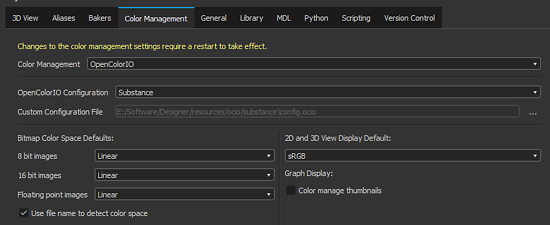
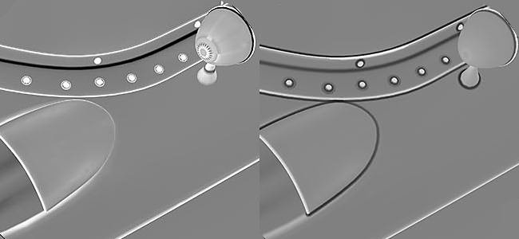
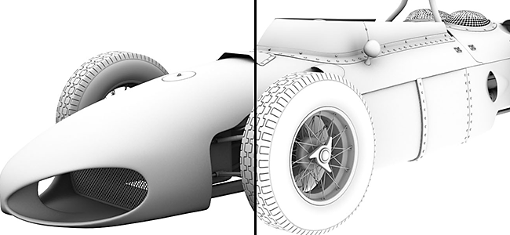
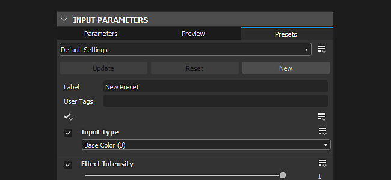
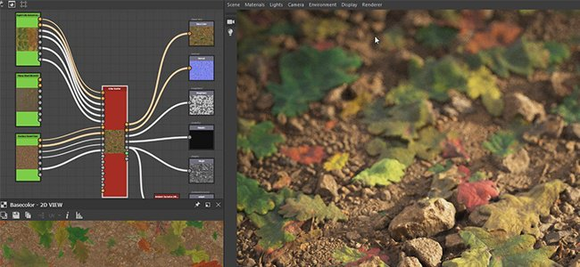

# Version 2019.3 (9.3)

**Substance Designer 2019.3** introduit la gestion des couleurs avec la prise en charge d&#39;OpenColorIO, ainsi que des mises à jour améliorées de baker et un nouveau nœud d&#39;atlas scatter.

Date de publication : *19 décembre 2019*

## Principales fonctionnalités

### Gestion des couleurs et prise en charge d’OpenColorIO

La Substance Designer prend désormais en charge la gestion des couleurs, qui permet de contrôler la façon dont les couleurs sont interprétées et transformées. Cette fonctionnalité est fournie avec la prise en charge d&#39;[OpenColorIO](https://opencolorio.org/), un système de gestion des couleurs largement utilisé dans l&#39;industrie du divertissement et des effets spéciaux.

* **Configuration de la gestion des couleurs dans les principaux paramètres**\
  Par défaut, la Substance Designer sera définie en mode « hérité », ce qui signifie qu’elle ne chargera aucune configuration spécifique et continuera de fonctionner comme auparavant. Pour passer à OpenColorIO, par exemple, il vous suffit de prendre connaissance des paramètres principaux, puis des paramètres du projet pour les configurer et les activer.

  {width="600px"}
* **La gestion des couleurs est appliquée de 3 manières différentes**\
  Différentes parties de l’application reçoivent la gestion des couleurs qui a différentes implications :

  * **Vue 2D et 3D**\
    La fenêtre d’affichage ouverte en temps réel et l’Iris peuvent tous deux être gérés par couleur. Cela permet de prévisualiser en contexte le matériau et la texture. Le profil colorimétrique peut être facilement basculé via la liste déroulante dédiée. Il est également possible d’afficher la vue dans le gamma linéaire pour prévisualiser sans correction colorimétrique.

    {width="400px"}

    {width="400px"}
  * **Entrées et sorties graphiques et exportation bitmap**\
    Lors de la lecture et de l’écriture d’images bitmap à l’entrée et à la sortie d’un graphe, la gestion des couleurs peut ajuster l’image et la convertir pour qu’elle fonctionne dans les bonnes conditions. Cela peut être contrôlé dans la préférence principale pour bitmap dans le graphe et modifié dans la boîte de dialogue d’exportation pendant le processus d’exportation. Enregistrer une image à partir de la vue 2D permet également de choisir l’espace colorimétrique.

    {width="400px"}

    {width="505px"}

### Nouvelle Courbure du Baker Maillage

La Courbure du baker du maillage a été refaite à partir de zéro. Il tire désormais parti du raytracing qui permet l’accélération GPU mais ajoute également la prise en charge des intersections de maillage.

Pour plus d&#39;informations, consultez la documentation [Courbure de Maillage](https://experienceleague.adobe.com/en/docs/substance-3d/bakers/bakers-settings/curvature-from-mesh).

>[!NOTE]
>
> La Courbure précédente du baker maillage est maintenant obsolète. Nous vous recommandons de passer à la nouvelle version.

### Amélioration de l’Ambient occlusion du Baker Maillage

Le baker Ambient occlusion à partir du Maillage dispose désormais d&#39;un nouveau paramètre appelé « Plan du Sol » qui simule un plan sous le maillage pour produire l&#39;occlusion du sol. Cela peut aider à produire des résultats d’aspect plus intéressants pour la géométrie statique ou les objets non organiques. Par défaut, le plan de Sol se trouve au bas du cadre de sélection du maillage, mais il peut être poussé davantage avec des paramètres dédiés.

Pour plus d&#39;informations, consultez la documentation [Ambient occlusion de Maillage](https://experienceleague.adobe.com/en/docs/substance-3d/bakers/bakers-settings/ambient-occlusion-from-mesh).

### Amélioration des propriétés et de l’éditeur de paramètres prédéfinis

L’éditeur de propriétés a été amélioré, ainsi que l’éditeur de paramètres prédéfinis :

* **Mode d&#39;aperçu plus rapide**\
  Le passage en mode Aperçu lors de la modification des paramètres de graphe est désormais beaucoup plus rapide, en particulier sur les graphes comportant de nombreux paramètres exposés. Le mode Aperçu est désormais un onglet dédié qui facilite le va-et-vient entre l&#39;éditeur de paramètres et son aperçu.
* **Éditeur de paramètres prédéfinis retravaillé**\
  La façon dont les paramètres prédéfinis sont gérés dans la Substance Designer est désormais beaucoup plus facile et plus rapide : l’éditeur de paramètres prédéfinis a désormais son onglet dédié et chaque paramètre prédéfini répertorie désormais les paramètres qu’il affecte.
* **Visible Si prend désormais en compte les gadgets de transformé 2D**\
  Lorsqu’un widget 2D de transforme est associé à une condition If visible, il peut désormais être masqué dans la vue 2D, ce qui le rend contextuel par rapport aux paramètres.

### Nouveau contenu

Cette version présente le nouveau nœud **Atlas scatter**. Ce nœud permet de lire une image d&#39;atlas (une image contenant des sous-images) et de séparer automatiquement son contenu en une composante individuelle qui peut ensuite être diffusée aléatoirement. Ce nœud peut être utilisé par example pour placer des branches et des feuilles sur un matériau de sol de dirt. La [Substance Source](https://source.substance3d.com/allassets?q=atlas) inclut désormais de nombreux matériaux Atlas qui peuvent être dispersés avec ce nouveau nœud.

>[!WARNING]
>
> Cette version ne prend plus en charge CentOS 6.x.\
> Sous CentOS 7.x, l&#39;application peut ne pas démarrer en raison de certains problèmes de dépendance. Pour résoudre le problème, mettez à jour le système ou copiez la [bibliothèque suivante](https://centos.pkgs.org/7/centos-x86_64/freetype-2.8-12.el7.x86_64.rpm.html) dans le dossier d&#39;installation.

## Notes de mise à jour

### 2019.3.3

*(Publié Le 14 Février 2020)*

**Ajouté :**

* [Batchtools] Livrer les profils OCIO par défaut avec des outils par lots

**Fixe :**

* atlas scatter de [Contenu] : problèmes lors de l’utilisation de couleurs aléatoires/normales dans certaines situations

### 2019.3.2

*(Publié Le 4 Février 2020)*

**Ajouté :**

* [SBSRender] Prise en charge de la gestion des couleurs

**Fixe :**

* [Contenu] Nœud sRVB linéaire vers ACEScg : les libellés d’E/S sont incorrects
* [Content] Nœud ACEScg vers sRGB : les libellés de sortie sont incorrects
* [Contenu] Nœuds Lumière de panorama : réglage de la plage de température
* [Graphe] Baisse et blocage importants des performances lors de l’ajustement d’un graphe imbriqué avec l’option « In-Context Editing » activée
* [Graphe] Crash lors de la suppression de plusieurs nœuds dans FX-Map
* [Performances] Le processus de Designer peut rester actif après la fermeture

### 2019.3.1

*(Publié Le 27 Janvier 2020)*

**Fixe :**

* [Graphe] Baisse et blocage importants des performances lors de l’ajustement d’un graphe imbriqué avec l’option « Modification contextuelle » activée
* [Graphe] Impossible de saisir une valeur enum sur [0, 99] dans Entier 1 tweak
* [Graphe] Le commentaire n’est pas déplacé lorsque le cadre correspondant est déplacé
* [Graphique] Les noms d&#39;entrée sont manquants sur le nœud d&#39;instance personnalisé
* [Graphique] Les vignettes peuvent être rendues lors du chargement du graphique même si l’option correspondante est désactivée dans les Préférences
* [Vue 2D] La valeur alpha négative affiche le correcteur quelle que soit l’option d’affichage
* [Vue 2D] La conversion de surface de 32f à 8bits échoue avec des valeurs élevées
* [Vue 2D] Les options Inclinaison haut/gauche et Créer un carré définissent certaines coordonnées sur des valeurs énormes dans les matrices de transformation avant
* [Vue 2D] Les UV de tous les objets de maillage ne sont pas affichés sur les jeux UV autres que « 0 »
* [Contenu] Biseau : le mode Angular ne fonctionne pas correctement sur le masque de mosaïque
* [Contenu] Flood Fill au dégradé : la valeur de l&#39;image de pente n&#39;est pas échantillonnée au milieu de la forme
* [Content] Fonction ; « Equality Boolean » est rompu
* [Boulangers] Artefacts lors de l’utilisation du mappage de tonalité automatique dans le boulanger « Courbure à partir du filet » dans des cas spécifiques
* [Boulangers] Blocage dans DXR lors de la cuisson alors qu’aucun matériau n’est sélectionné
* [Boulangers] Problème de performances dans la vue 2D lors de l’activation de l’info
* [Moteur] La fonction « Pow » génère des valeurs énormes lors de l’utilisation de valeurs d’entrée très faibles et d’un exposant élevé sur le moteur SSE2
* [Moteur] Blocage lors de l’utilisation d’une compression jpg élevée sur des ressources bitmap
* [Moteur] Le processeur de valeurs renvoie une valeur $size incorrecte à l&#39;intérieur d&#39;un sous-graphe
* [Paramètres] Une fenêtre contextuelle vide s&#39;affiche lors de la sélection d&#39;un nœud d&#39;instance avec un nombre élevé de paramètres
* [Paramètres] La valeur entière n&#39;est pas affichée dans les éléments de paramètre du menu déroulant
* [Paramètres] Le bouton Modifier de la Matrice de transformation n&#39;est pas disponible en mode Aperçu
* [Cooker] $size dans ValueProcessor est incorrect à l’intérieur d’une instance de graphique
* [Cooker] La taille de sortie est incorrecte lorsque le lien de valeur passe par un nœud point vers un nœud atomique
* [UI] Le bouton permettant d&#39;afficher tous les éléments de la barre inférieure de la vue 2D n&#39;est pas visible
* [UI] L’aperçu des valeurs de RGB sélectionnées affiche des nombres incorrects lors de l’utilisation de la gestion des couleurs
* [Export] Les images RVBA 16f sont exportées en niveaux de gris
* [Vue 3D] Impossible d’importer OBJ avec plusieurs espaces
* [Gestion des couleurs] La configuration OCIO n’est pas prise en compte lors de la publication de sbsar
* [Color Widget] Les plages de curseurs de couleur peuvent se développer de manière exponentielle dans un cas spécifique
* [Doc] La section « paramValue » est incomplète dans la référence au format Sbs
* [MDL] Le widget de couleur dans les instances sbsar est incorrect
* [Paramètres prédéfinis] Blocage lors de la mise à jour des paramètres prédéfinis dans un cas spécifique
* [PSD] Erreur FreeImage lors du chargement de fichiers PSD à partir de versions récentes de Photoshop
* [Ressources] Blocage lors de l’annulation de la liaison bitmap directement dans le graphique
* [SVG] Les nœuds de SVG ne se mettent pas à jour automatiquement lors de l’utilisation des outils vectoriels

### 2019.3.0

*(Publié Le 19 Décembre 2019)*

**Ajouté :**

* [Général] Prise en charge de la gestion des couleurs avec le fichier de configuration OpenColorIO
* [Paramètres prédéfinis] Améliorer la gestion des paramètres prédéfinis
* [Paramètres prédéfinis] Synchroniser les gadgets d’affichage 2D et les curseurs d’aperçu
* [Paramètres prédéfinis] Restauration des valeurs d’aperçu lors du retour au mode Aperçu
* [Paramètres prédéfinis] Maintenez le mode d’aperçu actif lors de la modification d’autres nœuds, ressources ou graphiques
* [Paramètres prédéfinis] L’option Annuler fonctionne correctement lors de la navigation entre les 3 onglets de paramètres prédéfinis
* [Paramètres prédéfinis] Autoriser à réinitialiser les paramètres à la valeur par défaut du graphique ou à la valeur du paramètre prédéfini en mode Aperçu
* [Paramètres prédéfinis] Amélioration de l’épinglage des paramètres
* [Paramètres prédéfinis] Importer/exporter tous les paramètres prédéfinis d’un graphique dans un fichier
* [Bakers] Nouveau baker « Courbure à partir d’un filet » basé sur le lancer de rayons
* [Boulangers] Ajouter l&#39;option de plan au sol dans le boulanger « AO from Mesh »
* [Boulangers] Ajouter l&#39;option de correspondance par nom pour ignorer le dos dans &#39;AO from Mesh&#39; baker
* [Contenu] Nouveau nœud d’Atlas scatter
* [Contenu] Nouveaux nœuds et fonctions de conversion de l’espace colorimétrique (ACEScg)
* [Contenu] Amélioration de la cohérence des noms pour les nœuds avec des versions en couleurs/niveaux de gris
* [Graphique] Amélioration des performances en mode Aperçu des paramètres prédéfinis
* [Graphique] Option Ajouter $(colorspace) macro à l’exportation des sorties de graphique
* [Paramètres] Lorsqu&#39;un paramètre est défini sur invisible, masquez l&#39;objet correspondant dans la vue 2D
* [Paramètres] N’ajoutez pas « Groupe d’entrée de graphique » comme préfixe lors de l’exposition des paramètres
* [Paramètres] Ajout d’une info-bulle pour les paramètres VisibleIf dans Graph
* [AXF] Mise à jour du SDK AXF vers la version 1.6

**Fixe :**

* [Linux] Designer ne se lance pas sur CentOS 8 en raison d’un échec de chargement de la plateforme Qt.
* [Linux] AVERTISSEMENT : la bibliothèque Freetype a été supprimée de l&#39;application SD : les utilisateurs avec CentOS version &lt;= 7.5 doivent l&#39;installer manuellement.
* [AxF] Blocage lors de l’importation de fichiers créés avec des versions AxF plus récentes
* [2DView] Les textures de pinceau alimentées par une ressource ne sont pas appliquées
* [2DView] Blocage lors de la modification des entrées d’un graphique instancié avec ajustement de position
* [3DView] Blocage lors de l’annulation du chargement... action
* [3DView] Option Ajouter un espace colorimétrique pour les textures d’émission dans les nuanceurs GLSLFX
* [Boulangers] Les cartes alimentées par les ressources sont ignorées pendant la cuisson
* [Bakers] Les options « Direction de l’espace universel » ne sont pas correctement verrouillées
* [Bitmap] Les bitmaps EXR avec des valeurs en virgule flottante sont rendus sous forme d’image noire
* [Contenu] Flood Fill à l’index : la détection de forme échoue dans un cas particulier
* [Contenu] Recadrage : problème d’échantillonnage lorsque le nœud de recadrage a une résolution inférieure à l’entrée
* [Général] Blocage lors de la fermeture de Designer lors de la génération de la bibliothèque
* [Graphique] Les nœuds bitmap ne reflètent pas la compression du bitmap associé
* [Graphique] Le cache n’est pas effacé lors de l’effacement des vignettes de nœud après le premier rendu
* [Graphique] Taille de nœud incorrecte
* [Graphique] Blocage lors de la modification des connexions d’entrée sur un nœud de processeur de pixels dans certains cas
* [Graphique MDL] Échec lors de la restauration d’une valeur par défaut d’appel de fonction
* [Propriétés] Les boutons « Modifier » et « Matrice » dans les paramètres de matrice de transformation prêtent à confusion
