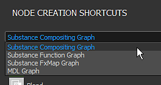
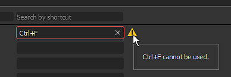
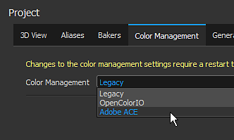
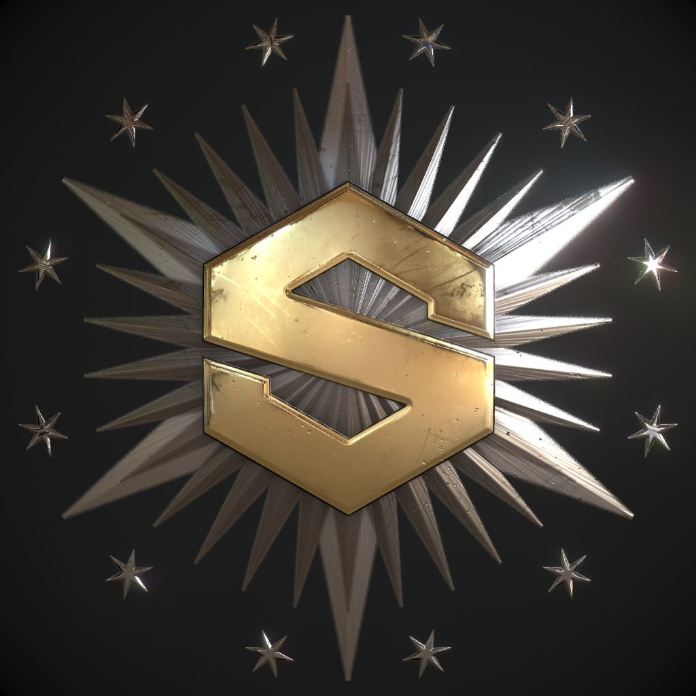

# Version 2020.1 (10.1)

**Substance Designer 2020.1** comprend un nouvel éditeur de raccourci, un module externe MaterialX et de nombreuses nouvelles améliorations pour la gestion des couleurs avec des fonctionnalités Adobe Color Engine et nouveaux bakers.

Date de publication : *10 avril 2020*

>[!NOTE]
>
> À partir de cette version, le numéro de version de l’application change de format. Ce qui aurait dû être **2020.1** devient désormais **10.1.0**.

## Principales fonctionnalités

### Nouvel éditeur de Raccourci pour la création de nœuds

Dans cette version, nous introduisons un nouvel éditeur de raccourci qui permet de définir des raccourcis clavier pour accélérer la création de nœuds dans les différents modes de graphe.

Le nouvel éditeur de raccourci est accessible dans les préférences principales via **Édition > Préférences > Raccourcis**. Par défaut, tous les champs de raccourci sont vides.

* **Raccourcis pour chaque type de graphe**\
  Il est possible de définir un raccourci pour chaque type de graphe disponible dans la Substance Designer, du graphe de composition habituel aux fonctions plus avancées telles que les fonctions et le MDL.

  
* **Attribuer des raccourcis à la fois pour les noeuds atomiques et les filtres personnalisés**\
  Par défaut, l’interface affiche les noeuds atomiques de chaque type de graphe. L’utilisation du champ de recherche permet d’affiner la liste, mais également de rendre accessibles les filtres et les nœuds de bibliothèque personnalisés :

  
* **Création d&#39;un nouveau raccourci**\
  Pour créer un nouveau raccourci pour un nœud spécifique, cliquez simplement dans le champ de texte en regard de son nom et saisissez les touches demandées sur le clavier. Pour effacer un raccourci, utilisez le bouton en croix.

  
* **Gestion des conflits de raccourcis**\
  Utilisez l’info-bulle de l’icône d’avertissement pour en savoir plus sur un conflit. Il indique si une clé entre en conflit avec une clé existante ou si elle est déjà utilisée par l’application à d’autres fins.

  

  
* **Rechercher des raccourcis**\
  S’il y a trop de raccourcis à suivre ou si un nœud n’est pas visible par défaut, utilisez le système de recherche pour les isoler :

  

### Nouveau module externe MaterialX (Beta)

Au cours de SIGGRAPH 2019, nous avons présenté un module externe MaterialX pour la Substance Designer. [MaterialX](http://www.materialx.org/) est un format développé par [Industrial Light &amp; Magic (ILM)](https://www.ilm.com/) qui permet aux artistes de créer des matériaux qui peuvent ensuite être utilisés sur une grande variété de plateformes et dans de nombreux usages (tels que les films, les émissions télévisées, les jeux, les expériences de réalité virtuelle et la fabrication). Ce nouveau plug-in, désormais disponible en version bêta, permet de créer des matériaux MaterialX à utiliser dans d’autres applications DCC compatibles. Jetez un œil à notre [article récent sur MaterialX](https://magazine.substance3d.com/research-a-portable-shader-graph/) pour en savoir plus sur le processus et les objectifs derrière ce nouveau module externe.

Ce nouveau plug-in permet de :

* Développez des shaders procéduraux et des textures en parallèle.
* Créez des ombrages avancés pour la Substance Painter avec des fonctionnalités telles que les cartes de détails et les masques procéduraux modifiables à l’exécution.
* Faites correspondre les fonctionnalités de shader d’un moteur de jeu ou d’un pipeline d’effets spéciaux dans le viewport Substance Designer et Substance Painter.

Pour obtenir le plug-in, il vous suffit de prendre [Substance share](https://share.substance3d.com/libraries/6111) pour le télécharger.

### Nouvelle intégration de l’Adobe Color Engine (ACE)

Outre la norme OpenColorIO, il est désormais possible d’utiliser Adobe Color Engine (ACE) pour prendre en charge les profils ICC de gestion des couleurs. Cela signifie que vous pouvez désormais importer et exporter des images calibrées pour les faire correspondre à d’autres logiciels tels que Photoshop et Illustrator.

* **Activation de l&#39;Adobe Color Engine**\
  Utilisez les paramètres du projet pour définir le système de gestion des couleurs à utiliser :

  
* **Modification du profil d&#39;écran**\
  Lors de la prévisualisation d’images via la vue 2D ou 3D, utilisez la liste déroulante pour spécifier le profil à utiliser :

  
* **ACE pour la gestion des couleurs héritée**\
  Le transforme de sortie ACE tonemapped est désormais disponible avec le mode de gestion des couleurs hérité.

### Bakers améliorés

Nous avons affiné certains de nos bakers avec deux changements principaux :

* **Échantillonnage amélioré**\
  Le baker de l&#39;Ambient occlusion, du Thickness et de la Courbure utilise désormais une nouvelle méthode d&#39;échantillonnage qui améliore considérablement la qualité des résultats bakés. Il produit un bruit plus attrayant et des résultats plus stables, sans qu&#39;il soit nécessaire d&#39;augmenter le nombre d&#39;échantillons. L’image ci-dessous montre la méthode d’échantillonnage précédente en haut et la nouvelle méthode en bas avec 4, 8 et 16 échantillons de gauche à droite (tous les rendus ont été effectués avec l’sous-échantillonnage anticrénelage défini sur 4x4).

  {width="600px"}
* **Nouveau paramètre de normalisation**\
  Les bakers Thickness et Heightmap disposent d&#39;un nouveau paramètre de normalisation qui vous permet de baker les valeurs brutes à la texture au lieu des valeurs comprises entre 0 et 1. Ceci est utile avec une map height de connaître les distances brutes entre un maillage à faible et à fort poly par exemple. La valeur du diviseur correspondra exactement à l’intensité du displacement à configurer sur le maillage low-poly pour correspondre à la silhouette du maillage high-poly. Afin d&#39;interpréter correctement la map height, nous avons également exposé un nouveau paramètre « Scalar Zero Value » pour définir la valeur de pixel correspondent à 0. En outre, le facteur manuel permet de résoudre les problèmes de seam potentiels sur les maillages UDIM causés par une normalisation par UV-Tile.

  

### Vue 3D améliorée

La vue 3D a reçu diverses améliorations de la qualité de vie qui devraient rendre le travail quotidien plus agréable :

* **Synchronisation des paramètres entre les systèmes de rendu**\
  Les paramètres de shader sont désormais synchronisés entre OpenGl et Iray, ce qui facilite considérablement le saut entre eux.
* **Afficher l&#39;aperçu de l&#39;entrée de texture et ajouter le paramètre de désactivation**\
  Les paramètres d&#39;entrée shader affichent désormais un aperçu de leur saisie : il peut s&#39;agir d&#39;un paramètre de couleur uniforme, d&#39;un nœud de graphe ou d&#39;un bitmap. Il est également possible de décocher un paramètre pour le désactiver temporairement.

  

  
* **Aperçu de la Map d&#39;environnement dans les paramètres**\
  Lorsque vous accédez à **vue 3D > Environnement > Modifier**, un aperçu de la map d&#39;environnement utilisée pour éclairer la scène s&#39;affiche.

  
* **Nouveau shader non éclairé**\
  Un nouveau shader nommé « unlit » a été inclus par défaut. Il ne réagit à aucun éclairage et peut être utilisé pour afficher une seule texture dans le viewport au-dessus d’un maillage. Ceci est utile pour examiner les textures bakées par exemple.

  {width="500px"}
* **Performances améliorées sur les écrans haute résolution avec réduction de la taille des viewports**\
  Comme pour la Substance Painter, un nouveau paramètre nommé **Mise à l&#39;échelle des Viewports** est désormais disponible dans les préférences principales. Il détecte qu&#39;un écran utilise la mise à l&#39;échelle HDPI (tels que les écrans Retina sur MacOS) et divise automatiquement la résolution du viewport par 2. Ce comportement évite de dessiner le viewport à des résolutions trop élevées et améliore les performances générales.\
  Les valeurs de paramètre actuelles sont les suivantes :

  * **Aucun** : pas de mise à l&#39;échelle du viewport.
  * **Auto** (par défaut) : si l&#39;application est sur un écran HDPI, la résolution du viewport sera divisée par deux.

  

### Nouveau contenu

Cette version inclut également des nœuds nouveaux ou améliorés :

* **Nœud de Rendu PBR amélioré**\
  Déjà introduit dans une version précédente, ce nœud a été grandement amélioré. Il propose désormais des commandes de caméra, de nouvelles formes (telles qu&#39;un plan et un cylindre), des post-effets (Profondeur de champ, Fleur/Reflet, Vignette, etc.) et de nouveaux types de matériaux (comme Clear-Coat et Anisotropie) ainsi que la prise en charge des matériaux opaques.\
  Pour plus d&#39;informations, consultez la [page de documentation](../../../compositing-graphs/nodes-reference-for-com/node-library/material-filters/pbr-utilities/pbr-render/pbr-render.md) dédiée.

  {width="250px"}

  {width="250px"}

  {width="250px"}
* **Nouveau nœud de mappage de Rendu PBR**\
  En tant qu’extension de Rendu PBR, vous pouvez utiliser ce nouveau nœud pour créer des aperçus composites de canal de mappage.\
  Pour plus d&#39;informations, consultez la [page de documentation](../../../compositing-graphs/nodes-reference-for-com/node-library/material-filters/pbr-utilities/pbr-render-mapping/pbr-render-mapping.md) dédiée.

  {width="250px"}

  {width="250px"}
* **Nouveau filtre FXAA**\
  Le nouveau filtre met en œuvre l&#39;algorithme d&#39;anticrénelage approximatif rapide (FXAA) qui est une méthode d&#39;anticrénelage. Il peut être utilisé sur une texture régulière pour lisser les lignes dentelées ou les bords.\
  Pour plus d&#39;informations, consultez la [page de documentation](../../../compositing-graphs/nodes-reference-for-com/node-library/filters/effects/fxaa/fxaa.md) dédiée.

  {width="600px"}
* **Nouveau filtre Hald CLUT**\
  Ce filtre permet d’ajuster le ton et la couleur d’une image avec une table de correspondance d’entrée (LUT). Il utilise le format Hald CLUT, pour en créer un, il suffit de partir d&#39;un LUT d&#39;identité [disponible ici](http://www.quelsolaar.com/technology/clut.html).\
  Pour plus d&#39;informations, consultez la [page de documentation](../../../compositing-graphs/nodes-reference-for-com/node-library/filters/adjustments/hald-clut/hald-clut.md) dédiée.

  {width="600px"}

## Notes de mise à jour

### 2020.1.3

*(Publié Le 11 Juin 2020)*

**Ajouté :**

* [Contenu] Exposer le paramètre « Couleur de cache » dans le nœud Transformer en niveaux de gris sans échec
* [Contenu] Rendu PBR : ajout d’une option personnalisée Entrée d’arrière-plan
* [Contenu] Nœuds Lumière de panorama : nouvelle option pour prélever la couleur de l’image d’arrière-plan
* [Paramètres] Masquer les paramètres avec l’indicateur « non pris en charge » dans la liste de la fenêtre Exposer les paramètres

**Fixe :**

* [vue 3D] Crash lors du changement de maillages personnalisés dans un cas spécifique
* [vue 3D] Le format normal est toujours DirectX au démarrage
* [Contenu] bruit Worley 3D : rendu d’un artefact lors de l’utilisation d’une valeur de taille de grille élevée
* [Contenu] La fusion des nœuds de fondu est incorrecte
* [Contenu] Rendu PBR : supprimer l’avertissement de l’outil de cuisson
* [Contenu] Rendu PBR : résultat contient des couleurs négatives dans certains cas
* [Cooker] Problème d&#39;injection du cache pour les instanciers à sorties multiples
* [Explorateur] Crash lors de la fermeture d’un pack contenant un Graphe MDL affiché
* [Graphe] Cuisson en 2 passes : le changement de type de nœud ne déclenche pas de recook
* [Graphe] Crash lors de la suppression d’entrées lors de l’utilisation de sa connexion
* [Graphe] Les points de terminaison de lien peuvent être déplacés vers un espace vide
* [MDL] Crash lors de l’annulation de l’exportation MDL à partir du graphe MaterialX
* [MDL] Erreur lors de l’annulation de l’exportation vers MDLE
* [Paramètres prédéfinis] Crash dans l’onglet Paramètres prédéfinis après la modification du type de paramètre inclus dans le paramètre prédéfini
* [Ressources] La liste de Matériaux est vide dans le menu contextuel du graphe pour les maillages liés comme non UDIM

### 2020.1.2

*(Publié Le 27 Avril 2020)*

**Ajouté :**

* [Contenu] Ajouter un modèle de filtre Alchemist
* [Contenu] Rendu PBR : ajoutez des paramètres pour contrôler les intensités des ombres de diffusion/specular
* [Contenu] Nœuds Shape Light : ajout d&#39;un paramètre de position de caméra
* [Actualités] Le style « Flèche » du groupe ne fonctionne pas la première fois que la fenêtre s’affiche
* [Bakers] Ajoutez le raccourci Z à la vue 2D pour afficher l’image au format 1:1
* [Projet] Masquer l’alias $(PROJECT\_DIR) de la liste
* [Explorateur] Ne créez pas de ressource personnalisée pour les ressources qui ne sont pas un fichier sur le disque

**Fixe :**

* [Player] Signaler les alias manquants lors du chargement des packages SBS
* [Player] Afficher la valeur de générateur aléatoire sous forme de base décimale
* [Player] Regrouper toutes les maps d&#39;environnement incluses dans Substance Designer
* crash [Player] à la sortie dans macOS High Sierra
* [Player] Impossible de charger les packages utilisant sbs://
* [Contenu] bruit Worley 3D : rendu d’un artefact lors de l’utilisation d’une valeur de taille de grille élevée
* [Contenu] L’entrée « supérieur à zéro » dans le nœud « Onde » n’est pas utilisée
* [Contenu] Éclairage plan : le mode de position Espace monde ne fonctionne pas
* [Contenu] Lumière sphérique : la position d’éclairage interne ne fonctionne pas correctement
* [Bakers] Crash lors du baking avec la fenêtre de baking pendant l’exécution d’une option « Actualiser toutes les maps bakées »
* [Bakers] Le Baking échoue sur Optix pour AO à partir du Maillage en utilisant Faible comme Élevé avec une Map normal
* [Bakers] La résolution de l’aperçu des fichiers UVT ne correspond pas à la taille de l’écran
* [vue 3D] Le bitmap attribué est remplacé lors du chargement d&#39;une MDL si la valeur par défaut n&#39;est pas une texture 2d
* [vue 3D] Les widgets Propriétés du Matériau changent après la réinitialisation d’une propriété
* [vue 3D] La préférence globale Format normal ne fonctionne plus
* [MatX] Bibliothèque : la catégorie de Graphe MaterialX n&#39;affiche pas tous les nœuds disponibles
* [MatX] Le menu contextuel d’un Graphe personnalisé peut contenir des sous-dossiers vides dans le dossier « Ajouter un nœud »
* [SBSAR] L’entrée principale est restaurée à la première entrée de la liste
* [Bibliothèque] Seul le premier graphe est inclus à partir de SBSAR avec plusieurs graphes
* [CustomGraph] Dans certains cas, les nœuds qui ne font pas partie du type de graphe actif sont créés automatiquement
* [Iray] Le paramètre « Profondeur » de la projection Box ne fonctionne pas correctement
* [Préférences] Amélioration de la mise en page dans les paramètres du projet
* [Paramètres] Crash lors du déplacement d’un widget de position après avoir supprimé un paramètre
* [UI] Crash lors de la modification de la hiérarchie des utilisations dans le nœud sorties
* [Graphe] Crash lors de l’utilisation d’une zone de sélection sur un commentaire et un nœud badgé

### 2020.1.1

*(Publié Le 10 Avril 2020)*

**Fixe :**

* [vue 3D] L’utilisation de la mémoire est trop élevée lors du travail sur le graphe de composition
* [Contenu] Formes inattendues dans la sortie non carrée des nœuds « Polygone »
* [Contenu] Rendu PBR : la caméra Orthographique ne fonctionne pas correctement lors de l’utilisation d’une résolution non carrée
* [Contenu] Rendu PBR : Swirly bokeh augmente la luminosité de la bordure de l’image
* [Gestion des couleurs] Le sélecteur de couleurs dans la boîte de dialogue Nouveau bitmap ne gère pas les couleurs.
* [Gestion des couleurs] Les sélecteurs de couleurs dans les outils peinture et Vecteur de la vue 2D ne prennent pas en charge la gestion des couleurs.

### 2020.1.0

*(Publié Le 9 Avril 2020)*

**Ajouté :**

* [Raccourcis] Gestionnaire de raccourcis pour la création de nœuds
* [Contenu] Nouveau nœud de Rendu PBR
* [Contenu] Nouveau filtre FXAA
* [Contenu] Nouveau filtre Hald CLUT
* [Contenu] Exposer le filtrage dans les nœuds « Recadrer »
* [vue 3D] Amélioration des paramètres de Shader/du workflow d’affectation des textures
* [vue 3D] Nouveau shader non éclairé
* [vue 3D] Ajout d’une « valeur zéro scalaire » aux ombrages de displacement
* [vue 3D] Ajout d’une option permettant de réduire la résolution du viewport lorsque la haute résolution est activée
* [vue 3D] GLSLFX : permet de définir des informations d’interface graphique sur sampler (par défaut, min, max, guiMin, guiMax, guiStep, guiWidget, guiName, guiGroup)
* [vue 3D] Ajoutez l’option Charger l’état avec le Maillage... dans le menu Scène
* [vue 3D] Ajout du transforme de sortie ACE tonemapped en mode de gestion des couleurs hérité
* [Bakers] Nouvelle méthode d&#39;échantillonnage dans les bakers AO, Courbure, Courbure normale, Thickness
* [Baker] Nouvelles options de normalisation dans les bakers Height et Thickness
* [Gestion des couleurs] Intégrer Adobe ACE (Adobe Color Engine)
* [Gestion des couleurs] Ajoutez des options pour définir le comportement par défaut lorsque le profil ICC est manquant
* [Paramètres] Incrémenter les curseurs en fonction de la Substance Painter
* [Packaging] Regroupez autant de DLL Qt que possible pour les scripts Python
* [Projet] Désactivez les paramètres pour les fichiers de projet en lecture seule et communiquez clairement cet état
* [Préférences] Masquer des paramètres non clairs spécifiques liés aux périodes de réactivité et de calcul
* [UI] Renommer Pow2 -> 2Pow
* [Propriétés] Optimisation de l’affichage des propriétés du graphe de composition
* [AXF] Mise à jour vers AXF SDK 1.7.1

**Fixe :**

* [vue 3D] Les paramètres Lumière ambiante ne sont pas visibles même s’ils sont activés
* [vue 3D] glslfx : le widget de couleur est toujours un vec3 sans alpha
* [vue 3D] Le jeu de Maps d&#39;environnement d&#39;une ressource n&#39;est pas enregistré dans la ressource scène
* [vue 3D] Iray : la lumière ambiante est convertie en lumière ponctuelle à l’origine de la scène
* [vue 3D] glslfx : le widget de couleur est toujours un vec3 sans alpha
* [Paramètres] L&#39;URL du package d&#39;instance est incorrecte dans le groupe d&#39;attributs
* [Paramètres] Crash lors de l’expose de paramètres
* [Paramètres] Les icônes ne sont pas correctement alignées dans les paramètres des nœuds de courbe
* [Paramètres] La chaîne de nœud &#39;Text&#39; s&#39;affiche uniquement en mode &#39;Preview&#39; lorsqu&#39;elle est exposée
* [Paramètres] Crash lors du changement de nom d&#39;un paramètre d&#39;entrée utilisé dans l&#39;instruction &#39;Visible If&#39;
* [Paramètres] Crash lors de la suppression d&#39;un nœud Levels dont une fonction est définie dans l&#39;un de ses paramètres
* [UI] L’icône d’avertissement dans la liste des paramètres d&#39;entrée est placée sur un bouton existant
* [UI] Les avertissements ne sont pas effacés sur l&#39;élément de paramètre d&#39;entrée correct dans un cas spécifique
* [UI] Empêcher le message « Le maillage est-il UDIM ? » pop-up pour apparaître lorsque les UV maillages sont strictement dans la mosaïque [0,1]
* [UI] Les listes déroulantes des paramètres prédéfinis peuvent défiler avec la molette de la souris en passant simplement la souris au-dessus
* [UI] L’option « calcul des sorties » dans les attributs de graphe n’est pas nommée correctement
* [MDL] Crash lors du placement d&#39;une ressource de graphe SBS dans un Graphe MDL
* [MDL] Le nœud SBS avec entrée d’image ne fonctionne pas correctement
* [MDL] Liaisons de texture et noms d&#39;utilisation incorrects
* [Graphe] Le groupe de valeurs d’entrée et l’utilisation sont ignorés dans le mode de création de lien « Matériau »
* [Graphe] Les valeurs d’entrée utilisent la valeur par défaut au lieu des données d’entrée pour les booléens
* [Bakers] Des normales incorrectes dans le baker Normales des espaces monde à l’aide d’une Map normal tangente dans des cas spécifiques
* [Bakers] Utilisation excessive de la mémoire lors du baking avec la fenêtre Aperçu ouverte
* [Paramètres prédéfinis] les paramètres prédéfinis corrompus rendent le rendu crash
* [Paramètres prédéfinis] Le paramètre de Booléen de l’ancien SBS n’est pas affecté par le paramètre prédéfini
* [Bibliothèque] Les ressources du premier package ouvert sont répertoriées dans le menu flottant de création de nœud
* [Publish] La publication sur SBSAR renvoie le code d’erreur 13 dans SBSCooker sur macOS
* [Publish] Avertissement d’argument obsolète dans SBSCooker lors de la publication dans SBSAR
* [API] Impossible d’obtenir les métadonnées d’un package provenant d’un fichier .fichier sbsar
* [Export] En mode hérité, l’option d’espace colorimétrique revient aux valeurs par défaut pour des sorties spécifiques
* [vue 2D] La copie dans le Presse-papiers ne prend pas en compte l’état de gestion des couleurs
* [Unix] Designer ignore les signaux système
* [Bibliothèque] Certains filtres de la bibliothèque ne fonctionnent pas correctement en raison de balises translatées
* [Cooker] La racine carrée des nombres négatifs doit renvoyer 0 au lieu de NaN
* [vue 2D] Les couches rouge et bleue sont permutées après l’annulation du premier tracé de peinture
* [Console] Message d&#39;avertissement trop long dans la console : « QPixmap::scaled: Pixmap est un pixmap nul »
* [Contenu] « Shape Glow » : avertissement culinaire
* [Dépendances] L’affectation d’un graphe situé dans un autre package à un maillage ne crée pas de dépendances
* [Iray] Les propriétés du Matériau deviennent inactives après le changement de géométrie

**Ajouté :**

* [Raccourcis] Gestionnaire de raccourcis pour la création de nœuds
* [Contenu] Nouveau nœud de Rendu PBR
* [Contenu] Nouveau filtre FXAA
* [Contenu] Nouveau filtre Hald CLUT
* [Contenu] Exposer le filtrage dans les nœuds « Recadrer »
* [vue 3D] Amélioration des paramètres de Shader/du workflow d’affectation des textures
* [vue 3D] Nouveau shader non éclairé
* [vue 3D] Ajout d’une « valeur zéro scalaire » aux ombrages de displacement
* [vue 3D] Ajout d’une option permettant de réduire la résolution du viewport lorsque la haute résolution est activée
* [vue 3D] GLSLFX : permet de définir des informations d’interface graphique sur sampler (par défaut, min, max, guiMin, guiMax, guiStep, guiWidget, guiName, guiGroup)
* [vue 3D] Ajoutez l’option Charger l’état avec le Maillage... dans le menu Scène
* [vue 3D] Ajout du transforme de sortie ACE tonemapped en mode de gestion des couleurs hérité
* [Bakers] Nouvelle méthode d&#39;échantillonnage dans les bakers AO, Courbure, Courbure normale, Thickness
* [Baker] Nouvelles options de normalisation dans les bakers Height et Thickness
* [Gestion des couleurs] Intégrer Adobe ACE (Adobe Color Engine)
* [Gestion des couleurs] Ajoutez des options pour définir le comportement par défaut lorsque le profil ICC est manquant
* [Paramètres] Incrémenter les curseurs en fonction de la Substance Painter
* [Packaging] Regroupez autant de DLL Qt que possible pour les scripts Python
* [Projet] Désactivez les paramètres pour les fichiers de projet en lecture seule et communiquez clairement cet état
* [Préférences] Masquer des paramètres non clairs spécifiques liés aux périodes de réactivité et de calcul
* [UI] Renommer Pow2 -> 2Pow
* [Propriétés] Optimisation de l’affichage des propriétés du graphe de composition
* [AXF] Mise à jour vers AXF SDK 1.7.1
