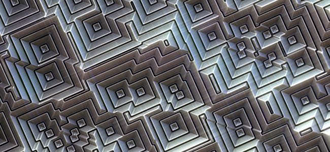
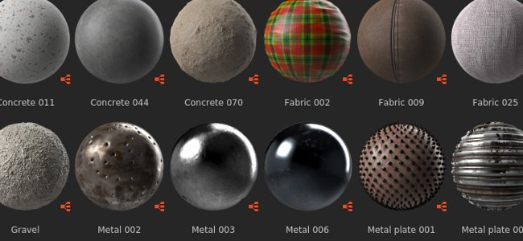

# Version 2020.2 (10.2)

**Substance Designer 2020.2** apporte une nouvelle mise à jour des Substances Engine, un workflow amélioré pour l&#39;exposition des paramètres, des améliorations de performances et un nouveau contenu.

Date de publication : *12 octobre 2020*

## Principales fonctionnalités

### Nouvelle mise à jour du moteur (version 8)

Dans cette nouvelle version, la Substance Engine est maintenant dans la version 8 et apporte de nouvelles fonctionnalités et plusieurs améliorations :

* **Valeurs par défaut pour les images d&#39;entrée**\
  Les entrées d’image dans graph peuvent désormais définir une couleur par défaut, ce qui rend pratique la définition d’une valeur appropriée lorsque rien n’est chargé ou connecté à cette entrée.

  {width="600px"}

* **Nouveaux modes de distance**\
  [Le nœud de distance](../../../compositing-graphs/nodes-reference-for-com/atomic-nodes/distance/distance.md) a maintenant deux nouveaux modes qui changent la façon dont le calcul est effectué :

  * **Euclidienne** (mode d&#39;origine) : distance de ligne droite entre les points dans la géométrie euclidienne.
  * **Manhattan** : distance entre les points, mais contrainte sur une grille, similaire à des blocs urbains.
  * **Tchebychev** : distance maximale par rapport à la différence de deux points sur une grille de taille uniforme.

  {width="600px"}

* **Nouvelle interpolation de dégradé**&#x200B;[&#x200B; Le nœud de dégradé](../../../compositing-graphs/nodes-reference-for-com/atomic-nodes/gradient-map/gradient-map.md) possède un nouveau mode **Lisse** pour interpoler les touches, ce qui produit des transitions de couleurs beaucoup plus naturelles. Il fonctionne en regardant les clés de voisinage. Le mode précédent **Interpolation** a été renommé en **Tangente plate**.

  {width="600px"}

  

  Il existe également un paramètre supplémentaire pour le mode **Lisse** qui contrôle la longueur de la tangente utilisée pour calculer la courbe qui fusionne entre les couleurs. Une valeur de 0 signifie que les tangentes ont une longueur de 0, tandis qu’une valeur de ou 1 signifie que les tangentes seront égales à la moitié de la longueur entre deux touches.

  

* **Nœud de courbe amélioré**&#x200B;[&#x200B; Le nœud de courbe](../../../compositing-graphs/nodes-reference-for-com/atomic-nodes/curve/curve.md) peut désormais générer directement une image en niveaux de gris. Cette modification permet de définir une courbe et de l’exporter directement sans avoir à brancher au préalable une texture en dégradé.

  

### Amélioration du paramètre d’exposition

Le workflow d’exposition et de modification des paramètres a été amélioré pour être plus simple :

* **Les actions de menu améliorées** Les actions permettant d&#39;exposer et de modifier les paramètres exposés ont été séparées pour être plus explicites. De nouveaux raccourcis ont également été introduits pour modifier plus facilement et plus rapidement les paramètres exposés. Par exemple, il existe désormais un bouton dédié pour modifier la fonction d’un paramètre et une action dédiée pour accéder au paramètre de graphique exposé.

  

  

* **Configuration directe du nouveau paramètre à partir de la boîte de dialogue** Lors de l&#39;exposition d&#39;un paramètre, tous les contrôles réguliers tels que la description et les valeurs par défaut sont désormais accessibles à partir de la boîte de dialogue **Exposer le paramètre**. Cela facilite et accélère la configuration et la création de nouveaux paramètres de graphe, évitant ainsi d&#39;avoir à accéder à la vue des paramètres de graphe immédiatement après la création d&#39;un paramètre.

  {width="600px"}

### Configuration d’icônes améliorée pour le graphique en Substance

La configuration des vignettes dans le graphique en Substance est désormais beaucoup plus facile grâce à l’interface améliorée :

* **Génération automatique des vignettes de graphique**\
  Il est désormais possible de générer automatiquement un aperçu d’un graphique de Substance en cliquant simplement sur le bouton Générer en regard de l’icône dans les paramètres du graphique. Actuellement, il prend uniquement en charge les graphiques utilisant le workflow PBR Métallique/Rugosité comme nœuds de sortie. Lors de la génération de la vignette, l’intensité du displacement est calculée à partir de la valeur de Taille physique si elle est définie. Sinon, elle prend par défaut la valeur 0,1.

  {width="600px"}

* **Ajout de vignettes personnalisées avec les nouveaux boutons**\
  Nous avons ajouté plusieurs nouveaux boutons pour simplifier la configuration des vignettes personnalisées :

  * **Parcourir** : ouvrez une boîte de dialogue de fichier pour charger une image. Vous pouvez également cliquer sur l’icône de dossier en regard des boutons.
  * **Générer** : voir la démonstration ci-dessus.
  * **Coller** : chargez une image à partir du Presse-papiers.
  * **Supprimer** : supprimez l&#39;image actuellement affectée à l&#39;icône.

  

### Performances améliorées

Deux nouvelles optimisations ont été effectuées dans cette nouvelle version pour réduire le temps entre les itérations :

* **Amélioration des performances de calcul graphique**\
  Les nœuds de sortie sont maintenant directement calculés à la demande au lieu de calculer les nœuds intermédiaires en chemin (ce qui est maintenant dans une deuxième étape). Cette modification permet de prévisualiser les résultats d’un graphique beaucoup plus rapidement, même en ajustant les nœuds racine. Dans la comparaison ci-dessous, cette optimisation permet de voir plus d&#39;itérations du graphique dans la même période de temps (ici avec un matériau à une résolution 4K):

  

* **Amélioration de la dilatation et de la diffusion Bakers**\
  La génération de la dilatation et de la diffusion des textures cuites est désormais jusqu’à 4 fois plus rapide que dans les versions précédentes. Cela réduit le temps d&#39;attente entre les pâtisseries.

  

### Nouveau contenu

Cette version inclut l’ajout de quelques nouveaux nœuds, ainsi que des possibilités supplémentaires sur certains nœuds existants :

* **[Nouveau filtre Seuil](../../../compositing-graphs/nodes-reference-for-com/node-library/filters/adjustments/threshold/threshold.md)**&#x200B;ce nœud permet d&#39;isoler rapidement sous forme de masque noir et blanc une partie d&#39;une image en fonction d&#39;une entrée en niveaux de gris. En pratique, ce filtre est similaire au filtre Histogramme Scan existant, mais il est plus pratique à utiliser au quotidien. Pour en savoir plus, consultez la [page de documentation dédiée](../../../compositing-graphs/nodes-reference-for-com/node-library/filters/adjustments/threshold/threshold.md).

  {width="650px"}

* **[Nouveau filtre de section transversale](../../../compositing-graphs/nodes-reference-for-com/node-library/filters/effects/cross-section/cross-section.md)**&#x200B;ce nœud permet de visualiser la forme d&#39;une entrée en niveaux de gris en tant que profil, ce qui facilite considérablement la création de la carte de hauteur et des formes avec ce filtre en tant qu&#39;outil de débogage. Pour plus d&#39;informations, consultez la [page de documentation dédiée](../../../compositing-graphs/nodes-reference-for-com/node-library/filters/effects/cross-section/cross-section.md).

  {width="600px"}

  {width="600px"}

* **Amélioration du [Tile Generator](../../../compositing-graphs/nodes-reference-for-com/node-library/texture-generators/patterns/tile-generator/tile-generator.md) et du** [**Mosaïque Sampler**](../../../compositing-graphs/nodes-reference-for-com/node-library/texture-generators/patterns/tile-sampler/tile-sampler.md)\
  Ces deux nœuds disposent désormais de nouveaux paramètres pour développer d’autres capacités et utilisations :

  * **Conserver le rapport** : conservez le rapport des carreaux, vous n’avez pas besoin de compenser manuellement la taille lorsque le nombre sur les axes X et Y est inégal.
  * **Absolue** : conservez au carreau un pourcentage prédéfini de la largeur de l’image finale.
  * **Pixel** : définissez la taille du carreau en pixels.

  Pour plus de détails, consultez la [page de documentation dédiée](../../../compositing-graphs/nodes-reference-for-com/node-library/texture-generators/patterns/tile-generator/tile-generator.md).

  

### Divers

**Iray** a été mis à jour vers la version 2020.1.0 qui ajoute la prise en charge du nouveau GPU Ampere par Nvidia (tel que le RTX 3080 et le RTX 3090).

## Notes de mise à jour

### 2020.2.0

*(Publié Le 12 Octobre 2020)*

**Ajouté :**

* [Contenu] Ajouter un nœud « Section transversale »
* [Contenu] Ajouter la fonction « Cross product vec2 » à features.sbs
* [Contenu] Ajouter un nœud de valeur « Obtenir la taille »
* [Contenu] Ajouter la fonction « Orthogonal vec2 » à features.sbs
* [Contenu] Ajouter des fonctions Moyenne à des fonctions.sbs
* [Contenu] Ajouter un filtre Seuil
* [Contenu] Correspondance des couleurs : ajoutez une entrée de masque pour spécifier où appliquer le filtre
* [Contenu] Tile Generator/Sampler : ajout de nouvelles options pour contrôler la taille du motif
* [Contenu] Mise à jour du nœud Rendu PBR avec la valeur par défaut pour les entrées d’image
* [Paramètres] Ajoutez des icônes d’avertissement pour mettre en évidence les problèmes dans Paramètres de l’instance
* [Paramètres] Ignorer les instructions If visibles pour les entrées/sorties impliquant des paramètres auxquels une fonction est appliquée
* [Paramètres] Améliorer l&#39;UX pour l&#39;association de groupe
* [Paramètres] Reformulation de la façon d’exposer un seul paramètre
* [Paramètres] Mettre en surbrillance les paramètres exposés
* [Paramètres] Améliorer le nettoyage des paramètres inutilisés
* [Engine] Nœud de courbe : nouvelle option pour générer la texture de courbe
* [Moteur] Valeurs par défaut sur les images d’entrée
* [Moteur] Nœud de distance : nouveaux modes de distance (distances de Manhattan et de Tchebychev)
* [Moteur] Nœud de dégradé : nouveau mode d’interpolation pour avoir un mélange plus naturel entre les couleurs
* [Moteur] Certains paramètres sont maintenant grisés en fonction d’autres paramètres
* [UX] Accepter les couleurs RGB à 6 chiffres dans le champ hexadécimal du sélecteur de couleurs
* [UX] Évitez d’afficher les propriétés des commentaires dès qu’elles sont sélectionnées
* [UX] Afficher les groupes pertinents au début de l’écriture d’un nom de groupe
* [UX] Raccourci vers la réexportation des sorties graphiques
* [UX] Différencier toutes les zones de texte déroulantes des zones de liste déroulante standard
* [GraphRender] Affiche les nœuds une par une et pas seulement lorsqu’ils sont tous calculés.
* [GraphRender] Amélioration du délai d’annulation pendant le rendu des graphiques
* [GraphRender] Amélioration de la précision de la barre de progression du rendu
* [Vignettes] Calcul automatique des vignettes (icône)
* [Vignettes] Modification de l’interface utilisateur pour ajouter une vignette (icône) à un pack
* [Préférences] Activer le GPU raytracing par défaut pour les nouveaux utilisateurs
* [Préférences] 3DView / OpenGL / Quality : remplacez le curseur du nombre d’échantillons par une liste de choix plus intuitive
* [Boulangers] Améliorer les performances post-traitement
* [Gestion des couleurs] Afficher l’espace colorimétrique de travail actuel dans la boîte de dialogue des préférences.
* [Iray] Basculer automatiquement en mode CPU lorsqu’il n’y a pas de GPU compatible
* [Performances] Améliorer le temps de réponse pour calculer le nœud qui nous intéresse (maintenant calculé en premier)
* [API Python] Nouvelle méthode addActionToExplorerToolbar pour ajouter des icônes à la barre d’outils de l’explorateur
* [Ressources] Mise à niveau vers FBX 2020.0.1
* [iRay] Mise à jour vers Iray 2020.1.0
* [API] Ajout d’un accès Python aux paramètres et propriétés de gestion des couleurs

**Fixe :**

* [Graphique] La modification de la taille du gabarit ou du carreau uv n’annule pas le rendu actuel
* [Graphique] Blocage lors du déplacement d’une connexion de sortie en appuyant ensuite sur Alt+LMB
* [Graphique] Blocage lors du déplacement de connexions en mode Matériau ou Matériau compact
* [Graphique] Les nœuds d’entrée ne peuvent pas prévisualiser les ressources Bitmap
* [Graphique] Compatibilité des nœuds rompue sur les instances
* [Graphique] Trop de nœuds sont invalidés lors de la modification d’un paramètre de graphique
* [Contenu] La forme de sortie « Extrusion de forme » est inversée dans des cas spécifiques : nouvelle version requise, l’ancienne est obsolète
* [Contenu] Résultat incorrect à l’aide de la variation de couleur personnalisée dans le nœud Correspondance de couleur
* [Contenu] Le rapport Taille par quantité X/Y en Atlas scatter a l’effet inverse
* [Contenu] Le rapport entre la taille et la quantité sur X/Y dans Shape Splatter a l’effet inverse
* [Vue 3D] Blocage lors de l’opération Annuler après le chargement d’une ressource Scène à partir d’un package
* [Vue 3D] Environnement personnalisé non enregistré dans SBSSCN si le chemin a un alias avec des caractères spéciaux
* [Vue 3D] Le changement de format normal dans les paramètres de matière entraîne des états inversés
* [UI] Le texte du bouton « Définir comme principal » déborde de la zone d’affichage
* [UI] La position de la fenêtre principale n’est pas correctement restaurée lorsque vous travaillez en mode fenêtré
* [UI] Le texte de la barre d’état est décalé lorsque la fenêtre est en plein écran ou déplacée près du bord de l’écran
* [Iris] Blocage avec message « Balise non valide » lors du basculement entre les systèmes de rendu
* [Iray] Faces visibles sur les surfaces non opaques
* [Paramètres prédéfinis] Blocage lors de l’application de paramètres prédéfinis dans des instances de certains graphiques de Substance Source
* [Paramètres prédéfinis] nom erroné affiché après l&#39;annulation sur l&#39;instance sbs
* [Rendu] Mauvais rendu lors de l’ajustement d’un paramètre en mode aperçu
* [Boulangers] L’actualisation de plusieurs maps bakées entraîne des avertissements bloquant certains boulangers
* [Cooker] L’ajustement des nœuds SBSAR dans les instances SBS entraîne une sortie de 0 de l’instance
* [Explorer] Les alias personnalisés ne sont pas transmis lors de l’utilisation de « Enregistrer et ouvrir dans la Substance Player »
* [Éditeur de dégradé] La sélection de couleur absolue n’a pas d’impact sur toutes les touches sélectionnées
