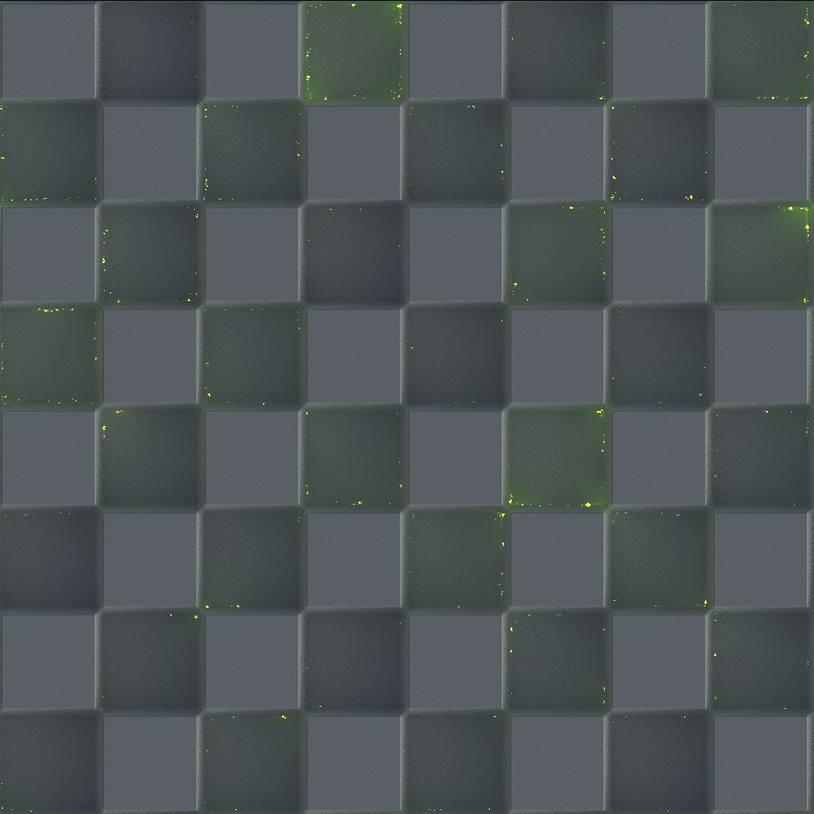

# Version 11.2

**Substance 3D Designer 11.2** a légèrement changé de nom et est maintenant connecté à Adobe Creative Cloud. Elle apporte la toute première version des graphiques de modèle de Substance de données, la fonctionnalité Envoyer vers, un certain nombre de nœuds basés sur Lancer de rayon et certaines modifications de l’interface utilisateur.

Date de publication : *23 juin 2021*

## Principales fonctionnalités

### Nouveaux graphiques de Substance

Un tout nouveau type de graphe, le graphe du modèle de Substance, est disponible. Il vous permet de créer des modèles 3D procéduraux à l’aide d’une interface de nœuds familière.

<table>
<tr style="border: 0;">
<td style="border: 0;" valign="top">

{width="300px"}

</td>
<td style="border: 0;" valign="top">

{width="300px"}

</td>
</tr>
</table>

N’oubliez pas de consulter la nouvelle section de documentation dédiée pour en savoir plus.

Il s’agit d’une première version, alors attendez-vous à quelques limitations.

### Fonctionnalité Envoyer à

Les versions Adobes de Substance 3D Designer possèdent une nouvelle fonctionnalité Envoyer vers, qui vous permet d’envoyer rapidement des actifs à d’autres applications Substance 3D. Plus besoin de publier au format SBSAR et de charger des fichiers individuels, Envoyer vers résout ce problème en un clic.

>[!NOTE]
>
> Les versions Steam de Substance 3D Designer ne disposent pas de la fonctionnalité Envoyer à.

### Nouveaux nœuds Lancer de rayon

Aucune version de Designer n’est terminée sans nouveaux nœuds. S&#39;appuyant sur la puissance phénoménale du Rendu PBR, 5 nouveaux nœuds basés sur la RT nous rejoignent dans cette version.

<table>
<tr style="border: 0;">
<td style="border: 0;" valign="top">

{width="300px"}

</td>
<td style="border: 0;" valign="top">

{width="300px"}

</td>
</tr>
</table>

La fonction RTAO offre un résultat encore meilleur à un AO précis et correct que le nœud HBAO précédent.

{width="300px"}

L’option Caustiques génère des caustiques physiquement corrects avec lancer de rayon basés sur une carte de hauteur, comme un simple bruit de Perlin. Parfait pour créer des textures de flipbook animées réalistes pour des réverbérations en temps réel.

{width="300px"}

RT Shadow génère des ombres précises avec lancer de rayons, avec quelques commandes simples.

<table>
<tr style="border: 0;">
<td style="border: 0;" valign="top">

{width="200px"}

</td>
<td style="border: 0;" valign="top">

{width="200px"}

</td>
<td style="border: 0;" valign="top">

{width="200px"}

</td>
</tr>
</table>

RT Irradiance est le plus avancé des nouveaux nœuds. Il effectue une irradiation par lancer de rayons à partir d’un matériau avec une carte d’height, une carte d’environnement et/ou une carte d’émission.

{width="600px"}

Cela signifie que vous pouvez créer des textures avec un éclairage précuit, comme pour les projets stylisés, ou vous pouvez appliquer une lueur de lancer de rayons rebondissant sur votre carte de hauteur.

{width="300px"}

Enfin, il y a le nœud Bent Normal. Par rapport à une conversion normale normale ordinaire, ce nœud utilise AO pour modifier votre mappage normal afin d&#39;utiliser ces informations d&#39;AO. Avant que vous n&#39;ayez besoin de boulons de maillage pour créer l&#39;effet, ce nœud le fait dans l&#39;espace de texture pour vous.

### Adobe Standard Material Shader

Dans le cadre de nos efforts pour unifier les matériaux et le rendu dans nos applications, le nouvel ombrage par défaut dans la vue 3D est l’ombrage de matériau standard Adobe. À première vue, il n’est pas différent de l’ancien ombrage de rugosité métallique PBR (il s’en inspire de toute façon), mais il prend en charge de nombreux canaux plus exotiques, ce qui vous permet de les prévisualiser sans avoir besoin d’un moteur de rendu externe.

### Modifications de l’interface utilisateur

De petites modifications ont été apportées à l’interface utilisateur, mais les plus évidentes sont un menu Fichier > Nouveau pack amélioré, qui vous permet de choisir le type de graphique, ainsi que des boutons améliorés et mis à jour dans la barre d’outils principale, offrant des raccourcis pour les nouveaux types de graphique et leur envoi à d’autres applications.

## Tutoriels

Vous trouverez ci-dessous nos tutoriels vidéo couvrant les nouvelles fonctionnalités :

## Notes de mise à jour

### 11.2.0

*(Publié Le 23 Juin 2021)*

**Ajouté :**

* [Branding] La Substance Designer devient Adobe Substance 3D Designer
* [Modèles de Substance] Nouveaux graphiques de modèles de Substance pour créer des modèles 3D procéduraux
* [Contenu] Ajout de nouveaux mappages d’environnement HDR
* [Contenu] Nouveau nœud Courbé normal
* [Content] Nouveau nœud d&#39;Occlusion ambiante RT
* [Content] Nouveau nœud RT Caustics
* [Content] Nouveau nœud RT Caustics
* [Contenu] Nouveau nœud d&#39;irradiation RT
* [Contenu] Nouveau nœud Ombres RT
* [Interopérabilité] Envoyer la ressource vers Painter, lance Painter et ajoute ou met à jour la ressource dans la bibliothèque (nécessite une formule Substance 3D Adobe)
* [Interopérabilité] Envoyer la ressource vers Sampler, lance Sampler et ajoute ou met à jour la ressource dans la bibliothèque (nécessite une formule Substance 3D Adobe)
* [Interopérabilité] Parcourez votre ressource dans Adobe Bridge et lancez Bridge à l’emplacement de la ressource (nécessite une formule Substance 3D Adobe).
* [ASM] Prise en charge du nouveau matériau Adobe Standard Material (ASM) dans Graphe Substance et MDL Graph
* [ASM] Ajouter des modèles ASM
* [ASM] Ajouter OpenGL Shader pour ASM
* [ASM] Définir ASM Shader comme shader par défaut
* [Général] Agréger tous les fichiers temporaires dans le répertoire temporaire défini par l’utilisateur
* [Général] Nouvelle commande Enregistrer une copie sous
* [Général] Menu Fichier de mise à jour
* [Général] Mettre à jour le menu Aide
* [Publish] Nouvelle fenêtre de publication
* [Publish] Ajoutez une option dans les préférences afin de ne pas enregistrer le fichier SBS lors de la publication d’un fichier SBSAR
* [Properties] Ajouter un champ de type de graphique aux propriétés du graphique
* [Propriétés] Réorganisez les propriétés des graphiques de manière plus pertinente.
* [Branding] Nouvelle fenêtre À propos
* [Branding] Mise à jour du style d&#39;application
* [GLSLFX] Ajout d’un libellé aux techniques
* [GLSLFX] Ajouter la possibilité de définir le libellé d&#39;un shader GLSLFX
* [Métadonnées] Ajouter des métadonnées aux ressources du package
* [Métadonnées] Autoriser l’édition de métadonnées pour les graphiques, les entrées, les sorties et les ressources
* [Localisation] Nouvelles traductions en allemand, français et chinois simplifié
* [UX] Inversez le zoom dans la vue 3D en cas de glissement de la souris
* [AXF] Mise à jour vers la version 1.8.0
* [Journaux] Ajout des plug-ins installés aux journaux
* [VFX] Ajouter la configuration ACES 1.2 OpenColorIO
* [API Python] Ajout d’une méthode pour interroger le répertoire tmp spécifié dans les paramètres
* [API Python] Ajoutez une méthode isModified à SDPackage pour vérifier si un pack est enregistré
* [API Python] Ajout de méthodes de conversion de couleurs à SDColorManagementEngine
* [API Python] Supprimer des objets graphiques (commentaires, épingles, cadres, ...)
* [API Python] Exposer la propriété de Taille physique pour les nœuds d&#39;instance de graphe
* [API Python] Exposer Enregistrer une copie sous
* [API Python] Correction de la méthode SDPackageMgr.savePackage
* [API Python] Obtenir une liste des objets graphiques sélectionnés
* [API Python] Introduction de nouveaux noms de méthode pour travailler avec des sélections de graphiques
* [API Python] Les plug-ins ne peuvent pas ajouter d’actions au premier panneau d’explorateurs créé

**Fixe :**

* [Paramètres] Les valeurs négatives sur les paramètres Entier1 déroulants entraînent un comportement incongru dans l&#39;instance
* [Paramètres] Problème lors de l’incrémentation d’une valeur sur un widget d’angle
* [Graphique] Problèmes de synchronisation lorsque la sortie est affichée dans la vue 2D ou 3D.
* [Internationalisation] Certains caractères spécifiques sont transformés en espaces dans les identificateurs de fichiers
* [Préférences] Le libellé du fichier « Projet utilisateur » n’est pas retraduit du japonais
* [API Python] Erreur de récurrence lors de l&#39;exécution de la méthode SDUIMgr.getCurrentGraphSelectedNodes()
* [API Python] SDApplication.getPath(SDApplicationPath.InstallationDir) ne renvoie rien
* [API Python] SDSBSARExporter n’envoie pas de notifications d’enregistrement de fichiers
