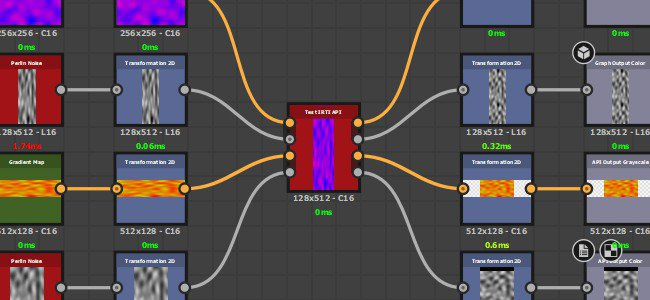
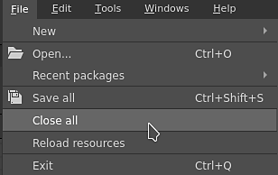
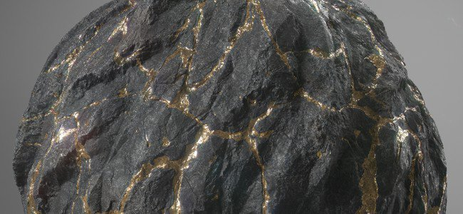
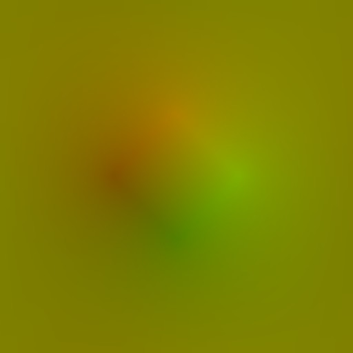

# Version 11.3

**Substance 3D Designer**

Date de publication : *24 novembre 2021*

## Fonctionnalité majeure

### Nouvelles fonctionnalités de graphe model

De nombreuses améliorations ont été apportées au graphe model pour étendre les capacités de modélisation :

* <b>Nouveau workflow de particule</b>\
  Le nouveau workflow de modélisation de particule permet de créer des nuages de points pour manipuler la géométrie. Ils peuvent être utilisés pour créer de nombreuses nouvelles formes complexes et/ou répétitives, telles que les tuiles du toit sur l’image juste au-dessus.\
  Pour en savoir plus sur le nouveau workflow de particule, consultez les pages de documentation suivantes :

  * Types d’éléments dans une scène
  * Particules
  * Rognage de particule
  * Particules d&#39;instances

  

* <b>Nouveaux nœuds de modélisation et de déformation</b>\
  D’autres nœuds ont été ajoutés pour créer des formes plus complexes. Cliquez sur chaque nœud pour en savoir plus :
  * Transformation générative
  * Motif organique
  * Tour
  * Rognage de courbe

* <b>Améliorations générales\
  </b>Le workflow autour du graphe de modélisation a été amélioré avec :
  * Nouvelles info-bulles sur les paramètres des nœuds pour faciliter leur apprentissage.
  * La hiérarchie du modèle 3D est désormais conservée lors de l’exportation au format FBX
  * L’affectation de matériau peut être exportée aux formats de fichier OBJ et FBX.
  * Prévisualisation des nœuds intermédiaires dans le viewport en mode d’incrustation.

### Interopérabilité améliorée

Les actions d&#39;envoi ont été étendues, avec deux nouvelles possibilités :

* **Envoyer SBSM (fichier de modèle substance) à Stager**\
  Les modèles 3D procéduraux peuvent désormais être envoyés à Stager et modifiés à partir de là avec les paramètres exposés.

* **Recevoir SBS/SBSAR de Sampler**\
  Il est désormais possible de recevoir des fichiers de Substance générés par Sampler directement dans Designer.

### Divers

Diverses améliorations ont été apportées à la qualité de vie :

* **Entrées par rapport aux entrées**\
  Les entrées de graphique définies dans Relative aux entrées héritent désormais de la taille des nœuds connectés au lieu de la taille par défaut du graphique parent. Cela facilite considérablement la gestion des différentes résolutions via des entrées de tailles différentes.

  {width="400px"}

* **Nouvelle fenêtre graphique**\
  La nouvelle fenêtre de graphique a été retravaillée et permet désormais de mieux voir les détails d’un modèle spécifique et de créer un graphique directement dans un package existant.

  {width="400px"}

* **Fermer tous les packages**\
  Une petite action qui rend moins fastidieuse la gestion de nombreux packs dans l’explorateur. Utilisez **Fichier** > **Fermer tout** pour fermer tous les packs actuellement ouverts.

  

* **Agrandir la vue actuelle**\
  Utilisez la nouvelle icône de barre de titre **icône** ou le raccourci **MAJ+Espace** pour développer une fenêtre en plein écran. Cela peut également être utilisé sur une fenêtre flottante.

* **Améliorations de la vue 3D**\
  La vue 3D dispose de nouveaux paramètres d’affichage pour basculer entre l’affichage des faces arrière d’un modèle 3D et l’affichage des sommets, des tangentes et des bitangentes.

### Contenu

Cette version ajoute de nouveaux nœuds de diffusion et des améliorations pour le nœud Rendu PBR :

* <b>Nœuds de diffusion</b>\
  Les nouveaux nœuds de couleur de diffusion, de niveaux de gris de diffusion et de diffusion UV permettent de générer des flous de saignement doux à partir d’un masque d’entrée.

  {width="230px"}

   

* **Nœud de Rendu PBR amélioré**\
  Ce nœud a subi les modifications suivantes :
  * Nouveau mode UV cubique pour la forme sphère.
  * Prise en charge de la diffusion de surface.
  * L&#39;Anisotropie suit maintenant le modèle Adobe Strand Material 5ASM).
  * L’éclairage basé sur l’image a été amélioré grâce à l’échantillonnage de l’importance.
  * L’éclairage émissif a été amélioré grâce à l’échantillonnage de l’importance.

## Notes de mise à jour

### 11.3.0

*(Publié Le 24 Novembre 2021)*

**Ajouté :**

* [Modèles de Substance] Ajout d’info-bulles pour les paramètres des nœuds
* [Modèles de Substance] Permet d&#39;afficher dans l&#39;incrustation dans la fenêtre 3D le résultat d&#39;un nœud intermédiaire
* [Modèles de Substance] Amélioration de l’affichage des bases
* [Modèles de Substance] Conservez la hiérarchie des objets lors de l’exportation d’un graphique de modèle de Substance au format .fbx
* [Modèles de Substance] Prise en charge de plusieurs matériaux dans l’exportation FBX/OBJ à partir du graphique Modèle de Substance
* [Modèles de Substance][Contenu] Nœud de particule
* [Modèles de Substance][Contenu] Nœud Transformation générative
* [Modèles de Substance][Contenu] Nœud Motif organique
* [Modèles de Substance][Contenu] Particules du nœud Instances
* [Modèles de Substance][Contenu] Nœud de taille des particules
* [Modèles de Substance][Contenu] Nœud de tour
* [Modèles de Substance][Contenu] Nœud Shell
* [Modèles de Substance][Contenu] Nœud de projection
* [Modèles de Substance][Contenu] Nœud de rognage de courbe
* [Modèles de Substance][Contenu] Mettre à jour le nœud Curve Sampler
* [Modèles de Substance][Contenu] Mettre à jour le nœud Mesh Sampler
* [Modèles de Substance][Contenu] Mettre à jour le nœud de variation
* [UX] Bouton pour agrandir la vue actuelle
* [UX] Mettre à jour la fenêtre Nouveau graphique
* [UX] Ajouter l&#39;option « Télécharger le lecteur » dans le menu Outils et l&#39;agréger avec « Localiser le lecteur »
* [UX] Ajouter l’entrée « Tout fermer » au menu Fichier
* [UX] Appliquer la même casse dans tout le menu principal
* [UX] Afficher automatiquement les propriétés des éléments de graphique dupliqués
* [UX] Ajoutez des boutons dans la barre d’outils du graphique pour désactiver la taille d’écran constante pour les titres d’image / commentaires / épingles
* [UX] Boutons pour copier les informations de version dans le Presse-papiers dans la boîte de dialogue À propos
* [Matières] Entrées relatives aux entrées
* [Contenu] Ajout de l’option Limites sur les bruits Perlin 3D
* [Contenu] Nouveau nœud de processus de diffusion
* [Contenu] Nouvelle version du nœud de Rendu PBR
* [Interopérabilité] Recevoir SBS et SBSAR de Sampler
* [Interopérabilité] Envoyer SBSM à Stager
* [Vue 3D] Ajout d’une option pour désactiver l’abattage du dos
* [Vue 3D] Ajout d’une option pour afficher l’espace tangent des sommets
* [Explorateur] Mettre en surbrillance le graphique dans l’Explorateur lorsque vous double-cliquez sur l’arrière-plan de la vue Graphique
* [Explorer] Supprimer l’option « Explorer » dans les menus contextuels
* [Boulangers] Masquer les boulangers obsolètes
* [Gestion des couleurs] Ajout de la prise en charge des règles du fichier de configuration OCIO v2
* [Bibliothèque] Renommer les catégories en fonction des types de graphiques
* [Préférences] Désactivez automatiquement le processeur dans les préférences matérielles d’Iray si un GPU CUDA pris en charge est détecté

**Fixe :**

* [Modèles de Substance] Blocage sur Mac lors de l’utilisation de l’option « as sudb » sur .fbx
* [Modèles de Substance] Blocage lors de l’exportation vers SBSM dans un cas spécifique
* [Modèles de Substance] Échec de l’exportation lors de l’exportation des paramètres exposés dont les widgets n’ont jamais été créés
* [Modèles de Substance] Blocage aléatoire lors de l’ouverture d’un graphique faisant référence à plusieurs fichiers .fbx
* [modèles de Substance] Les plages ne sont pas appliquées dynamiquement dans les widgets des paramètres exposés
* [Modèles de Substance] L’option Recharger le filet ne fonctionne pas sur les ressources utilisées dans le graphique des modèles de Substance
* [Modèles de Substance] Les scènes ne s’affichent pas dans une vue 3D disponible dans un cas spécifique
* [UI] La zone de désactivation est trop grande dans les options de matière
* [UI] Problème de style dans la boîte de dialogue « Fichier de package non enregistré »
* [UI] Appuyez deux fois sur la touche de tabulation pour naviguer entre les valeurs.
* [UI] Le zoom avec la souris est inversé entre la vue 3D et les autres fenêtres.
* [UI] Le chargement d’un fichier SBS déjà ouvert à l’aide de la liste « Fichiers récents » déclenche une invite « Package introuvable »
* [UI][macOS] Disposition d’interface par défaut incorrecte après le démarrage de l’application
* [UI] Les packages ne peuvent pas être enregistrés à la racine d’un lecteur (Windows uniquement)
* [Graphique] L’option « Afficher automatiquement dans la vue 2D » est incohérente dans un cas spécifique.
* [Graphique] L&#39;option « Ouvrir la référence » est disponible pour les nœuds d&#39;instance SBSAR
* [Graphique] Les propriétés des épingles ne s’affichent que lors de la création d’un élément
* [Graphique] Les règles de chaîne d’épingles sont appliquées de manière incohérente
* [Graphique] Blocage lors de l’enregistrement d’un graphique vide
* [Vue 3D] L’angle d’Anisotropie est inversé dans le shader ASM
* [Vue 3D] ASM Shader : problèmes de linéarisation avec les mappages associés à SSS
* [Vue 3D] Rendu OpenGL rompu après la fermeture de vues 3D supplémentaires dans un cas spécifique
* [Vue 3D] Les positions de caméra prédéfinies ne sont pas correctes dans la vue 3D avec certains fichiers .fbx
* [MDL] L’option « Ajouter un nœud » du menu contextuel ne fonctionne pas pour les graphiques MDL.
* [MDL] Bogue : la connexion du nœud échoue lors de l’utilisation de composants float2.x et similaires (SD 11.1.2)
* [MDL] Blocage lors de l’ouverture d’un fichier .sbs spécifique
* [MDL] Unités de scène par mètre en iris non définies au début de la session de rendu
* [MDL] Se bloque lors de l’ajustement d’un nœud LDAP dans le graphique MDL
* [MDL] Ordre des paramètres dans le code MDL exporté
* [Explorer] un dossier de ressources vide est créé après l&#39;annulation de la création de la ressource
* [Explorateur] Seul le premier élément d’un package peut être déplacé vers le bas de la liste
* [Content] RT Bent Normal et RT AO déclenchent le calcul des nœuds dans les graphiques imbriqués
* [Nœud d’entrée] Le bitmap dans Nœuds d’entrée n’est pas mis à jour lorsque l’UDIM est modifié
* [Iray] L’affichage d’une scène de modèles de Substance avec de nombreuses instances prend beaucoup de temps
* [Préférences] Ligne vide lors de l’annulation de l’ajout d’un fichier de projet
* [Éditeur Python] L’option « Fermer » reste activée après la fermeture du dernier script et inclut toujours son nom e
