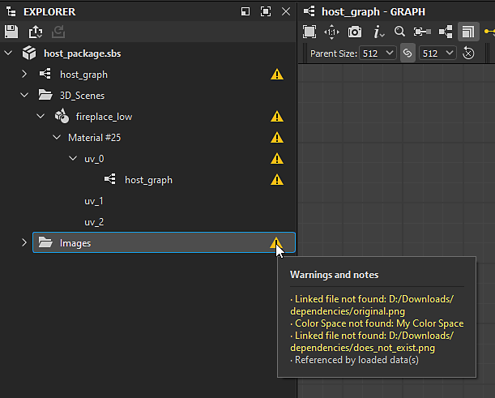

# Version 12.1

**Substance 3D Designer 12.1** apporte de nombreux nouveaux nœuds pour les graphes de matériau de Substances, la prise en charge des formats de fichier USD et une plus grande interopérabilité avec Stager.

Date de publication : *26 avril 2022*

## Fonctionnalité majeure

### Nouveau contenu pour les graphes de matériau de Substance

Beaucoup de nœuds ont été ajoutés dans cette version, vous y trouverez de nouveaux motifs, de nouveaux bruits, de nouveaux filtres, ...

Jetez un œil aux pages de nœuds liées ci-dessous pour des exemples de l&#39;ampleur de la sortie qui est réalisée par ces nouveaux nœuds puissants !

* **Nouveaux motifs**

  * Nous avons ajouté un nouveau nœud <b>Mosaïque aléatoire 2</b> pour générer des mosaïques adjacentes de tailles et de rapports aléatoires, ce qui est très utile pour créer rapidement des grilles totalement irrégulières avec des coins et des biseaux inclinés et arrondis.

    {width="640px"}
  * Nouveau motif de <b>Triangle Grid</b> pour générer une grille composée de triangles. Nous l&#39;utilisons dans le matériau ci-dessous pour simuler facilement et parfaitement le grain du cuir. Ce générateur représente une surface de vertex dans l’espace 3D et peut être utilisé pour créer divers styles polygonaux.

    {width="640px"}
* **Nouveaux Bruits**

  * Afin de vous donner plus de variété, un ensemble de <b>15 nouvelles cartes d&#39;Usure/salissures</b> (béton, fuites, éclaboussures sales, ...) a été ajouté à la bibliothèque.

    {width="640px"}
  * Vous trouverez également de <b>nouveaux Bruits 2D et 3D</b>, tels que Voronoi (2D et 3D), Voronoi Fractal (2D et 3D), 3D Ridged Fractal et une mise à jour du Bruit Perlin 3D actuel (ajout de répétition et d’options absolues).\
    Ces bruits sont tous cartographiés dans l&#39;espace 3D et offrent plusieurs styles, ce qui permet une plus grande variété et un contrôle qui vous donnera beaucoup de choix pour créer la carte parfaite pour votre matériau, comme la mer et les panneaux de science-fiction matériaux ci-dessous.

    {width="640px"}

    {width="640px"}
  * Collection de <b>nœuds de Texture 3D</b> (position, SDF, décalage) et de <b>nœuds de rendu 3D </b> (surface ou volume) permettant de créer et de rendre des textures 3D, qui sont un atlas des tranches d’un modèle 3D.

    {width="640px"}

* **Nouveaux filtres**

  * Avec le nœud <b>Recadrage automatique</b>, vous pouvez placer une forme au *centre* de l&#39;image sans être redimensionnée, ou la redimensionner pour l&#39;adapter à l&#39;espace. Par exemple, votre forme peut être librement modifiée tout en conservant une position et une taille cohérentes lorsqu’elle est dispersée.

    {width="640px"}
  * Avec le nœud <b> Extend Shape</b>, vous pourrez étirer une section d&#39;une forme dans une direction et une distance personnalisées.

    {width="640px"}
  * Et avec le nœud <b>Rotation non uniforme</b>, vous pouvez faire pivoter une entrée en fonction d&#39;un mappage donné.

    {width="640px"}
* **Et aussi...**

  * Des fonctions d&#39;accélération (graphe de fonction) très utiles pour piloter une valeur de manière non linéaire.
  * Enfin, cette version apporte également une nouvelle version plus précise du nœud <b>Quantize</b>, ainsi qu&#39;un tout nouveau filtre utilitaire <b>Summed Area Table</b>.

### Amélioration de l’interopérabilité

* **Support USD** En plus du

  et

  formats de fichier, vous pouvez désormais importer et exporter des fichiers USD (

  ,

  ,

  ) afin de les utiliser comme ressources de vos Graphes Substance models, pour le baking ou dans la vue 3D pour présenter votre matériau de Substance. Vous pouvez également utiliser ce format pour exporter votre Graphe Substance model ou le contenu de la vue 3D.
* <b>Envoyer vers Stager\
  </b>Vous pouvez désormais envoyer votre matériau de Substance à Stager en un clic, comme cela était déjà possible avec Sampler et Painter. Grâce à cette fonctionnalité, plus besoin de publier en tant que SBSAR et de charger des fichiers individuels (nécessite Stager version 1.2.0 avec le nouveau gestionnaire de matériau)

  

### Divers

* Si vous travaillez sur des tissus, vous pouvez désormais afficher un maillage dédié dans la vue 3D afin de mieux voir comment votre matériau est rendu sur une forme drapée. Ouvrez le menu <b>Scène</b> dans le panneau Vue 3D et sélectionnez l&#39;option <b>Tissu</b> pour afficher ce modèle.

  {width="640px"}

* Nous avons également ajouté de nouveaux nœuds de gestion des scènes pour les Graphes Substance models. Ces nœuds vous permettent de renommer, redéfinir la parenté, fusionner ou développer vos éléments de scène de données afin d&#39;organiser votre hiérarchie de scène de données. Il existe également un nouveau nœud pour définir le pivot d&#39;un ou plusieurs éléments d&#39;une scène.

* Lorsque vous travaillez sur des projets dans Designer, vous pouvez rencontrer des avertissements et des messages d’erreur, qui vous informent d’un problème dans le projet. Dans cette version, nous <b>améliorons le système de gestion des erreurs</b> afin de faire apparaître toutes les erreurs et tous les avertissements dans l&#39;Explorateur : tout est répertorié au même endroit et il est donc plus facile de vérifier si votre projet contient des problèmes.

  {width="640px"}

## Notes de mise à jour

### 12.1.0

*(Publié Le 19 Avril 2022)*

<b>Ajouté :</b>

* [Main] Nouveau contenu pour les graphes de matériau
* [Main] Envoyer des Matériaux à Stager
* [Principal] Prise en charge des fichiers USD
* [Principal] Amélioration du signalement des erreurs dans l’interface utilisateur
* [Principal] Nœuds de gestion des Scènes pour les graphes models
* [Contenu] Ajout d’options supplémentaires aux Bruits Perlin 3D (répétition, absolu...)
* [Contenu] Nouveau nœud fractal Bruit 3D ridged
* [Contenu] Nouveau nœud Décalage de Texture 3D
* [Contenu] Nouveau nœud de position de Texture 3D
* [Contenu] Nouveau nœud de surface de rendu de Texture 3D
* [Contenu] Nouveau nœud de volume de rendu de Texture 3D
* [Contenu] Nouveau nœud de Champ de distance signée de Texture 3D
* [Contenu] Nouveau nœud de recadrage automatique
* [Contenu] Nouvelles fonctions d’accélération
* [Contenu] Nouveaux nœuds Extend Shape
* [Contenu] Nouvelles Cartes D’Usure/salissures
* [Content] Nouveau nœud de rotation non uniforme
* [Content] Nouveau filtre Tableau de zones de somme
* [Contenu] Nouveau générateur Tile Random 2
* [Contenu] Nouveau générateur de motif de Triangle Grid
* [Content] Nouvelle version du nœud Quantize Grayscale
* [Contenu] Nouveaux Bruits fractaux Voronoi et Voronoi (2D/3D)
* [Contenu] Seuil : ajout du mode de comparaison « Inférieur » et « Inférieur et égal »
* [Content]&#x200B;[vue 3D] Ajoutez un ajustement de maillage pour afficher les fabric dans les ressources livrées
* [Modèles de Substance] Nouveau nœud Développer les instances de groupe
* [Modèles de Substance] Nouveau nœud de Fuse
* [Modèles de Substance] Nouveau nœud Renommer
* [Modèles de Substance] Nouveau nœud Reparent
* [Modèles de Substance] Nouveau nœud Définir le pivot
* [Substance models] Mise à jour vers SDK 1.6.0
* [ThirdParty] Mettre à niveau Qt (et QtForPython) vers 5.15.8
* [Tiers] Mise à niveau de Python vers la version 3.9.9
* [Tiers] Mise à niveau d’OpenSSL vers la version 1.1.1m
* [UI] Amélioration du comportement du menu Nœud en cas de clic incorrect
* [UI] Ouvrir les sous-graphes dans le même onglet, même épinglés
* [UI] Supprimer le bouton d’Épingle de la barre de titre du panneau Explorateur
* [UI] Enregistrer l’option « Ne plus afficher » sur l’écran de bienvenue dans toutes les versions
* [vue 3D] Affichez l’unité de Grille dans le viewport lorsque l’assistant Axe est activé
* [Automatisation] Fournir l’outil de ligne de commande sbsbaker avec Designer
* [Gestion des couleurs] Implémentation d’un nouveau back-end GPU pour Adobe ACE
* [Cooker] Ajouter une option pour cuisiner un paquet sans horodatage
* [Graphe] Ajout de badges dans le graphe FxMap
* [Bibliothèque] Ajout d’un nouveau filtre pour les fonctions d’accélération
* Prise en charge d’USD par [Player]
* [Properties] Ajoutez une erreur d&#39;avertissement sur le paramètre « PKG Resource Path » d&#39;un nœud Bitmap lorsque la ressource est introuvable
* [Substance Engine] Mise à niveau vers la version 8.4.1
* [Yebis] Avertissez l&#39;utilisateur que les effets de post-traitement Yebis seront supprimés dans la prochaine version
* [Documentation] Nouvelle page « Avertissements et erreurs »
* [Documentation] Nouvelle page décrivant l’héritage dans les graphes de Substance
* [Documentation] Mise à jour de la section « Iray »
* [Documentation] Mise à jour de la section « Graphes MDL »

<b>Fixe :</b>

* [UI] Problèmes d’écrêtage dans les info-bulles des modèles dans la nouvelle fenêtre de graphe
* [UI] Texte blanc difficile à lire dans les nœuds lors de l’utilisation du mode sombre dans macOS
* [UI] Problème de disposition dans certaines boîtes de dialogue
* [UI] Le message d&#39;avertissement s&#39;affiche tronqué lors de la création du graphe de fonction de Substance dans Explorateur.
* [UX] Le sélecteur de couleurs descend à chaque nouvelle ouverture
* [UX] La fenêtre de l’éditeur de dégradé s’ouvre à chaque apparition
* [UX] Les propriétés de Graphe ne s&#39;affichent pas automatiquement pour les packages chargés
* Mappeur de Flood Fill [Content] : sélection d&#39;entrée incorrecte dans un cas spécifique
* [Contenu] Flood Fill : fond perdu de texte dans les boutons de paramètres booléens
* [Contenu] Plage incorrecte pour le paramètre Angle du premier échantillon de lumière du nœud Plusieurs angles vers Normal
* [Modèles de Substance] Les propriétés du nœud affichent identifiant au lieu de libellé
* [Modèles de Substance]&#x200B;[Vue 3D] Problème d’actualisation lors de la réouverture d’un projet
* [Modèles de Substance]&#x200B;[3Dview] Problème d’actualisation lors de l’utilisation de l’aperçu structure filaire
* [Paramètres] Crash lors de la suppression d’entrées de graphe en succession rapide dans un cas spécifique
* [Paramètres] Crash lors de la réinitialisation d&#39;un paramètre d&#39;instance lors de la modification de sa description de référence
* [Bitmap] La détection UDIM n&#39;est pas déclenchée pour les fichiers bitmap déposés dans le graphe
* [Graphe] Les nœuds de bitmap/SVG ne sont pas invalidés lorsque la ressource est modifiée sur le disque après le chargement du package
* [GraphRender] Fuite de mémoire lorsque l’évaluation du graphe de Substance est annulée
* [Localisation] La chaîne « Rebake all maps for this resource » apparaît non localisée
* [MDL] Paramètre exposé initialisé à 0 si l&#39;entrée est connectée à un nœud Point non connecté
* [Préférences] Les info-bulles s’affichent même lorsque le curseur se trouve dans un espace vide
* [Propriétés] L’annulation d’une modification de la valeur d’espace colorimétrique définit la valeur par défaut dans un cas spécifique
* [Text] Impossible d&#39;annuler le changement de police vers une ressource de police manquante
