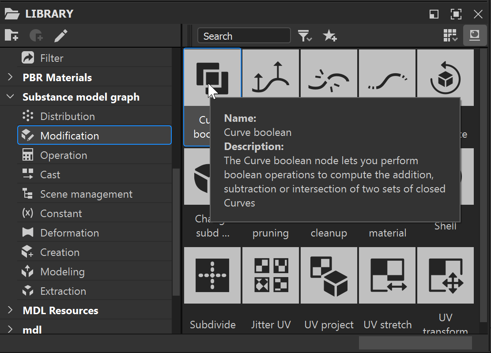
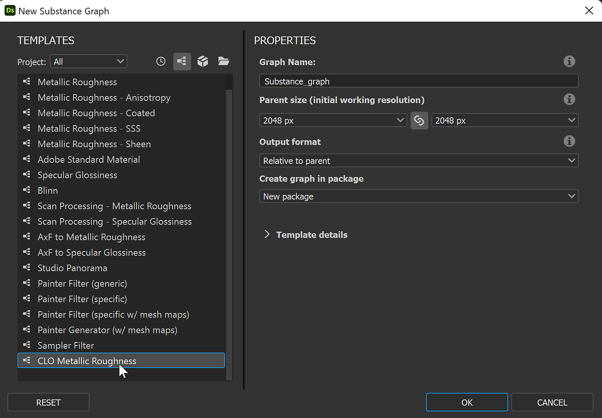

# Version 12.2

<b>Substance 3D Designer 12.2</b> apporte la prise en charge native des machines avec puce Apple (M1), certaines améliorations pour les Graphes Substance models et d’autres petites mises à jour. Cette page décrira tous les détails concernant cette nouvelle version.

Date de publication : *19 juillet 2022*

## Principales fonctionnalités

### Prise en charge native des puces Apple Silicon (M1)

La version 12.2 de Designer est la première à bénéficier de la prise en charge native complète des nouveaux ordinateurs Apple équipés de la puce M1. Bien que Designer puisse s’exécuter techniquement sur les appareils Apple Silicon précédemment, la prise en charge native vous offrira une expérience plus rapide et plus efficace. Comme vous pouvez le voir sur l&#39;image ci-dessous, les calculs sont *jusqu&#39;à deux fois plus rapides* avec cette nouvelle version sur ces ordinateurs.

{width="600px"}

### Améliorations pour les Graphes Substance models

* <b>Info-bulles sur les nœuds\
  </b>Il n&#39;est pas toujours possible d&#39;expliquer ce qu&#39;un nœud fait avec une simple icône et un titre. C&#39;est pourquoi nous avons maintenant une info-bulle avec une *description complète du nœud* lorsque vous êtes dans la bibliothèque ou dans la Vue du graphe de données. Il vous aidera à trouver le nœud que vous recherchez ou à mieux comprendre quelles sont ses capacités. 

* <b>Raccourcis pour la création de nœuds\
  </b>Pour accélérer la création de vos nœuds les plus utilisés, vous pouvez désormais définir vos propres raccourcis dans les Préférences, comme pour les autres types de graphes.

* <b>Aperçu du nœud à partir du menu contextuel du nœud\
  </b>Dans notre dernière version, nous avons ajouté la possibilité de prévisualiser un nœud dans la vue 3D grâce à un raccourci du clavier (*MAJ+clic* sur un nœud). Cette fonctionnalité est désormais également disponible dans le *menu contextuel des nœuds* afin de la rendre plus facilement identifiable.

  {width="600px"}
* <b>Rechercher en fonction de la compatibilité des nœuds\
  </b>Lorsque vous recherchez un nœud dans le menu des nœuds (accessible en appuyant sur *barre d&#39;espace* dans la Vue du graphe de données), les nœuds sont désormais correctement filtrés afin d&#39;afficher uniquement ceux qui sont *compatibles avec celui actuellement sélectionné* dans le graphe. Cela vous aide à trouver rapidement le nœud que vous recherchez.

### Divers

* <b>Améliorations de vue 2D</b>\
  Alors qu&#39;il était possible dans les versions précédentes d&#39;afficher les sorties du graphe dans la vue 3D via le *menu contextuel* du graphe de Substance, il n&#39;était pas possible d&#39;afficher une sortie du graphe dans la vue 2D. Cette option a été ajoutée à ce menu, avec un sous-menu répertoriant toutes les sorties du graphe à afficher dans la vue 2D.\
  Le bouton « Afficher les sorties » de la barre d&#39;outils vue 2D a également été mis à jour avec une flèche vers le bas et une info-bulle afin de rendre son comportement plus clair.\
  Enfin, l&#39;option « sorties du graphe d&#39;affichage automatiques lors du chargement d&#39;un graphe » dans les Préférences a été *divisée en deux paramètres distincts*, pour vue 2D et vue 3D respectivement, afin de vous permettre de contrôler la vue à ouvrir et à remplir automatiquement lorsque vous chargez un graphe.

* <b>Modèle CLO</b>\
  Afin d&#39;améliorer l&#39;interopérabilité avec le logiciel CLO, nous avons ajouté un *nouveau modèle dédié*. Cela ajoutera automatiquement à votre graphe toutes les *métadonnées* requises pour importer correctement votre matériau dans CLO.

  {width="600px"}

* <b>Configuration requise pour la plateforme de référence VFX</b>\
  Chaque année, la Plateforme de Référence VFX publie une liste d&#39;outils et de bibliothèques à utiliser dans chaque logiciel pour l&#39;industrie des effets visuels afin de minimiser les incompatibilités entre les logiciels. Comme d&#39;habitude, nous *mettons à jour toutes nos dépendances* afin de respecter toutes ces recommandations.

## Notes de mise à jour

### 12.2.0

*(Publié Le 19 Juillet 2022)*

<b>Ajouté :</b>

* [Apple] Prise en charge native d’Apple Silicon (M1) (version pour Creative Cloud uniquement)
* [Graphe Substance model] Afficher les info-bulles des nœuds dans la Vue du graphe
* [Graphe Substance model] Afficher les info-bulles des nœuds dans la bibliothèque
* [Graphe Substance model] Ajout d’une entrée de menu contextuel pour prévisualiser les nœuds
* [Graphe Substance model] Autoriser l’utilisateur à créer des raccourcis pour la création de nœuds
* [UI] Ajouter l’option « Afficher la sortie en vue 2D » dans le menu contextuel du graphe de Substance
* [UI] Fractionner le paramètre « Affichage automatique des sorties » en paramètres spécifiques à vue 2D/vue 3D
* [UI] Ajouter une flèche déroulante et une info-bulle au bouton « Afficher la sortie » dans la barre d’outils vue 2D
* [UI] Reformulation et réorganisation des éléments dans le panneau Informations de l’Explorateur
* [Gestion des couleurs] Ajoutez les espaces colorimétriques d’exportation Adobe RVB linéaire (1998) et Adobe RVB (1998) pour Adobe ACE.
* [Gestion des couleurs] Ajouter l’espace colorimétrique de travail « Linear Adobe RGB (1998) » pour Adobe ACE
* [Gestion des couleurs] Prise en charge des écrans OCIO ICC
* [Gestion des couleurs] Masquer l’espace colorimétrique de travail d’Adobe RGB dans les préférences ACE
* [Gestion des couleurs] Amélioration de la qualité des tables LUT 3D bakées en mode ACE
* [Gestion des couleurs] Utiliser le nouveau back-end GPU dans la visionneuse 3D
* [Localisation] Mise à jour complète de la langue coréenne
* [Moteur] Mise à jour vers la version 8.6.0
* [Graphe] Affectez un identifiant de graphe par défaut lorsque cette propriété reste vide
* [Bibliothèque] Désactiver les hyperliens des info-bulles pour les non-instanciers
* [NewProject] Mise à jour de la résolution par défaut
* [Modèles] Ajouter un modèle CLO
* [API] Exposer la propriété defaultParentSize pour les objets SDSBSCompGraph
* [Dépendances] Mettre à jour Alembic vers la version 1.8.3
* [Dépendances] Mettre à jour AXF vers la version 1.9.0
* [Dépendances] Mettre à jour Boost vers la version 1.76
* [Dépendances] Mise à jour de FBX vers la version 2020.2.1
* [Dépendances] Mise à jour de l’Iray version 2021.1.0
* [Dépendances] Mettre à jour OpenColorIO vers la version 2.1.1
* [Dépendances] Mise à jour de l’OpenEXR version 3.1.5
* [Dépendances] Mettre à jour TBB vers la version 2020.3
* [Dépendances] Mettre à jour USD vers la version 0.22.3
* [Supprimer] Désactiver la fonction effets de post-traitement (Yebis)
* [Supprimer] Supprimer la commande « Enregistrer le rendu dans Artstation » du menu vue 3D

<b>Fixe :</b>

* [Modèles de Substance] La plage fixe définie sur le paramètre exposé est enregistrée lors de la désexposition
* [modèles de Substance] l&#39;Identifiant n&#39;est pas convivial sur les nœuds constants
* [Modèles de Substance] Améliorer la recherche en fonction de la compatibilité des nœuds
* [UI] L’ordre des sous-menus « Nouveau » est incorrect pour les ressources de dossier
* [UI] La taille par défaut de la fenêtre principale est très petite
* [UI] Les barres d’outils ne sont pas affectées par l’option « Réinitialiser la mise en page »
* [UI] grille de transparence visible sur l’icône de ressource de police dans Explorateur
* [Cooker] Les graphes de Substance instanciés dans le Graphe MDL sont toujours entièrement recuites
* [Graphe] Crash lors du collage d&#39;un nœud copié à partir d&#39;un graphe avec un identifiant vide
* [MDL] Crash lors de la fermeture d&#39;un Graphe MDL spécifique
* [Performances] L’application ne répond pas lors du chargement de packs très volumineux
* [Resources] La ressource scène 3D peut être importée dans un cas spécifique
