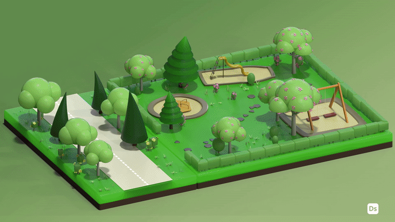
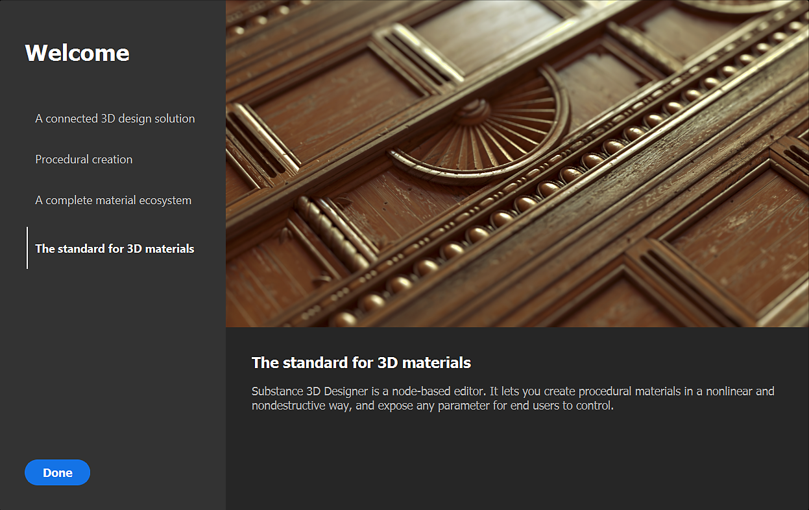
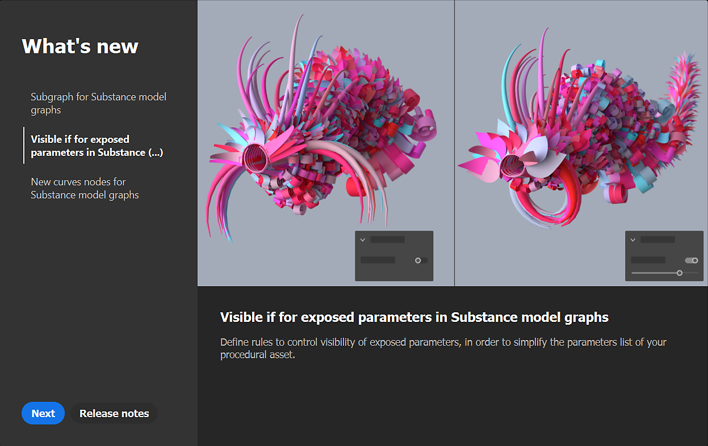

# Version 12.3

<b>Substance 3D Designer 12.3</b> porte les Graphes Substance models à un nouveau niveau avec la <b>prise en charge des sous-graphes</b> (ou des instances de graphe), plus<b> &#39;Visible if&#39; </b>contrôle pour les paramètres exposés et certains<b> nouveaux nœuds</b> dédiés à l&#39;édition des courbes. Cette version introduit également deux nouveaux panneaux (<b>Bienvenue </b> et <b>Nouveautés</b>) pour améliorer l’intégration des utilisateurs, ainsi que d’autres fonctionnalités mineures ou correctifs de bogues décrits ci-dessous.

Date de publication : *6 octobre 2022*

{width="1111px"}

## Principales fonctionnalités

### Soutien aux Instances de graphe dans les Graphes Substance models

Si vous avez l&#39;habitude de créer des graphes, vous voulez être en mesure de faire des sous-graphes (ou des instances de graphe) afin de réutiliser votre travail, de rendre les graphes moins encombrés et plus efficaces.\
Cela est désormais possible également pour les Graphes Substance models : il vous suffit de faire glisser votre sous-graphe de l’Explorateur vers votre graphe principal pour l’utiliser comme un instancier.

{width="600px"}

Nous avons également introduit le concept de nœuds de sortie pour les Graphes Substance models, tels que la scène de sortie. Vous avez désormais la possibilité d’avoir une ou plusieurs sorties dans votre graphe.\
Chaque sortie correspondra à une épingle de sortie lorsque votre graphe sera instancié dans un autre graphe.

{width="600px"}

Lorsque vous faites un clic droit sur un instancier, vous pouvez bien sûr accéder à son sous-graphe référencé afin de le visualiser ou de le modifier.

{width="600px"}

Grâce aux sous-graphes et aux paramètres exposés, vous pouvez créer des actifs complexes et appliquer des variations infinies, comme le montre l’illustration ci-dessous.

{width="600px"}

### Autres améliorations pour les Graphes Substance models

* <b>Visible si pour les paramètres exposés</b>\
  Lorsque vous exposez des paramètres, vous pouvez masquer ou afficher les paramètres en fonction de leur état. Par exemple, un curseur s’affiche uniquement lorsqu’un bouton est activé.\
  Avec <b>Visible si</b>, vous pouvez ajouter des conditions à la visibilité des paramètres, en conservant une interface utilisateur propre et fonctionnelle. Ce mécanisme déjà disponible pour les graphes de Substance est maintenant étendu aux Graphes Substance models, en utilisant, bien sûr, la même syntaxe. <b>\
  </b>

  {width="600px"}

* <b>Nouveaux nœuds dédiés à l’édition des courbes\
  </b>Cette version apporte de nouveaux nœuds dédiés à l&#39;édition de courbes : la <b>courbe inverse</b> échange les deux extrémités d&#39;une courbe, la <b>subdivision de courbe</b> ajoute plus de vertex sur les segments selon deux méthodes, la <b>courbe de lissage </b> lisse tous les angles sur une courbe 2D et enfin la <b>courbe de décalage</b> gonfle ou dégonfle une courbe 2D, comme indiqué ci-dessous.<b>

  </b>

  {width="600px"}
* <b>Nouvelle fenêtre de graphe </b>\
  La fenêtre <b>Nouveau Graphe Substance model</b> est désormais également disponible pour les Graphes Substance models. Vous pouvez ajouter vos propres modèles ou sélectionner un modèle par défaut, puis saisir directement le nom de votre graphe et sélectionner le pack auquel le graphe sera ajouté.

  {width="600px"}

### Panneaux Bienvenue et Nouveautés

Nous avons introduit deux nouveaux panneaux pour vous aider à prendre en main Designer :

Tout d&#39;abord, le panneau <b>Bienvenue</b>, affiché la première fois que vous *lancez* Designer, offre une vue d&#39;ensemble globale du logiciel et de son rôle dans l&#39;écosystème Substance 3D. Ensuite, le panneau <b>Nouveautés</b>, qui s&#39;affiche la première fois que vous exécutez une *nouvelle version* de Designer, présente rapidement les principales fonctionnalités introduites dans cette version.

Ces deux panneaux sont également accessibles à partir du menu Aide.

### Divers

* <b>Widget à deux boutons pour les paramètres booléens exposés</b>\
  Vous disposez maintenant d&#39;une nouvelle façon d&#39;exposer des paramètres booléens dans un graphe de Substance. En plus du bouton de permutation, vous pouvez utiliser des <b>boutons côte à côte</b> avec des textes personnalisés afin de rendre plus visibles les deux modes différents pilotés par le paramètre booléen.
* <b>Résoudre les problèmes de mise à l’échelle des écrans haute résolution </b>\
  Dans les versions précédentes, Designer ne pouvait pas gérer correctement le facteur de mise à l’échelle défini dans le système d’exploitation. Comme vous pouvez le voir dans l’illustration ci-dessous, tout est parfaitement géré sur un écran 4K avec une mise à l’échelle de 125 %, toutes les polices et tous les boutons étant affichés à une taille cohérente.\
  Notez que l&#39;option « Désactiver la haute résolution » dans les Préférences a été réinitialisée sur *Faux* dans cette nouvelle version, car cette option n&#39;est plus nécessaire pour avoir une interface utilisable.

  {width="600px"}

* **Prise en charge native d’Apple Silicon (M1/M2) pour Steam version**\
  La version 12.2 de Designer a été la première à offrir une prise en charge complète des nouveaux ordinateurs Apple équipés de puces M1 ou M2, mais cette prise en charge était absente de l’édition Steam. Désormais, tous les utilisateurs de Designer peuvent bénéficier d’une expérience plus rapide et plus efficace sur ces ordinateurs.

## Notes de mise à jour

### 12.3.0

*(Publié Le 6 Octobre 2022)*

**Ajouté :**

* [Général] Panneau d’intégration pour accueillir les nouveaux utilisateurs
* [Général] Panneau Nouveautés pour améliorer la découvrabilité des nouvelles fonctionnalités
* [Modèle de Substance] Prise en charge des sous-graphes et des instances
* [Substance] Prise en charge visible si pour les paramètres exposés
* [Modèle de Substance] Ajout de la prise en charge des nœuds de sortie
* [modèle de Substance] Nœud de décalage de courbe
* [modèle de Substance] Nœud de retournement de courbe
* [modèle de Substance] Nœud de lissage de courbe
* [modèle de Substance] Nœud de subdivision de courbe
* [modèle de Substance] Nœud de greffe
* [Substance model] Mettre à jour le nœud « Filter Scène »
* [Substance] Rendre les non-noeuds atomiques détectables dans le menu Nœud
* [Substance] Ajouter l’action « Ouvrir la référence » dans le menu contextuel d’un instancier
* [Modèle de Substance] Ajoutez une action « Afficher dans 3DView » dans le menu contextuel des nœuds pouvant être envoyés à 3DView
* [Modèle de Substance] Affiche automatiquement les propriétés d&#39;un nœud après l&#39;avoir exposé
* [Substance] Création d’une fenêtre « Nouveau Graphe Substance model » avec la liste des modèles
* [UI] Amélioration de la cohérence des options d’enregistrement d’images dans vue 2D et vue 3D
* [UI] Renommez « Lien > maillage 3D » en « Lien > scène 3D » dans le menu contextuel de l’Explorateur
* [UI] La réinitialisation de la disposition s’applique désormais à toutes les fenêtres flottantes
* [UI] Utiliser le libellé « Afficher les sorties en vue 3D » dans les menus contextuels pour les graphes
* [Library] Prise en charge des Graphes Substance models non atomiques
* [SBSAR] Description des sorties du graphe de soutien dans le SBSAR
* [Shader] Définir la valeur par défaut du facteur de Tessellation sur 1 pour tous les ombrages
* [UI] Exposer le widget à 2 boutons pour les paramètres booléens
* [Moteur] Mise à jour vers la version 8.6.4
* [Steam] Version optimisée pour le chipset Apple Silicon (Apple M1/M2)

**Fixe :**

* [UI] Résolution des problèmes de mise à l’échelle des écrans haute résolution
* [UI] Modèle &#39;$(udim)&#39; manquant dans la liste de la fenêtre de baking
* [UI] Crash lors de l’affichage du menu Nœud sur la bordure droite de l’écran (macOS uniquement)
* [UI] Le bouton Extension dans le menu de la vue 3D n’est pas visible
* [UI] Le menu d&#39;extension de la barre d&#39;outils Graphe est incomplet
* [UI] Valeur de widget de paramètre incorrecte après l’annulation de l’activation de la plage fixe
* [Vue 3D] Le paramètre de shader non par défaut est perdu lors de l’Iray d’une session à une autre
* [Bakers] Crash lors du chargement de la fenêtre de baking avec une scène sans maillages
* [Fonction] Crash lors de la copie d&#39;une instance dans son graphe référencé
* [Fonction] Correction des crashs possibles lors de la manipulation des nœuds
* [Globalisation] L’italique n’est pas toujours correctement désactivé en japonais/coréen/chinois
* [Graphe] identifiant de secours incorrect pour les nouveaux fichiers MDL et Graphes Substance models
* [Graphe] Les paramètres hérités pilotés par des valeurs sont parfois calculés de manière incorrecte
* [GraphRender] Crash lors du changement de moteur lors du calcul du graphe haute résolution (macOS uniquement)
