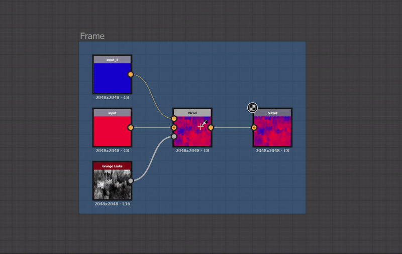
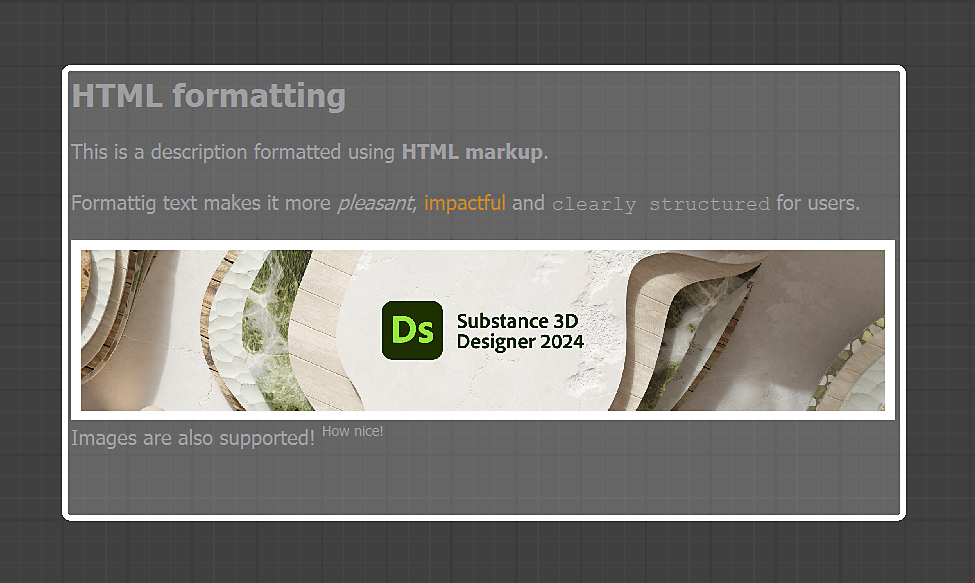
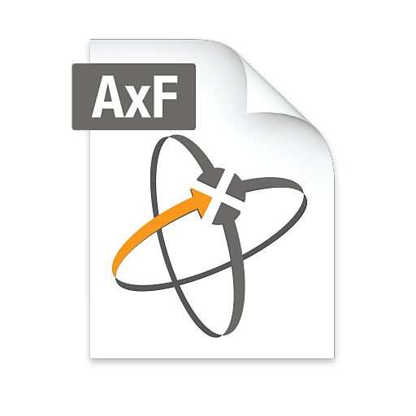

# Version 13.1

<b>Substance 3D Designer 13.1</b> ajoute de nombreuses améliorations de la qualité de vie au graphe de nœuds, principalement en ce qui concerne les cadres, afin d&#39;améliorer l&#39;expérience de création de matériaux. L’exportation AxF a également été ajoutée, ce qui permet un workflow d’interopérabilité pour les utilisateurs qui travaillent avec le format AxF.

*Date de publication : 12 décembre 2023*

## Améliorations en matière de cadres

Le cadre est un outil obligatoire pour que votre graphe reste bien organisé et lisible. C&#39;est pourquoi nous avons décidé de les peaufiner dans cette nouvelle version.

### Développement automatique

Au fur et à mesure que le graphe se développe, le contenu cadre devra peut-être être réorganisé. Les nœuds peuvent se déplacer pour faire de la place pour les ajouts ou le contenu peut devoir être plus espacé pour promouvoir la lisibilité. Pour faciliter ces réglages, il est désormais possible de développer automatiquement un cadre lors du déplacement d&#39;objets inclus : maintenez la touche <b>Maj</b> enfoncée tout en déplaçant un objet pour que les bordures du cadre s&#39;ajustent automatiquement afin que cet objet reste dans leurs limites.

### Ajuster la taille au contenu

Lorsque vous effectuez des réglages dans votre graphe, il se peut qu’un cadre ne soit plus correctement ajusté à son contenu. Cette nouvelle commande vous permet d’ajuster automatiquement la position et la taille du cadre afin qu’il s’adapte à l’étendue de son contenu, avec un remplissage d’une cellule de grille moyenne. Si le cadre a une description, il est ajusté pour utiliser tout espace vide à côté de la description, si possible.

### Descriptions améliorées

Grâce au code de HTML, vous pouvez désormais avoir du texte formaté dans une description de cadre. Cela s&#39;applique également aux commentaires.

### <b>... Et bien plus encore !</b>

Beaucoup de choses ont été repensées, comme les règles d&#39;appartenance pour être plus tolérantes, les zones d&#39;interaction pour redimensionner facilement les cadres, contraindre des règles pour ne pas mal aligner vos nœuds sur la grille, et l&#39;aspect visuel pour apporter un peu de fraîcheur. N&#39;hésitez pas à consulter la [documentation](../../interface/the-graph-view/graph-items/frame/frame.md) des cadres pour en savoir plus.

## Amélioration de la qualité de vie

* <b>Améliorations du menu Nœud :</b>afin de gagner du temps lors de la recherche du nœud dont vous avez besoin, nous avons légèrement amélioré le menu Nœud. La recherche est maintenant plus indulgente et vous donnera un résultat même s&#39;il n&#39;y a pas de correspondance parfaite. En outre, vous pouvez désormais utiliser la flèche vers le haut pour accéder directement au dernier élément de la liste.
* <b>Position des nœuds :</b>si vous souhaitez avoir une disposition parfaite pour votre graphe, ces deux petits changements vous plairont ! Lorsque vous copiez/collez des nœuds d’un graphe vers un autre, les nœuds collés sont désormais alignés sur la grille principale. Et lorsque vous ajoutez un nœud sur un lien long, celui-ci sera désormais placé au milieu de la partie visible du lien, afin de le rendre visible dans toutes les situations.
* <b>Options vue 2D :</b>si vous êtes un utilisateur intensif de [Vue 2D](../../interface/2d-view/2d-view.md), vous gagnerez du temps car des options telles que « Afficher le damier », « Conserver la taille de l&#39;affichage », « Utiliser la taille physique » et « Afficher la répétition » sont désormais enregistrées, de sorte que vous n&#39;avez pas à les redéfinir lors de la création d&#39;une nouvelle Vue 2D ou même au redémarrage de Designer.

## Exportation AxF

<table>
<tr style="border: 0;">
<td width="25.00%" style="border: 0;" valign="top">

</td>
<td width="100.00%" style="border: 0;" valign="top">

AxF est un format de [X-Rite](https://www.xrite.com/axf). Il permet de capturer, de stocker, de modifier et de communiquer des caractéristiques de matériau complexes à l’aide de données numériques tout au long du processus de conception numérique. Dans les versions précédentes de Designer, vous pouviez [importer des Fichiers AxF](../../resources/axf-appearance-exchange/axf-appearance-exchange-format.md), puis améliorer la répétition ou ajouter des effets procéduraux, mais vous étiez ensuite contraint d&#39;exporter les modifications en tant que nouveau .fichier sbsar.

Dans cette nouvelle version, nous introduisons la possibilité de modifier les matériaux AxF sur place, puis d&#39;[exporter vos modifications](../../resources/axf-appearance-exchange/axf-appearance-exchange-format.md) en tant que nouveau calque dans le Fichier AxF importé.

</td>
</tr>
</table>

## API

Enfin, cette version 13.1 continue d’améliorer l’API Python en ajoutant deux possibilités supplémentaires :

* <b>&#39;Propriétés Visible if&#39; : </b>vous pouvez désormais définir cette propriété pour les paramètres, entrées et sorties des graphes.
* <b>Ordre des entrées/sorties des graphes :</b> utilisez sdsbscompgraph::reorderGraphInput et sdsbscompgraph::reorderGraphOutput pour organiser les paramètres selon vos besoins.

>[!NOTE]
>
> Designer 13.1 est la dernière version majeure basée sur Qt5, les prochaines versions majeures seront mises à niveau vers Qt6. Cela peut avoir un impact sur vos plug-ins personnalisés.

## Notes de mise à jour

### 13.1.0

*(Publié le 12 décembre 2023)*

### Ajouté

* [Cadre] Développement automatique
* [Cadres] Modification des règles pour définir quand un objet appartient à un cadre
* [Cadre] Désactiver la mise à l’échelle du texte pour la description cadre
* [Cadre] Taille adaptée au contenu
* [Cadre] Nouveaux états par défaut, survol et sélectionné
* [Cadre] Contraindre sur Grande Grille
* [Cadre] Code de HTML de prise en charge pour la description Cadre
* [Cadre] Mise à jour des zones d’interaction
* [Cadre] Mise à jour de l’aspect visuel
* [Graphe] Crée le nœud au milieu du lien visible au lieu du milieu du lien
* [Graphe] Afficher les propriétés d’un élément s’il est le seul élément avec des propriétés disponibles dans une sélection
* [Graphe] Supprimer l’option « Mise à l’échelle » pour les commentaires dans le graphe
* [Graphe] Contraindre les nœuds sur la grille principale lors du copier/coller
* [UX] Autoriser la recherche floue dans le menu Nœud et la recherche dans la bibliothèque
* [UX] Effectuer une boucle N dans la liste du menu Nœud
* [AxF] Prise en charge de l’exportation AxF
* [AxF] Désactiver AxF sous Linux
* [API] Définissez la propriété « Visible if » des paramètres, entrées et sorties de graphe à l’aide de l’API Python
* [API] Définition de l’ordre des E/S de graphe à l’aide de l’API Python
* [Dépendances] Mettre à jour Boost vers 1.80.0
* [Dépendances] Mettre à jour OpenSubdiv vers la version 3.5.x
* [Dépendances] Mise à jour du SDK FBX vers 2020.3
* [Dépendances] Mettre à jour NGL vers 1.35.0.20
* [Gestion des couleurs] Ajout de la prise en charge des écrans OCIO ICC
* [Levels] Ajouter un moyen de réinitialiser l&#39;histogramme
* [Python] Avertir les utilisateurs si QtForPython ne peut pas être importé
* [Vue 2D] Enregistrement de l’état des options d’affichage
* [vue 3D] Ajout d’une technique de positionnement au shader Informations sur le maillage
* [Exporter] Ajoutez un bouton « Enregistrer les paramètres » pour enregistrer les modifications apportées aux options d’exportation.

### Correctifs

* [vue 3D] Impossible d&#39;attribuer une texture à une entrée de type texture\_2d d&#39;un Matériau MDL
* [AxF] Les identifiants de Graphe dans la liste des modèles peuvent être vides
* [AxF] Le champ de modèle de graphe de Substance est vide par défaut
* atlas scatter [Contenu] : comportement incorrect dans des cas spécifiques
* [Contenu] Mappeur de Flood Fill : sortie vide lorsque toutes les formes ont la même taille de boîte de dialogue
* [Content] FloodFill à la position : artefacts d’imprécision dans certaines situations
* [Contenu] Sortie « Specular » incorrecte dans le nœud « BaseColor/Métallique/Rugosité converter »
* [Contenu] L’option Masquer sur tracé ne fonctionne pas à la verticale
* [Contenu] Description manquante pour les nœuds Valeur d’entrée, Niveaux de gris en entrée, Couleur d’entrée et Sortie
* [Contenu] Description manquante pour les nœuds Set et Sequence
* [Contenu] Éclaboussure de forme : artefacts d’imprécision dans la sortie « Splatter data 2 »
* [Moteur] Les valeurs booléennes dans les Processeurs de valeurs sont toujours évaluées sur « False » (Apple Silicon uniquement).
* [Explorateur] L’ordre des boutons de la barre d’outils est incohérent entre les systèmes d’exploitation
* [Cadres] N’attrapez pas les nœuds lorsque vous déplacez un cadre avec le modificateur CTRL
* [Map de dégradé] l’option réinitialiser tout doit également réinitialiser le widget de dégradé
* [GraphRender] Certains nœuds deviennent noirs lors de l’ajustement en mode aperçu
* [Graphe] L’aperçu de « Valeur d’entrée » est bloqué sur « False » lors de l’ajustement de la valeur booléenne par défaut (Apple Silicon uniquement)
* [Graphe] Les nœuds de point proches du bord Cadre ne sont pas déplacés par le Cadre
* [Interopérabilité] L’icône Renvoyer n’est pas mise à jour après l’envoi à Substance 3D Stager
* [MDL] Impossible de modifier la Rugosité dans les nœuds où ce paramètre est disponible
* [MDL] Connexions non valides dans le modèle « AxF to Métallique rugosité »
* [UI] La fenêtre « Exporter les sorties » peut être réduite (Windows uniquement)
* [UI] Les images apparaissent pixellisées dans l’écran À propos lors de l’utilisation de la mise à l’échelle de l’affichage
* [UI] Les outils d’alignement de nœud de la barre d’outils graphe créent plusieurs étapes d’annulation.

### PROBLÈMES CONNUS

* [AxF OpenGL Shader] Largeur incorrecte pour la distribution anisotrope
* [AxF OpenGL Shader] rugosité par défaut incorrecte
* [Shader OpenGL AxF] Rotation de base d’ombrage incorrecte
* [AxF OpenGL Shader] Rayon incorrect sous la détection de l&#39;hémisphère
* [AxF OpenGL Shader] Détection de contribution incorrecte
* [AxF] Les valeurs de mappage « Couleur Specular » sont incorrectes lors de l’exportation.
* [AxF] L’aperçu et les textures ne s’affichent pas correctement dans la boîte de dialogue « Importer AxF »
* [AxF] La propriété « cc no refraction » n&#39;est pas injectée correctement dans le modèle AxF vers AxF
