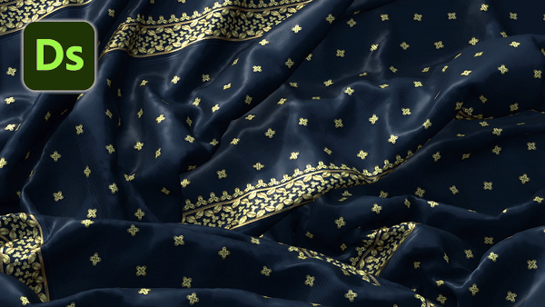
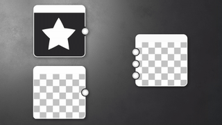

# Version 15.0

Cette mise à jour apporte un tout nouveau rendu 3D, avec les modes pixelliseur et traceur, ainsi qu&#39;une prise en charge native de [USD](https://openusd.org/release/index.html) pour vous permettre de modifier et d&#39;exporter des scènes sans aucune perte de données.

*Date de publication : 15 juillet 2025*

## Nouveau moteur de rendu 3D

### Nouveau traceur de tracé et pixellisation

Cette nouvelle version vous donne accès à un [rendu 3D](../../interface/3d-view/3d-renderers/3d-renderers.md) avancé, avec un mode de pixellisation (pour avoir un aperçu en temps réel lorsque vous travaillez sur votre matière) et un mode de traceur de tracé (un mode de lancer de rayon pour obtenir un rendu parfait et précis). Ce nouveau moteur de rendu améliore les fonctionnalités avec des fonctionnalités telles que les ombres en mode pixellisé, améliore la qualité et les performances, et est conçu pour prendre en charge les technologies futures telles que [MaterialX](https://materialx.org/). Il complète les systèmes de rendu OpenGL et Iray existants dans Designer et s’aligne sur les systèmes de rendu disponibles dans Substance 3D Viewer et Substance 3D Sampler, garantissant une expérience uniforme dans l’ensemble de l’écosystème.

La barre d&#39;outils de la vue [3D](../../interface/3d-view/3d-view.md) a été mise à jour pour avoir un accès rapide à certaines des nouvelles fonctionnalités disponibles dans ce moteur de rendu :

* <b>Outil de sélection :</b> pour sélectionner un sous-filet dans la scène. Une fois qu&#39;un sous-maillage est sélectionné, vous pouvez vous concentrer dessus (F) ou accéder à ses propriétés de matériau (clic droit).
* <b>Activez le traceur de tracé :</b> pour basculer rapidement entre les modes traceur de tracé et pixelliseur.
* <b>Activer les ombres :</b> pour activer les ombres dans la scène, ce qui est utile pour voir comment vos matériaux se comportent en fonction de la lumière.
* <b>Activer le plan au sol :</b> pour activer ou non le plan au sol dans la scène.

En outre, le raccourci clavier permettant de faire pivoter la luminosité de l&#39;environnement a été modifié pour correspondre aux autres applications de Substance de données. Il s&#39;agit donc désormais de *<b>cliquer avec le bouton droit de la souris</b>* au lieu de *<b>cliquer avec le bouton droit de la souris tout en maintenant la touche Ctrl+Maj</b>*.

### Effets de post-traitement

[Les effets post sont de retour](../../interface/3d-view/camera/post-effects/post-effects.md) ! Ils sont désormais disponibles via le menu Caméra et sont développés en interne.

* <b>Fleur :</b> simule l&#39;éblouissement autour des points lumineux comme les lumières et les reflets, ce qui permet de mieux visualiser les surfaces émissives.
* <b>Mappage des tonalités :</b>la gamme de couleurs avec les profils pour obtenir un effet HDR (High-Dynamic-Range).
* <b>Profondeur de champ :</b> simule les propriétés de mise au point d&#39;un objectif de caméra (pixellisation uniquement).

## Édition d’actifs en contexte

Lorsque vous travaillez sur vos matériaux, vous pouvez [les prévisualiser dans le contexte d&#39;une scène 3D spécifique](../../working-with-3d-scenes/working-with-3d-scenes.md). C’est pourquoi nous avons ajouté la possibilité d’importer et de rendre une scène complète, avec toutes ses textures, caméras et éclairages. Et cerise sur le gâteau, si cette scène fait référence à des ombrages MaterialX, ils seront correctement rendus avec le pixelliseur !

Une fois importé, vous pouvez travailler sur votre scène en sélectionnant un filet (avec MAJ + clic ou grâce à l’explorateur de scènes) et en [remplaçant l’une de ses matières](../../working-with-3d-scenes/overriding-scene-mat/overriding-scene-materials.md). Vous pouvez alors :

* Créez ou chargez un graphique et appliquez-le sur un matériau de scène.
* Ajustez un matériau existant en [extrayant ses textures](../../working-with-3d-scenes/extracting-materials-val/extracting-materials-values-and-textures.md) dans un nouveau graphique.

Enfin, une fois votre scène 3D modifiée, vous pouvez [l’exporter](../../working-with-3d-scenes/exporting-scenes/exporting-scenes.md) en tant que nouveau fichier ou en tant que nouveau calque du fichier d’origine, ce qui vous empêche de perdre des données (format USD uniquement).

Enfin, d’autres formats 3D sont désormais pris en charge pour l’importation et l’exportation : USD (+ usda, usdc, usdz), STL, PLY et GLTF, en plus des formats déjà disponibles FBX et OBJ.

## Infobulles enrichies

Des info-bulles riches ont été introduites pour mieux démontrer l&#39;objectif de chaque nœud. Ces info-bulles, actuellement disponibles uniquement pour les [nœuds atomiques](../../compositing-graphs/nodes-reference-for-com/atomic-nodes/atomic-nodes.md), incluent des visuels pour démontrer l&#39;effet du nœud et fournissent un lien direct vers la documentation pour obtenir des informations détaillées, notamment la liste des paramètres, des conseils et des astuces.

<table>
<tr style="border: 0;">
<td style="border: 0;" valign="top">

</td>
<td style="border: 0;" valign="top">

</td>
<td style="border: 0;" valign="top">

</td>
</tr>
</table>

## Amélioration de la prise en charge non carrée

Si vous devez travailler avec des textures non carrées, cette nouvelle option est faite pour vous. Dans les [propriétés du matériau](../../interface/3d-view/material-properties/material-properties.md) de la vue 3D, dans les options UV pour contrôler le carrelage, vous pouvez désormais définir une valeur différente pour les deux axes.

{zoomable="yes"}

## Bakers

Bien que l’interface de boulangerie n’ait connu que des mises à jour mineures (consultez la liste détaillée ci-dessous pour plus d’informations), la bibliothèque Baker a été entièrement reconstruite pour utiliser des boulangers basés sur le GPU, ce qui se traduit par des performances bien meilleures. Avec les nouveaux formats de fichiers pris en charge mentionnés ci-dessus, cette mise à jour représente une avancée considérable pour les utilisateurs engagés dans des workflows de boulangerie.

Remarque : si vous utilisiez sbsbaker.exe pour automatiser votre processus, l’outil a été renommé substance3d\_baker.exe (utilisez substance3d-baker —help pour plus d’informations).

## Mises à jour de la configuration requise pour les effets spéciaux

Chaque année, la [plateforme de référence pour les effets visuels](https://vfxplatform.com/) publie une liste d&#39;outils et de bibliothèques à utiliser dans chaque logiciel du secteur des effets visuels afin de réduire les incompatibilités entre les logiciels. Comme d&#39;habitude, nous *mettons à jour toutes nos dépendances* afin de respecter toutes ces recommandations.

## Vidéo

## Notes de mise à jour

### 15.0.0

*(Publié le 15 juillet 2025)*

### Ajouté

* [Vue 3D] Nouveau système de rendu, avec modes pixelliseur et traceur de tracé
* [Vue 3D] Ajout d’un outil de sélection pour choisir un objet dans la scène 3D
* [Vue 3D] Ajouter la nouvelle option « Exporter la scène avec les calques... » action dans le menu Scène
* [Vue 3D] Ajouter de nouveaux boutons de barre d’outils
* [Vue 3D] Ajoutez la possibilité de basculer entre plusieurs caméras contenues dans une scène USD
* [Vue 3D] Permet de se concentrer sur l’objet sélectionné en appuyant sur la touche F dans la clôture
* [Vue 3D] Permet de générer un graphique de composition de Substance à partir d&#39;un matériau existant
* [Vue 3D] Permet d’envoyer un graphique de composition SBS dans la vue 3D et d’affecter sa sortie unique à l’utilisation de l’environnement/du panorama
* [Vue 3D] Effacez la sélection actuelle en appuyant sur la touche Échap
* [Vue 3D] Afficher une scène 3D importée avec des textures
* [Vue 3D] Distinguer les commandes de répétition de texture X et Y
* [Vue 3D] Activer/désactiver les ombres
* [Vue 3D] Activer/désactiver le plan au sol
* [Vue 3D] Dans le menu « Matières », ajoutez « Supprimer » uniquement pour la Matière qui a été ajoutée manuellement et qui est inutilisée
* [Vue 3D] Dans le menu « Matières », supprimez l’action « Tout supprimer »
* [Vue 3D] Rendre les fichiers USDZ exportés autonomes
* [Vue 3D] Rendre les propriétés du rendu persistantes lors du changement de mode de rendu
* [Vue 3D] Conserver les entrées de matériau existantes lors du remplacement d’un matériau
* [Vue 3D] Réorganisation des propriétés de la caméra
* [Vue 3D] Supprimer les actions « Camera/Save screenshot... » et « Copier la capture d’écran dans le presse-papiers »
* [Vue 3D] Supprimez l’action de menu « Matière/Tout reconstruire ».
* [Vue 3D] Supprimez le préfixe « Par défaut » de l’étiquette de la caméra par défaut
* [Vue 3D] Définissez l’action de menu « Rétablir la valeur par défaut » comme dernière action dans le menu hamburger de la propriété d’entrée du matériau
* [Vue 3D] Réglages des raccourcis
* [Vue 3D] Prise en charge des ombres et de la translucidité en mode temps réel
* [Vue 3D] Prise en charge des ombrages MaterialX à partir d&#39;une scène USD importée
* [Vue 3D / OpenGL] Renommez le paramètre « Échelle UV activée » en « Activer la Taille physique à partir du graphique ».
* [Vue 3D / Effets postérieurs] Fleur
* [Vue 3D / Effets de post] Profondeur de champ
* [Vue 3D / Effets postérieurs] Mappage de tonalité
* [Vue 3D / Scene Browser] Permet d&#39;afficher les propriétés de la matière lors de sa sélection dans SceneBrowser
* [Vue 3D / Explorateur de scènes] Masquer la colonne « Matière »
* [Vue 3D / Scene Browser] Mettez en gras les primitives USD qui sont contrôlées par une entité prédéfinie
* [Boulangers] Ajoutez un menu contextuel dans l’arborescence avec des actions « Tout sélectionner »/« Tout désélectionner »
* [Bakers] Ajouter une option pour contrôler l’interpolation bitangente
* [Bakers] Ajouter un séparateur horizontal dans l’interface utilisateur graphique
* [Bakers] Ajouter une macro UDIM par défaut dans le nom de la sortie lorsque la scène est udim
* [Bakers] Autoriser à recalculer la tangente
* [Boulangers] Permet de renommer un boulanger sans rompre les liens
* [Boulangers] Modification de la taille par défaut du panneau central
* [Bakers] Texture d’entrée pour le workflow UDIM
* [Bakers] Faire correspondre l’ordre de liste des cartes vue 2D à l’ordre de liste de rendu des Bakers
* [Bakers] Rendre la fenêtre de baking modale
* [Baker] Gestion des paramètres de mappage de tonalité
* [Bakers] Supprimer la sélection de plugin de repère tangent
* [Bakers] Statut d’enregistrement « activé » ou « désactivé » pour les Bakers lors de l’enregistrement d’un paramètre prédéfini
* [Bakers] Sélectionner le matériau par défaut dans le widget de sélection
* [Bakers] Définir l’orientation par défaut de la texture de sortie normale par rapport à la préférence
* [Baker] Définissez UV tiles sur Tous par défaut
* [Baker] Option d’ajout FromTexture/FromValue dans WordSpaceDirection
* [Bakers] World to tangente : définissez l’entrée par défaut sur « from texture »
* [SBSBaker] Création d’une option pour contrôler l’ordre du back-end
* [SBSBaker] Amélioration de l’utilisation de l’argument StringList
* [SBSBaker] Renommez « match\_source\_instance » en « match\_maillage\_name »
* [SBSBaker] Renommez « Submesh » en « GeomSubset ».
* [SBSBaker] Renommer en substance3d\_baker
* [Contenu] Ajouter une forme « Hémisphère » aux nœuds de générateur exposant des formes de quadrant
* [Interop] Prise en charge du format de fichier GLTF
* [Interop] Prise en charge du format de fichier PLY
* [Interop] Prise en charge du format de fichier STL
* [Bibliothèque] Uniformiser les info-bulles pour les noeuds atomiques
* [Mac] Ne plus prendre en charge les plates-formes MacIntel
* [Nodes] Ajouter des info-bulles riches pour les noeuds atomiques
* [Paramètres] Fermer la section « Attributs » par défaut
* [Paramètres] Permet à l’utilisateur de spécifier les valeurs par défaut des paramètres de base pour les nouvelles instances
* [Préférences] Bakers : ajoutez une option booléenne pour calculer l’espace de tangente par fragment
* [Préférences] Supprimer les plug-ins d’espace tangent
* [Préférences] Stockez les préférences par version mineure de SD (XX.X).
* [VFX] Mise à jour de Boost vers 1.85.0
* [VFX] Mise à jour de MacOS version minimale vers la version 12.0
* [VFX] Mettre à jour OpenColorIO vers la version 2.4.2
* [VFX] Mettre à jour OpenColorIO vers la version 2.4.x
* [VFX] Mettre à jour OpenExr vers la version 3.3.x
* [VFX] Mise à jour de Qt vers la version 6.5.8

### Correctifs

* [Vue 3D] Les textures de la scène USD exportée ne sont pas correctement appliquées
* [Vue 3D] [UDIM] Impossible d’afficher les sorties graphiques UDIM dans la vue 3D lorsque l’affichage automatique à l’ouverture du graphique est désactivé dans les préférences de graphique
* [Boulangers] &#39;Anti-alias.&#39; et &#39;Moy. les cellules normales pour les boulangers non applicables sont vides et modifiables
* [Bakers] L’action « Actualiser » utilise le moteur de lancer de rayons lorsqu’elle est désactivée dans les préférences
* [Boulangers] Les boulangers bloqués comme occupés après l&#39;échec lors du processus &#39;Actualiser toutes les maps bakées&#39;
* [Bakers] Blocage à plus de 180 UDIM lors du baking OpenGL Position map sur un maillage spécifique
* [Boulangers] Blocage lors de l’ouverture de la boîte de dialogue « Informations sur le modèle de four » plusieurs fois de suite (macOS uniquement)
* [Boulangers] Dans l’exportation du paramètre prédéfini JSON, la valeur « udim » est remplacée par « 1001 » lorsqu’elle était définie sur « Tout »
* [Bakers] La mémoire n&#39;est pas correctement détectée sous Linux
* [Bakers] La dépendance d’entrée de mappage manquante ne déclenche pas d’avertissement et/ou de rendu de bloc
* [Bakers] Aucun libellé d’erreur lorsque le nom de la sortie est vide
* [Bakers] Le remplacement du filet en poly élevé du fichier n’a aucun effet
* [Boulangers] Le boulanger cible n&#39;est pas sélectionné par défaut lors de l&#39;utilisation de l&#39;action &#39;Rebake&#39;
* [Moteur] Distance : « coupe » visible dans certaines situations
* [Engine] Fx-Map : les couleurs négatives ne sont pas prises en charge lorsque la profondeur de bit est de 8 bits (moteurs GPU uniquement)
* [Localisation] La saisie des caractères revient du japonais au latin dans le menu des nœuds
* [Security] Vulnérabilité d&#39;analyse de fichier USDC hors écriture liée
* [Sécurité] Vulnérabilité II d’écriture hors limites lors de l’analyse du fichier NEF
* [Sécurité] Vulnérabilité de lecture III hors limites lors de l’analyse du fichier DNG
* [Préférences] Problèmes UX dans les paramètres de projet pour les projets en lecture seule
* [Ressources] Les jeux UV multiples ne sont pas affichés lors de l&#39;ouverture des fichiers FBX
* [UI] Libellés qui se chevauchent dans la barre d’état
* [UI] Les info-bulles du menu déroulant « Mode de création de lien » ne sont pas affichées

### PROBLÈMES CONNUS

* [Boulangers] Blocages lors de la cuisson avec certains pilotes NVidia spécifiques
* [Vue 3D] OpenGL : certaines scènes importées peuvent ne pas être rendues
* [Vue 3D] Pixellisation : artefacts d’ombre lors de l’utilisation du displacement sur une scène plate
* [Vue 3D] Traceur de tracé : performances lentes lors de la mise à jour des textures avec la tessation/le displacement activé
* [Vue 3D] Certaines propriétés de matériau de couleur ne sont pas gérées correctement lorsqu’elles sont remplacées
* [Vue 3D] Les scènes avec des primitives animées ne sont pas prises en charge correctement
* [Vue 3D] Les filets avec plusieurs UDims ne sont pas encore pris en charge
* [Vue 3D] Les filets comportant plusieurs UV ne sont pas pris en charge et peuvent entraîner un rendu de matériau non valide.
* [Vue 3D] Traceur de tracé non pris en charge sur les cartes graphiques AMD
