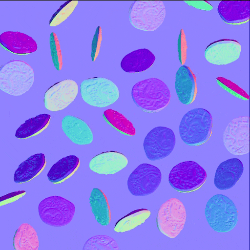
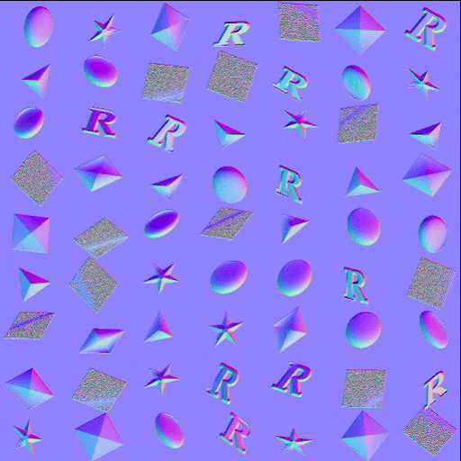
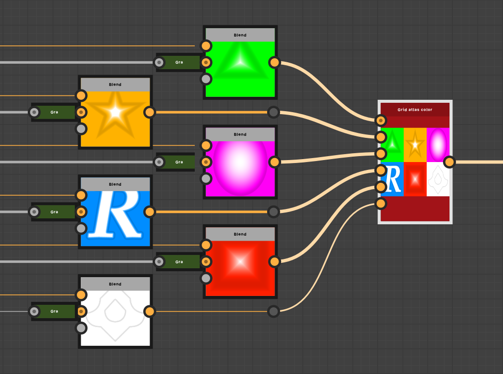
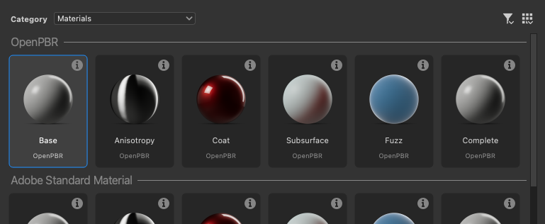
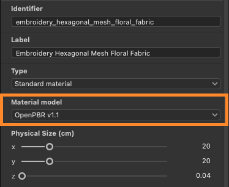

# Version 16.0

Cette version 16.0 introduit un flux de travail plus créatif pour la diffusion et la manipulation de motifs grâce au nouveau Shape Splatter et aux nœuds SDF. Il prend également en charge nativement l’OpenPBR et améliore les paramètres de displacement dans la vue 3D.

*Date de publication : 14 avril 2026*

## Nœuds v2 Shape Splatter

### Nouvelles façons de disperser des formes

Les nouveaux nœuds de l&#39;[éclaboussure de forme v2](../../compositing-graphs/nodes-reference-for-com/node-library/texture-generators/patterns/shape-splatter-v2/shape-splatter-v2.md) débloquent des comportements de diffusion complexes qui ont été difficiles jusqu&#39;à présent, avec **d&#39;autres méthodes de distribution de forme** (disque de Poisson, uniforme) qui sont *sans collision* par défaut, et le contrôle du *regroupement net* de formes dans des zones spécifiques avec une **map density**.\
Les utilisateurs avancés peuvent configurer des *distributions personnalisées* définies par un graphique de fonction.

<table style="margin-top: 32px; margin-bottom: 32px">
    <tr style="border: 0">
        <td style="width: 33%; border: 0">
             <i>Distribution de Poisson</i>
        </td>
        <td style="width: 33%; border: 0">
             <i>Distribution uniforme</i>
        </td>
        <td style="width: 33%; border: 0">
             <i>Éclaboussure de forme v2 : Map density</i>
        </td>
    </tr>
</table>

### Formes 3D

Les formes dispersées sont désormais des **objets 3D** qui peuvent être déplacés, pivotés et mis à l’échelle sur tous les axes XYZ.

Utilisez des **primitives simples** telles que des cubes, des sphères et des cylindres, ou des **formes personnalisées complexes** formées par *extrusion d&#39;une carte d&#39;height* ou la création de *formes 3D SDF*. (Plus d’informations ci-dessous)

Cela débloque des diffusions plus dynamiques, plus variées et plus crédibles à tous les niveaux. Il est désormais possible de réutiliser les formes 3D pour les variations en les retournant. (Nous vous voyons, artistes de l&#39;environnement !)

<table style="margin-top: 32px; margin-bottom: 32px; border: none">
    <tr style="border: 0">
        <td style="width: 33%; border: 0">
             <i>Rotation 3D aléatoire</i>
        </td>
        <td style="width: 33%; border: 0">
             <i>Extrusion de forme</i>
        </td>
        <td style="width: 33%; border: 0">
             <i>Formes 3D SDF</i>
        </td>
    </tr>
</table>

### Nœuds compagnon

Comme pour la famille de nœuds Shape Splatter v1, Shape Splatter v2 est livré avec sa propre cohorte de nœuds compagnon.

Les nœuds du mappeur v2 [Shape splatter](../../compositing-graphs/nodes-reference-for-com/node-library/texture-generators/patterns/shape-splatter-v2-mapper-color/shape-splatter-v2-mapper-color.md) activent la projection des textures sur les formes 3D dispersées, avec prise en charge des *projections triplanaires* et des *ID de matériau* pour le mappage de plusieurs textures. Les résultats peuvent être ajustés globalement ou par forme pour les décalages de texture et les variations de couleur.\
Encore une fois, les utilisateurs avancés peuvent configurer *des mappages de textures personnalisés* définis par un graphe de fonction.

[L&#39;éclaboussure de forme v2 vers le masque](../../compositing-graphs/nodes-reference-for-com/node-library/texture-generators/patterns/shape-splatter-v2-to-mask/shape-splatter-v2-to-mask.md) crée des masques pour une sélection spécifique de formes et/ou d&#39;ID de matériau, permettant une utilisation plus granulaire des formes en aval dans le graphe.

<table style="margin-top: 32px; margin-bottom: 32px; border: none">
    <tr style="border: 0">
        <td style="width: 33%; border: 0">
             <i>Mappage triplanaire</i>
        </td>
        <td style="width: 33%; border: 0">
             <i>Mappage normal</i>
        </td>
        <td style="width: 33%; border: 0">
             <i>Mappage par ID de matériau à partir de formes SDF</i>
        </td>
    </tr>
</table>

### Atlas en grille

<table>
    <tr style="vertical-align: top; border: 0">
        <td style="border: 0">
            
Les motifs personnalisés peuvent être fournis séparément au nœud Shape splatter v2 ou regroupés dans un atlas en grille pour des workflows plus épurés et plus efficaces.

Les modèles de packing sont simplifiés grâce aux nouveaux nœuds <a href="../../compositing-graphs/nodes-reference-for-com/node-library/texture-generators/patterns/grid-atlas-color/grid-atlas-color.md">Atlas en grille</a>.

        </td>
        <td style="text-align: right; width: 33%; margin-left: 32px; border: 0">
            
        </td>
    </tr>
</table>

### Échantillon de matière

<table style="border: none">
    <tr style="border: none">
        <td style="border: none; vertical-align: top">
            
L'<b>échantillon de matériau<a href="../../compositing-graphs/creating-compositing-gra/material-samples/material-samples.md"></b> de </a>boulons rouillés est disponible pour passer à la famille de nœuds de la version 2 des éclaboussures de forme et à leurs caractéristiques.

Le graphe est organisé et annoté pour vous guider à travers sa structure, ses paramètres de nœuds et ses techniques.

Il est également <i>entièrement modifiable</i>. Il peut donc être utilisé comme sandbox pour mieux comprendre le jeu d’outils Shape splatter v2. Vous pouvez créer autant d’exemples de graphiques que vous le souhaitez, alors n’hésitez pas à jouer !

        </td>
        <td style="border: none; width: 20%; vertical-align: top; text-align: right">
            
        </td>
    </tr>
</table>

## Nœuds 3D SDF (champ de distance signé)

<table>
    <tr style="vertical-align: top; width: 75%; border: 0">
        <td style="border: 0">
            
Designer 16.0 ajoute une méthode puissante de génération de formes 3D dans un graphe fonctionnel à l’aide d’un vaste catalogue de nœuds pour la création de Fonctions SDF.

Les champs Distance signée sont des représentations de l'espace sous la forme d'une distance par rapport aux surfaces définies mathématiquement. Ils peuvent être utilisés pour définir des formes de plus en plus complexes, ces surfaces étant transformées et associées à l'aide de divers opérateurs.

        </td>
        <td style="text-align: right; width: 25%; margin-left: 32px; border: 0">
            
        </td>
    </tr>
</table>

### Création de Fonctions SDF 3D

Les fonctions SDF impliquent une [nouvelle famille de nœuds](../../function-graphs/nodes-reference-for-fun/function-node-library/function-node-library.md#sdf-functions) qui se divise en 4 catégories :

* Les **primitives** sont les composantes de base. Elles génèrent des formes simples et ajustables avec quelques commandes qui vous permettent de les adapter selon vos besoins.
* Les **opérateurs** associent ou répliquent des formes de manière simple ou complexe en fonction du nœud : des simples opérateurs booléens aux morphes, aux coques et aux symétries, ils élargissent considérablement les possibilités de type de forme 3D qui peut être obtenu
* Les **Transformes** vous permettent d&#39;ajuster la position, la rotation et la taille des formes comme vous pouvez vous y attendre et au-delà avec la flexion, la torsion et l&#39;élongation.
* Les nœuds **Matériau** vous permettent de définir certains attributs de matériau de base, tels que la couleur et l&#39;ID de matériau, qui peuvent être utilisés par la famille de nœuds [Shape splatter v2](../../compositing-graphs/nodes-reference-for-com/node-library/texture-generators/patterns/shape-splatter-v2/shape-splatter-v2.md) pour le masquage ou la coloration des formes.

>[!INFO]
> 
> Accédez à la page [Utilisation des Fonctions SDF](../../function-graphs/nodes-reference-for-fun/function-node-library/function-nodes-sdf-functions/working-with-sdf-functions.md) pour commencer à travailler avec ces nœuds.

Les nœuds légers dotés d’icônes claires et lisibles facilitent la création de Fonctions SDF 3D, en particulier avec ce nouvel outil...

### Nœud de la visionneuse 3D

Lorsque vous créez des Fonctions SDF 3D, vous devez visualiser les formes obtenues dans l’espace 3D. Le [nœud de la visionneuse 3D](../../compositing-graphs/nodes-reference-for-com/node-library/filters/effects/3d-viewer/3d-viewer.md) effectue le rendu des fonctions 3D SDF ou d&#39;intersection sous la forme d&#39;une Scène 3D avec des commandes de caméra ajustables, un éclairage d&#39;environnement personnalisé et la prise en charge du rendu des matériaux de base. (Couleur, rugosité et métallisme)

Le nœud comprend également des fonctionnalités permettant de vérifier les formes générées en détail et de résoudre les problèmes de débogage : passes de rendu distinctes (AOV), isolignes SDF et assistants visuels. (E.g. Fond perdu de couleur, grille et arcs de rotation)

<table style="margin-top: 32px; margin-bottom: 32px">
    <tr style="width: 50%; border: 0">
        <td style="text-align: center; width: 50%; border: 0; padding: 15px">
            
        </td>
        <td style="width: 50%; border: 0; padding: 0">
            <table>
                <tr style="vertical-align: top; border: 0">
                    <td style="text-align: center; border: 0">
                        
                    </td>
                    <td style="text-align: center; border: 0">
                        
                    </td>
                </tr>
                <tr style="vertical-align: top; border: 0; background: transparent">
                    <td style="text-align: center; border: 0; background: transparent">
                        
                    </td>
                    <td style="text-align: center; border: 0; background: transparent">
                        
                    </td>
                </tr>
            </table>
    </tr>
</table>

## Prise en charge d’OpenPBR

[OpenPBR de surface](https://academysoftwarefoundation.github.io/OpenPBR/) est une spécification de modèle d&#39;ombrage de surface destinée à servir de norme pour l&#39;infographie et capable de modéliser avec précision la grande majorité des matériaux.

Ce modèle de matériau est désormais pris en charge dans l&#39;ensemble de l&#39;application, avec [nuanceurs dédiés](../../interface/3d-view/material-properties/material-properties.md#openpbr) dans nos nouveaux systèmes de rendu (Pixellisation, Pathtracer GPU) et le système de rendu OpenGL.

Commencez avec cette norme largement adoptée par l’industrie avec de nouveaux modèles de graphe, ou passez en revue les exemples de matériau intégrés désormais basés sur l’OpenPBR.

<table style="border: none; margin-top: 32px; margin-bottom: 32px">
    <tr style="vertical-align: top; border: 0">
        <td style="text-align: center; border: 0">
            
        </td>
        <td style="text-align: center; border: 0">
            
        </td>
    </tr>
</table>

L’shader est désormais la norme par défaut pour vue 3D et prend en charge en mode natif les graphes des versions précédentes en associant les utilisations PBR héritées aux OpenPBR.

Les ombrages OpenPBR prennent en charge davantage d’effets que les ombrages existants, tels que les couches minces et les parois minces. Tous les effets sont disponibles dans la pixellisation (Pixellisation, OpenGL), y compris enfin la réfraction !

<table style="border: none;">
    <tr style="vertical-align: top; border: 0">
        <td style="border: 0">
            Il est également plus facile de synchroniser les workflows impliquant des shaders spécifiques, avec un nouvel attribut <a href="../../compositing-graphs/graph-parameters/graph-parameters.md#attributes">'Modèle de matériau'</a> pour les graphes de Substance, qui garantit que les graphes affichés dans la vue 3D utilisent le shader approprié pour le modèle de matériau du graphe.
        </td>
        <td style="text-align: right; margin-left: 32px; border: 0">
            
        </td>
    </tr>
</table>

>[!NOTE]
> 
>L’attribut est également inclus dans les fichiers SBSAR publiés à intégrer dans votre flux de travaux de matériau.

## Commandes de displacement dans vue 3D

Il est désormais plus rapide et plus facile d&#39;ajuster le displacement et la tessellation dans vue 3D, avec un accès direct dans une [fenêtre contextuelle de nouveau Displacement](../../interface/3d-view/displacement/displacement.md) disponible dans la barre d&#39;outils vue 3D.

Ajustez les valeurs de **l&#39;échelle d&#39;Height**, de **niveau d&#39;Height** et de **Tessellation** sans effectuer de va-et-vient répétés dans les propriétés de matériau et les paramètres de rendu.

Ces commandes sont disponibles pour nos nouveaux systèmes de rendu (Pixellisation, Pathtracer GPU) et pour le système de rendu OpenGL.

Si la scène comprend plusieurs matériaux, sélectionnez l&#39;objet de la scène que vous souhaitez ajuster au préalable en maintenant la touche <code>Maj enfoncée</code> et en cliquant dessus (Pixellisation et Pathtracer GPU uniquement) ou en la sélectionnant dans l’explorateur de Scènes.

>[!NOTE]
> 
>La tessellation est de *par objet* dans la pixellisation et Pathtracer GPU, et de *par matériau* dans OpenGL.

## Autres modifications

### Nœuds de valeur constante

<table style="border: none; margin-top: 32px; margin-bottom: 32px">
    <tr style="vertical-align: top; border: 0">
        <td style="border: 0">
            
Pour faciliter l'accès aux valeurs constantes dans les graphes de Substance, <a href="../../compositing-graphs/nodes-reference-for-com/node-library/values/constant.md">nouveaux nœuds</a> ont été ajoutés pour générer une valeur simple de chaque type.

Vous les trouverez tous dans la section <b>Valeurs &gt; Constantes</b> de la bibliothèque.

        </td>
        <td style="width: 60%; border: 0">
            
        </td>
    </tr>
</table>

### Graphes MDL et Iray de vie

Comme vous en avez été informé dans la version 15.1, le jeu de fonctionnalités par Graphe MDL et le moteur de rendu d’Iray sont désormais supprimés de Designer.\
Notre Pathtracer GPU interne est le système de rendu de choix pour un rendu photoréaliste de haute qualité dans Designer.

Designer s’éloigne du langage MDL pour privilégier MaterialX en tant que langue ombrage de choix pour les définitions de matériau interchangeables et largement prises en charge.\
MaterialX a rapidement pris de l’ampleur dans les industries de l’infographie et peut être transporté par des fichiers USD pour une portabilité totale des scènes entre les DCC et les systèmes de rendu.

>[!NOTE]
> 
>La documentation des Graphes MDL et du moteur de rendu d&#39;Iray est disponible sur leur [page de fin de vie dédiée](../../technical-issues/mdl-graph-iray-eol/mdl-graph-iray-eol.md).

### Mises à niveau de la plateforme VFX et version minimale de macOS

Les bibliothèques suivantes ont été mises à niveau pour répondre à la dernière norme de plateforme VFX :

* C++ 20
* Python 3.13
* Qt 6,8
* Boost 1,88
* OpenColorIO 2.5
* OpenSubDiv 3.7
* OpenEXR 3.4
* oneTBB 2022

La configuration requise pour la version minimale prise en charge de macOS a été mise à jour vers macOS 14 Sonoma.

## Notes de mise à jour

### 16.0.0

*(Publié le 14 avril 2026)*

### Ajouté

* [Contenu] Nœud Shape splatter v2
* [Contenu] Nœuds de couleur/niveaux de gris du mappeur d’éclaboussures de forme v2
* [Contenu] Éclaboussure de forme v2 sur le nœud de masque
* Nœuds d&#39;Atlas en grille [Contenu]
* [Contenu] Nœud de la visionneuse 3D
* [Content] Nœuds de l&#39;opérateur 3D SDF
* [Content] Nœuds primitifs 3D SDF
* [Contenu] Nœuds de transformation 3D SDF
* [Contenu] Nœuds de matière 3D SDF
* [Contenu] Nœud d’angle par rapport au vecteur
* [Content] Nœuds à valeur constante
* [Vue 3D] OpenPBR shader pour le moteur de rendu OpenGL
* [Vue 3D] Ombrage d’OpenPBR pour la pixellisation et les systèmes de rendu de Pathtracer GPU
* Fenêtre de Displacement [Vue 3D] pour définir l’échelle d’height, le niveau d’height et la facettisation
* [Vue 3D] Réorganisation des éléments de la barre d’outils
* [Vue 3D] Définir OpenPBR comme modèle de matériau par défaut dans la vue 3D
* [Vue 3D] Veillez à ce que la vue 3D prenne en compte l’attribut de graphique « Modèle de matériau ».
* [Vue 3D] Synchronisation des modèles de matériau lors du basculement entre les modes de rendu Pixellisation/Pathtracer GPU et OpenGL
* [Vue 3D] Assurez-vous que le modèle de matériau est persistant lorsque vous changez de moteur de rendu 3D et de définition de matière
sont synchronisées
* [Vue 3D] Pathtracer GPU : activer le cycle de pixels du bruit bleu
* [Vue 3D] Exposer le contrôle d’opacité de l’occlusion ambiante
* [Vue 3D] Définissez la plage de paramètres de mosaïque sur [0, 10] pour tous les ombrages
* [Vue 3D] Renommer l’action « Focus » en « Image »
* [Vue 3D] Gérer le nouveau paramètre refineLevel qui remplace tessellationFactor
* [Vue 3D] Ajouter un compteur IPS
* [Vue 3D] Déplacez la barre de progression dans la même barre d’outils horizontale que l’espace colorimétrique en bas
* [Boulangers] Afficher l’UV du boulanger sélectionné dans l’aperçu
* [Graphique] Ajouter un nouvel attribut « Modèle de matériau » aux graphiques de Substance
* [NewGraph] Ajout de séparateurs dans la vue Miniatures
* [Paramètres] Définissez la valeur constante par défaut pour les paramètres d’entrée avec l’éditeur « Function ».
* [Paramètres] Remplir la zone de liste déroulante de `Set` et `Is defined` paramètres de nœud avec des variables disponibles
* [Préférences] Supprimer l’option obsolète « Facteur de mise à l’échelle » dans l’onglet « Vue 3D »
* [Publish] Boîte de dialogue Publish : Inclure le modèle de matériau dans les informations sur le graphique
* [Python] Ajoutez une nouvelle classe SDMaterialModelDescription pour obtenir les informations d&#39;un modèle de matériau
* [Python] Autoriser à obtenir/définir la propriété de modèle de matériau des objets SDSBSCompGraph
* [Éditeur Python] Augmentez la taille de la police à 12
* [Modèles] Ajouter des modèles d’OpenPBR
* [Templates] Convertir des échantillons de matière en OpenPBR
* [Tiers] Mise à jour de Boost vers la version 1.88
* [Tiers] Mise à jour de l’API C++ vers C++20
* [ThirdParty] Mettre à jour NGL vers 1.42
* [ThirdParty] Mise à jour oneTBB vers la version 2022.x
* [ThirdParty] Mettre à jour OpenColorIO vers la version 2.5.x
* [Tiers] Mise à jour OpenEXR à la version 3.4.x
* [ThirdParty] Mettre à jour Qt &amp; QtForPython vers la version 6.8.x et Python vers la version 3.13.x
* [ThirdParty] Mettre à jour TBB vers oneTBB 2021.x
* [Dépréciation] Supprimer Iray et l’éditeur MDL

### Correctifs

* [Vue 2D] La plage de sélection de l’histogramme n’est pas conservée lorsque la largeur du widget devient petite
* [Exportation 3D] Les filets exportés depuis Designer ne sont pas rendus de la même manière en mode d’affichage utilisateur
* [Vue 3D] L’affectation d’éléments non-udim à la vue 3D laisse le mode de rendu en mosaïque unique
* [Vue 3D] Résultat serré lors de l’utilisation d’OCIO
* [Vue 3D] Blocage lors de l’application d’une texture de graphique sur un matériau non remplacé pour une scène spécifique
* [Vue 3D] Blocage lors de la création de tampons d’image
* [Vue 3D] Pathtracer GPU Eclair : géométrie rompue et performances réduites lors du rendu d’un modèle spécifique
* [Vue 3D] Transformation de texture incorrecte pour des scènes spécifiques
* [Vue 3D] Cadrage incohérent de la scène/sélection lors de l’utilisation d’une résolution de rendu fixe
* [Vue 3D] Couleur diffuse incorrecte lors du rendu de certains fichiers GLTF
* [Vue 3D] Environnement invisible lors du changement de moteur de rendu dans un cas spécifique
* [Vue 3D] Les matières ne sont pas détectées correctement lors de l’importation de certains fichiers .fbx
* [Vue 3D] Le remplacement des matériaux plusieurs fois réinitialise la mosaïque à 1
* [Vue 3D] Les propriétés de la catégorie « UV » ne sont pas enregistrées dans les fichiers SBSSCN
* [Vue 3D] L’option « Réinitialiser et afficher les sorties en vue 3D » à partir de graphiques à sortie unique ne réinitialise pas les matières
* [Vue 3D] &#39;Enregistrer le rendu&#39; : le format d’image modifié n’est pas conservé
* [Vue 3D] La sélection ne fonctionne pas sur les GPU AMD
* [Vue 3D] La scène 3D autonome n’est pas actualisée en cas de modification sur le disque
* [Vue 3D] Certaines propriétés de matériau de couleur ne sont pas gérées correctement lorsqu’elles sont remplacées
* [Vue 3D] Les textures UDIM ne sont pas appliquées correctement sur un maillage spécifique
* [Vue 3D] La scène USD avec la matière MaterialX ne s’affiche plus correctement
* [Bakers] Blocages avec certains maillages
* [Boulangers] Transfert de texture : blocage dans bkBufferViewCopy
* [Cooker] Boucle infinie dans le nœud While Loop dans un cas qui pourrait être empêché
* [Moteur] Arrêter le moteur de Substance lors de la fermeture de l&#39;application
* [Général] Éviter les blocages aléatoires lors de la sortie de l’application (Windows uniquement)
* [Graphique] Graphique de fonction : la propagation de type ne fonctionne pas correctement dans certaines situations
* [Graphique] Les liens de graphique sont supprimés lorsqu’un nœud d’entrée d’image est renommé
* [Graphique] Les liens et les épingles affichent parfois des artefacts
* [Préférences] La mise à l’échelle du Viewport est inversée
* [Propriétés] Crash lors de la modification de l’ajustement d’entrée de graphe lors de l’affichage de ses paramètres d’instance
* [Python] Impossible d&#39;importer les modules PySide6 (conflit possible avec l&#39;installation existante de PySide6)
* [Python] Les modules PySide et Shiboken existants sont en conflit avec Designer
* [UI] Le style de survol disparaît sur les boutons dans un cas spécifique (Windows uniquement)
* [UI] Le style de survol n’est pas visible sur les boutons déroulants lorsque vous cliquez dessus (macOS uniquement)
* [UI] Le bouton « En savoir plus » dans l’info-bulle « ? » ne fonctionne pas lorsque l’info-bulle est en dehors des limites de la boîte de dialogue (Windows uniquement)

### PROBLÈMES CONNUS

* [Graphe] Les icônes générées pour les OpenPBR ne sont pas précises
* [vue 3D] Les Scènes avec des primitives animées ne sont pas correctement prises en charge
* [vue 3D] Le traceur de tracé n’est pas pris en charge sur toutes les cartes graphiques AMD

