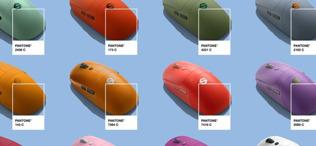
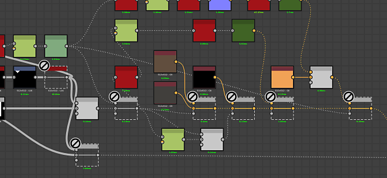
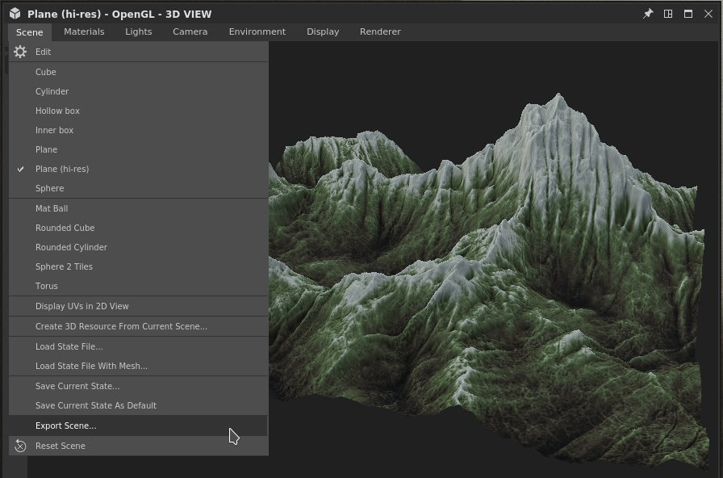

# Version 2021.1 (11.1)

**Substance Designer 2021.1** offre un ensemble de nouvelles fonctionnalités avec la prise en charge des couleurs Pantone, la possibilité de désactiver un nœud dans un graphique et l’exportation de maillages facettisés, ainsi que plusieurs améliorations de la qualité de vie.

Date de publication : *28 janvier 2021*

## Principales fonctionnalités

### Prise en charge de nouvelles couleurs Pantone

Cette version ajoute la prise en charge des tons directs Pantone. Pantone est connu pour son grand ensemble de couleurs utilisées dans une grande variété d’industries telles que le design graphique, la conception de mode, la fabrication et bien plus encore. Grâce à cette nouvelle fonctionnalité, il est désormais beaucoup plus facile de faire correspondre la couleur d’un matériau à sa valeur réelle. Pour plus de détails, consultez la [page de documentation](../../color-management/spot-colors-pantone/spot-colors-pantone.md) dédiée.

>[!NOTE]
>
> Pour utiliser ces nouvelles couleurs Pantone, le paramètre de gestion des couleurs doit être défini sur **Adobe ACE** dans les préférences de l&#39;application.

* **Choix entre les couleurs RGB et Pantone**\
  Le sélecteur de couleurs propose désormais une option permettant de sélectionner le mode de modification d’une couleur. Par défaut, elle est définie sur RGB, mais il est également possible de passer à un livre Pantone (une bibliothèque de couleurs). Plusieurs livres sont inclus par défaut.

  

  Une fois le mode du sélecteur de couleurs modifié, les couleurs disponibles sont définies par le livre sélectionné.

  

* **Rechercher des couleurs dans le livre actuel**\
  Le champ de texte en haut de la liste permet de rechercher des couleurs spécifiques dans l’ensemble du livre Pantone. Il n&#39;examinera pas les autres livres, alors n&#39;oubliez pas de basculer entre eux lorsque vous cherchez quelque chose.

  

* **Choisissez et trouvez les bonnes couleurs**\
  Le sélecteur de couleurs permet de sélectionner n’importe quelle couleur à l’écran et de trouver celle qui correspond le mieux au livre actif.

  

### Nouveau Désactiver les nœuds dans un graphique

Cette version ajoute la possibilité de désactiver un nœud, ce qui le rend transparent dans un graphique. Ceci est utile lorsque vous voulez comparer et itérer sur un matériau pour voir quels effets un nœud spécifique ajoute au résultat final par exemple.

Pour désactiver un nœud, faites un clic droit dessus et choisissez **Désactiver la sélection** ou appuyez sur le raccourci clavier **Maj+D**. Tous les nœuds ne peuvent pas être désactivés, cela dépend de plusieurs critères. Pour plus de détails, consultez la section dédiée dans la [page de documentation](../../interface/the-graph-view/the-graph-view.md) suivante.

### Nouvelle exportation du maillage tesselé à partir de la clôture

Le maillage tesselé dans la vue 3D peut désormais être exporté dans plusieurs formats de fichier.

Pour ce faire, utilisez simplement l&#39;action de scène **Fichier > Exporter** dans la **Vue 3D**. Pour plus de détails, consultez la [page de documentation](../../interface/3d-view/3d-view.md) dédiée.

{width="700px"}

### Améliorations générales

Plusieurs améliorations mineures mais utiles et de nouvelles fonctionnalités ont été ajoutées à cette version pour faciliter le travail au jour le jour :

* **Allocation automatique du budget mémoire pour le moteur**\
  La gestion de la RAM et de la RAM de l’application a été améliorée et s’ajuste désormais mieux à la mémoire système disponible. Les GPU avec beaucoup de Vram peuvent désormais tirer parti de leur mémoire intégrée.

* **La vue 3D prend désormais en charge la nouvelle sémantique « PhysicalSize ».**\
  Les ombrages personnalisés peuvent désormais prendre en compte la taille physique d’un matériau à ajuster son comportement. Pour plus de détails, consultez les nuanciers fournis avec l’application.

* **Nouveaux paramètres pour exclure le contenu de la bibliothèque**\
  La bibliothèque peut désormais exclure des extensions de fichier spécifiques ou des modèles de nom spécifiques (avec la prise en charge des caractères génériques). Cela permet d&#39;ignorer le contenu indésirable dans la fenêtre [Bibliothèque](../../interface/the-library/the-library.md).

* **Créer des dossiers lors de l&#39;exportation d&#39;images bitmap**\
  Lors de l’exportation d’images bitmap à partir d’un graphique, il est désormais possible de définir des barres obliques pour créer des dossiers et des sous-dossiers lorsqu’ils n’existent pas. Cela permet d’organiser les bitmaps par graphique dans leur propre dossier, par exemple en utilisant : **project/$(graph)/$(identifier)**.

* **SBSRender prend désormais en charge les profils ACE et ICC Adobes**\
  Le processus SBSRender (qui fait partie d’Automation Toolkit) peut désormais effectuer le rendu des sorties de Substance avec une gestion des couleurs appropriée lors de l’utilisation du moteur ACE d’Adobe.

>> 

Crédits des images : [chien avec fleur](https://unsplash.com/photos/2s6ORaJY6gI) et [chien avec lunettes](https://unsplash.com/photos/siNDDi9RpVY) de &#42;&#42;Unsplash&#42;&#42;.

## Tutoriels

Vous trouverez ci-dessous nos tutoriels vidéo couvrant les nouvelles fonctionnalités :

## Notes de mise à jour

### 2021.1.0

*(Publié Le 28 Janvier 2021)*

**Ajouté :**

* [Tons directs] Prise en charge des couleurs Pantone dans Designer
* [Graphique] Désactiver les nœuds
* [Vue 3D] Exporter des filets facettisés à partir de la fenêtre d’affichage
* [Internationalisation] Mettre à jour la version japonaise
* [Vue 3D] Optimisation de la consommation de mémoire lorsque vous n’utilisez pas Iray
* [API Python] Ajout de la méthode SDResource.delete() pour supprimer une source SDR
* [API Python] Ajout de la prise en charge des tons directs à l’API Python
* [API Python] Nouveau rappel à déclencher lorsqu’un pack est fermé
* [Vue 2D] Conversion de la base de données de pinceaux de SQLite au format Json
* [Vue 2D] Amélioration des performances de rendu et de la fiabilité (calcul du processeur)
* [Bibliothèque] Option « Exclure le modèle » ajoutée dans les paramètres du projet
* [Bibliothèque] Renommez « Exclure le modèle » en « Exclure les extensions de fichier » dans les paramètres du projet
* [UX] Supprimer le bouton « ? » dans les barres de titre des fenêtres sous Windows
* [UX] Déplacez le raccourci Ctrl+E vers « Ouvrir la référence » lorsque l’édition contextuelle est désactivée
* [Boulangers] Supprimer le cache d&#39;aperçu lors de la suppression d&#39;un boulanger dans la liste des boulangers
* [Performances] Optimisation du budget de la mémoire cache des images sur le matériel avec GPU avec mémoire partagée
* [Préférences] Adapter la valeur « Limite du cache GPU » au pool de mémoire disponible
* [Properties] Afficher l&#39;attribut de Taille physique sur l&#39;instance de nœud
* [Scripting] Marquer le système de script externe comme obsolète
* [Share] Supprimer les fonctionnalités « Exporter vers la Substance share »

**Ajouté :**

* [Contenu] Ordre des E/S incohérent sur les nœuds Matériau
* [Contenu] L’entrée principale sur les nœuds de déformation est incohérente
* [Contenu] Résoudre les avertissements de l’outil Cuisinière à partir du nœud Flou radial
* [Export] L&#39;exportation par lots avec le moteur CPU utilise VRAM pour déterminer le budget de la mémoire
* [Exporter] L’exportation vers un chemin d’accès qui n’existe pas crée les dossiers
* [Export] Le budget de mémoire est trop faible lors de l’exportation par lots
* [Vue 2D] Artefacts/effets de bande lors de la copie d’images HDR dans le Presse-papiers
* [Vue 2D] L’exportation d’images à partir de ressources exporte toujours 8 bits
* [Vue 3D] Iray : modifier la valeur normale à l’aide de l’éditeur donne un résultat étrange
* [Vue 3D] Iray : la désactivation de la couche normale ne produit pas le bon résultat
* [Bibliothèque] Le filtrage par URL ne fonctionne pas correctement
* [Bibliothèque] Les ressources correspondant à un modèle exclu de la bibliothèque ne peuvent pas être importées manuellement
* [Boulangers] Le fait de renommer un boulanger n&#39;a aucune incidence sur son entrée dans la liste d&#39;aperçu de la vue 2D
* [Explorer] Perte de la synchronisation entre les données de l’Explorateur et du graphique
* [Graphique de fonction] Blocage lors de la définition du nœud de fonction avec un type de sortie non concordant en tant que sortie
* [MDL] Les nœuds d’instance SBS n’ont pas d’aperçu, génèrent la sortie 0 et ne déclenchent pas le calcul du graphique
* [API Python] Impossible de modifier la propriété &#39;editor&#39; du paramètre d&#39;entrée
* [Python] La réinitialisation de la mise en page ne réinitialise pas correctement les docks créés par Python
* [Ressources] Impossible de lier/importer un document de PSD 32 bits
