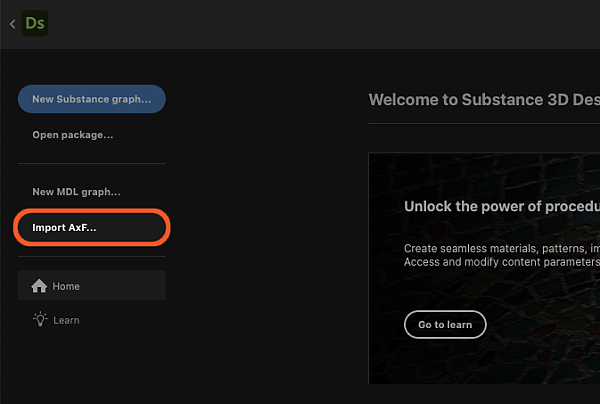
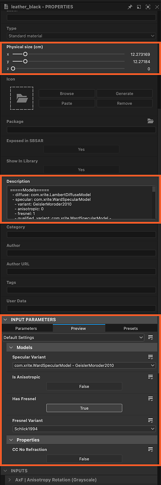
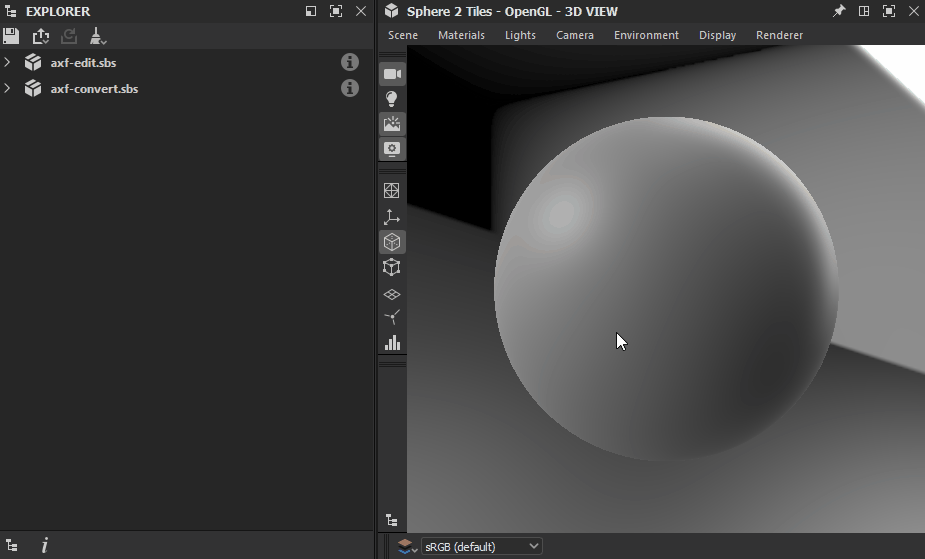

# AxF (Appearance eXchange Format)

<table>
<tr style="border: 0;">
<td width="25.00%" style="border: 0;" valign="top">

Icône 

</td>
<td width="100.00%" style="border: 0;" valign="top">

Substance 3D Designer prend en charge le format d&#39;exchange d&#39;apparence de [X-Rite.](https://www.xrite.com/axf) Les créateurs du format le décrivent comme suit :

«Les Fichiers AxF sont utilisés pour capturer, stocker, modifier et communiquer les caractéristiques de matériaux complexes tout au long du processus de conception numérique. AxF fournit un moyen standard de stocker et de partager toutes les données d&#39;apparence pertinentes (couleur, texture, brillance, réfraction, translucency, effets spéciaux (étincelles) et propriétés de réflexion) dans des applications de gestion du cycle de vie des produits (PLM), de conception assistée par ordinateur (CAO) et de rendu de pointe.»

</td>
</tr>
</table>

En termes simples, les Fichiers AxF hébergent un certain nombre de textures extraites par le matériel de scanner TAC7 de X-Rite, associées à des métadonnées qui décrivent des propriétés supplémentaires du matériau. Cela signifie qu&#39;un AxF est plus que de simples données de texture : il comporte également des propriétés d&#39;ombrage.

Les fichiers AxF ne sont *pas* importés en tant que package [ressource](../../resources/resources.md). Le [processus d&#39;importation](#import) implique plutôt l&#39;extraction des textures et des métadonnées du Fichier AxF, puis leur utilisation pour préparer des graphes créés à partir de [modèles dédiés](#graph-templates).

Les modèles disponibles s’adressent à deux workflows AxF :

* <b>conversion</b> d&#39;un matériau SVBRDF dans un Fichier AxF en matériau PBR ;
* <b>Modification</b> d&#39;un matériau SVBRDF en place et [exportation](#export) vers un Fichier AxF existant en tant que nouveau calque.

>[!NOTE]
>
> Modèles de matériau pris en charge
> 
> Seuls les matériaux utilisant un modèle <b>SVBRDF</b> (BRDF à variation spatiale) peuvent être *entièrement* chargés et modifiés dans Designer.
> 
> Les matériaux utilisant le modèle <b>EP-SVBRDF</b> (Energy Preserving SVBRDF) peuvent être chargés, mais seules les fonctions du modèle SVBRDF peuvent être modifiées et visualisées. Les fonctionnalités exclusives à EP-SVBRDF ne sont pas prises en charge.
> 
> Les autres modèles ne sont pas pris en charge.

## Importation de Fichiers AxF

Le workflow d’importation de Fichiers AxF peut être démarré à partir de l’une des deux méthodes ci-dessous :

+++Écran d’accueil

Cliquez sur le bouton <b>Importer AxF...</b> dans la section de gauche de l&#39;[écran d&#39;accueil](../../interface/home-screen/home-screen.md).

{width="600px"}

+++

+++Explorateur

Cliquez sur RMB sur un pack dans l&#39;[Explorateur](../../interface/the-explorer-window/the-explorer-window.md), puis accédez à <b>Importer > AxF</b> dans le menu contextuel du pack.

{width="600px"}

+++

### Boîte de dialogue Importer

La boîte de dialogue <b>Importation AxF</b> vous permet de vérifier les données chargées à partir du Fichier AxF sélectionné et de configurer les modèles de graphe requis pour effectuer les modifications ou conversions prévues.

Il comporte quatre sections :

L&#39;<b>En-tête</b> affiche le nom du matériau détecté dans le Fichier AxF, ainsi que sa représentation (actuellement, toujours SVBRDF). La vignette d’aperçu incorporée au fichier s’affiche également.

La section <b>Modèles</b> vous permet de configurer le modèle [Substance de graphes](../../compositing-graphs/substance-compositing-graphs.md) pour commencer à travailler sur le matériau. Consultez la section [Modèles de Graphe](#graph-templates) ci-dessous pour en savoir plus sur ces modèles et leur configuration.

<b>Textures</b> répertorie toutes les textures extraites du Fichier AxF impliqué dans le matériau détecté. Pour chaque texture, son nom, sa résolution native, son format de données et sa taille physique sont affichés.

Les <b>métadonnées</b> et les <b>propriétés</b> répertorient les données extraites du matériau dans le Fichier AxF. Cela a un impact sur la configuration de certaines propriétés de modèles de graphe de Substance (voir la section [Modèles de Graphe](#graph-templates) ci-dessous).

### Résultat

Après avoir cliqué sur le bouton <b>OK</b>, un pack est créé dans l&#39;[Explorateur](../../interface/the-explorer-window/the-explorer-window.md). Le package comprend les ressources suivantes :

<table>
<tr style="border: 0;">
<td style="border: 0;" valign="top">

Un dossier <b>Ressources</b> héberge un *sous-dossier* pour chaque matériau importé du Fichier AxF.

Chaque sous-dossier comprend un autre sous-dossier qui contient les *textures* extraites du Fichier AxF pour ce matériau. Ce dernier sous-dossier porte le nom du matériau *représentation* utilisé par les textures (actuellement uniquement <b>SVBRDF</b>).

Un graphe pour chaque modèle configuré dans la section <b>Modèles</b> de la boîte de dialogue d&#39;importation.\
Dans le cas des [graphes de Substance de données](../../compositing-graphs/substance-compositing-graphs.md), ceux-ci sont préconfigurés avec les textures et les données extraites du Fichier AxF, ainsi que les paramètres de modèle que vous avez sélectionnés (voir la section Modèles de Graphe ci-dessous).

</td>
<td style="border: 0;" valign="top">

</td>
</tr>
</table>

## Modèles de graphe

<table>
<tr style="border: 0;">
<td style="border: 0;" valign="top">

Il existe des modèles de graphe dédiés aux workflows AxF pour les [graphes de Substance](../../compositing-graphs/substance-compositing-graphs.md).

Cliquez sur le bouton <b>Ajouter un modèle</b> et sélectionnez le type de graphe souhaité dans le menu déroulant.

</td>
<td style="border: 0;" valign="top">

</td>
</tr>
</table>

### Modèles de graphe de Substance

<table>
<tr style="border: 0;">
<td style="border: 0;" valign="top">

Deux types de modèles de graphe de Substance sont disponibles :

Les modèles <b>AxF vers Métallique rugosité</b> et <b>AxF vers Specular Brillance</b> sont des modèles *de conversion* qui vous permettent de mapper les matériaux AxF vers des modèles PBR standard.\
Ils peuvent ensuite être utilisés avec les nuanceurs vue 3D par défaut et associés à d&#39;autres matériaux PBR produits dans Designer, [Sampler](https://www.adobe.com/products/substance3d-sampler.html) ou acquis à partir de notre bibliothèque [Ressources 3D](https://substance3d.adobe.com/assets/).

<b>AxF à AxF</b> est un modèle *transparent* qui vous permet de modifier les matériaux AxF en place et d&#39;exporter ces modifications sous forme de nouveaux calques dans les Fichiers AxF existants. Voir Exportation de Fichiers AxF ci-dessous pour en savoir plus.

</td>
<td style="border: 0;" valign="top">

</td>
</tr>
</table>

<table>
<tr style="border: 0;">
<td style="border: 0;" valign="top">

Pour tous les modèles de graphe de Substance ajoutés dans la liste <b>Modèles</b>, les opérations supplémentaires suivantes sont effectuées :

Pour tout nœud [<b>d&#39;entrée</b>](../../compositing-graphs/nodes-reference-for-com/atomic-nodes/input/input.md) dont l&#39;*utilisation* correspond à l&#39;*identifiant* d&#39;une texture extraite du Fichier AxF, ce Noeud d&#39;entrée est remplacé par un nœud [Bitmap](../../compositing-graphs/nodes-reference-for-com/atomic-nodes/bitmap/bitmap.md) référençant cette texture ;

La propriété <b>Résolution</b> du graphe (c&#39;est-à-dire Taille de la sortie) est automatiquement définie sur la puissance de deux égale ou supérieure à la résolution de la texture extraite *la plus grande* ;

La propriété <b>Résolution</b> des nœuds [Bitmap](../../compositing-graphs/nodes-reference-for-com/atomic-nodes/bitmap/bitmap.md) (c&#39;est-à-dire Taille de la sortie) est automatiquement définie pour correspondre à celle du graphe, après l&#39;application de l&#39;opération précédente ;

La propriété <b>Taille physique</b> du graphe est définie sur la taille physique de la *première* texture extraite ;

Les *valeurs par défaut* des paramètres du graphe sont définies pour correspondre aux données du Fichier AxF.

Les *métadonnées* extraites du matériau dans le Fichier AxF sont copiées dans la propriété <b>Description</b> du graphe.

>[!IMPORTANT]
>
> Les valeurs par défaut des paramètres du graphe ne doivent pas être modifiées après cette configuration initiale.
> 
> Ils spécifient les propriétés d’ombrage indispensables pour interpréter correctement les valeurs des textures.
> 
> Par conséquent, la modification de ces paramètres entraînera un rendu incorrect lors de la visualisation du matériau dans la [vue 3D](../../interface/3d-view/3d-view.md).

</td>
<td style="border: 0;" valign="top">

</td>
</tr>
</table>

## Exportation de Fichiers AxF

Les Fichiers AxF existants peuvent être modifiés sur place à partir de Designer, leurs ressources sont mises à jour à l&#39;aide des [sorties](../../compositing-graphs/nodes-reference-for-com/atomic-nodes/output/output.md) d&#39;un [graphe de Substances](../../compositing-graphs/substance-compositing-graphs.md).

Avec la possibilité d’exporter des sorties du graphe vers les Fichiers AxF, un workflow AxF standard dans Designer peut ressembler à ceci :

1. Importer un Fichier AxF
1. Utiliser le modèle de graphe de Substance « AxF à AxF »
1. Modifiez les textures extraites à l’aide des fonctions et des nœuds disponibles dans les graphes de Substance
1. Exporter les sorties du graphe vers le même Fichier AxF

La propriété <b>Taille physique</b> du graphe est utilisée pour définir l&#39;attribut <b>Taille physique</b> des textures mises à jour dans le Fichier AxF modifié.

>[!NOTE]
>
> Les modifications apportées aux ressources du fichier sont ajoutées en tant que *nouveau calque*. Cela signifie que chaque exportation effectuée à partir de Designer vers le même Fichier AxF augmentera la taille de ce fichier.

<table>
<tr style="border: 0;">
<td width="33.33%" style="border: 0;" valign="top">

### Boîte de dialogue Exporter

La boîte de dialogue d&#39;exportation <b>AxF</b> est disponible dans la boîte de dialogue <b>Exporter les sorties</b> en tant qu&#39;onglet dédié.

Dans la barre d&#39;outils [Vue du graphe](../../interface/the-graph-view/the-graph-view.md), ouvrez le menu  <b>Outils</b> et sélectionnez l&#39;option <b>Exporter les sorties...</b> pour afficher la boîte de dialogue, puis sélectionnez l&#39;onglet <b>AxF</b>.

</td>
<td width="100.00%" style="border: 0;" valign="top">

</td>
</tr>
</table>

La boîte de dialogue comporte trois sections principales :

Le champ de saisie <b>Fichier</b> vous permet de sélectionner le Fichier AxF cible qui doit être modifié. Ce fichier est chargé et vérifié, puis, si ses données sont valides, elles sont utilisées pour remplir les colonnes « Ressource AxF » ci-dessous.

<b>Les sorties mappées</b> répertorient les sorties du graphe dans la colonne Sortie et font correspondre leur *utilisation* à une ressource AxF dans le fichier cible qui partage le même *identifiant*. Si des problèmes sont détectés, ils s’affichent sous la forme d’un avertissement (jaune) ou d’une erreur (référence) dans la colonne Notes.

<b>Sorties non mappées</b> répertorie les sorties du graphe et les ressources AxF dans le fichier cible qui n&#39;ont pas pu être mappées. Ces sorties sont ignorées et ces ressources AxF restent inchangées.

>[!NOTE]
>
> Pour qu&#39;une sortie du graphe soit répertoriée dans cette boîte de dialogue, sa propriété <b>Groupe</b> doit être définie sur &#39;AxF&#39;.

Cliquez sur <b>Démarrer l&#39;exportation </b> pour modifier le Fichier AxF cible avec le nouveau calque contenant les modifications dans les sorties mappées.

Le résultat s’affiche sous forme de message en regard de la barre de progression dans la barre d’état de la boîte de dialogue.

>[!TIP]
>
> Un nouveau calque est créé dans le fichier cible chaque fois qu’une exportation est effectuée. Par conséquent, n’oubliez pas d’effectuer des exportations délibérées et délibérées pour gérer la taille et la complexité du fichier.

### Mappage des sorties aux ressources AxF

Lors de l’exportation vers un Fichier AxF existant, ses ressources sont mises à jour à l’aide des sorties du graphe. Designer fait correspondre l&#39;identifiant des ressources aux nœuds [Sortie](../../compositing-graphs/nodes-reference-for-com/atomic-nodes/output/output.md) qui ont le même identifiant qu&#39;une <b>Utilisation</b>.

En outre, la propriété *Groupe</b> de la sortie <b>doit* être définie sur &#39;AxF&#39; pour qu&#39;elle soit répertoriée dans la boîte de dialogue d&#39;exportation AxF (voir ci-dessus).

Les ressources peuvent être des textures (c’est-à-dire des bitmaps) ou des uniformes (c’est-à-dire des valeurs) avec un nombre spécifique de canaux. Il est obligatoire que la sortie du graphe corresponde exactement à ce nombre de chaînes. Si ce n’est pas le cas, une erreur sera générée pour cette ressource pendant l’exportation et elle restera inchangée.

Le nombre de canaux est spécifié différemment selon le type de données fournies au nœud de sortie :

* <b>Bitmap (Texture) :</b> la propriété [Components](../../compositing-graphs/nodes-reference-for-com/atomic-nodes/output/output.md) permet de spécifier le nombre de canaux, où R représente un canal, RG deux canaux, etc. La propriété est utilisée pour indiquer à Designer quels canaux RVBA de l’image bitmap couleur doivent être codés dans la ressource.
* <b>Valeur (uniforme) :</b> le nombre de composants de la valeur vectorielle est utilisé pour spécifier le nombre de canaux, où [Flottant](../../function-graphs/nodes-reference-for-fun/atomic-function-nodes/constant-nodes/constant-nodes.md) correspond à un canal, [Flottant 2](../../function-graphs/nodes-reference-for-fun/atomic-function-nodes/constant-nodes/constant-nodes.md) à deux canaux, et ainsi de suite.

>[!IMPORTANT]
>
> Dans le modèle de graphe de Substance <b>AxF à AxF</b>, le nœud [Output](../../compositing-graphs/nodes-reference-for-com/atomic-nodes/output/output.md) pour la contribution <b>Specular Lobe</b> est configuré par défaut sur un *canal unique* (c&#39;est-à-dire que sa propriété Components est définie sur &#39;R&#39;).\
> Si le Fichier AxF importé utilise plusieurs canaux dans sa ressource Lobe Specular, définissez la propriété <b>Components</b> de la sortie en conséquence.
> 
> Par exemple, pour une ressource Lobe Specular utilisant deux couches (Rouge pour Rugosité Specular et Vert pour Anisotropie Specular), définissez la propriété Components sur &#39;RG&#39;.

## Affichage des Fichiers AxF dans la vue 3D

La méthode de rendu des matériaux SVBRDF AxF dans la [vue 3D](../../interface/3d-view/3d-view.md) dépend de la [configuration d&#39;importation](#import).

+++Convertir en PBR

Si vous souhaitez convertir un matériau SVBRDF d&#39;un Fichier AxF en matériau PBR standard, votre configuration d&#39;importation impliquera probablement un [modèle de conversion de graphe Substance](#graph-templates).

Dans ce cas, vous devez utiliser le **moteur de rendu OpenGL** dans vue 3D et sélectionner le <code>SVBRF AxF</code> shader.\
Ensuite, vous pouvez glisser-déposer le graphe de Substance que vous avez configuré dans la boîte de dialogue d’importation, afin de connecter ses sorties au shader.

+++

+++Modifier sur place

Si votre objectif est d&#39;effectuer *des modifications* sur un Fichier AxF existant, suivez les instructions ci-dessous pour visualiser son matériau SVBRDF en fonction du moteur de rendu sélectionné :

Un shader GLSLFX dédié est disponible pour visualiser des matériaux à l&#39;aide d&#39;une représentation SVBRDF à partir d&#39;un Fichier AxF : <b>AxF SVBRDF</b>.

Le shader est disponible dans le menu <b>Matériaux</b> : ouvrez le sous-menu du matériau de la scène (« Par défaut ») et sélectionnez une technique sous l&#39;entrée <b>AxF SVBRDF</b>.

Utilisez l&#39;option <b>Modifier</b> dans le même sous-menu pour afficher les propriétés du shader dans le dock [Propriétés](../../interface/properties/properties.md).\
En particulier, la propriété <b>Répétition</b> vous permet d&#39;ajuster la répétition des textures sur le matériau afin de visualiser ce dernier à une échelle appropriée.

Après avoir sélectionné le shader, cliquez sur RMB dans l&#39;espace vide du graphe et sélectionnez l&#39;option <b>Afficher les sorties en vue 3D</b> pour visualiser ses sorties en [vue 3D](../../interface/3d-view/3d-view.md).

{width="600px"}

Ce shader est actuellement un *travail en cours* et certaines fonctionnalités ne sont toujours pas prises en charge. Par conséquent, bien qu&#39;il puisse donner une vue d&#39;ensemble des caractéristiques des matériaux, il ne devrait pas être utilisé pour des ajustements fins.

Utilisez l&#39;option <b>Modifier</b> dans le même sous-menu pour afficher les propriétés du shader dans le dock [Propriétés](../../interface/properties/properties.md).\
En particulier, la propriété <b>Répétition</b> vous permet d&#39;ajuster la répétition des textures sur le matériau afin de visualiser ce dernier à une échelle appropriée.

Après avoir sélectionné le shader, cliquez sur RMB dans l&#39;espace vide du graphe et sélectionnez l&#39;option <b>Afficher les sorties en vue 3D</b> pour visualiser ses sorties en [vue 3D](../../interface/3d-view/3d-view.md).

<i>Remarque :</i> ignorez la partie de la vidéo du basculement vers le rendu d&#39;Iray jusqu&#39;à la fin, car le rendu d&#39;Iray et la prise en charge de MDL ont été <i>supprimés</i> de Designer dans la version 16.0.0.

+++

### Variantes de modèle prises en charge

Les shaders utilisés dans la vue 3D prennent en charge les variantes suivantes pour les modèles de transmission de specular, de Fresnel et de couche claire:

<table>
<tr style="border: 0;">
<td style="border: 0;" valign="top">
<b>Variantes de Specular</b>

* Ward / Geisler-Moroder 2010
* GGX / Walter2007
* GGX / Ross 2005

</td>
<td style="border: 0;" valign="top">
<b>Variantes Fresnel</b>

* Schlick 1994
* Schlick 1994 coloré
* Fresnel simple

</td>
<td style="border: 0;" valign="top">
<b>Effacer les variantes de transmission du pelage</b>

* Dirac réfractif *(OpenGL uniquement)*
* Dirac réfractif / Aucune compression d&#39;angle solide *(OpenGL uniquement)*
* Dirac Non Réfractif
* Dirac non réfractif / DSPBR 2020x
* GGX

</td>
</tr>
</table>
