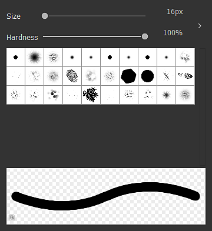

# Outils de peinture bitmap

Cette page décrit les outils de peinture disponibles dans le panneau [Vue 2D](../../../interface/2d-view/2d-view.md) pour les bitmaps compatibles.

{width="512px"}

## Vue d’ensemble

Le panneau [Vue 2D](../../../interface/2d-view/2d-view.md) offre des outils de peinture bitmap de base qui vous permettent de créer ou de modifier des images *manuellement* directement dans l&#39;application. Ces outils sont particulièrement utiles, par exemple, pour peindre rapidement des *masques*.

Les outils prennent en charge la saisie du stylet, y compris la *pression du stylet*. Pour tirer parti des écrans à stylet, vous pouvez [désancrer](../../../interface/customizing-your-wor/customizing-your-workspace.md) le panneau [Vue 2D](../../../interface/2d-view/2d-view.md), puis le placer et le redimensionner dans une configuration plus confortable pour la peinture.

Les modifications peuvent être *annulées individuellement* et toutes les autres fonctionnalités du panneau Affichage 2D sont toujours *disponibles* pendant que vous modifiez l&#39;image, telles que le panneau [Histogramme](../../../interface/2d-view/2d-view.md), l&#39;[affichage en mosaïque](../../../interface/2d-view/2d-view.md) et l&#39;[image d&#39;arrière-plan](../../../interface/2d-view/2d-view.md).

>[!IMPORTANT]
>
> Vous ne pouvez peindre *que* sur des *ressources bitmap* [8 bits](../../../resources/bitmap-resource/bitmap-resource.md) [nouvelles ou importées](../../../resources/importing-linking-and-new/importing-linking-and-new-resources.md).

>[!WARNING]
>
> **Windows uniquement**
> 
> Les utilisateurs de tablettes doivent appliquer les paramètres décrits dans la page suivante pour une expérience optimale : [Configuration des stylos et des tablettes](https://docs.substance3d.com/display/SPDOC/Configuring+Pens+and+Tablets)

{width="512px"}

## Activation des outils de peinture

Les outils de peinture seront automatiquement activés dans le panneau [Vue 2D](../../../interface/2d-view/2d-view.md) lorsque les critères suivants concernant une image bitmap seront remplis :

* Le bitmap est une ressource [nouvelle ou importée](../../../resources/importing-linking-and-new/importing-linking-and-new-resources.md)
* Le bitmap a une précision de *8 bits*
* Le bitmap s&#39;affiche dans le panneau [Vue 2D](../../../interface/2d-view/2d-view.md)

Les bitmaps *nouveaux* peuvent être créés de l&#39;une des manières suivantes :

* Dans le panneau [Explorateur](https://helpx.adobe.com/substance-3d/unlisted/documentation/sddoc/the-explorer-129368147.html), cliquez sur RMB sur un *pack SBS* ou sur un *dossier* dans un pack pour ouvrir leur menu contextuel, puis ouvrez le sous-menu <b>Nouveau</b> et sélectionnez l&#39;option <b>Bitmap</b>
* Dans un [graphique](../../../interface/the-graph-view/the-graph-view.md), créez un [nœud Bitmap](../../../compositing-graphs/nodes-reference-for-com/atomic-nodes/bitmap/bitmap.md) et sélectionnez l&#39;option <b>À partir d&#39;une nouvelle ressource...</b> dans le menu contextuel

La fenêtre <b>Nouveau bitmap</b> s&#39;ouvre et vous permet de définir *nom*, *résolution* et *couleur d&#39;arrière-plan* de la nouvelle ressource bitmap.

>[!NOTE]
>
> Les *nouvelles* ressources bitmap *toujours* ont des couleurs *RVBA* et une précision *8 bits*.

>[!WARNING]
>
> Pour des performances optimales avec les outils de peinture, nous vous recommandons d’utiliser des bitmaps avec des résolutions *de deux*, par exemple 128, 256, 512, 1024, ...

## Barres d&#39;outils

Les outils et options de peinture sont organisés dans les *barres d&#39;outils* du panneau [Vue 2D](../../../interface/2d-view/2d-view.md). Ces barres d&#39;outils peuvent être déplacées sur *n&#39;importe quel côté* du panneau ou en tant que *barre d&#39;outils flottante*, en cliquant et en maintenant <b>LMB</b> sur leur *poignée* (affichée sous la forme d&#39;une triple ligne), puis en relâchant <b>LMB</b> à l&#39;emplacement souhaité.

Deux barres d&#39;outils s&#39;affichent lorsque les outils de peinture sont activés : la [barre d&#39;outils de sélection d&#39;outils](#bitmappaintingtools-toolselectiontoolbar) et la barre d&#39;outils Options d&#39;outils, qui sont décrites ci-dessous.

## Barre d’outils de sélection d’outils

Les outils de peinture se trouvent dans la **barre d&#39;outils de sélection d&#39;outils**, qui est placée par défaut *à gauche* du panneau [Vue 2D](../../../interface/2d-view/2d-view.md). Les raccourcis clavier vous permettent d’accéder rapidement à ces outils et sont indiqués ci-dessous entre parenthèses après le nom de l’outil/de la fonction :

 <b>Sélection de couleurs</b> <b>vignettes :</b> permet de définir une couleur *primaire* et *secondaire*. Cliquez sur l&#39;une de ces vignettes pour afficher la fenêtre <b>Éditeur de couleurs</b> et définir une couleur. Les outils utiliseront la couleur *primaire*. Les couleurs primaire et secondaire peuvent être *permutées* (<b>X</b>) à tout moment

 <b>Outil Pinceau (B) :</b> applique la couleur *primaire* à l&#39;emplacement du curseur, lorsque l&#39;utilisateur appuie sur la pointe du stylet ou le bouton <b>LMB</b>, à l&#39;aide des options définies dans la barre d&#39;outils Options d&#39;outil

 <b>Outil Tampon (T) :</b> vous permet de tamponner une partie de l&#39;image sur une autre. Vous pouvez définir la *source* qui doit être tamponnée en maintenant la touche <b>Alt</b> enfoncée et en cliquant sur <b>LMB</b>. Cette zone de l&#39;image sera ensuite tamponnée sur la zone *cible* de l&#39;image à l&#39;emplacement du curseur, lorsque vous appuyez sur la pointe du stylet ou le bouton <b>LMB</b>, à l&#39;aide des options définies dans la barre d&#39;outils Options d&#39;outil. Veuillez noter que la source *suivra* les mouvements de la cible et que la taille de la zone *source* *correspondra* à la taille du *pinceau*

 <b>Activer l&#39;alignement (option de l&#39;outil Tampon) :</b> vous permet de définir si la source doit *rester en place* lorsqu&#39;un nouveau tampon commence, ou si elle doit *se déplacer par rapport au nouvel emplacement du tampon*

Gomme <b> (E) :</b> remplace la couleur actuelle de l&#39;image par la valeur (0, 0, 0, 0) à l&#39;emplacement du curseur, lorsque vous appuyez sur la pointe du stylet ou le bouton <b>LMB</b>, à l&#39;aide des options définies dans la barre d&#39;outils Options d&#39;outil. Assurez-vous que l&#39;[affichage de la transparence](../../../interface/2d-view/2d-view.md) est activé pour suivre l&#39;impact de cet outil sur le canal <b>Alpha</b>.

## Barre d’outils Options d’outil

Les options des outils disponibles dans la [barre d&#39;outils de sélection d&#39;outils](#bitmappaintingtools-toolselectiontoolbar) se trouvent dans la barre d&#39;outils Options d&#39;outils, qui est placée par défaut *en haut* du panneau [Vue 2D](../../../interface/2d-view/2d-view.md).

<table>
<tr style="border: 0;">
<td style="border: 0;" valign="top">

### SÉLECTION DU PINCEAU

La  <b>sélection du pinceau</b> vous permet de sélectionner un pinceau *préconfiguré* à partir des *paramètres prédéfinis* de pinceau disponibles, de définir sa <b>taille</b> et sa <b>dureté</b> *(* voir la section <b>Forme</b> de l’éditeur de pinceau), et affiche un *aperçu* d’un coup de pinceau.

Les pinceaux prédéfinis peuvent être créés et modifiés dans l&#39;éditeur de pinceaux et classés dans *bibliothèques*. Les pinceaux prédéfinis qui apparaîtront dans ce panneau représentent la *somme* de toutes les bibliothèques de pinceaux prédéfinis chargées. Ces bibliothèques peuvent être gérées en accédant au menu  <b>Bibliothèque de pinceaux</b> (voir la section <b>Paramètres prédéfinis</b> de l’éditeur de pinceaux)

Le bouton  <b>Sélectionner la couleur d&#39;arrière-plan</b> vous permet de modifier la couleur d&#39;arrière-plan de l&#39;*aperçu du contour*.

</td>
<td style="border: 0;" valign="top">

</td>
</tr>
</table>

<table>
<tr style="border: 0;">
<td style="border: 0;" valign="top">

### ÉDITEUR DE PINCEAUX

L&#39; <b>éditeur de pinceau</b> donne accès à des options granulaires pour définir le comportement du pinceau :

<b>Paramètres prédéfinis</b>

Les pinceaux peuvent être personnalisés, puis enregistrés en tant que <b>pinceau prédéfini</b>, qui sera ensuite disponible dans la  <b>liste de pinceaux prédéfinis</b> et dans le panneau  <b>Sélection de pinceaux</b>.

Pour créer un paramètre prédéfini, définissez les propriétés ci-dessous à votre convenance, puis cliquez sur le bouton  <b>Ajouter un pinceau prédéfini </b> et définissez un nom de pinceau dans la fenêtre <b>Nom du paramètre prédéfini</b>. Le nouveau paramètre prédéfini est désormais automatiquement sélectionné dans la <b>liste des pinceaux prédéfinis</b>. Vous pouvez à tout moment le  <b>mettre à jour</b> avec les nouveaux paramètres actuels ou le  <b>supprimer</b>.

Les paramètres prédéfinis sont organisés et enregistrés dans des *bibliothèques*, qui peuvent être gérées dans le menu de la  <b>bibliothèque de pinceaux</b> :

<b>Exporter la bibliothèque :</b> *enregistrer* les paramètres prédéfinis actuels et tous leurs paramètres dans un fichier de bibliothèque

<b>Importer la bibliothèque :</b> *charger* les paramètres prédéfinis à partir d&#39;un fichier de bibliothèque existant et *les ajouter* à la liste actuelle : les paramètres prédéfinis portant le *même nom sont remplacés* par ceux du fichier de bibliothèque

<b>Réinitialiser la bibliothèque :</b> réinitialise les paramètres prédéfinis actuels par la bibliothèque par défaut

<b>Remplacer la bibliothèque :</b> *charger* les paramètres prédéfinis à partir d&#39;un fichier de bibliothèque existant et *fermer* la liste actuelle

</td>
<td style="border: 0;" valign="top">

</td>
</tr>
</table>

#### Paramètres du pinceau

Les paramètres d’un pinceau sont regroupés dans les sections suivantes :

+++Forme
Le paramètre <b>Type de forme</b> contrôle la forme de base du pinceau. Les formes disponibles sont les suivantes :

* *Ellipse* : forme ronde définie comme *cercle* par défaut

* *Rectangle* : forme droite définie comme *carré* par défaut

* *Polygone* : forme droite qui a un nombre *personnalisable* de bords et d&#39;angles

<b>Nombre d&#39;arêtes </b>(*Forme de polygone* uniquement) : vous permet de choisir le nombre de *faces* du polygone

<b>Rayon interne </b>(*Forme de polygone* uniquement) : permet de contrôler la distance entre un visage *milieu* et le centre de la forme, créant ainsi un motif *étoile*

<b>Dureté</b> : définit *rayon de fondu* de la forme

+++

+++Transformer
Lors de l’application d’un contour à l’image, le contour est en fait un estampage répété du motif de pinceau, suivant le comportement défini par les commandes de cette section.

<b>Taille</b> : définit le *diamètre* de la forme du pinceau en pixels

<b>Variation de taille</b> : vous permet de *randomiser* la taille du pinceau par tampon, qui est exprimée en *pourcentage* de la valeur <b>Taille</b>, et contrôle la *plage* de valeurs aléatoires de <b>0</b> à la valeur <b>Taille</b>

<b>Contrôle de la taille</b> : si vous utilisez une entrée de stylet avec prise en charge de la *pression du stylet*, vous pouvez utiliser ce paramètre pour contrôler la taille du pinceau

<b>Espacement</b> : contrôle l&#39;espacement *entre chaque tampon individuel* le long d&#39;un coup de pinceau. Cela permet de séparer et de définir plus clairement les motifs de forme

<b>Arrondi</b> : par défaut, le <b>type de forme</b> sélectionné dans la section <b>Forme</b> a un rapport largeur/height de *1:1*. Ce paramètre vous permet de modifier ce rapport en *abaissant la largeur* en pourcentage de l&#39;height

<b>Variation d&#39;arrondi</b> : vous permet de *randomiser* l&#39;arrondi par tampon, qui est exprimé en *pourcentage* de la valeur d&#39;<b>arrondi</b>, et contrôle la *plage* de valeurs aléatoires de <b>0</b> à la valeur d&#39;<b>arrondi</b>

<b>Angle</b> : contrôle la *rotation* du motif de pinceau en *degrés*

<b>Variation d&#39;angle</b> : vous permet de *randomiser* la rotation par tampon, qui est exprimée en *pourcentage* de la valeur <b>Angle</b>, et contrôle la *plage* de valeurs aléatoires de <b>0</b> à <b>360 </b>degrés

+++

+++Dispersion
Par défaut, le motif de forme est estampé strictement le long du contour. Il peut s’avérer nécessaire de perturber ce processus en appliquant un décalage au motif de forme afin qu’il puisse être éparpillé autour du trait pour un effet plus organique ou chaotique.

<b>Dispersion</b> : *distance* maximale par laquelle chaque tampon individuel doit être décalé par rapport au trait, exprimée en pourcentage de l&#39;*épaisseur du pinceau*. Notez que cette distance est *aléatoire par défaut* entre <b>0</b> et le *pourcentage défini* de l&#39;épaisseur du pinceau, et que la *direction* du décalage est également aléatoire

<b>Nombre</b> : nombre de copies dispersées d&#39;un tampon individuel

+++

+++Couleur
La couleur appliquée par le pinceau est définie par la *couleur primaire sélectionnée* et la <b>texture du pinceau</b>, si une couleur est actuellement appliquée. Cette couleur peut être modifiée dynamiquement à l’aide des commandes de cette section.

<b>Variation du flux</b> : vous permet de *randomiser* le flux par tampon, exprimé en *pourcentage* du flux maximal

<b>Contrôle du flux</b> : si vous utilisez une entrée de stylet avec prise en charge de la *pression du stylet*, vous pouvez utiliser ce paramètre pour lui permettre de contrôler le flux

<b>Variation de teinte</b> : vous permet de *randomiser* la teinte de couleur *décalée* par tampon, exprimée en *pourcentage* de l&#39;étendue de teinte complète

<b>Variation de saturation</b> : vous permet de *randomiser* la saturation de couleur *décalée* par tampon, exprimée en *pourcentage* de l&#39;étendue de saturation complète

<b>Variation de la luminosité</b> : vous permet de *randomiser* la luminosité des couleurs *décalée* par tampon, exprimée sous la forme d&#39;un *pourcentage* de l&#39;étendue de luminosité complète

+++

+++Texture
Vous pouvez appliquer un *fichier bitmap* au pinceau et l&#39;utiliser pour *tamponner* ce bitmap au lieu d&#39;une couleur plate. La texture du pinceau se comporte comme suit :

<b>Fichier de texture :</b>définit le *chemin* du bitmap qui doit être utilisé comme texture de pinceau. Vous pouvez sélectionner l’image bitmap via votre explorateur de fichiers système à l’aide du bouton  en regard du champ de saisie

La texture *uniquement* remplace la couleur plate de base du pinceau, ce qui signifie que *toutes les propriétés de pinceau répertoriées ci-dessus peuvent toujours être utilisées* et fonctionner comme décrit

Les couleurs de la texture sont *décalées en teinte* vers la *couleur primaire définie*, ce qui signifie que si la couleur primaire définie est le blanc, les couleurs de la texture peuvent être utilisées telles quelles. Plus la couleur primaire définie est saturée, plus les couleurs de la texture seront décalées vers celle-ci

+++

### OPACITÉ/FLUX

Les outils Pinceau, Tampon et Gomme offrent des commandes pour l&#39;<b>opacité</b> et le <b>flux</b> :

L&#39;<b>opacité</b> contrôle l&#39;*opacité maximale* du tampon. Il s&#39;agit d&#39;un effet *additif sur des traits distincts*, ce qui signifie que l&#39;opacité d&#39;une zone peut être ramenée à son maximum de 100 % en effectuant plusieurs traits *distincts* dans cette zone

<b>Flux</b> contrôle la *quantité d&#39;effet de l&#39;outil* qui est appliquée à tout moment. Il s&#39;agit d&#39;*un additif sur le même contour*, ce qui signifie que l&#39;opacité d&#39;une zone peut être ramenée à son maximum de 100 % en effectuant plusieurs passes du *même contour* dans cette zone, ou plusieurs contours distincts.

<table>
<tr style="border: 0;">
<td width="100.00%" style="border: 0;" valign="top">

### MODE MOSAÏQUE

Les outils Pinceau, Tampon et Gomme vous permettent également de définir leurs  <b>modes de mosaïque</b>, qui définissent leur capacité à *boucler* vers le côté opposé de l&#39;image lorsqu&#39;un trait affecte une zone en dehors des limites de l&#39;image :

<b>Mosaïque X et Y</b> : mosaïque de coups de pinceau *horizontalement et verticalement*

<b>Mosaïque X</b> : mosaïque de coups de pinceau *horizontalement uniquement*

<b>Mosaïque Y</b> : vignette de contours *verticalement uniquement*

<b>Aucun carrelage</b> : les coups de pinceau *ne sont pas carrelés*

</td>
<td width="25.00%" style="border: 0;" valign="top">

</td>
</tr>
</table>
