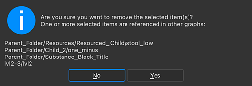

# Import, liaison et nouvelles ressources

[Substance 3D Designer](https://www.adobe.com/fr/products/substance3d-designer.html) prend en charge 3 modes d&#39;importation ou de création de nouvelles ressources à utiliser dans votre graphique. Ces ressources peuvent être de différents types, y compris, mais sans s&#39;y limiter, les [bitmaps](../../resources/bitmap-resource/bitmap-resource.md), les [images vectorielles](../../resources/vector-graphics-svg-res/vector-graphics-svg-resource.md), les [scènes 3D](https://helpx.adobe.com/fr/substance-3d/unlisted/documentation/sddoc/3d-mesh-resource-200574577.html) et les [polices](../../resources/font-resource/font-resource.md). Cette page explique les différentes méthodes et quand chacune est la mieux utilisée.

Pour accéder à toutes les méthodes, [cliquez sur RMB sur un pack dans l&#39;Explorateur](https://helpx.adobe.com/fr/substance-3d/unlisted/documentation/sddoc/the-explorer-129368147.html) [.](https://helpx.adobe.com/fr/substance-3d/unlisted/documentation/sddoc/the-explorer-129368147.html)

Le tableau suivant donne un aperçu rapide des différences de fonctionnalités entre les méthodes.

|                                                                                                                                                                         | Nouveau | Importer | Lier |
|-------------------------------------------------------------------------------------------------------------------------------------------------------------------------|----------------------------------------------------------------------------------------|----------------------------------------------------------------------------------------|----------------------------------------------------------------------------------------|
| Graphiques ([graphiques de Substance](../../compositing-graphs/substance-compositing-graphs.md), [graphiques de fonction de Substance](../../function-graphs/function-graphs.md) | 

 | 

 | 

 |
| [Bitmaps](../../resources/bitmap-resource/bitmap-resource.md),[&#x200B; images vectorielles (SVG)](../../resources/vector-graphics-svg-res/vector-graphics-svg-resource.md) | 

 | 

 | 

 |
| [Scènes 3D](https://helpx.adobe.com/fr/substance-3d/unlisted/documentation/sddoc/3d-mesh-resource-200574577.html), [polices](../../resources/font-resource/font-resource.md) | 

 | 

 | 

 |
| Est créé en regard du fichier SBS | 

 | 

 | 

 |
| Modifiable dans Designer | 

 | 

 | 

 |
| Les modifications externes sont automatiquement synchronisées | 

 | 

 | 

 |
| Incorporé dans le SBSAR publié | 

 | 

 | 

 |

## Nouvelles ressources

La création d’une nouvelle ressource signifie qu’une ressource de votre pack sera créée à partir de zéro. Toutes les ressources Designer uniquement peuvent uniquement être créées de cette façon, telles que les graphiques de Substances et de fonctions de Substance.

La création d&#39;[une image bitmap](../../resources/bitmap-resource/bitmap-resource.md)ou d&#39;[un SVG](../../resources/vector-graphics-svg-res/vector-graphics-svg-resource.md) est un cas particulier : ces fichiers s&#39;afficheront dans votre Explorateur et se comporteront comme une ressource importée, mais sans nécessiter de fichier externe. Ils peuvent être modifiés dans Designer. Les nouvelles images bitmap et les nouveaux SVG créés de cette manière sont utiles si vous n’avez pas besoin de faire appel à un éditeur externe : par exemple, si vous souhaitez simplement une forme vectorielle rapide et simple ou un simple masque d’image bitmap 2D peint.

## Ressources importées

L&#39;importation d&#39;une ressource signifie qu&#39;une copie du fichier de ressources sera créée à côté de votre fichier SBS (dans le dossier *Graphname*.resources), [sauf pour les fichiers SVG](../../resources/vector-graphics-svg-res/vector-graphics-svg-resource.md). Elle est parfois également appelée « incorporation » d’une ressource.

Une fois placée dans le graphique, une ressource importée peut ensuite être modifiée dans Designer à l&#39;aide des [outils de peinture bitmap](../../resources/bitmap-resource/bitmap-painting-tools/bitmap-painting-tools.md) ou des [outils d&#39;édition vectorielle](../../resources/vector-graphics-svg-res/vector-editing-tools/vector-editing-tools.md) dans la [vue 2D](../../interface/2d-view/2d-view.md). Les ressources importées ne sont plus liées à leurs fichiers source d’origine : cela signifie que si vous modifiez, supprimez ou mettez à jour le fichier importé à l’origine, cela n’a aucun effet sur les ressources dans Designer.

Dans le cas de [fichiers AxF](../../resources/axf-appearance-exchange/axf-appearance-exchange-format.md), le processus est un peu plus compliqué : des graphiques de Substance et des ressources bitmap sont créés à partir du package AxF. Tous ces éléments peuvent toutefois être modifiés dans leurs éditeurs respectifs : vue Graphique ou vue 2D.

>[!WARNING]
>
> Pour les nouveaux packs, les ressources importées et nouvelles ne sont pas enregistrées sur le disque tant que vous n’enregistrez pas le pack.

## Ressources liées

La liaison d’une ressource signifie que Designer référencera le fichier source à son emplacement d’origine sur le disque, mais le présentera dans l’Explorateur comme s’il faisait partie de votre pack. Vous ne pourrez pas modifier la ressource réelle directement dans Designer, utilisez-la uniquement en tant que composant de votre graphique ou en tant que source pour créer des cartes.

La liaison est idéale si vous savez que vous devrez utiliser un éditeur externe pour mettre à jour votre ressource pendant que vous travaillez simultanément dans Designer. Les bitmaps de référence sont un exemple parfait : vous pouvez avoir des bitmaps de référence Designer provenant d’une application de baking externe, qui rechargeront et mettront à jour automatiquement votre graphique dès que ces fichiers seront modifiés. De même, les scènes 3D ne peuvent être liées qu’entre elles. Ainsi, lorsque vous exportez un nouveau fichier FBX à partir de votre application 3D, Designer met automatiquement à jour le maillage utilisé dans la vue 3D. Si vous êtes en train de cuire des cartes à partir de ce maillage, vous devrez recommencer manuellement le processus de cuisson, idéalement en cliquant sur RMB et en sélectionnant &#39;Actualiser toutes les maps bakées&#39;.

## Suppression de ressources

Lors de la suppression d&#39;une ressource d&#39;un package, la boîte de dialogue <b>Confirmer la suppression de l&#39;élément</b> s&#39;affiche. Si des éléments en cours de suppression sont *référencés par d&#39;autres Substances*, comme [les instances de graphes](../../compositing-graphs/creating-compositing-gra/graph-instances-sub-gra/graph-instances-sub-graphs.md) et [les ressources bitmap](../../resources/bitmap-resource/bitmap-resource.md) utilisées dans les [graphes de graphiques](../../compositing-graphs/substance-compositing-graphs.md), la boîte de dialogue inclut un *avertissement et une liste* de ces éléments.

>[!NOTE]
>
> Nous vous recommandons d&#39;être attentif à ces éléments et de prendre les mesures nécessaires pour *anticiper toutes les dépendances rompues* qui résulteraient de la suppression d&#39;éléments d&#39;un package.\
> Ces actions peuvent inclure la *suppression de toutes les utilisations* de ces ressources avant la suppression.

{width="512px"}
