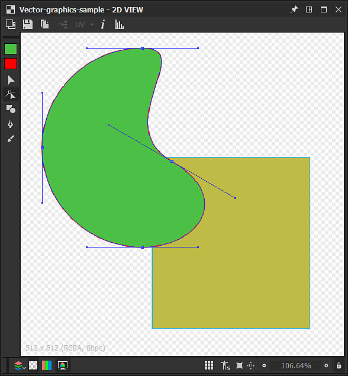
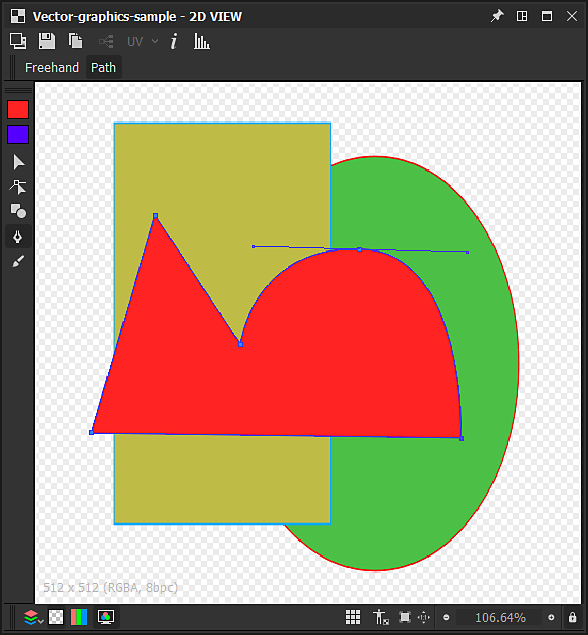
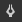

# Outils d’édition vectorielle

Cette page décrit les outils de modification disponibles dans le panneau [Vue 2D](https://docs.substance3d.com/display/SDDOC/2D+view) pour les images vectorielles compatibles.

## Vue d’ensemble

<table>
<tr style="border: 0;">
<td style="border: 0;" valign="top">

Le panneau [Vue 2D](https://docs.substance3d.com/display/SDDOC/2D+view) offre des outils d&#39;édition vectorielle de base qui vous permettent de créer ou de modifier des graphiques vectoriels *manuellement* directement dans [Substance 3D Designer](https://www.adobe.com/fr/products/substance3d-designer.html). Ces outils sont particulièrement utiles, par exemple, pour créer rapidement des *masques* ou des *motifs*.

Les outils prennent en charge la saisie au stylet. Pour tirer parti des écrans à stylet, vous pouvez [désancrer](https://docs.substance3d.com/display/SDDOC/Customizing+your+workspace) le panneau [Vue 2D](https://docs.substance3d.com/display/SDDOC/2D+view), puis le placer et le redimensionner dans une configuration plus confortable pour la peinture.

Les modifications peuvent être *annulées individuellement* et toutes les autres fonctionnalités du panneau Vue 2D sont toujours *disponibles* lorsque vous modifiez l&#39;image vectorielle, telles que le panneau [Histogramme](https://docs.substance3d.com/display/SDDOC/2D+view#id-2Dview-Histogram), l&#39;[affichage en mosaïque](https://docs.substance3d.com/display/SDDOC/2D+view#id-2Dview-Viewport) et l&#39;[image d&#39;arrière-plan](https://docs.substance3d.com/display/SDDOC/2D+view#id-2Dview-Backgroundimage).

</td>
<td style="border: 0;" valign="top">

{width="512px"}

</td>
</tr>
</table>

>[!TIP]
>
> **Windows uniquement**
> 
> Les utilisateurs de tablettes doivent appliquer les paramètres décrits dans la page suivante pour une expérience optimale dans Designer : [Configuration des stylos et des tablettes](https://docs.substance3d.com/display/SPDOC/Configuring+Pens+and+Tablets)

>[!IMPORTANT]
>
> Vous ne pouvez peindre *que* sur des *ressources d&#39;images vectorielles[&#128279;](../../../resources/vector-graphics-svg-res/vector-graphics-svg-resource.md)&#x200B; &lbrace;8 bits*[nouvelles ou importées](https://docs.substance3d.com/display/SDDOC/Importing%2C+Linking+and+New+Resources).

{width="512px"}

## Activation des outils d’édition vectorielle

Les outils d&#39;édition vectorielle seront automatiquement activés dans le panneau [Vue 2D](https://docs.substance3d.com/display/SDDOC/2D+view) lorsque les critères suivants concernant une image vectorielle seront remplis :

* L&#39;image vectorielle est une ressource [nouvelle ou importée](https://docs.substance3d.com/display/SDDOC/Importing%2C+Linking+and+New+Resources)
* Le bitmap s&#39;affiche dans le panneau [Vue 2D](https://docs.substance3d.com/display/SDDOC/2D+view)

Les *nouvelles* images d&#39;images vectorielles peuvent être créées de l&#39;une des manières suivantes :

* Dans le panneau [Explorateur](https://docs.substance3d.com/display/SDDOC/The+Explorer+Window), cliquez sur RMB sur un *pack SBS* ou sur un *dossier* dans un pack pour ouvrir leur menu contextuel, puis ouvrez le sous-menu **Nouveau** et sélectionnez l&#39;option **SVG**
* Dans un [graphique](https://docs.substance3d.com/display/SDDOC/The+Graph+view), créez un [nœud de SVG](../../../compositing-graphs/nodes-reference-for-com/atomic-nodes/svg/svg.md) et sélectionnez l&#39;option **À partir d&#39;une nouvelle ressource...** dans le menu contextuel

La fenêtre **Nouvelles données vectorielles** s’ouvre, vous permettant de définir le *nom* et la *résolution* de la nouvelle ressource d’images vectorielles.

>[!TIP]
>
> Pour des performances optimales avec les outils d&#39;édition vectorielle, nous vous recommandons d&#39;utiliser des images vectorielles avec des résolutions *de deux*, par exemple 128, 256, 512, 1024, ...

### Exportation d’images vectorielles à partir d’autres logiciels

Designer *uniquement* prend en charge les images vectorielles utilisant le format de fichier **SVG**.

Pour optimiser la compatibilité et la fiabilité de Designer et de ses outils d&#39;édition, assurez-vous que tous les objets sont convertis en *contours* et dissociés en *objets distincts* à l&#39;aide de *couleurs plates*, de sorte qu&#39;*aucun des éléments suivants ne subsiste* :

* **Texte**
* **Dégradés**
* **Motifs** (à la fois pour les fonds et les contours)
* **Styles**

Les utilisateurs d&#39;**Adobe Illustrator** peuvent se reporter à l&#39;image jointe pour connaître les *paramètres d&#39;exportation recommandés pour le SVG.*

+++Options d’exportation Adobe Illustrator

+++

>[!NOTE]
>
> Pour en savoir plus sur les limitations du SVG, l&#39;exportation à partir d&#39;autres logiciels et propriétés du SVG dans Designer, consultez la section [Ressources d&#39;images vectorielles (SVG)](../../../resources/vector-graphics-svg-res/vector-graphics-svg-resource.md).

## Outils

Les outils et options de peinture sont organisés dans les *barres d&#39;outils* du panneau [Vue 2D](https://docs.substance3d.com/display/SDDOC/2D+view). Ces barres d&#39;outils peuvent être déplacées sur *n&#39;importe quel côté* du panneau ou en tant que *barre d&#39;outils flottante*, en cliquant et en maintenant **LMB** sur leur *poignée* (affichée sous la forme d&#39;une triple ligne), puis en relâchant **LMB** à l&#39;emplacement souhaité.

Deux barres d’outils s’affichent lorsque les outils d’édition vectorielle sont activés :

* **Sélection d&#39;outil** **barre d&#39;outils** : vous permet de *sélectionner un outil* ainsi que les *couleurs de remplissage/contour*. Par défaut, cet outil est placé sur le côté *gauche* du panneau Vue 2D
* **Barre d&#39;outils des options d&#39;outil** : vous permet de définir les *options* pour l&#39;*outil actuellement sélectionné*. Par défaut, cet outil est placé sur le côté *supérieur* du panneau Vue 2D

Les raccourcis clavier vous permettent d’accéder rapidement aux outils et sont indiqués ci-dessous entre parenthèses après le nom de l’outil/de la fonction :

+++Choix de couleur
Les  **vignettes *de sélection de couleurs*** vous permettent de définir une couleur de *remplissage* et de *contour* pour les formes vectorielles. Vous pouvez ouvrir l&#39;**éditeur de couleurs** pour chacune de ces couleurs de l&#39;une des manières suivantes :

* **Couleur de fond :** cliquez sur la vignette de la couleur de *fond* (en haut) ou double-cliquez sur LMB sur la zone de travail

* **Couleur du contour :** cliquez sur la vignette de couleur du *contour* (en bas) ou *maintenez la touche Ctrl* enfoncée et double-cliquez sur LMB sur la zone de travail

Les couleurs définies seront ensuite appliquées aux *formes actuellement sélectionnées*.

Si la couleur de *contour* actuelle est *noire*, c&#39;est-à-dire luminance 0 ou RGB (0, 0, 0), elle *ne* sera pas appliquée aux formes sélectionnées tant que vous n&#39;aurez pas *cliqué sur la vignette de couleur de contour*.

+++

+++Transformation
{width="512px"}

L&#39;outil  <b>Transformation</b> (<b>V</b>) peut sélectionner des formes, qui sont ensuite incluses dans un gadget de transformation. Cet objet vous permet d&#39;effectuer les actions suivantes :

<b>Déplacer</b> : cliquez et maintenez le LMB *à l&#39;intérieur* de l&#39;objet

<b>Mise à l&#39;échelle</b> : cliquez et maintenez le bouton de la souris enfoncé sur l&#39;une des *poignées carrées* le long du gadget pour *mettre à l&#39;échelle* l&#39;objet horizontalement, verticalement ou les deux. Par défaut, la mise à l&#39;échelle est effectuée par rapport à la poignée sur le côté *opposé* de l&#39;objet. Vous pouvez maintenir la touche <b>Alt</b> pour effectuer la mise à l&#39;échelle par rapport au *centre* de l&#39;objet, et maintenir la touche <b>Maj</b> enfoncée pour *verrouiller* le *rapport largeur/height* de l&#39;objet

<b>Rotation :</b>cliquez et maintenez le bouton de la souris enfoncé à côté de l&#39;une des *poignées carrées* le long de l&#39;objet, *à l&#39;extérieur* de l&#39;objet.

+++

+++Nœud
{width="512px"}

L&#39;outil  <b>Nœud</b> (<b>A</b>) vous permet de sélectionner des sommets individuels (c&#39;est-à-dire des nœuds) de la forme sélectionnée et de modifier sa position et ses poignées, ainsi que d&#39;ajouter et de supprimer des sommets. Une fois qu’une forme est sélectionnée, les actions suivantes peuvent être effectuées :

<b>Ajouter un sommet :</b> Ctrl+LMB sur le contour de la forme

<b>Supprimer le sommet</b> : Ctrl+LMB sur le sommet

<b>Déplacer le sommet</b> : maintenez le repère LMB sur le sommet

<b>Déplacer les poignées de sommet</b> : maintenez le bouton de la souris enfoncé sur la poignée

<b>Déplacer indépendamment la poignée de sommet</b> : maintenez les touches Alt+LMB enfoncées sur la poignée. Notez que les poignées seront *dissociées* au-delà de ce point jusqu&#39;à ce qu&#39;elles soient *réinitialisées*

<b>Réinitialiser les poignées</b> : cliquez sur Alt+LMB sur le sommet. Les poignées seront réinitialisées à la *position du sommet*

<b>Déplacer les poignées de sommet réinitialisées</b> : maintenez les touches Alt+LMB enfoncées sur le sommet. Les poignées *liées* apparaîtront

+++

+++Forme
{width="512px"}

L&#39;outil  <b>Formes</b> (<b>M</b>) offre un ensemble de formes primitives, utilisant la couleur actuelle de *remplissage*, qui peut être créée et modifiée :

* <b>Rectangle ;</b>

* <b>Ellipse ;</b>

* <b>Rectangle arrondi :</b> les angles arrondis ont un rayon verrouillé ;

* <b>Polygone :</b> crée un octogone.

Pour dessiner une primitive, maintenez <b>LMB</b> n&#39;importe où dans la zone de travail à partir de l&#39;un de ses *coins*. Maintenez <b>Alt+LMB</b> enfoncé pour dessiner la forme à partir de son *centre*.

+++

+++Stylet
{width="512px"}

L&#39;outil  <b>Plume</b> (<b>P</b>) vous permet de dessiner une nouvelle forme personnalisée, en utilisant la couleur actuelle de *remplissage*. Deux modes sont disponibles :

En mode <b>Tracé </b>, la forme est dessinée *un sommet à la fois*. Les commandes suivantes sont disponibles :

Ajouter <b>un sommet </b>droit dedans/droit : cliquez sur LMB

Ajouter un sommet <b>courbe d&#39;entrée/courbe de sortie</b> (*tangentes alignées*) : maintenez enfoncé le LMB et faites glisser

Ajouter <b>courbe d’entrée/de sortie </b>sommet (*tangentes non alignées*)\* : maintenez enfoncées les touches LMB et faites glisser, puis maintenez les touches Alt+LMB enfoncées

Ajouter <b>un sommet d&#39;entrée/de sortie</b>\*: identique au sommet d&#39;entrée/de sortie de courbe (tangentes non alignées), mais la ligne de sortie doit être placée* au-dessus du nouveau sommet*

Ajouter <b>un sommet</b> droit à l&#39;intérieur/à l&#39;extérieur\* : maintenez les touches Alt+LMB enfoncées et faites glisser

<b>Fermer la forme</b> sur le sommet *suivant* : maintenez la touche Ctrl enfoncée

<b>Fermer la forme</b> sur le *sommet actuel* : appuyez sur Entrée ou cliquez sur LMB sur le *premier sommet* de la forme actuelle

Le mode <b>Main levée </b> vous permet de dessiner des formes directement en faisant glisser le stylet sur la zone de travail tout en maintenant la touche LMB enfoncée.

Les sommets sont *automatiquement placés* le long du contour de sorte que le tracé obtenu corresponde au contour autant que possible. La forme est *fermée automatiquement* à la fin du trait, reliant le premier sommet au dernier du trait.

+++

+++Extrusion
{width="512px"}

L&#39;outil  **Extrusion** (E) *ajoute* une forme de *diamètre défini*, dessinée le long d&#39;un tracé à l&#39;aide du *mode de dessin* sélectionné, et applique le résultat dans la zone de travail en suivant le *mode de fusion* défini dans la barre d&#39;outils Options.

Les *modes de dessin* suivants sont disponibles :

 **Forme libre** : dessine la forme *directement en faisant glisser* le stylet sur la zone de travail tout en maintenant la touche LMB enfoncée. La forme est ajoutée ensemble à la fin du contour.

 **Polygonal** : dessine la forme *face par face* en cliquant sur LMB pour ajouter un angle. La forme est ajoutée ensemble lorsque vous appuyez sur la touche Entrée.

La forme dessinée peut être contrôlée à l’aide des paramètres suivants :

<b>Taille</b> : contrôle le diamètre de la forme radiale dessinée à l&#39;emplacement du curseur.

<b>Smoothness</b> : contrôle la quantité selon laquelle la forme dessinée doit être *lissée et simplifiée* lorsqu&#39;elle est ajoutée à la fin du trait.

Une fois le dessin terminé, la forme est ajoutée et fusionnée avec la forme actuellement sélectionnée en utilisant l&#39;un des *modes de fusion* disponibles suivants :

 **Aucune fusion** : la forme est dessinée *au-dessus* de la forme sélectionnée en tant que *objet distinct*.

 **Union** : la forme est *ajoutée* à la forme sélectionnée.

 **Soustraction** : la forme est *découpée* de la forme sélectionnée.

 **Intersection** : seules les parties *superposées* de la nouvelle forme et de la forme sélectionnée restent.

+++

## Opérations sur les formes

{width="512px"}

En plus des outils répertoriés ci-dessus, un certain nombre d&#39;opérations peuvent être effectuées sur les *formes sélectionnées*, à l&#39;aide du menu contextuel disponible lorsque vous cliquez sur RMB. Ces opérations sont presque toutes dotées d’un raccourci clavier (entre parenthèses ci-dessous) et sont organisées dans les catégories suivantes :

+++Ajout et suppression de formes
<b>Copier la sélection</b> (Ctrl+C) : *Copier* les formes sélectionnées dans le Presse-papiers

<b>Couper la sélection</b> (Ctrl+X) : *copier* les formes sélectionnées dans le Presse-papiers et *supprimer* les formes

<b>Coller</b> (Ctrl+V) : créez la forme copiée actuellement dans le Presse-papiers, à l&#39;*emplacement du curseur*

<b>Coller en place</b> (Ctrl+Maj+V) : créez la forme copiée actuellement dans le Presse-papiers, à l&#39;*emplacement de la forme copiée*

<b>Supprimer la sélection</b> (Suppr) :*Supprimer* les formes sélectionnées

+++

+++Organisation des formes
Les formes sont disposées en *pile*, ce qui définit l&#39;*ordre* des formes dans la zone de travail, c&#39;est-à-dire celle qui est au-dessus de laquelle. Par défaut, de nouvelles formes sont créées *au-dessus* de la zone de travail, et les commandes suivantes vous permettent de modifier cette disposition :

<b>Placer au premier plan</b> (Accueil) :*élève* les formes sélectionnées au *haut* de la pile de formes

<b>En avant</b> (Page préc.) : *élève* les formes sélectionnées d&#39;un *niveau* dans la pile de formes

<b>Envoyer vers l&#39;arrière</b> (PgDown) : *abaisse* les formes sélectionnées de *un niveau* dans la pile de formes

<b>Arrière-plan</b> (Fin) : *abaisse* les formes sélectionnées au *bas* de la pile de formes

+++

+++Image Envoyer vers un nouveau SVG
Vous pouvez utiliser des formes dans l&#39;image active pour créer une *nouvelle [ressource SVG](../../../resources/vector-graphics-svg-res/vector-graphics-svg-resource.md)* dans le [package SBS](../../../getting-started/overview/overview.md) actif. À cet égard, les mesures suivantes sont disponibles :

<b>Copier la sélection dans le nouveau SVG</b> : crée une nouvelle ressource de SVG et copie les formes sélectionnées *en place* dans cette nouvelle image.

<b>Couper la sélection dans le nouveau SVG</b> : crée une nouvelle ressource SVG, copie les formes sélectionnées *à leur place* dans cette nouvelle image et *les supprime* de l&#39;*image active*.

+++
